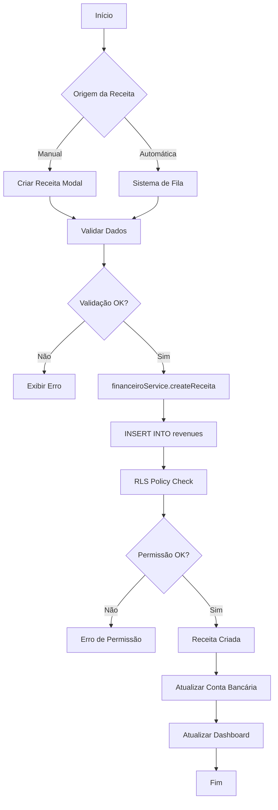
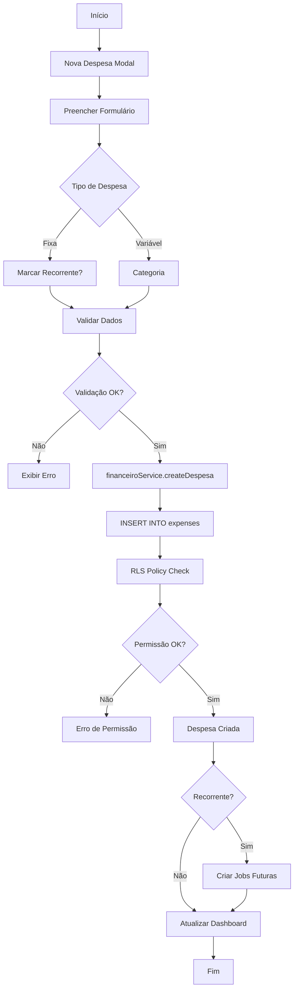
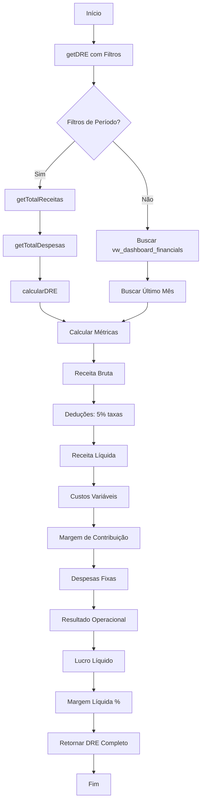
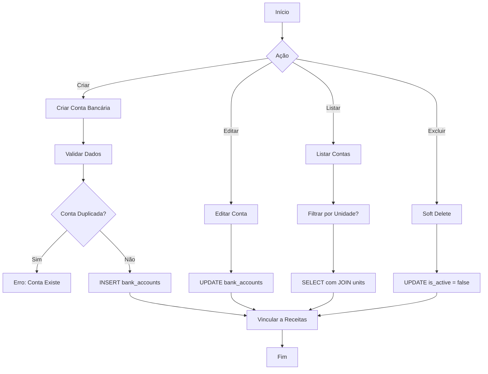

# 📊 Estrutura Financeira do Barber Analytics Pro

> **Documentação Técnica Completa**
> Sistema de Gestão Financeira — Contas a Receber, Contas a Pagar e DRE

---

## 📋 Índice

1. [Visão Geral](#-visão-geral)
2. [Arquitetura do Sistema](#-arquitetura-do-sistema)
3. [Estrutura do Banco de Dados](#-estrutura-do-banco-de-dados)
4. [Fluxo de Contas a Receber](#-fluxo-de-contas-a-receber)
5. [Fluxo de Contas a Pagar](#-fluxo-de-contas-a-pagar)
6. [DRE - Demonstração do Resultado do Exercício](#-dre---demonstração-do-resultado-do-exercício)
7. [Integração com Contas Bancárias](#-integração-com-contas-bancárias)
8. [Camadas de Serviço](#-camadas-de-serviço)
9. [Interface do Usuário](#-interface-do-usuário)
10. [Fluxogramas Detalhados](#-fluxogramas-detalhados)

---

## 🎯 Visão Geral

O módulo financeiro do **Barber Analytics Pro** é responsável por gerenciar todo o fluxo de caixa das barbearias, incluindo:

- **Contas a Receber (Receitas)**: Registro de todas as entradas financeiras
- **Contas a Pagar (Despesas)**: Controle de todas as saídas financeiras
- **DRE**: Demonstrativo consolidado de resultados
- **Contas Bancárias**: Gestão de contas vinculadas às unidades
- **Relatórios e Comparativos**: Análises financeiras por período e unidade

### Princípios Fundamentais

- **Clean Architecture**: Separação clara entre camadas
- **Domain-Driven Design**: Modelagem baseada no negócio
- **Row Level Security (RLS)**: Segurança em nível de linha no banco
- **Views Resilientes**: Mapeamento flexível de colunas

---

## 🏗 Arquitetura do Sistema

```
┌─────────────────────────────────────────────────────────────┐
│                    CAMADA DE APRESENTAÇÃO                   │
│  FinanceiroPage → ReceitasTab, DespesasTab, DRETab, etc.   │
└────────────────────────┬────────────────────────────────────┘
                         │
┌────────────────────────▼────────────────────────────────────┐
│                    CAMADA DE APLICAÇÃO                      │
│   financeiroService.js → CRUD + Agregações + KPIs          │
│   bankAccountsService.js → Gestão de Contas Bancárias      │
└────────────────────────┬────────────────────────────────────┘
                         │
┌────────────────────────▼────────────────────────────────────┐
│                    CAMADA DE DOMÍNIO                        │
│    Views: vw_revenues_base, vw_expenses_base, vw_dre       │
│    Functions: get_financial_kpis(start, end)               │
└────────────────────────┬────────────────────────────────────┘
                         │
┌────────────────────────▼────────────────────────────────────┐
│                 CAMADA DE INFRAESTRUTURA                    │
│  Supabase PostgreSQL → revenues, expenses, bank_accounts   │
│  RLS Policies → Segurança baseada em papéis (roles)        │
└─────────────────────────────────────────────────────────────┘
```

---

## 🗄 Estrutura do Banco de Dados

### Tabela: `revenues` (Receitas/Contas a Receber)

```sql
CREATE TABLE revenues (
    id UUID PRIMARY KEY,
    type VARCHAR,              -- Tipo da receita (serviço, produto, etc.)
    value NUMERIC,             -- Valor da receita
    date DATE,                 -- Data da receita
    source VARCHAR,            -- Origem (caixa, cartão, pix, etc.)
    observations TEXT,         -- Observações adicionais
    professional_id UUID,      -- FK → professionals
    unit_id UUID,              -- FK → units
    account_id UUID,           -- FK → bank_accounts (nova coluna)
    created_at TIMESTAMPTZ
);
```

**Índices:**
- `idx_revenues_date`: Otimização para filtros por período
- `idx_revenues_unit_id`: Filtros por unidade
- `idx_revenues_account_id`: Filtros por conta bancária

### Tabela: `expenses` (Despesas/Contas a Pagar)

```sql
CREATE TABLE expenses (
    id UUID PRIMARY KEY,
    type VARCHAR,              -- Tipo: 'fixa' ou 'variavel'
    category VARCHAR,          -- Categoria (aluguel, produtos, etc.)
    value NUMERIC,             -- Valor da despesa
    date DATE,                 -- Data da despesa
    recurring BOOLEAN,         -- Se é despesa recorrente
    observations TEXT,         -- Observações adicionais
    unit_id UUID,              -- FK → units
    created_at TIMESTAMPTZ
);
```

**Índices:**
- `idx_expenses_date`: Otimização para filtros por período
- `idx_expenses_unit_id`: Filtros por unidade
- `idx_expenses_type`: Filtros por tipo (fixa/variável)

### Tabela: `bank_accounts` (Contas Bancárias)

```sql
CREATE TABLE bank_accounts (
    id UUID PRIMARY KEY,
    name VARCHAR NOT NULL,           -- Nome identificador
    bank VARCHAR NOT NULL,           -- Nome do banco
    agency VARCHAR NOT NULL,         -- Agência
    account_number VARCHAR NOT NULL, -- Número da conta
    unit_id UUID NOT NULL,           -- FK → units
    initial_balance NUMERIC,         -- Saldo inicial
    is_active BOOLEAN,               -- Status da conta
    created_at TIMESTAMPTZ,
    updated_at TIMESTAMPTZ
);
```

### Views Resilientes

O sistema utiliza **views JSON-based** que mapeiam automaticamente diferentes nomes de colunas:

#### `vw_revenues_base`
Unifica colunas de receitas usando COALESCE:
- `value` → `amount` → `total` → `price` → `received_value`
- `date` → `revenue_date` → `created_at` → `received_at`

#### `vw_expenses_base`
Unifica colunas de despesas usando COALESCE:
- `value` → `amount` → `total` → `paid_value`
- `date` → `expense_date` → `created_at` → `paid_at`

#### `vw_monthly_dre`
Consolida DRE mensal com FULL OUTER JOIN entre receitas e despesas:
```sql
SELECT
  month,
  total_revenues,
  total_expenses,
  net_profit,
  profit_margin
FROM vw_monthly_dre;
```

---

## 💰 Fluxo de Contas a Receber

### Processo Completo



### Código de Criação de Receita

**Frontend → Modal de Nova Receita:**
```jsx
// NovaReceitaModal.jsx
const handleSubmit = async (formData) => {
  try {
    await financeiroService.createReceita({
      tipo: formData.tipo,
      valor: parseFloat(formData.valor),
      data: formData.data,
      origem: formData.origem,
      observacoes: formData.observacoes,
      account_id: formData.contaBancaria,
      unitId: selectedUnit
    });

    toast.success('Receita criada com sucesso!');
    onRefresh();
  } catch (error) {
    toast.error(error.message);
  }
};
```

**Backend → financeiroService:**
```javascript
// financeiroService.js:85
async createReceita(receita) {
  const { data, error } = await supabase
    .from('revenues')
    .insert({
      type: receita.tipo,
      value: receita.valor,
      date: receita.data,
      source: receita.origem,
      observations: receita.observacoes,
      account_id: receita.account_id,
      unit_id: receita.unitId
    })
    .select()
    .single();

  if (error) throw error;
  return data;
}
```

### Busca de Receitas com Filtros

```javascript
// financeiroService.js:17
async getReceitas(filters = {}, page = 1, limit = 20) {
  let query = supabase
    .from('revenues')
    .select(`
      *,
      professional:professionals(name),
      unit:units(name)
    `)
    .order('date', { ascending: false });

  // Aplicar filtros
  if (filters.startDate) {
    query = query.gte('date', filters.startDate.toISOString().split('T')[0]);
  }

  if (filters.endDate) {
    query = query.lte('date', filters.endDate.toISOString().split('T')[0]);
  }

  // Paginação
  const from = (page - 1) * limit;
  query = query.range(from, from + limit - 1);

  const { data, error } = await query;
  return { data, totalPages: Math.ceil(count / limit) };
}
```

---

## 💸 Fluxo de Contas a Pagar

### Processo Completo



### Código de Criação de Despesa

**Frontend → Modal de Nova Despesa:**
```jsx
// NovaDespesaModal.jsx
const handleSubmit = async (formData) => {
  try {
    await financeiroService.createDespesa({
      tipo: formData.tipo, // 'fixa' ou 'variavel'
      categoria: formData.categoria,
      valor: parseFloat(formData.valor),
      data: formData.data,
      recorrente: formData.recorrente,
      observacoes: formData.observacoes,
      unitId: selectedUnit
    });

    toast.success('Despesa criada com sucesso!');
    onRefresh();
  } catch (error) {
    toast.error(error.message);
  }
};
```

**Backend → financeiroService:**
```javascript
// financeiroService.js:246
async createDespesa(despesa) {
  const { data, error } = await supabase
    .from('expenses')
    .insert({
      type: despesa.tipo,
      category: despesa.categoria,
      value: despesa.valor,
      date: despesa.data,
      recurring: despesa.recorrente,
      observations: despesa.observacoes,
      unit_id: despesa.unitId
    })
    .select()
    .single();

  if (error) throw error;
  return data;
}
```

### Análise de Categorias de Despesas

```javascript
// financeiroService.js:590
async getAnaliseCategorias(filters = {}) {
  const despesas = await this.getTotalDespesas(filters);
  const todasCategorias = { ...despesas.fixas, ...despesas.variaveis };

  const total = Object.values(todasCategorias).reduce((sum, val) => sum + val, 0);

  return Object.entries(todasCategorias).map(([categoria, valor]) => ({
    categoria,
    valor,
    percentual: total > 0 ? (valor / total) * 100 : 0,
    tipo: despesas.fixas[categoria] ? 'fixa' : 'variavel'
  })).sort((a, b) => b.valor - a.valor);
}
```

---

## 📊 DRE - Demonstração do Resultado do Exercício

### Estrutura do DRE

O DRE segue a estrutura contábil padrão:

```
Receita Bruta
(-) Deduções (taxas, impostos)
(=) Receita Líquida
(-) Custos Variáveis
(=) Margem de Contribuição
(-) Despesas Fixas
(=) Resultado Operacional
(-) Depreciação
(=) Lucro Líquido
```

### Fluxo de Cálculo do DRE



### Código de Geração do DRE

**View SQL:**
```sql
-- vw_monthly_dre
CREATE OR REPLACE VIEW vw_monthly_dre AS
WITH rev AS (
  SELECT
    date_trunc('month', revenue_dt) AS month,
    SUM(amount) AS total_revenues
  FROM vw_revenues_detailed
  GROUP BY 1
),
exp AS (
  SELECT
    date_trunc('month', expense_dt) AS month,
    SUM(amount) AS total_expenses
  FROM vw_expenses_detailed
  GROUP BY 1
)
SELECT
  COALESCE(rev.month, exp.month) AS month,
  COALESCE(rev.total_revenues, 0) AS total_revenues,
  COALESCE(exp.total_expenses, 0) AS total_expenses,
  COALESCE(rev.total_revenues, 0) - COALESCE(exp.total_expenses, 0) AS net_profit,
  CASE
    WHEN COALESCE(rev.total_revenues, 0) > 0
    THEN (COALESCE(rev.total_revenues, 0) - COALESCE(exp.total_expenses, 0))
         / COALESCE(rev.total_revenues, 0)
    ELSE NULL
  END AS profit_margin
FROM rev
FULL OUTER JOIN exp ON exp.month = rev.month
ORDER BY month;
```

**Service JavaScript:**
```javascript
// financeiroService.js:328
async getDRE(filters = {}) {
  if (filters.startDate && filters.endDate) {
    const receitas = await this.getTotalReceitas(filters);
    const despesas = await this.getTotalDespesas(filters);
    return this.calcularDRE(receitas, despesas);
  }

  const { data } = await supabase
    .from('vw_dashboard_financials')
    .select('*')
    .limit(1)
    .order('month', { ascending: false });

  const latest = data[0];

  return {
    periodo: latest.month,
    receitaBruta: Number(latest.total_revenues || 0),
    deducoes: 0,
    receitaLiquida: Number(latest.total_revenues || 0),
    custosVariaveis: Number(latest.variable_costs || 0),
    margemContribuicao: Number(latest.total_revenues || 0) - Number(latest.variable_costs || 0),
    despesasFixas: Number(latest.fixed_costs || 0),
    resultadoOperacional: Number(latest.total_revenues || 0) - Number(latest.total_expenses || 0),
    lucroLiquido: Number(latest.net_profit || 0),
    margemLiquida: Number(latest.profit_margin || 0) * 100
  };
}
```

**Cálculo Manual do DRE:**
```javascript
// financeiroService.js:464
calcularDRE(receitas, despesas) {
  const receitaBruta = Object.values(receitas).reduce((sum, val) => sum + val, 0);
  const custosVariaveis = Object.values(despesas.variaveis || {}).reduce((sum, val) => sum + val, 0);
  const despesasFixas = Object.values(despesas.fixas || {}).reduce((sum, val) => sum + val, 0);

  const deducoes = receitaBruta * 0.05; // 5% estimado para taxas
  const receitaLiquida = receitaBruta - deducoes;
  const margemContribuicao = receitaLiquida - custosVariaveis;
  const resultadoOperacional = margemContribuicao - despesasFixas;
  const lucroLiquido = resultadoOperacional;
  const margemLiquida = receitaBruta > 0 ? (lucroLiquido / receitaBruta) * 100 : 0;

  return {
    periodo: 'Período Selecionado',
    receitaBruta,
    deducoes,
    receitaLiquida,
    custosVariaveis,
    margemContribuicao,
    despesasFixas,
    resultadoOperacional,
    lucroLiquido,
    margemLiquida,
    detalhes: { receitas, despesas }
  };
}
```

---

## 🏦 Integração com Contas Bancárias

### Fluxo de Gestão de Contas Bancárias



### Código de Gestão de Contas Bancárias

**Criar Conta Bancária:**
```javascript
// bankAccountsService.js:84
async createBankAccount(accountData) {
  this._validateAccountData(accountData);

  const { data, error } = await supabase
    .from('bank_accounts')
    .insert([{
      name: accountData.name.trim(),
      bank: accountData.bank.trim(),
      agency: accountData.agency.trim(),
      account_number: accountData.account_number.trim(),
      unit_id: accountData.unit_id,
      initial_balance: accountData.initial_balance || 0,
      is_active: true
    }])
    .select(`
      *,
      units (id, name)
    `)
    .single();

  if (error) throw error;
  return data;
}
```

**Verificar Duplicidade:**
```javascript
// bankAccountsService.js:222
async checkAccountExists(bank, agency, accountNumber, unitId, excludeId = null) {
  let query = supabase
    .from('bank_accounts')
    .select('id')
    .eq('bank', bank.trim())
    .eq('agency', agency.trim())
    .eq('account_number', accountNumber.trim())
    .eq('unit_id', unitId)
    .eq('is_active', true);

  if (excludeId) {
    query = query.neq('id', excludeId);
  }

  const { data } = await query;
  return data && data.length > 0;
}
```

**Soft Delete:**
```javascript
// bankAccountsService.js:178
async deleteBankAccount(id) {
  const { error } = await supabase
    .from('bank_accounts')
    .update({ is_active: false })
    .eq('id', id);

  if (error) throw error;
  return true;
}
```

---

## ⚙️ Camadas de Serviço

### financeiroService.js

**Responsabilidades:**
- CRUD completo de receitas e despesas
- Agregações e totalizações por período
- Geração de DRE
- Comparativos mensais e por unidade
- Análise de categorias

**Métodos Principais:**
```javascript
class FinanceiroService {
  // RECEITAS
  async getReceitas(filters, page, limit)
  async createReceita(receita)
  async updateReceita(id, receita)
  async deleteReceita(id)

  // DESPESAS
  async getDespesas(filters, page, limit)
  async createDespesa(despesa)
  async updateDespesa(id, despesa)
  async deleteDespesa(id)

  // DRE E ANÁLISES
  async getDRE(filters)
  async getTotalReceitas(filters)
  async getTotalDespesas(filters)
  async calcularDRE(receitas, despesas)

  // COMPARATIVOS
  async getComparativoMensal(unitId)
  async getComparativoUnidades(filters)
  async getAnaliseCategorias(filters)
}
```

### bankAccountsService.js

**Responsabilidades:**
- CRUD de contas bancárias
- Validação de duplicidade
- Soft delete (is_active flag)
- Estatísticas de contas

**Métodos Principais:**
```javascript
class BankAccountsService {
  async getBankAccounts(unitId, incluirInativas)
  async getBankAccountById(id)
  async createBankAccount(accountData)
  async updateBankAccount(id, updateData)
  async deleteBankAccount(id)
  async reactivateBankAccount(id)
  async checkAccountExists(bank, agency, accountNumber, unitId, excludeId)
  async getBankAccountsStats(unitId)

  // VALIDAÇÕES PRIVADAS
  _validateAccountData(data, isCreate)
}
```

---

## 🎨 Interface do Usuário

### FinanceiroPage - Estrutura de Abas

```jsx
const TABS = [
  { id: 'receitas', label: 'Receitas', icon: DollarSign },
  { id: 'despesas', label: 'Despesas', icon: TrendingDown },
  { id: 'dre', label: 'DRE', icon: FileText },
  { id: 'comparativos', label: 'Comparativos', icon: BarChart3 },
  { id: 'contas-bancarias', label: 'Contas Bancárias', icon: CreditCard, adminOnly: true }
];
```

### ReceitasTab

**Funcionalidades:**
- Listagem paginada de receitas
- Filtros por período, unidade, profissional
- Modal de criação/edição
- Visualização de detalhes

**Campos do Formulário:**
- Tipo de receita (serviço, produto, etc.)
- Valor (R$)
- Data
- Origem (caixa, cartão, pix, boleto)
- Conta bancária (select de bank_accounts)
- Observações

### DespesasTab

**Funcionalidades:**
- Listagem paginada de despesas
- Filtros por período, unidade, tipo, categoria
- Modal de criação/edição
- Marcação de despesas recorrentes

**Campos do Formulário:**
- Tipo (fixa/variável)
- Categoria (aluguel, produtos, salários, etc.)
- Valor (R$)
- Data
- Recorrente (checkbox)
- Observações

### DRETab

**Visualização:**
```
┌─────────────────────────────────────────┐
│  DRE - Demonstração de Resultado        │
│  Período: Janeiro/2025                  │
├─────────────────────────────────────────┤
│  Receita Bruta          R$ 50.000,00    │
│  (-) Deduções           R$  2.500,00    │
│  (=) Receita Líquida    R$ 47.500,00    │
│  (-) Custos Variáveis   R$ 15.000,00    │
│  (=) Margem Contrib.    R$ 32.500,00    │
│  (-) Despesas Fixas     R$ 20.000,00    │
│  (=) Resultado Oper.    R$ 12.500,00    │
│  (=) Lucro Líquido      R$ 12.500,00    │
│                                          │
│  Margem Líquida: 25.00%                 │
└─────────────────────────────────────────┘
```

### ComparativosTab

**Gráficos Disponíveis:**
- Evolução mensal (linha)
- Receitas vs Despesas (barras)
- Comparativo por unidade (barras horizontais)
- Distribuição de categorias (pizza)

---

## 📈 Fluxogramas Detalhados

### Fluxograma 1: Ciclo Completo de Receita

```
┌─────────────┐
│   INÍCIO    │
└──────┬──────┘
       │
       ▼
┌─────────────────────┐
│ Usuário acessa      │
│ FinanceiroPage      │
└──────┬──────────────┘
       │
       ▼
┌─────────────────────┐
│ Clica em            │
│ "Nova Receita"      │
└──────┬──────────────┘
       │
       ▼
┌─────────────────────┐
│ NovaReceitaModal    │
│ abre                │
└──────┬──────────────┘
       │
       ▼
┌─────────────────────┐
│ Preenche campos:    │
│ - Tipo              │
│ - Valor             │
│ - Data              │
│ - Origem            │
│ - Conta Bancária    │
└──────┬──────────────┘
       │
       ▼
┌─────────────────────┐
│ Clica "Salvar"      │
└──────┬──────────────┘
       │
       ▼
       ┌───────────────┐
       │ Validação     │
       │ Frontend      │
       └───────┬───────┘
               │
        ┌──────▼──────┐
        │ Válido?     │
        └──┬───────┬──┘
      NÃO  │       │ SIM
           │       │
    ┌──────▼────┐  │
    │  Exibir   │  │
    │  Erros    │  │
    └───────────┘  │
                   │
            ┌──────▼──────────────────┐
            │ financeiroService       │
            │ .createReceita()        │
            └──────┬──────────────────┘
                   │
            ┌──────▼──────────────────┐
            │ supabase.from('revenues')│
            │ .insert()               │
            └──────┬──────────────────┘
                   │
            ┌──────▼──────────────────┐
            │ RLS Policy Check:       │
            │ - User autenticado?     │
            │ - Tem permissão?        │
            └──────┬──────────────────┘
                   │
            ┌──────▼──────┐
            │ Permitido?  │
            └──┬───────┬──┘
          NÃO  │       │ SIM
               │       │
        ┌──────▼────┐  │
        │  Erro 403 │  │
        │  Forbidden│  │
        └───────────┘  │
                       │
                ┌──────▼──────────────────┐
                │ INSERT executado        │
                │ revenue_id gerado       │
                └──────┬──────────────────┘
                       │
                ┌──────▼──────────────────┐
                │ Trigger atualiza        │
                │ conta bancária          │
                │ (se account_id)         │
                └──────┬──────────────────┘
                       │
                ┌──────▼──────────────────┐
                │ Retorna data criado     │
                │ para frontend           │
                └──────┬──────────────────┘
                       │
                ┌──────▼──────────────────┐
                │ Toast.success()         │
                │ "Receita criada!"       │
                └──────┬──────────────────┘
                       │
                ┌──────▼──────────────────┐
                │ onRefresh()             │
                │ Atualiza listagem       │
                └──────┬──────────────────┘
                       │
                       ▼
                  ┌─────────┐
                  │   FIM   │
                  └─────────┘
```

### Fluxograma 2: Geração de DRE por Período

```
┌─────────────┐
│   INÍCIO    │
└──────┬──────┘
       │
       ▼
┌─────────────────────┐
│ Usuário acessa      │
│ DRETab              │
└──────┬──────────────┘
       │
       ▼
┌─────────────────────┐
│ Seleciona filtros:  │
│ - Data inicial      │
│ - Data final        │
│ - Unidade (opcional)│
└──────┬──────────────┘
       │
       ▼
┌─────────────────────┐
│ Clica "Gerar DRE"   │
└──────┬──────────────┘
       │
       ▼
┌─────────────────────────────┐
│ financeiroService.getDRE    │
│ (filters)                   │
└──────┬──────────────────────┘
       │
       ▼
       ┌──────────────────┐
       │ Tem período      │
       │ especificado?    │
       └──┬───────────┬───┘
     SIM  │           │ NÃO
          │           │
          │     ┌─────▼─────────────────┐
          │     │ Buscar                │
          │     │ vw_dashboard_financials│
          │     │ último mês            │
          │     └─────┬─────────────────┘
          │           │
          │           │
  ┌───────▼─────────┐ │
  │ getTotalReceitas│ │
  │ (filters)       │ │
  └───────┬─────────┘ │
          │           │
  ┌───────▼─────────┐ │
  │ getTotalDespesas│ │
  │ (filters)       │ │
  └───────┬─────────┘ │
          │           │
          │           │
  ┌───────▼─────────┐ │
  │ calcularDRE     │ │
  │ (receitas,      │ │
  │  despesas)      │ │
  └───────┬─────────┘ │
          │           │
          └─────┬─────┘
                │
         ┌──────▼──────────────────────┐
         │ CÁLCULO DRE:                │
         │                             │
         │ 1. Receita Bruta = Σ receitas│
         │                             │
         │ 2. Deduções = 5% rec. bruta │
         │                             │
         │ 3. Rec. Líquida = bruta - ded│
         │                             │
         │ 4. Custos Var. = Σ desp. var.│
         │                             │
         │ 5. Marg. Contrib. = líq - var│
         │                             │
         │ 6. Desp. Fixas = Σ desp. fixas│
         │                             │
         │ 7. Res. Oper. = contrib - fixas│
         │                             │
         │ 8. Lucro Líq. = res. oper.  │
         │                             │
         │ 9. Marg. Líq. = lucro/bruta %│
         └──────┬──────────────────────┘
                │
         ┌──────▼──────────────────────┐
         │ Retornar objeto DRE:        │
         │ {                           │
         │   periodo,                  │
         │   receitaBruta,             │
         │   deducoes,                 │
         │   receitaLiquida,           │
         │   custosVariaveis,          │
         │   margemContribuicao,       │
         │   despesasFixas,            │
         │   resultadoOperacional,     │
         │   lucroLiquido,             │
         │   margemLiquida             │
         │ }                           │
         └──────┬──────────────────────┘
                │
         ┌──────▼──────────────────────┐
         │ Frontend renderiza:         │
         │ - Tabela com valores        │
         │ - Gráficos de evolução      │
         │ - KPIs destacados           │
         └──────┬──────────────────────┘
                │
                ▼
           ┌─────────┐
           │   FIM   │
           └─────────┘
```

### Fluxograma 3: Sistema de Permissões (RLS)

```
┌─────────────┐
│   INÍCIO    │
│  (Qualquer  │
│  Operação)  │
└──────┬──────┘
       │
       ▼
┌─────────────────────┐
│ Usuário faz request │
│ ao Supabase         │
└──────┬──────────────┘
       │
       ▼
┌─────────────────────┐
│ Supabase recebe:    │
│ - auth.uid()        │
│ - user_metadata     │
└──────┬──────────────┘
       │
       ▼
       ┌──────────────────┐
       │ RLS Policy       │
       │ Evaluation       │
       └──────┬───────────┘
              │
       ┌──────▼──────┐
       │ Role =      │
       │ 'admin'?    │
       └──┬───────┬──┘
     SIM  │       │ NÃO
          │       │
  ┌───────▼────┐  │
  │ PERMITIR   │  │
  │ TUDO       │  │
  └────────────┘  │
                  │
           ┌──────▼──────┐
           │ Role =      │
           │ 'gerente'?  │
           └──┬───────┬──┘
         SIM  │       │ NÃO
              │       │
    ┌─────────▼──────────────┐
    │ Verificar unit_id:     │
    │ professional.unidade_id│
    │ = record.unit_id?      │
    └──┬──────────────────┬──┘
   SIM │                  │ NÃO
       │                  │
  ┌────▼────┐      ┌──────▼─────┐
  │PERMITIR │      │  NEGAR     │
  │ (própria│      │  Erro 403  │
  │ unidade)│      └────────────┘
  └─────────┘
       │
       ▼
┌─────────────────────┐
│ Operação executada  │
│ no banco            │
└──────┬──────────────┘
       │
       ▼
  ┌─────────┐
  │   FIM   │
  └─────────┘
```

---

## 🔐 Segurança e Validações

### Row Level Security (RLS)

**Políticas para `revenues`:**
```sql
-- Admin: acesso total
CREATE POLICY "Admin full access"
ON revenues FOR ALL TO authenticated
USING (user_metadata->>'role' = 'admin');

-- Gerente: apenas sua unidade
CREATE POLICY "Manager own unit"
ON revenues FOR ALL TO authenticated
USING (
  unit_id IN (
    SELECT p.unidade_id
    FROM profissionais p
    WHERE p.user_id = auth.uid()
  )
);
```

**Políticas para `expenses`:**
```sql
-- Mesma estrutura de revenues
-- Admin total, Gerente por unidade
```

**Políticas para `bank_accounts`:**
```sql
-- Admin: CRUD completo
-- Gerente: SELECT apenas sua unidade
```

### Validações Frontend

```javascript
// Validação de valor
if (isNaN(valor) || valor <= 0) {
  throw new Error('Valor deve ser positivo');
}

// Validação de data
if (new Date(data) > new Date()) {
  throw new Error('Data não pode ser futura');
}

// Validação de campos obrigatórios
if (!tipo || !valor || !data) {
  throw new Error('Preencha todos os campos obrigatórios');
}
```

### Validações Backend

```javascript
// bankAccountsService.js:288
_validateAccountData(data, isCreate) {
  if (isCreate) {
    if (!data.name?.trim()) throw new Error('Nome obrigatório');
    if (!data.bank?.trim()) throw new Error('Banco obrigatório');
    if (!data.agency?.trim()) throw new Error('Agência obrigatória');
    if (!data.account_number?.trim()) throw new Error('Conta obrigatória');
    if (!data.unit_id) throw new Error('Unidade obrigatória');
  }

  if (data.agency && !/^[\d-]+$/.test(data.agency.trim())) {
    throw new Error('Agência deve conter apenas números e hífen');
  }

  if (data.initial_balance !== undefined && data.initial_balance < 0) {
    throw new Error('Saldo inicial não pode ser negativo');
  }
}
```

---

## 📌 Pontos de Atenção

### Performance

1. **Índices essenciais:**
   - `revenues.date`, `revenues.unit_id`, `revenues.account_id`
   - `expenses.date`, `expenses.unit_id`, `expenses.type`
   - `bank_accounts.unit_id`, `bank_accounts.is_active`

2. **Views materializadas:** Considerar para grandes volumes
   - `vw_monthly_dre` pode ser materializada e atualizada via cron

3. **Paginação:** Sempre usar `limit` e `offset` nas queries

### Integridade de Dados

1. **Foreign Keys:**
   - `revenues.unit_id` → `units.id`
   - `revenues.account_id` → `bank_accounts.id` (ON DELETE SET NULL)
   - `expenses.unit_id` → `units.id`
   - `bank_accounts.unit_id` → `units.id` (ON DELETE CASCADE)

2. **Constraints:**
   - `value/amount > 0` (validar no frontend e backend)
   - `date <= CURRENT_DATE` (receitas/despesas não podem ser futuras)

3. **Soft Delete:**
   - `bank_accounts.is_active` em vez de DELETE físico
   - Preserva histórico e integridade referencial

### Manutenção

1. **Logs de auditoria:** Implementar triggers para rastreamento
2. **Backup regular:** Especialmente antes de fechamentos mensais
3. **Testes automatizados:** Cobrir fluxos críticos de DRE

---

## 🎯 Conclusão

O módulo financeiro do **Barber Analytics Pro** implementa uma solução robusta e escalável para gestão completa de receitas, despesas e demonstrativos contábeis, seguindo os princípios de:

- **Clean Architecture**: Separação clara de responsabilidades
- **DDD**: Modelagem orientada ao domínio
- **Security First**: RLS em todas as tabelas sensíveis
- **Resilience**: Views flexíveis adaptáveis a mudanças de schema
- **Performance**: Índices estratégicos e queries otimizadas
- **Usabilidade**: Interface intuitiva e feedback em tempo real

---

**Versão:** 1.0
**Data:** 13/10/2025
**Autor:** Sistema de Documentação — Barber Analytics Pro
**Referências:** CLAUDE.md, PRD, Plano de Execução
