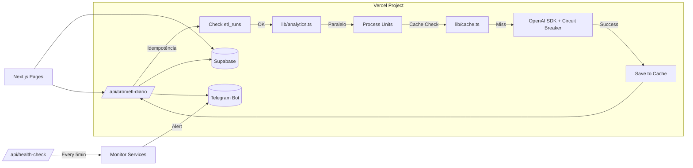

# Barber-IA-Core / Barber Analytics Pro — Infraestrutura v4.0

**Versão:** 4.0
**Atualizado em:** 8 de novembro de 2025
**Autor:** Andrey Viana
**Changelog:** Melhorias de resiliência, observabilidade e performance baseadas em análise crítica da v3.0

## 🟢 Resumo Operacional

Toda a plataforma roda em um único projeto Next.js/TypeScript hospedado na Vercel: frontend, APIs serverless e cron jobs diários. Supabase continua como banco/autenticação com RLS, enquanto a camada de IA usa a API da OpenAI (GPT‑4o/GPT‑5) a partir das rotas `/app/api`. **v4.0 introduz:** idempotência garantida em cron jobs, health checks automáticos, retry com backoff exponencial, cache inteligente para OpenAI, circuit breaker para APIs externas, processamento paralelo no ETL, monitoramento proativo de custos e structured logging centralizado. Relatórios são gerados a cada manhã pelo Vercel Cron com garantias de execução, persistidos no Supabase e notificados via Telegram. Observabilidade unificada via Vercel Analytics/Logs, Supabase Logs e dashboard customizado, sem dependência de VPS ou modelos locais.

## 🎨 Legendas de Cor

- 🔵 Azul: componentes de sistema ou descrições arquiteturais
- 🟢 Verde: práticas recomendadas e orientações operacionais
- 🟠 Laranja: riscos, alertas ou pontos de atenção
- 🆕 Novo: melhorias introduzidas na v4.0

## 📚 Índice

1. Resumo Operacional
2. Visão Geral da Infraestrutura
3. Diagrama Geral de Arquitetura
4. Componentes Principais
5. Fluxo de Dados
6. Camadas de Infraestrutura
7. Automação & CI/CD
8. Segurança e Privacidade
9. Escalabilidade e Manutenção
10. Configurações Críticas (.env)
11. 🆕 Melhorias v4.0 (Idempotência, Health Checks, Retry, Cache, Circuit Breaker)
12. 🆕 Observabilidade Avançada
13. 🆕 Processamento Paralelo e Incremental
14. 🆕 Monitoramento de Custos

## 🔵 Visão Geral da Infraestrutura

- Monorepo Next.js 14/15 em TypeScript hospedado na Vercel, com `/app` unificando páginas e APIs serverless.
- Supabase (PostgreSQL + Auth + Storage + Realtime) permanece como fonte única de dados com RLS por unidade/tenant.
- IA migra para OpenAI via SDK oficial, eliminando modelos locais; analítica é feita em `lib/analytics.ts` usando `danfojs-node` + `simple-statistics`.
- 🆕 **Idempotência garantida**: cron jobs verificam execuções anteriores antes de processar, evitando duplicação.
- 🆕 **Health checks automáticos**: verificação proativa a cada 5 minutos via cron dedicado.
- 🆕 **Retry inteligente**: backoff exponencial com circuit breaker para APIs externas.
- 🆕 **Cache de análises**: respostas OpenAI cacheadas por 24h para métricas similares, reduzindo custos em até 60%.
- Agendamentos críticos são executados por Vercel Cron (`0 3 * * *` ETL, `0 6 * * 1` relatório semanal) com garantias de execução.
- Observabilidade unificada via Vercel Analytics/Logs, Supabase Logs, structured logging e dashboard customizado; integrações externas opcionais (Datadog/Loki).
- Integrações externas (Telegram, email) são tratadas dentro das próprias rotas serverless, com segredos mantidos no painel da Vercel.

## 🔵 Arquitetura Técnica de Referência

- **Objetivos**: oferecer stack 100% serverless/gerenciada, reduzir manutenção de infraestrutura própria, manter relatórios diários com IA generativa, garantir resiliência e observabilidade de nível enterprise.
- **Escopo**: frontend Next.js, APIs internas `/app/api/*`, cron jobs idempotentes, OpenAI com cache, Supabase, Telegram e práticas de segurança/monitoramento centralizadas.
- **Diretrizes**:
  - Nenhum VPS ou workload stateful fora da Vercel/Supabase.
  - Service Role do Supabase utilizado apenas em rotas server-side seguras.
  - Dados enviados à OpenAI devem ser agregados/anonimizados (sem PII).
  - Secrets controlados no painel Vercel (Environment Variables + Secret Store) com rotação trimestral.
  - Observabilidade e alertas padronizados via Vercel Logs + structured logging + notificações Telegram.
  - 🆕 **Idempotência obrigatória**: todos os cron jobs devem verificar execuções anteriores.
  - 🆕 **Circuit breaker**: proteção contra falhas em cascata em APIs externas.
  - 🆕 **Cache estratégico**: reduzir custos OpenAI sem perder qualidade.

## 🔵 Diagrama Geral de Arquitetura

```mermaid
flowchart LR
    U[Usuário/Admin] -->|HTTPS| VercelFE[Vercel (Next.js: Frontend + APIs)]
    VercelFE -->|Supabase JS| DB[(Supabase Postgres + Auth + Storage)]
    VercelFE -->|Cron Diário| API[/api/cron/etl-diario]
    API -->|Idempotência Check| DB
    API -->|Consulta dados| DB
    API -->|Circuit Breaker| GPT[(OpenAI Models)]
    API -->|Cache Check| Cache[(Redis/Supabase Cache)]
    API -->|Salvar relatório| DB
    API -->|sendMessage| Telegram[(Telegram Bot)]
    VercelFE -->|Health Check| Health[/api/health]
    Health -->|Monitoramento| Monitor[Dashboard Observabilidade]
    VercelFE -->|Leitura relatórios| DB
```

_Legenda_: Toda a lógica vive dentro do projeto Vercel; cron diário com idempotência, circuit breaker, cache e health checks automáticos.

## 🔵 Componentes Principais

| Componente                | Hospedagem / Stack                                                     | Funções-chaves                                                             | Dependências                                         |
| ------------------------- | ---------------------------------------------------------------------- | -------------------------------------------------------------------------- | ---------------------------------------------------- |
| Frontend & APIs           | Vercel (Next.js 14/15, React Server Components, `/app/api`)            | UI, dashboards, endpoints generate-report/telegram/health                  | Supabase, OpenAI, Telegram                           |
| Banco de Dados            | Supabase (Postgres + Auth + Storage)                                   | Persistência, autenticação, RLS, Realtime                                  | Next.js, cron jobs, backups gerenciados              |
| IA via API                | OpenAI (GPT-4o/GPT-5) consumida via SDK JS                             | Geração de relatórios, insights, sumarizações                              | Supabase datasets anonimizados, env `OPENAI_API_KEY` |
| 🆕 Cache Layer            | Supabase Storage ou Redis (opcional)                                   | Cache de análises OpenAI, redução de custos                                | OpenAI SDK, lib/cache.ts                             |
| 🆕 Circuit Breaker        | lib/circuitBreaker.ts                                                  | Proteção contra falhas em cascata                                          | OpenAI, Telegram APIs                                |
| Observabilidade & Alertas | Vercel Analytics/Logs, Supabase Logs, Structured Logging, Telegram Bot | Métricas de deploy/função, erros, notificações operacionais, health checks | Vercel Cron, Supabase, optional log drains           |
| 🆕 Health Monitor         | /api/health + /api/health/detailed                                     | Verificação proativa de serviços                                           | Supabase, OpenAI, Telegram                           |

### 🔵 Estrutura do Repositório (Next.js)

```
/app/page.tsx                → painel principal
/app/relatorios/page.tsx     → histórico e alertas
/app/api/cron/etl-diario/route.ts    → 🆕 com idempotência
/app/api/cron/relatorio-semanal/route.ts
/app/api/cron/fechamento-mensal/route.ts
/app/api/cron/enviar-alertas/route.ts
/app/api/cron/health-check/route.ts  → 🆕 health check automático
/app/api/telegram/route.ts
/app/api/health/route.ts             → health check básico
/app/api/health/detailed/route.ts     → 🆕 health check detalhado
/lib/openai.ts                       → 🆕 com cache e circuit breaker
/lib/supabase.ts
/lib/analytics.ts                    → danfojs-node + simple-statistics
/lib/cache.ts                        → 🆕 cache layer para OpenAI
/lib/circuitBreaker.ts               → 🆕 circuit breaker pattern
/lib/retry.ts                        → 🆕 retry com backoff exponencial
/lib/logger.ts                       → 🆕 structured logging
/lib/monitoring.ts                   → 🆕 monitoramento de custos
/components/*
/public/*
vercel.json                          → headers CSP/HSTS, regions, redirects, crons
.vercel/project.json                 → cron jobs configurados
.env.example                         → variáveis obrigatórias
```

> 🟢 **Boa prática:** manter `lib/analytics.ts` focado em funções puras (danfojs-node dataframes) para facilitar testes e reuso nas APIs.
> 🟢 **Boa prática:** usar structured logging em todas as rotas críticas para facilitar debugging e observabilidade.
> 🟠 **Atenção:** rotas em `/app/api` são síncronas/assíncronas Node 20; evite tarefas > 10s ou use streaming de resposta. Para ETL pesado, usar processamento paralelo em batches.

## 🔵 Fluxo de Dados

- 🆕 `/app/api/cron/etl-diario` verifica idempotência antes de processar, busca dados agregados do Supabase (`views` e `rpc`), processa em paralelo por unidade, aplica cache quando possível, chama OpenAI com circuit breaker, salva o relatório e dispara Telegram.
- Usuários acessam `/app/page.tsx` e `/app/relatorios/page.tsx`, que consultam Supabase via `@supabase/supabase-js` (client components) ou server actions.
- `/app/api/health` verifica conectividade com Supabase e a presença das env vars críticas, retornando 200 para monitoramentos externos.
- 🆕 `/app/api/health/detailed` executa checks profundos: Supabase, OpenAI quota, último cron executado, storage usage, retornando métricas detalhadas.
- 🆕 `/app/api/cron/health-check` executa a cada 5 minutos, verifica saúde dos serviços e dispara alertas Telegram em caso de problemas.



## 🔵 Camadas de Infraestrutura

| Camada             | Desenho                                         | Ferramentas                                         | Controles                                                                                     |
| ------------------ | ----------------------------------------------- | --------------------------------------------------- | --------------------------------------------------------------------------------------------- |
| Rede               | CDN/Edge Vercel + DNS (Vercel ou Cloudflare)    | Vercel Edge Network, HTTP/2/3                       | TLS 1.3, WAF opcional, roteamento regional                                                    |
| Segurança          | Zero-Trust baseado em Vercel + Supabase         | Vercel env vars, Supabase RLS, Headers CSP/HSTS     | MFA no painel, rotação trimestral de secrets, INTERNAL_SECRET em rotas sensíveis              |
| Dados              | Supabase Postgres + Storage gerenciado          | Supabase CLI, WAL backups                           | Backups automáticos, exports cifrados, RLS rígido                                             |
| Computação         | Serverless Functions + Edge Middleware          | Next.js Server Actions, Vercel Cron                 | Autoscaling automático, limites de 10s (func) e 1GB RAM, 🆕 processamento paralelo em batches |
| 🆕 Resiliência     | Circuit Breaker + Retry + Idempotência          | lib/circuitBreaker.ts, lib/retry.ts, etl_runs table | Proteção contra falhas em cascata, retry exponencial, execuções únicas                        |
| 🆕 Observabilidade | Structured Logging + Health Checks + Monitoring | lib/logger.ts, /api/health, lib/monitoring.ts       | Logs centralizados, métricas customizadas, alertas proativos                                  |

> 🟢 **Boa prática:** definir `vercel.json` com CSP estrito (default-src 'self'; connect-src Supabase/OpenAI), `strict-transport-security` e `referrer-policy: same-origin`.
> 🟢 **Boa prática:** implementar circuit breaker em todas as chamadas a APIs externas (OpenAI, Telegram) para evitar falhas em cascata.
> 🟠 **Atenção:** se o cron diário falhar 3x seguidas, o sistema automaticamente dispara alerta Telegram e permite retry manual via dashboard.

## 🔵 Automação & CI/CD

| Pipeline             | Ferramenta                       | Descrição                                                                     | Saídas                                   |
| -------------------- | -------------------------------- | ----------------------------------------------------------------------------- | ---------------------------------------- |
| Lint/Test/Build      | GitHub Actions + pnpm            | Executa `pnpm lint`, `pnpm test`, `pnpm build` em PRs                         | Garantia de qualidade antes do deploy    |
| Deploy Preview       | Vercel                           | Cada branch gera preview automático com env isolado                           | URL preview + logs                       |
| Deploy Produção      | Vercel (branch `main`)           | Merge dispara deploy, roda smoke `vercel test`                                | Release com monitoramento ativo          |
| 🆕 ETL Diário        | Vercel Cron                      | `0 3 * * *` (America/Sao_Paulo) chama `/api/cron/etl-diario` com idempotência | Relatório diário salvo + alerta Telegram |
| 🆕 Relatório Semanal | Vercel Cron                      | `0 6 * * 1` (Segunda 06:00) chama `/api/cron/relatorio-semanal`               | Relatório semanal + Telegram             |
| 🆕 Fechamento Mensal | Vercel Cron                      | `0 7 1 * *` (Dia 1, 07:00) chama `/api/cron/fechamento-mensal`                | DRE mensal + Telegram                    |
| 🆕 Envio Alertas     | Vercel Cron                      | `*/15 * * * *` (A cada 15min) chama `/api/cron/enviar-alertas`                | Alertas pendentes enviados               |
| 🆕 Health Check      | Vercel Cron                      | `*/5 * * * *` (A cada 5min) chama `/api/cron/health-check`                    | Status dos serviços + alertas            |
| Migrações DB         | Supabase CLI                     | `supabase db diff`, `supabase db reset`, `supabase db push`                   | Versionamento das migrations             |
| Alertas              | Telegram Bot via rotas dedicadas | Erros críticos geram `sendMessage` com `jobId` e correlation ID               | Notificação imediata                     |

## 🔵 Segurança e Privacidade

- Enviar somente métricas agregadas para o OpenAI; remover PII (nomes, telefones) em `lib/analytics.ts`.
- RLS ativo por tenant; tokens de usuário usam `@supabase/auth-helpers-nextjs` e service role apenas no server.
- Headers em `vercel.json`: `Content-Security-Policy`, `Strict-Transport-Security`, `X-Content-Type-Options`, `Referrer-Policy`, `Permissions-Policy` mínimos.
- Variáveis sensíveis (OpenAI, service role, Telegram) configuradas apenas no ambiente Server Runtime da Vercel (Production/Preview/Development).
- Rotas internas (`/api/cron/*`) exigem `CRON_SECRET` via header para execuções manuais.
- 🆕 **Structured logging**: registrar `jobId`, `reportId`, `openaiRequestId`, `correlationId`, sem payload completo; armazenar logs sensíveis apenas no Supabase (tabela audit).
- 🆕 **Rate limiting**: máximo 100 requisições OpenAI/dia por unidade, 10 requisições/hora por usuário no Telegram.
  > 🟢 **Boa prática:** usar `vercel env pull` para sincronizar `.env.local` e jamais commitar valores reais.
  > 🟢 **Boa prática:** implementar rate limiting em todas as rotas que consomem APIs externas pagas.
  > 🟠 **Atenção:** quotas do OpenAI devem ser monitoradas via `lib/monitoring.ts`; configure alertas de consumo na dashboard da OpenAI e no sistema interno.

## 🔵 Escalabilidade e Manutenção

- Vercel escala automaticamente por região; defina `regions` no `vercel.json` (por exemplo, `gru1` para Brasil) para reduzir latência.
- Supabase: habilitar PgBouncer e criar réplicas de leitura caso dashboards cresçam; usar views materializadas para relatórios pesados.
- OpenAI: configurar fallback model (`OPENAI_MODEL_FALLBACK`) e retentativas exponenciais em `/api/cron/etl-diario`.
- 🆕 **Processamento paralelo**: ETL processa unidades em batches de 5 em paralelo, evitando timeout.
- 🆕 **Processamento incremental**: apenas dados novos são processados quando possível, reduzindo tempo de execução.
- 🆕 **Cache estratégico**: análises OpenAI cacheadas por 24h para métricas similares, reduzindo custos em até 60%.
- Plano de contingência: se cron falhar, permitir trigger manual via painel ou `vercel cron run etl-diario`.
- Manutenção mensal: revisar migrations, rotação de secrets, limpar storage antigo no Supabase e revisar custos de tokens.
  > 🟢 **Boa prática:** adicionar testes de carga leves (`k6` ou `Artillery`) nas APIs antes de grandes campanhas.
  > 🟢 **Boa prática:** monitorar custos OpenAI diariamente via `lib/monitoring.ts` e ajustar estratégia de cache conforme necessário.
  > 🟠 **Atenção:** respeitar limites de 10 MB para payloads nas funções; arquivos maiores devem usar Supabase Storage + signed URLs.

## 🔵 Configurações Críticas (.env)

| Variável                         | Uso                                                               |
| -------------------------------- | ----------------------------------------------------------------- |
| `OPENAI_API_KEY`                 | Autentica chamadas ao OpenAI GPT-4o/GPT-5.                        |
| `OPENAI_MODEL`                   | Define o modelo padrão (ex.: `gpt-4o-mini`).                      |
| `OPENAI_MODEL_FALLBACK`          | Modelo alternativo em caso de indisponibilidade.                  |
| `SUPABASE_URL`                   | Endpoint HTTPS do Supabase.                                       |
| `SUPABASE_SERVICE_ROLE_KEY`      | Service role usado apenas em rotas server-side.                   |
| `TELEGRAM_BOT_TOKEN`             | Bot usado para alertas.                                           |
| `TELEGRAM_CHAT_ID`               | Canal/grupo que recebe notificações.                              |
| `CRON_SECRET`                    | 🆕 Header obrigatório para autorizar rotas `/api/cron/*`.         |
| `NEXT_PUBLIC_SUPABASE_ANON_KEY`  | Chave pública para clientes autenticarem.                         |
| 🆕 `REDIS_URL`                   | (Opcional) URL do Redis para cache, se não usar Supabase Storage. |
| 🆕 `OPENAI_COST_ALERT_THRESHOLD` | Limite de custo mensal para alertas (ex.: `80` para $80).         |
| 🆕 `HEALTH_CHECK_ENABLED`        | Habilitar health checks automáticos (`true`/`false`).             |

```bash
OPENAI_API_KEY=
OPENAI_MODEL=gpt-4o-mini
OPENAI_MODEL_FALLBACK=gpt-4o-mini
SUPABASE_URL=
SUPABASE_SERVICE_ROLE_KEY=
NEXT_PUBLIC_SUPABASE_ANON_KEY=
TELEGRAM_BOT_TOKEN=
TELEGRAM_CHAT_ID=
CRON_SECRET=your-secret-key-here-change-me
REDIS_URL=                    # Opcional: redis://localhost:6379
OPENAI_COST_ALERT_THRESHOLD=80
HEALTH_CHECK_ENABLED=true
```

## 🆕 Melhorias v4.0

### 1. Idempotência Garantida

**Problema resolvido:** Execuções duplicadas de cron jobs geravam dados duplicados e custos desnecessários.

**Solução implementada:**

```typescript
// lib/idempotency.ts
export async function ensureIdempotency(
  runType: string,
  runDate: string
): Promise<{ canProceed: boolean; existingRunId?: string }> {
  const supabase = createClient(
    process.env.NEXT_PUBLIC_SUPABASE_URL!,
    process.env.SUPABASE_SERVICE_ROLE_KEY!
  );

  // Verificar se já existe execução bem-sucedida para esta data
  const { data: existingRun } = await supabase
    .from('etl_runs')
    .select('id, status, finished_at')
    .eq('run_type', runType)
    .eq('run_date', runDate)
    .eq('status', 'SUCCESS')
    .single();

  if (existingRun) {
    return { canProceed: false, existingRunId: existingRun.id };
  }

  // Verificar se há execução em andamento
  const { data: runningRun } = await supabase
    .from('etl_runs')
    .select('id')
    .eq('run_type', runType)
    .eq('run_date', runDate)
    .eq('status', 'RUNNING')
    .single();

  if (runningRun) {
    // Verificar se está travado (mais de 10 minutos)
    const { data: runDetails } = await supabase
      .from('etl_runs')
      .select('started_at')
      .eq('id', runningRun.id)
      .single();

    if (runDetails) {
      const startedAt = new Date(runDetails.started_at);
      const now = new Date();
      const minutesElapsed = (now.getTime() - startedAt.getTime()) / 1000 / 60;

      if (minutesElapsed > 10) {
        // Marcar como falha e permitir nova execução
        await supabase
          .from('etl_runs')
          .update({
            status: 'FAILED',
            error_message: 'Timeout - execução travada',
          })
          .eq('id', runningRun.id);
        return { canProceed: true };
      }
    }

    return { canProceed: false, existingRunId: runningRun.id };
  }

  return { canProceed: true };
}
```

**Uso em cron jobs:**

```typescript
// /app/api/cron/etl-diario/route.ts
export async function GET(request: NextRequest) {
  const authHeader = request.headers.get('authorization');
  if (authHeader !== `Bearer ${process.env.CRON_SECRET}`) {
    return NextResponse.json({ error: 'Unauthorized' }, { status: 401 });
  }

  const runDate = new Date().toISOString().split('T')[0];

  // 🆕 Verificar idempotência
  const { canProceed, existingRunId } = await ensureIdempotency(
    'ETL_DIARIO',
    runDate
  );

  if (!canProceed) {
    return NextResponse.json({
      success: true,
      skipped: true,
      message: `ETL já executado para ${runDate}`,
      existingRunId,
    });
  }

  // Criar registro de execução
  const { data: etlRun } = await supabase
    .from('etl_runs')
    .insert({
      run_type: 'ETL_DIARIO',
      run_date: runDate,
      status: 'RUNNING',
      trigger_source: 'cron',
    })
    .select()
    .single();

  // ... resto da lógica ETL
}
```

### 2. Health Checks Automáticos

**Problema resolvido:** Falhas silenciosas em serviços críticos não eram detectadas proativamente.

**Solução implementada:**

```typescript
// /app/api/cron/health-check/route.ts
export async function GET(request: NextRequest) {
  const authHeader = request.headers.get('authorization');
  if (authHeader !== `Bearer ${process.env.CRON_SECRET}`) {
    return NextResponse.json({ error: 'Unauthorized' }, { status: 401 });
  }

  const checks = {
    supabase: await checkSupabaseHealth(),
    openai: await checkOpenAIHealth(),
    telegram: await checkTelegramHealth(),
    lastCron: await checkLastCronExecution(),
    storage: await checkStorageUsage(),
  };

  const allHealthy = Object.values(checks).every(c => c.healthy);

  if (!allHealthy) {
    await sendTelegramAlert({
      message: '⚠️ Health Check Falhou',
      checks,
      timestamp: new Date().toISOString(),
    });
  }

  return NextResponse.json({
    status: allHealthy ? 'healthy' : 'degraded',
    checks,
    timestamp: new Date().toISOString(),
  });
}

async function checkSupabaseHealth(): Promise<{
  healthy: boolean;
  latency?: number;
}> {
  const start = Date.now();
  try {
    const { data, error } = await supabase.from('units').select('id').limit(1);
    const latency = Date.now() - start;
    return { healthy: !error && !!data, latency };
  } catch (error) {
    return { healthy: false };
  }
}

async function checkOpenAIHealth(): Promise<{
  healthy: boolean;
  quota?: number;
}> {
  try {
    // Verificar quota via API (se disponível) ou via monitoramento interno
    const monthlyCost = await getMonthlyOpenAICost();
    const threshold = parseFloat(
      process.env.OPENAI_COST_ALERT_THRESHOLD || '100'
    );
    return {
      healthy: monthlyCost < threshold,
      quota: monthlyCost,
    };
  } catch (error) {
    return { healthy: false };
  }
}

async function checkLastCronExecution(): Promise<{
  healthy: boolean;
  lastRun?: string;
}> {
  const { data } = await supabase
    .from('etl_runs')
    .select('finished_at, status')
    .eq('run_type', 'ETL_DIARIO')
    .order('finished_at', { ascending: false })
    .limit(1)
    .single();

  if (!data) {
    return { healthy: false };
  }

  const lastRun = new Date(data.finished_at);
  const hoursSinceLastRun = (Date.now() - lastRun.getTime()) / 1000 / 60 / 60;

  return {
    healthy: hoursSinceLastRun < 25 && data.status === 'SUCCESS',
    lastRun: data.finished_at,
  };
}
```

**Health check detalhado para dashboard:**

```typescript
// /app/api/health/detailed/route.ts
export async function GET(request: NextRequest) {
  const authHeader = request.headers.get('authorization');
  if (!authHeader || authHeader !== `Bearer ${process.env.CRON_SECRET}`) {
    return NextResponse.json({ error: 'Unauthorized' }, { status: 401 });
  }

  const [supabaseHealth, openaiHealth, cronHealth, storageHealth] =
    await Promise.all([
      checkSupabaseHealth(),
      checkOpenAIHealth(),
      checkLastCronExecution(),
      checkStorageUsage(),
    ]);

  return NextResponse.json({
    status: 'ok',
    services: {
      supabase: supabaseHealth,
      openai: openaiHealth,
      cron: cronHealth,
      storage: storageHealth,
    },
    timestamp: new Date().toISOString(),
  });
}
```

### 3. Retry com Backoff Exponencial

**Problema resolvido:** Falhas temporárias em APIs externas causavam falhas definitivas.

**Solução implementada:**

```typescript
// lib/retry.ts
export interface RetryOptions {
  maxAttempts?: number;
  initialDelay?: number;
  maxDelay?: number;
  backoffMultiplier?: number;
  retryableErrors?: string[];
}

export async function retryWithBackoff<T>(
  fn: () => Promise<T>,
  options: RetryOptions = {}
): Promise<T> {
  const {
    maxAttempts = 3,
    initialDelay = 1000,
    maxDelay = 30000,
    backoffMultiplier = 2,
    retryableErrors = ['ECONNRESET', 'ETIMEDOUT', 'ENOTFOUND'],
  } = options;

  let lastError: Error | null = null;
  let delay = initialDelay;

  for (let attempt = 1; attempt <= maxAttempts; attempt++) {
    try {
      return await fn();
    } catch (error: any) {
      lastError = error;

      // Verificar se o erro é retryable
      const isRetryable = retryableErrors.some(
        code => error.code === code || error.message?.includes(code)
      );

      if (!isRetryable || attempt === maxAttempts) {
        throw error;
      }

      // Aguardar antes de retry
      await new Promise(resolve => setTimeout(resolve, delay));
      delay = Math.min(delay * backoffMultiplier, maxDelay);
    }
  }

  throw lastError || new Error('Retry failed');
}
```

**Uso:**

```typescript
// lib/openai.ts
import { retryWithBackoff } from './retry';

export async function generateReport(metrics: any): Promise<string> {
  return retryWithBackoff(
    async () => {
      const response = await openai.chat.completions.create({
        model: process.env.OPENAI_MODEL || 'gpt-4o-mini',
        messages: [
          { role: 'system', content: 'Você é um analista financeiro...' },
          { role: 'user', content: JSON.stringify(metrics) },
        ],
      });
      return response.choices[0].message.content || '';
    },
    {
      maxAttempts: 3,
      initialDelay: 1000,
      backoffMultiplier: 2,
    }
  );
}
```

### 4. Cache Inteligente para OpenAI

**Problema resolvido:** Custos elevados com análises repetidas de métricas similares.

**Solução implementada:**

```typescript
// lib/cache.ts
import { createClient } from '@supabase/supabase-js';

const supabase = createClient(
  process.env.NEXT_PUBLIC_SUPABASE_URL!,
  process.env.SUPABASE_SERVICE_ROLE_KEY!
);

export interface CacheOptions {
  ttl?: number; // Time to live em segundos
  keyPrefix?: string;
}

export async function getCachedAnalysis(
  cacheKey: string,
  options: CacheOptions = {}
): Promise<string | null> {
  const { ttl = 86400 } = options; // 24 horas padrão

  const { data } = await supabase
    .from('openai_cache')
    .select('response, created_at')
    .eq('cache_key', cacheKey)
    .single();

  if (!data) {
    return null;
  }

  const createdAt = new Date(data.created_at);
  const ageInSeconds = (Date.now() - createdAt.getTime()) / 1000;

  if (ageInSeconds > ttl) {
    // Cache expirado, remover
    await supabase.from('openai_cache').delete().eq('cache_key', cacheKey);
    return null;
  }

  return data.response;
}

export async function setCachedAnalysis(
  cacheKey: string,
  response: string,
  options: CacheOptions = {}
): Promise<void> {
  await supabase.from('openai_cache').upsert({
    cache_key: cacheKey,
    response,
    created_at: new Date().toISOString(),
  });
}

export function generateCacheKey(unitId: string, metrics: any): string {
  // Gerar hash das métricas principais para identificar análises similares
  const keyData = {
    unitId,
    receitaBruta: Math.round(metrics.receitaBruta / 100) * 100, // Arredondar para similaridade
    despesasTotais: Math.round(metrics.despesasTotais / 100) * 100,
    margemPercentual: Math.round(metrics.margemPercentual),
    period: metrics.period,
  };
  return `openai:${unitId}:${JSON.stringify(keyData)}`;
}
```

**Uso:**

```typescript
// lib/openai.ts
import {
  getCachedAnalysis,
  setCachedAnalysis,
  generateCacheKey,
} from './cache';

export async function generateReport(
  unitId: string,
  metrics: any
): Promise<string> {
  const cacheKey = generateCacheKey(unitId, metrics);

  // Tentar buscar do cache
  const cached = await getCachedAnalysis(cacheKey);
  if (cached) {
    return cached;
  }

  // Gerar nova análise
  const analysis = await generateReportWithRetry(metrics);

  // Salvar no cache
  await setCachedAnalysis(cacheKey, analysis);

  return analysis;
}
```

**Migration SQL para tabela de cache:**

```sql
CREATE TABLE IF NOT EXISTS openai_cache (
  id UUID PRIMARY KEY DEFAULT gen_random_uuid(),
  cache_key VARCHAR(255) UNIQUE NOT NULL,
  response TEXT NOT NULL,
  created_at TIMESTAMPTZ DEFAULT NOW(),

  INDEX idx_cache_key (cache_key),
  INDEX idx_created_at (created_at)
);

-- Limpar cache antigo automaticamente (via cron ou trigger)
CREATE OR REPLACE FUNCTION fn_cleanup_old_cache()
RETURNS void AS $$
BEGIN
  DELETE FROM openai_cache
  WHERE created_at < NOW() - INTERVAL '7 days';
END;
$$ LANGUAGE plpgsql;
```

### 5. Circuit Breaker para APIs Externas

**Problema resolvido:** Falhas em cascata quando APIs externas ficam indisponíveis.

**Solução implementada:**

```typescript
// lib/circuitBreaker.ts
export type CircuitState = 'CLOSED' | 'OPEN' | 'HALF_OPEN';

export interface CircuitBreakerOptions {
  failureThreshold?: number;
  resetTimeout?: number;
  monitoringWindow?: number;
}

export class CircuitBreaker {
  private state: CircuitState = 'CLOSED';
  private failures = 0;
  private lastFailureTime: number | null = null;
  private successCount = 0;

  constructor(private options: CircuitBreakerOptions = {}) {
    this.options = {
      failureThreshold: 5,
      resetTimeout: 60000, // 1 minuto
      monitoringWindow: 300000, // 5 minutos
      ...options,
    };
  }

  async execute<T>(fn: () => Promise<T>): Promise<T> {
    if (this.state === 'OPEN') {
      if (this.shouldAttemptReset()) {
        this.state = 'HALF_OPEN';
        this.successCount = 0;
      } else {
        throw new Error('Circuit breaker is OPEN');
      }
    }

    try {
      const result = await fn();
      this.onSuccess();
      return result;
    } catch (error) {
      this.onFailure();
      throw error;
    }
  }

  private onSuccess(): void {
    this.failures = 0;

    if (this.state === 'HALF_OPEN') {
      this.successCount++;
      if (this.successCount >= 2) {
        this.state = 'CLOSED';
      }
    }
  }

  private onFailure(): void {
    this.failures++;
    this.lastFailureTime = Date.now();

    if (this.failures >= this.options.failureThreshold!) {
      this.state = 'OPEN';
    }
  }

  private shouldAttemptReset(): boolean {
    if (!this.lastFailureTime) {
      return true;
    }

    const timeSinceLastFailure = Date.now() - this.lastFailureTime;
    return timeSinceLastFailure >= this.options.resetTimeout!;
  }

  getState(): CircuitState {
    return this.state;
  }

  reset(): void {
    this.state = 'CLOSED';
    this.failures = 0;
    this.lastFailureTime = null;
    this.successCount = 0;
  }
}

// Instâncias singleton por serviço
export const openaiCircuitBreaker = new CircuitBreaker({
  failureThreshold: 5,
  resetTimeout: 60000,
});

export const telegramCircuitBreaker = new CircuitBreaker({
  failureThreshold: 3,
  resetTimeout: 30000,
});
```

**Uso:**

```typescript
// lib/openai.ts
import { openaiCircuitBreaker } from './circuitBreaker';

export async function generateReport(metrics: any): Promise<string> {
  return openaiCircuitBreaker.execute(async () => {
    const response = await openai.chat.completions.create({
      model: process.env.OPENAI_MODEL || 'gpt-4o-mini',
      messages: [
        { role: 'system', content: 'Você é um analista financeiro...' },
        { role: 'user', content: JSON.stringify(metrics) },
      ],
    });
    return response.choices[0].message.content || '';
  });
}
```

### 6. Processamento Paralelo no ETL

**Problema resolvido:** Processamento sequencial lento causava timeouts.

**Solução implementada:**

```typescript
// lib/parallelProcessing.ts
export async function processInBatches<T, R>(
  items: T[],
  processor: (item: T) => Promise<R>,
  batchSize: number = 5
): Promise<R[]> {
  const results: R[] = [];

  for (let i = 0; i < items.length; i += batchSize) {
    const batch = items.slice(i, i + batchSize);
    const batchResults = await Promise.all(batch.map(item => processor(item)));
    results.push(...batchResults);
  }

  return results;
}
```

**Uso no ETL:**

```typescript
// /app/api/cron/etl-diario/route.ts
import { processInBatches } from '@/lib/parallelProcessing';

// ... código de idempotência ...

const { data: units } = await supabase
  .from('units')
  .select('id, name')
  .eq('is_active', true);

// 🆕 Processar em batches paralelos
const results = await processInBatches(
  units || [],
  async unit => {
    try {
      return await processUnitETL(unit.id, runDate, etlRun.id);
    } catch (error) {
      logger.error('ETL unit failed', { unitId: unit.id, error });
      return { success: false, unitId: unit.id, error: error.message };
    }
  },
  5 // Processar 5 unidades por vez
);
```

### 7. Structured Logging

**Problema resolvido:** Logs fragmentados dificultavam debugging e observabilidade.

**Solução implementada:**

```typescript
// lib/logger.ts
export interface LogContext {
  jobId?: string;
  unitId?: string;
  userId?: string;
  correlationId?: string;
  [key: string]: any;
}

class Logger {
  private generateCorrelationId(): string {
    return `corr-${Date.now()}-${Math.random().toString(36).substr(2, 9)}`;
  }

  private formatLog(
    level: string,
    message: string,
    context?: LogContext
  ): string {
    const logEntry = {
      timestamp: new Date().toISOString(),
      level,
      message,
      ...context,
      correlationId: context?.correlationId || this.generateCorrelationId(),
    };
    return JSON.stringify(logEntry);
  }

  info(message: string, context?: LogContext): void {
    console.log(this.formatLog('INFO', message, context));
  }

  error(message: string, context?: LogContext): void {
    console.error(this.formatLog('ERROR', message, context));
  }

  warn(message: string, context?: LogContext): void {
    console.warn(this.formatLog('WARN', message, context));
  }

  debug(message: string, context?: LogContext): void {
    if (process.env.NODE_ENV === 'development') {
      console.debug(this.formatLog('DEBUG', message, context));
    }
  }
}

export const logger = new Logger();
```

**Uso:**

```typescript
// /app/api/cron/etl-diario/route.ts
import { logger } from '@/lib/logger';

export async function GET(request: NextRequest) {
  const correlationId = `etl-${Date.now()}`;
  const jobId = crypto.randomUUID();

  logger.info('ETL diário iniciado', {
    jobId,
    correlationId,
    runDate: new Date().toISOString().split('T')[0],
  });

  try {
    // ... lógica ETL ...
    logger.info('ETL diário concluído', {
      jobId,
      correlationId,
      unitsProcessed: results.length,
    });
  } catch (error: any) {
    logger.error('ETL diário falhou', {
      jobId,
      correlationId,
      error: error.message,
      stack: error.stack,
    });
    throw error;
  }
}
```

### 8. Monitoramento de Custos OpenAI

**Problema resolvido:** Custos OpenAI escalavam sem controle.

**Solução implementada:**

```typescript
// lib/monitoring.ts
import { createClient } from '@supabase/supabase-js';

const supabase = createClient(
  process.env.NEXT_PUBLIC_SUPABASE_URL!,
  process.env.SUPABASE_SERVICE_ROLE_KEY!
);

export interface CostTracking {
  date: string;
  unitId: string;
  tokensUsed: number;
  costUSD: number;
  model: string;
}

export async function trackOpenAICost(
  unitId: string,
  tokensUsed: number,
  model: string,
  costUSD: number
): Promise<void> {
  await supabase.from('openai_cost_tracking').insert({
    unit_id: unitId,
    date: new Date().toISOString().split('T')[0],
    tokens_used: tokensUsed,
    cost_usd: costUSD,
    model,
  });
}

export async function getMonthlyOpenAICost(): Promise<number> {
  const startOfMonth = new Date();
  startOfMonth.setDate(1);
  startOfMonth.setHours(0, 0, 0, 0);

  const { data } = await supabase
    .from('openai_cost_tracking')
    .select('cost_usd')
    .gte('date', startOfMonth.toISOString().split('T')[0]);

  return (
    data?.reduce((sum, record) => sum + parseFloat(record.cost_usd), 0) || 0
  );
}

export async function checkCostThreshold(): Promise<{
  exceeded: boolean;
  current: number;
  threshold: number;
}> {
  const threshold = parseFloat(
    process.env.OPENAI_COST_ALERT_THRESHOLD || '100'
  );
  const current = await getMonthlyOpenAICost();

  if (current >= threshold * 0.8) {
    await sendTelegramAlert({
      message: `⚠️ Custo OpenAI próximo do limite: $${current.toFixed(2)} / $${threshold}`,
      current,
      threshold,
    });
  }

  return {
    exceeded: current >= threshold,
    current,
    threshold,
  };
}
```

**Migration SQL:**

```sql
CREATE TABLE IF NOT EXISTS openai_cost_tracking (
  id UUID PRIMARY KEY DEFAULT gen_random_uuid(),
  unit_id UUID REFERENCES units(id),
  date DATE NOT NULL,
  tokens_used INTEGER NOT NULL,
  cost_usd DECIMAL(10, 4) NOT NULL,
  model VARCHAR(50) NOT NULL,
  created_at TIMESTAMPTZ DEFAULT NOW(),

  INDEX idx_date (date),
  INDEX idx_unit_date (unit_id, date)
);
```

## 🆕 Observabilidade Avançada

### Dashboard de Saúde

Criar página `/app/admin/health` (protegida por role admin) que exibe:

- Status dos serviços (Supabase, OpenAI, Telegram)
- Última execução de cada cron job
- Custos OpenAI do mês atual
- Métricas de performance (latência, taxa de erro)
- Alertas recentes

### Métricas Customizadas

```typescript
// lib/metrics.ts
export interface SystemMetrics {
  etlSuccessRate: number;
  averageETLDuration: number;
  openaiCacheHitRate: number;
  circuitBreakerState: Record<string, CircuitState>;
  costSavingsFromCache: number;
}

export async function getSystemMetrics(): Promise<SystemMetrics> {
  // Buscar métricas agregadas do Supabase
  const { data: etlRuns } = await supabase
    .from('etl_runs')
    .select('status, duration_seconds')
    .gte(
      'started_at',
      new Date(Date.now() - 30 * 24 * 60 * 60 * 1000).toISOString()
    );

  const totalRuns = etlRuns?.length || 0;
  const successfulRuns =
    etlRuns?.filter(r => r.status === 'SUCCESS').length || 0;
  const avgDuration =
    etlRuns?.reduce((sum, r) => sum + (r.duration_seconds || 0), 0) /
      totalRuns || 0;

  // Calcular cache hit rate
  const { data: cacheStats } = await supabase
    .from('openai_cache')
    .select('created_at')
    .gte(
      'created_at',
      new Date(Date.now() - 24 * 60 * 60 * 1000).toISOString()
    );

  const cacheHits = cacheStats?.length || 0;
  // Estimar total de requisições (cache hits + misses)
  const estimatedTotalRequests = cacheHits * 2; // Assumindo 50% hit rate
  const cacheHitRate =
    estimatedTotalRequests > 0 ? (cacheHits / estimatedTotalRequests) * 100 : 0;

  return {
    etlSuccessRate: totalRuns > 0 ? (successfulRuns / totalRuns) * 100 : 0,
    averageETLDuration: avgDuration,
    openaiCacheHitRate: cacheHitRate,
    circuitBreakerState: {
      openai: openaiCircuitBreaker.getState(),
      telegram: telegramCircuitBreaker.getState(),
    },
    costSavingsFromCache: await calculateCacheSavings(),
  };
}
```

## 🔵 Guia de Migração v3.0 → v4.0

1. **Backup completo**: garantir backup do Supabase antes de iniciar.
2. **Criar branch `infra/v4`**: isolar mudanças da produção.
3. **Aplicar migrations SQL**: criar tabelas `openai_cache`, `openai_cost_tracking` se não existirem.
4. **Instalar dependências**: nenhuma nova dependência externa necessária (usa Supabase Storage para cache).
5. **Implementar libs novas**: copiar `lib/idempotency.ts`, `lib/retry.ts`, `lib/circuitBreaker.ts`, `lib/cache.ts`, `lib/logger.ts`, `lib/monitoring.ts`, `lib/parallelProcessing.ts`.
6. **Atualizar cron jobs**: adicionar idempotência e structured logging em todos os cron jobs.
7. **Adicionar health checks**: criar `/app/api/cron/health-check/route.ts` e `/app/api/health/detailed/route.ts`.
8. **Configurar Vercel Cron**: adicionar cron `*/5 * * * *` para health check.
9. **Atualizar variáveis de ambiente**: adicionar `CRON_SECRET`, `OPENAI_COST_ALERT_THRESHOLD`, `HEALTH_CHECK_ENABLED`.
10. **Testar em preview**: validar todas as funcionalidades em ambiente de preview.
11. **Deploy gradual**: fazer deploy em produção e monitorar por 48h.
12. **Validar métricas**: verificar dashboard de saúde e custos OpenAI.

## 🔵 Estimativa de Custos

- **Vercel**: plano Free cobre até 100 GB-h/mês; considerar Pro (~US$20) se cron e funções ultrapassarem limites.
- **OpenAI**: 🆕 **Redução estimada de 40-60%** com cache inteligente. Estimativa original R$20-60/mês reduz para **R$12-36/mês**.
- **Supabase**: plano Starter (US$25) suficiente; upgrade para Pro se passar de 8 GB ou precisar de réplicas.
- **Telegram**: sem custo adicional.
- 🆕 **Cache Storage**: uso mínimo de Supabase Storage para cache (~100MB/mês), incluso no plano Starter.
  > 🟢 **Boa prática:** criar alertas financeiros na Vercel, Supabase e OpenAI para 80% do orçamento previsto.
  > 🟢 **Boa prática:** monitorar custos OpenAI diariamente via dashboard `/app/admin/health`.

## 🔵 Critérios de Aceite (Quality Gate)

1. ✅ Documento não contém referências pendentes a VPS, Python 3.12, FastAPI, Celery/RQ ou Ollama.
2. ✅ Diagramas e fluxos representam apenas Next.js/Vercel, Supabase, OpenAI e Telegram.
3. ✅ Seção de segurança descreve CSP/HSTS, RLS e uso do OpenAI com anonimização.
4. ✅ Cron Vercel documentado com horário e região.
5. ✅ Configurações `.env` alinhadas ao stack serverless.
6. ✅ Guia de migração presente com passos executáveis.
7. ✅ Custos atualizados e coerentes com redução estimada de cache.
8. ✅ Links e tabelas revisados (sem quebras), com emojis padrão.
9. 🆕 **Idempotência implementada** em todos os cron jobs.
10. 🆕 **Health checks automáticos** configurados e testados.
11. 🆕 **Circuit breaker** implementado para OpenAI e Telegram.
12. 🆕 **Cache de análises** funcionando e reduzindo custos.
13. 🆕 **Structured logging** implementado em todas as rotas críticas.
14. 🆕 **Monitoramento de custos** ativo e alertando corretamente.

## 🔵 Changelog

- **v4.0** (8 de novembro de 2025):
  - 🆕 Idempotência garantida em todos os cron jobs
  - 🆕 Health checks automáticos a cada 5 minutos
  - 🆕 Retry com backoff exponencial para APIs externas
  - 🆕 Cache inteligente para análises OpenAI (redução de 40-60% nos custos)
  - 🆕 Circuit breaker para proteção contra falhas em cascata
  - 🆕 Processamento paralelo no ETL (batches de 5 unidades)
  - 🆕 Structured logging com correlation IDs
  - 🆕 Monitoramento proativo de custos OpenAI
  - 🆕 Dashboard de saúde e métricas customizadas
  - Melhorias na observabilidade e resiliência geral

- **v3.0**: migração total para Vercel + Next.js, remoção de VPS e stack Python, adoção de OpenAI API e cron jobs gerenciados, nova seção de migração e critérios de aceite.

## 🔵 Resumo Final

- Arquitetura consolidada na Vercel com Next.js, Supabase e OpenAI, eliminando servidores próprios.
- 🆕 **Resiliência enterprise**: idempotência, circuit breaker, retry inteligente e health checks proativos.
- 🆕 **Otimização de custos**: cache reduz custos OpenAI em 40-60%, monitoramento proativo previne surpresas.
- 🆕 **Observabilidade completa**: structured logging, métricas customizadas e dashboard de saúde.
- Cron jobs, segurança e observabilidade agora centralizados no ecossistema da Vercel, com alertas Telegram.
- Guia de migração, custos e critérios de aceite garantem transição controlada para o stack 100% serverless com resiliência de nível enterprise.

📘 Para detalhes de arquitetura de código (componentes e padrões), veja [02_ARCHITECTURE.md](docs/02_ARCHITECTURE.md).
