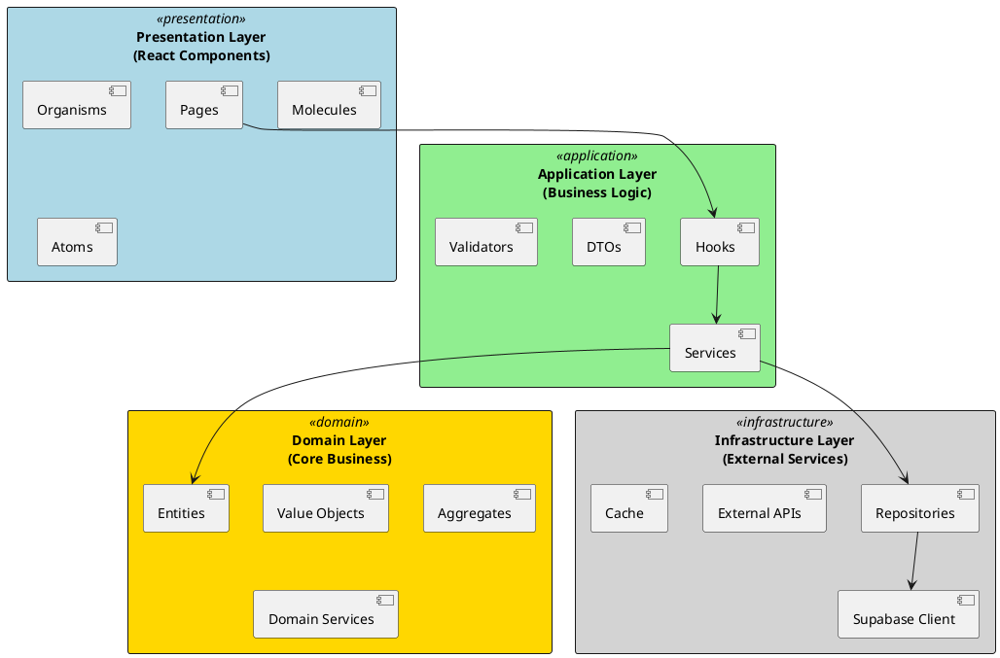
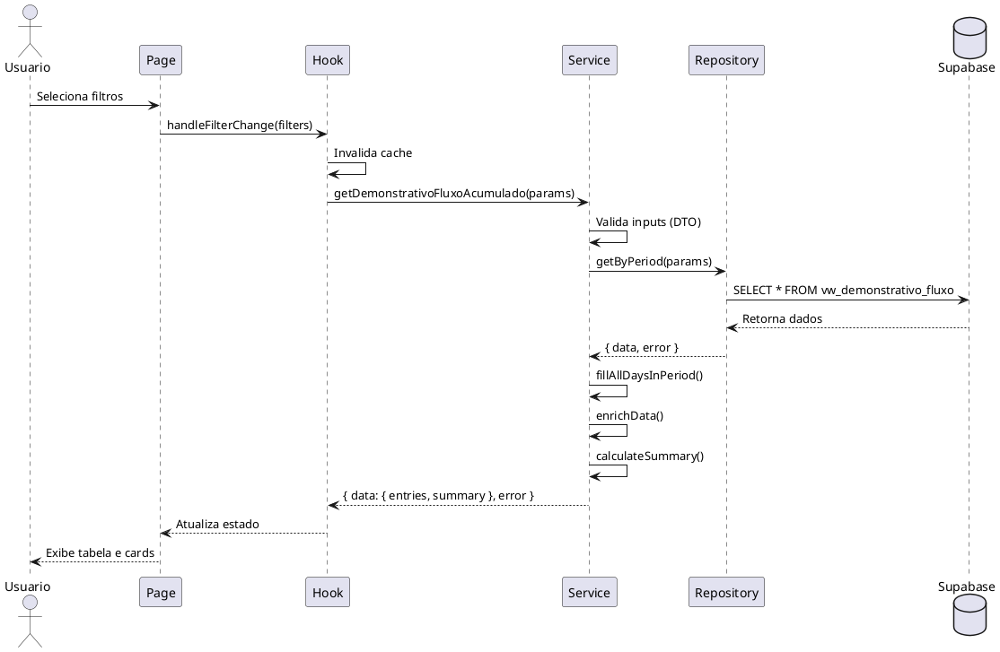
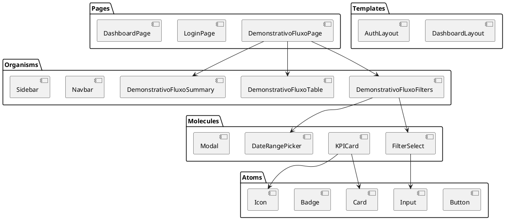
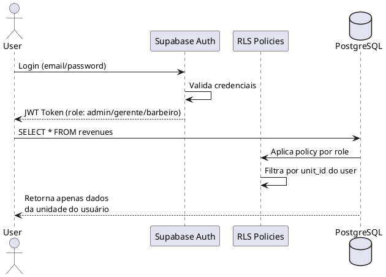
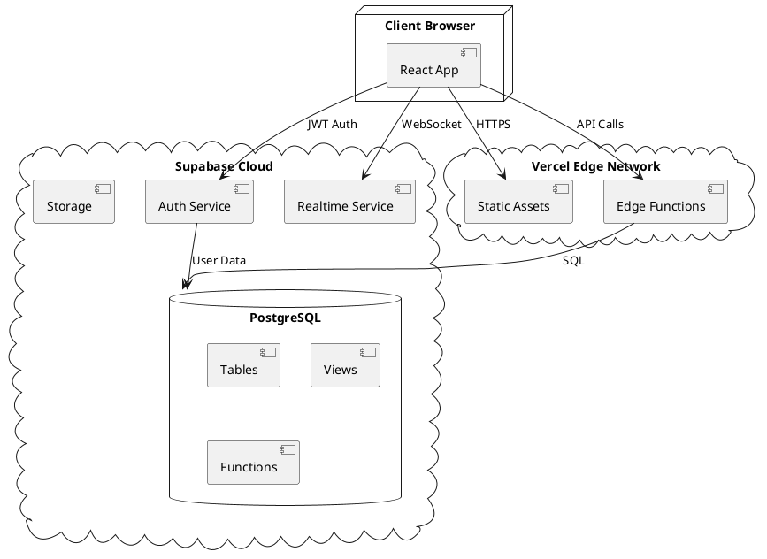

# 02 - Architecture: Barber Analytics Pro

---

**Documento:** 02_ARCHITECTURE.md
**Título:** Arquitetura do Sistema
**Autor:** Andrey Viana
**Versão:** 1.1.0
**Última Atualização:** 8 de novembro de 2025
**Licença:** Proprietary

---

## 📋 Objetivo do Documento

Este documento detalha a arquitetura técnica do **Barber Analytics Pro**, incluindo camadas, componentes, padrões arquiteturais e diagramas UML em formato PlantUML.

## 🏗️ Visão Geral da Arquitetura

O sistema adota **Clean Architecture** combinada com **Domain-Driven Design (DDD)** e **Atomic Design** para garantir:

- **Separação de Responsabilidades**: Cada camada tem função bem definida
- **Testabilidade**: Componentes isolados e mockáveis
- **Manutenibilidade**: Código legível e modular
- **Escalabilidade**: Preparado para crescimento horizontal

### Princípios Fundamentais

1. **Dependency Inversion**: Dependências apontam para o domínio
2. **Single Responsibility**: Cada módulo tem uma única razão para mudar
3. **Open/Closed**: Aberto para extensão, fechado para modificação
4. **Interface Segregation**: Interfaces específicas e coesas

## 🎯 Camadas da Arquitetura



### Camada 1: Presentation (Apresentação)

**Responsabilidade**: Interface com o usuário

**Componentes**:

- **Pages**: Páginas completas com rotas
- **Organisms**: Componentes complexos (Navbar, Sidebar, Dashboard)
- **Molecules**: Componentes compostos (KPICard, Modal, Chart)
- **Atoms**: Componentes básicos (Button, Input, Card)

**Tecnologias**:

- React 19
- TailwindCSS (Design System)
- React Router v6
- Lucide Icons

**Exemplo**:

```javascript
// src/pages/DemonstrativoFluxoPage.jsx
function DemonstrativoFluxoPage() {
  const { selectedUnit } = useUnit();
  const { data, loading, handleFilterChange } = useDemonstrativoFluxo({
    unitId: selectedUnit?.id,
  });

  return (
    <div className="card-theme p-6">
      <DemonstrativoFluxoFilters onFilterChange={handleFilterChange} />
      <DemonstrativoFluxoSummary data={data?.summary} />
      <DemonstrativoFluxoTable data={data?.entries} />
    </div>
  );
}
```

### Camada 2: Application (Aplicação)

**Responsabilidade**: Orquestração de casos de uso e lógica de negócio

**Componentes**:

- **Hooks**: Gerenciamento de estado e side effects (TanStack Query)
- **Services**: Regras de negócio e validações
- **DTOs**: Data Transfer Objects para validação
- **Validators**: Funções de validação reutilizáveis

**Padrões Utilizados**:

- Repository Pattern
- Service Layer Pattern
- DTO Pattern

**Exemplo**:

```javascript
// src/services/cashflowService.js
export const cashflowService = {
  async getDemonstrativoFluxoAcumulado({
    unitId,
    accountId,
    startDate,
    endDate,
  }) {
    // ETAPA 1: Validar inputs
    const dto = new DemonstrativoFluxoDTO({
      unitId,
      accountId,
      startDate,
      endDate,
    });
    if (!dto.isValid()) {
      return { data: null, error: dto.getErrors() };
    }

    // ETAPA 2: Buscar dados via repository
    const { data, error } = await demonstrativoFluxoRepository.getByPeriod({
      unitId,
      accountId,
      startDate,
      endDate,
    });

    if (error) return { data: null, error };

    // ETAPA 3: Preencher todos os dias do período
    const completeEntries = this.fillAllDaysInPeriod(data, startDate, endDate);

    // ETAPA 4: Enriquecer dados
    const enrichedEntries = completeEntries.map(entry => ({
      ...entry,
      formattedDate: formatDate(entry.transaction_date),
      formattedEntradas: formatCurrency(entry.entradas),
      // ... mais formatações
    }));

    // ETAPA 5: Calcular resumo
    const summary = this.calculateSummary(enrichedEntries);

    return { data: { entries: enrichedEntries, summary }, error: null };
  },
};
```

### Camada 3: Domain (Domínio)

**Responsabilidade**: Regras de negócio puras (framework-independent)

**Componentes**:

- **Entities**: Objetos com identidade única (Revenue, Expense, Client)
- **Value Objects**: Objetos imutáveis sem identidade (Money, CPF, Email)
- **Aggregates**: Conjunto de entidades tratadas como unidade
- **Domain Services**: Lógica que não pertence a uma entidade específica

**Exemplo**:

```javascript
// src/domain/entities/Revenue.js
export class Revenue {
  constructor({
    id,
    value,
    date,
    unitId,
    professionalId,
    paymentMethodId,
    status,
  }) {
    this.id = id;
    this.value = Money.create(value);
    this.date = date;
    this.unitId = unitId;
    this.professionalId = professionalId;
    this.paymentMethodId = paymentMethodId;
    this.status = status;
  }

  // Domain logic
  canBeCanceled() {
    return this.status !== 'Received';
  }

  calculateNetAmount(feePercentage) {
    const fee = this.value.multiply(feePercentage / 100);
    return this.value.subtract(fee);
  }
}
```

### Camada 4: Infrastructure (Infraestrutura)

**Responsabilidade**: Comunicação com serviços externos

**Componentes**:

- **Repositories**: Acesso a dados (Supabase)
- **Supabase Client**: Cliente configurado
- **External APIs**: Integrações (Asaas, WhatsApp)
- **Cache**: TanStack Query cache layer

**Exemplo**:

```javascript
// src/repositories/demonstrativoFluxoRepository.js
export const demonstrativoFluxoRepository = {
  async getByPeriod({ unitId, accountId, startDate, endDate }) {
    let query = supabase
      .from('vw_demonstrativo_fluxo')
      .select('*')
      .eq('unit_id', unitId)
      .gte('transaction_date', startDate)
      .lte('transaction_date', endDate)
      .order('transaction_date', { ascending: true });

    if (accountId) {
      query = query.eq('account_id', accountId);
    }

    const { data, error } = await query;

    return { data, error };
  },
};
```

## 📊 Diagrama de Componentes (C4 Model - Level 2)

```plantuml
@startuml Component Diagram
!include https://raw.githubusercontent.com/plantuml-stdlib/C4-PlantUML/master/C4_Component.puml

LAYOUT_WITH_LEGEND()

Container_Boundary(frontend, "Frontend Application") {
    Component(pages, "Pages", "React", "Páginas da aplicação")
    Component(hooks, "Custom Hooks", "TanStack Query", "Gerenciamento de estado")
    Component(services, "Services", "JavaScript", "Lógica de negócio")
    Component(repositories, "Repositories", "JavaScript", "Acesso a dados")
}

Container_Boundary(backend, "Supabase Backend") {
    ComponentDb(database, "PostgreSQL", "Database", "Armazena dados")
    Component(auth, "Auth", "Supabase Auth", "Autenticação JWT")
    Component(realtime, "Realtime", "WebSockets", "Eventos em tempo real")
    Component(edge, "Edge Functions", "Deno", "Lógica serverless")
}

Rel(pages, hooks, "Usa")
Rel(hooks, services, "Chama")
Rel(services, repositories, "Usa")
Rel(repositories, database, "Query SQL")
Rel(pages, auth, "Autentica")
Rel(hooks, realtime, "Subscribe")
Rel(services, edge, "Invoca")
@enduml
```

## 🔄 Fluxo de Dados (Sequence Diagram)

### Cenário: Buscar Demonstrativo de Fluxo de Caixa



## 🎨 Atomic Design

### Hierarquia de Componentes



## 🔐 Arquitetura de Segurança

### RLS (Row Level Security)



### Políticas RLS Principais

```sql
-- Exemplo: Policy para revenues
CREATE POLICY "view_own_unit_revenues"
ON revenues
FOR SELECT USING (
  unit_id IN (
    SELECT unit_id
    FROM professionals
    WHERE user_id = auth.uid()
    AND is_active = true
  )
);

CREATE POLICY "manage_revenues_admin_gerente"
ON revenues
FOR ALL USING (
  EXISTS (
    SELECT 1 FROM professionals
    WHERE user_id = auth.uid()
    AND unit_id = revenues.unit_id
    AND role IN ('admin', 'administrador', 'gerente')
    AND is_active = true
  )
);
```

## 📡 Integração com Supabase

### Realtime Subscriptions

```javascript
// src/hooks/useRealtimeRevenues.js
export function useRealtimeRevenues(unitId) {
  const queryClient = useQueryClient();

  useEffect(() => {
    const subscription = supabase
      .channel('revenues-changes')
      .on(
        'postgres_changes',
        {
          event: '*',
          schema: 'public',
          table: 'revenues',
          filter: `unit_id=eq.${unitId}`,
        },
        payload => {
          // Invalida cache quando houver mudanças
          queryClient.invalidateQueries(['revenues', unitId]);
        }
      )
      .subscribe();

    return () => {
      subscription.unsubscribe();
    };
  }, [unitId, queryClient]);
}
```

## 🚀 Deployment Architecture



## 🤖 Módulo de IA Financeira

### Arquitetura do Módulo

O módulo de IA Financeira segue a mesma estrutura Clean Architecture, com componentes específicos:

**Camada de Apresentação:**
- `/app/ia-financeira/saude/page.tsx` - Dashboard de Saúde Financeira
- `/app/ia-financeira/fluxo/page.tsx` - Dashboard de Fluxo de Caixa
- `/app/ia-financeira/alertas/page.tsx` - Dashboard de Alertas
- `/components/molecules/KPICard.tsx` - Card de KPI reutilizável
- `/components/molecules/TrendChart.tsx` - Gráfico de tendência
- `/components/molecules/ForecastAreaChart.tsx` - Gráfico de previsão

**Camada de Aplicação:**
- `/hooks/useHealthKPIs.ts` - Hook para KPIs de saúde
- `/lib/analytics/etl.ts` - Pipeline ETL diário
- `/lib/analytics/anomalies.ts` - Detecção de anomalias
- `/lib/analytics/cashflowForecast.ts` - Previsões de fluxo

**Camada de Domínio:**
- Entidades: `AIMetricsDaily`, `AlertEvent`, `KPITarget`
- Value Objects: `Trend`, `Severity`, `AlertType`

**Camada de Infraestrutura:**
- `/lib/repositories/aiMetricsRepository.ts`
- `/lib/repositories/alertsRepository.ts`
- `/lib/repositories/kpiTargetsRepository.ts`
- `/lib/ai/openai.ts` - Cliente OpenAI com circuit breaker
- `/lib/ai/analysis.ts` - Geração de análises
- `/lib/ai/anonymization.ts` - Anonimização de dados
- `/lib/telegram.ts` - Envio de alertas via Telegram
- `/lib/telegram/commands.ts` - Comandos do bot

### Fluxo de Dados

```plaintext
┌─────────────────────────────────────────────────────────────┐
│                    CRON JOBS (Vercel)                       │
│  ┌──────────────┐  ┌──────────────┐  ┌──────────────┐     │
│  │ ETL Diário   │  │ Relatório    │  │ Enviar       │     │
│  │ (03:00)      │  │ Semanal      │  │ Alertas      │     │
│  └──────┬───────┘  └──────┬───────┘  └──────┬───────┘     │
└─────────┼──────────────────┼──────────────────┼────────────┘
          │                  │                  │
          ▼                  ▼                  ▼
┌─────────────────────────────────────────────────────────────┐
│              APPLICATION LAYER (ETL & Analytics)            │
│  ┌──────────────┐  ┌──────────────┐  ┌──────────────┐     │
│  │ etlDaily()   │  │ detectAnomalies() │ generateAnalysis() │
│  └──────┬───────┘  └──────┬───────┘  └──────┬───────┘     │
└─────────┼──────────────────┼──────────────────┼────────────┘
          │                  │                  │
          ▼                  ▼                  ▼
┌─────────────────────────────────────────────────────────────┐
│              INFRASTRUCTURE LAYER (Repositories)             │
│  ┌──────────────┐  ┌──────────────┐  ┌──────────────┐     │
│  │ aiMetrics    │  │ alerts       │  │ OpenAI       │     │
│  │ Repository   │  │ Repository   │  │ Client       │     │
│  └──────┬───────┘  └──────┬───────┘  └──────┬───────┘     │
└─────────┼──────────────────┼──────────────────┼────────────┘
          │                  │                  │
          ▼                  ▼                  ▼
┌─────────────────────────────────────────────────────────────┐
│                    SUPABASE (PostgreSQL)                    │
│  ┌──────────────┐  ┌──────────────┐  ┌──────────────┐     │
│  │ ai_metrics_  │  │ alerts_events │  │ openai_cache │     │
│  │ daily        │  │              │  │              │     │
│  └──────────────┘  └──────────────┘  └──────────────┘     │
└─────────────────────────────────────────────────────────────┘
```

### Padrões Específicos do Módulo

**Circuit Breaker Pattern:**
- Proteção contra falhas do OpenAI e Telegram
- Configuração: `failureThreshold: 5`, `resetTimeout: 60000ms`

**Retry com Exponential Backoff:**
- Retry automático para chamadas externas
- Configuração: `maxAttempts: 3`, `initialDelay: 1000ms`

**Cache Strategy:**
- Cache genérico com TTL configurável
- Cache específico para análises IA (TTL: 24h)
- Redução de custos OpenAI em 40-60%

**Idempotência:**
- ETL diário usa `etl_runs` para garantir idempotência
- Evita processamento duplicado

**Anonimização:**
- Dados PII removidos antes de enviar à OpenAI
- Função `anonymizeMetrics` implementada

---

### Cache Strategy (TanStack Query)

```javascript
// src/config/queryClient.js
export const queryClient = new QueryClient({
  defaultOptions: {
    queries: {
      staleTime: 5 * 60 * 1000, // 5 minutos
      cacheTime: 10 * 60 * 1000, // 10 minutos
      refetchOnWindowFocus: false,
      retry: 3,
      retryDelay: attemptIndex => Math.min(1000 * 2 ** attemptIndex, 30000),
    },
  },
});
```

### Database Indexes

```sql
-- Índices críticos para performance
CREATE INDEX idx_revenues_unit_date ON revenues(unit_id, date);
CREATE INDEX idx_expenses_unit_date ON expenses(unit_id, date);
CREATE INDEX idx_orders_unit_status ON orders(unit_id, status);
CREATE INDEX idx_professionals_unit_active ON professionals(unit_id, is_active);

-- Índices para módulo IA Financeira
CREATE INDEX idx_ai_metrics_unit_date ON ai_metrics_daily(unit_id, date);
CREATE INDEX idx_alerts_unit_status ON alerts_events(unit_id, status, created_at);
CREATE INDEX idx_forecasts_unit_date ON forecasts_cashflow(unit_id, forecast_date);
CREATE INDEX idx_openai_cache_key ON openai_cache(cache_key);
CREATE INDEX idx_openai_cost_unit_date ON openai_cost_tracking(unit_id, date);
CREATE INDEX idx_etl_runs_type_status ON etl_runs(run_type, status, created_at);
```

## 🔧 Padrões de Código

### Naming Conventions

| Tipo       | Padrão               | Exemplo                        |
| ---------- | -------------------- | ------------------------------ |
| Componente | PascalCase           | `DemonstrativoFluxoPage`       |
| Hook       | camelCase com "use"  | `useDemonstrativoFluxo`        |
| Service    | camelCase            | `cashflowService`              |
| Repository | camelCase            | `demonstrativoFluxoRepository` |
| DTO        | PascalCase com "DTO" | `CreateRevenueDTO`             |
| Função     | camelCase            | `formatCurrency`               |
| Constante  | UPPER_SNAKE_CASE     | `API_BASE_URL`                 |

### Error Handling Pattern

```javascript
// Pattern padrão: { data, error }
async function fetchData() {
  try {
    const result = await repository.getData();
    return { data: result, error: null };
  } catch (error) {
    console.error('Error fetching data:', error);
    return { data: null, error: error.message };
  }
}
```

## 📚 Referências

- **Clean Architecture**: Robert C. Martin, 2017
- **DDD**: Eric Evans, 2003
- **Atomic Design**: Brad Frost, 2016
- **C4 Model**: Simon Brown
- **React Patterns**: Kent C. Dodds

---

## 🔗 Navegação

- **Anterior**: [01 - Requirements](./01_REQUIREMENTS.md)
- **Próximo**: [03 - Domain Model](./03_DOMAIN_MODEL.md)
- **Índice Geral**: [Documentação](./DOCUMENTACAO_INDEX.md)

---
