# 03 - Domain Model (DDD)

Este documento descreve o **Modelo de Domínio** do Barber Analytics Pro utilizando conceitos de **Domain-Driven Design (DDD)** conforme definido por Eric Evans.

---

## 📋 Índice

- [Introdução](#introdução)
- [Ubiquitous Language](#ubiquitous-language)
- [Bounded Contexts](#bounded-contexts)
- [Entities](#entities)
- [Value Objects](#value-objects)
- [Aggregates](#aggregates)
- [Domain Services](#domain-services)
- [Domain Events](#domain-events)
- [Repositories](#repositories)
- [Factories](#factories)
- [Referências](#referências)

---

## 🎯 Introdução

O **Domain Model** representa o núcleo de negócio do sistema, isolado de preocupações técnicas. Seguimos os princípios de **Domain-Driven Design (DDD)** para:

- ✅ Expressar regras de negócio de forma explícita
- ✅ Usar linguagem ubíqua compartilhada com especialistas do domínio
- ✅ Isolar lógica de domínio de infraestrutura
- ✅ Garantir consistência através de aggregates
- ✅ Modelar comportamento, não apenas dados

**Referências:**

- Evans, Eric. _Domain-Driven Design: Tackling Complexity in the Heart of Software_. Addison-Wesley, 2003.
- Vernon, Vaughn. _Implementing Domain-Driven Design_. Addison-Wesley, 2013.

---

## 🗣️ Ubiquitous Language

### Glossário de Termos de Domínio

| Termo                     | Definição                                    | Sinônimos             |
| ------------------------- | -------------------------------------------- | --------------------- |
| **Unidade**               | Barbearia física ou filial                   | Filial, Loja          |
| **Profissional**          | Barbeiro ou funcionário da unidade           | Barbeiro, Funcionário |
| **Receita**               | Entrada financeira registrada                | Revenue, Crédito      |
| **Despesa**               | Saída financeira registrada                  | Expense, Débito       |
| **Comanda**               | Pedido de serviço/produto do cliente         | Order, Pedido         |
| **Lista da Vez**          | Fila de atendimento por ordem de pontuação   | Turn List, Queue      |
| **DRE**                   | Demonstrativo de Resultado do Exercício      | Income Statement      |
| **Fluxo de Caixa**        | Demonstrativo de entradas e saídas           | Cash Flow Statement   |
| **Conciliação**           | Validação de receitas com extratos bancários | Bank Reconciliation   |
| **Regime de Competência** | Registro por data de competência             | Accrual Basis         |
| **Regime de Caixa**       | Registro por data de pagamento               | Cash Basis            |

---

## 🏗️ Bounded Contexts

O sistema é dividido em **5 contextos delimitados**:


---

## 🧩 Entities

### Entity: Revenue (Receita)

**Definição**: Entrada financeira registrada na unidade.

**Invariantes:**

- Valor deve ser positivo
- Data não pode ser futura
- Deve ter forma de pagamento válida
- Status deve seguir ciclo de vida válido


**Implementação:**

```javascript
// src/domain/entities/Revenue.js

export class Revenue {
  constructor({
    id,
    unitId,
    professionalId,
    value,
    date,
    competenceDate,
    description,
    category,
    paymentMethod,
    status = 'PENDING',
  }) {
    this.id = id;
    this.unitId = unitId;
    this.professionalId = professionalId;
    this.value = Money.fromNumber(value);
    this.date = new Date(date);
    this.competenceDate = new Date(competenceDate || date);
    this.description = description;
    this.category = category;
    this.paymentMethod = paymentMethod;
    this.status = status;

    this.validate();
  }

  validate() {
    if (this.value.isNegative()) {
      throw new Error('Valor da receita deve ser positivo');
    }

    if (this.date > new Date()) {
      throw new Error('Data não pode ser futura');
    }

    if (!this.paymentMethod) {
      throw new Error('Forma de pagamento é obrigatória');
    }
  }

  markAsPaid() {
    if (this.status === 'CANCELLED') {
      throw new Error('Não é possível marcar receita cancelada como paga');
    }
    this.status = 'PAID';
  }

  markAsCancelled() {
    if (this.status === 'PAID') {
      throw new Error('Não é possível cancelar receita já paga');
    }
    this.status = 'CANCELLED';
  }

  calculateNetValue() {
    const feePercentage = this.paymentMethod.fee || 0;
    const feeAmount = this.value.multiply(feePercentage / 100);
    return this.value.subtract(feeAmount);
  }

  reconcile(bankTransaction) {
    if (this.sourceHash === bankTransaction.hash) {
      this.markAsPaid();
      return true;
    }
    return false;
  }
}
```

---

### Entity: Expense (Despesa)

**Definição**: Saída financeira registrada na unidade.

**Invariantes:**

- Valor deve ser positivo
- Categoria deve ser válida
- Status deve seguir ciclo de vida válido


**Implementação:**

```javascript
// src/domain/entities/Expense.js

export class Expense {
  constructor({
    id,
    unitId,
    value,
    date,
    competenceDate,
    description,
    category,
    paymentMethod,
    status = 'PENDING',
    isRecurring = false,
  }) {
    this.id = id;
    this.unitId = unitId;
    this.value = Money.fromNumber(value);
    this.date = new Date(date);
    this.competenceDate = new Date(competenceDate || date);
    this.description = description;
    this.category = category;
    this.paymentMethod = paymentMethod;
    this.status = status;
    this.isRecurring = isRecurring;

    this.validate();
  }

  validate() {
    if (this.value.isNegative()) {
      throw new Error('Valor da despesa deve ser positivo');
    }

    if (!this.category) {
      throw new Error('Categoria é obrigatória');
    }
  }

  markAsPaid() {
    if (this.status === 'CANCELLED') {
      throw new Error('Não é possível marcar despesa cancelada como paga');
    }
    this.status = 'PAID';
  }

  markAsCancelled() {
    this.status = 'CANCELLED';
  }

  isFixed() {
    return this.category.type === 'FIXED';
  }

  isVariable() {
    return this.category.type === 'VARIABLE';
  }
}
```

---

### Entity: Order (Comanda)

**Definição**: Pedido de serviços/produtos feito por um cliente.

**Invariantes:**

- Deve ter ao menos 1 item
- Total calculado deve bater com soma dos itens
- Não pode alterar comanda fechada


**Implementação:**

```javascript
// src/domain/entities/Order.js

export class Order {
  constructor({
    id,
    unitId,
    professionalId,
    clientId,
    items = [],
    discount = 0,
    status = 'OPEN',
    openedAt = new Date(),
    closedAt = null,
  }) {
    this.id = id;
    this.unitId = unitId;
    this.professionalId = professionalId;
    this.clientId = clientId;
    this.items = items.map(item => new OrderItem(item));
    this.discount = Money.fromNumber(discount);
    this.status = status;
    this.openedAt = openedAt;
    this.closedAt = closedAt;
  }

  addItem(itemData) {
    if (this.status !== 'OPEN') {
      throw new Error('Não é possível adicionar itens a comanda fechada');
    }

    const item = new OrderItem({
      ...itemData,
      orderId: this.id,
    });

    this.items.push(item);
  }

  removeItem(itemId) {
    if (this.status !== 'OPEN') {
      throw new Error('Não é possível remover itens de comanda fechada');
    }

    this.items = this.items.filter(item => item.id !== itemId);
  }

  applyDiscount(amount) {
    if (this.status !== 'OPEN') {
      throw new Error('Não é possível aplicar desconto em comanda fechada');
    }

    this.discount = Money.fromNumber(amount);
  }

  calculateTotal() {
    const itemsTotal = this.items.reduce(
      (sum, item) => sum.add(item.calculateTotal()),
      Money.zero()
    );

    return itemsTotal.subtract(this.discount);
  }

  close() {
    if (this.items.length === 0) {
      throw new Error('Não é possível fechar comanda vazia');
    }

    if (this.status !== 'OPEN') {
      throw new Error('Comanda já está fechada');
    }

    this.status = 'CLOSED';
    this.closedAt = new Date();
  }

  cancel() {
    if (this.status === 'CLOSED') {
      throw new Error('Não é possível cancelar comanda já fechada');
    }

    this.status = 'CANCELLED';
  }
}

export class OrderItem {
  constructor({ id, orderId, type, referenceId, quantity, unitPrice }) {
    this.id = id;
    this.orderId = orderId;
    this.type = type; // 'SERVICE' ou 'PRODUCT'
    this.referenceId = referenceId;
    this.quantity = quantity;
    this.unitPrice = Money.fromNumber(unitPrice);
  }

  calculateTotal() {
    return this.unitPrice.multiply(this.quantity);
  }
}
```

---

## 💎 Value Objects

### Value Object: Money

**Definição**: Representa valores monetários com operações imutáveis.

**Características:**

- Imutável
- Comparável por valor
- Encapsula operações matemáticas


**Implementação:**

```javascript
// src/domain/value-objects/Money.js

export class Money {
  constructor(amount, currency = 'BRL') {
    this.amount = parseFloat(amount);
    this.currency = currency;
    Object.freeze(this);
  }

  static fromNumber(value) {
    return new Money(value);
  }

  static zero() {
    return new Money(0);
  }

  add(other) {
    this.ensureSameCurrency(other);
    return new Money(this.amount + other.amount, this.currency);
  }

  subtract(other) {
    this.ensureSameCurrency(other);
    return new Money(this.amount - other.amount, this.currency);
  }

  multiply(factor) {
    return new Money(this.amount * factor, this.currency);
  }

  divide(divisor) {
    if (divisor === 0) {
      throw new Error('Divisão por zero não permitida');
    }
    return new Money(this.amount / divisor, this.currency);
  }

  isZero() {
    return this.amount === 0;
  }

  isNegative() {
    return this.amount < 0;
  }

  equals(other) {
    return this.amount === other.amount && this.currency === other.currency;
  }

  toString() {
    return new Intl.NumberFormat('pt-BR', {
      style: 'currency',
      currency: this.currency,
    }).format(this.amount);
  }

  toNumber() {
    return this.amount;
  }

  ensureSameCurrency(other) {
    if (this.currency !== other.currency) {
      throw new Error('Moedas diferentes não podem ser operadas');
    }
  }
}
```

---

### Value Object: CPF

**Definição**: Representa um CPF brasileiro com validação.

```javascript
// src/domain/value-objects/CPF.js

export class CPF {
  constructor(value) {
    this.value = this.clean(value);
    this.validate();
    Object.freeze(this);
  }

  clean(cpf) {
    return cpf.replace(/\D/g, '');
  }

  validate() {
    if (this.value.length !== 11) {
      throw new Error('CPF deve ter 11 dígitos');
    }

    // Verifica CPFs inválidos conhecidos
    const invalidCPFs = [
      '00000000000',
      '11111111111',
      '22222222222',
      '33333333333',
      '44444444444',
      '55555555555',
      '66666666666',
      '77777777777',
      '88888888888',
      '99999999999',
    ];

    if (invalidCPFs.includes(this.value)) {
      throw new Error('CPF inválido');
    }

    // Validação do dígito verificador
    if (!this.validateDigits()) {
      throw new Error('CPF inválido');
    }
  }

  validateDigits() {
    let sum = 0;
    let remainder;

    // Valida primeiro dígito
    for (let i = 1; i <= 9; i++) {
      sum += parseInt(this.value.substring(i - 1, i)) * (11 - i);
    }
    remainder = (sum * 10) % 11;
    if (remainder === 10 || remainder === 11) remainder = 0;
    if (remainder !== parseInt(this.value.substring(9, 10))) return false;

    // Valida segundo dígito
    sum = 0;
    for (let i = 1; i <= 10; i++) {
      sum += parseInt(this.value.substring(i - 1, i)) * (12 - i);
    }
    remainder = (sum * 10) % 11;
    if (remainder === 10 || remainder === 11) remainder = 0;
    if (remainder !== parseInt(this.value.substring(10, 11))) return false;

    return true;
  }

  format() {
    return this.value.replace(/(\d{3})(\d{3})(\d{3})(\d{2})/, '$1.$2.$3-$4');
  }

  equals(other) {
    return this.value === other.value;
  }

  toString() {
    return this.format();
  }
}
```

---

### Value Object: Email

**Definição**: Representa um endereço de e-mail válido.

```javascript
// src/domain/value-objects/Email.js

export class Email {
  constructor(value) {
    this.value = value.toLowerCase().trim();
    this.validate();
    Object.freeze(this);
  }

  validate() {
    const emailRegex = /^[^\s@]+@[^\s@]+\.[^\s@]+$/;
    if (!emailRegex.test(this.value)) {
      throw new Error('E-mail inválido');
    }
  }

  getDomain() {
    return this.value.split('@')[1];
  }

  equals(other) {
    return this.value === other.value;
  }

  toString() {
    return this.value;
  }
}
```

---

### Value Object: DateRange

**Definição**: Representa um período com data inicial e final.

```javascript
// src/domain/value-objects/DateRange.js

export class DateRange {
  constructor(startDate, endDate) {
    this.startDate = new Date(startDate);
    this.endDate = new Date(endDate);
    this.validate();
    Object.freeze(this);
  }

  validate() {
    if (this.startDate > this.endDate) {
      throw new Error('Data inicial deve ser anterior à data final');
    }
  }

  contains(date) {
    const checkDate = new Date(date);
    return checkDate >= this.startDate && checkDate <= this.endDate;
  }

  overlaps(other) {
    return this.startDate <= other.endDate && other.startDate <= this.endDate;
  }

  getDurationInDays() {
    const diffTime = Math.abs(this.endDate - this.startDate);
    return Math.ceil(diffTime / (1000 * 60 * 60 * 24));
  }

  equals(other) {
    return (
      this.startDate.getTime() === other.startDate.getTime() &&
      this.endDate.getTime() === other.endDate.getTime()
    );
  }
}
```

---

## 📦 Aggregates

### Aggregate: Order Aggregate

**Aggregate Root**: Order
**Entities**: Order, OrderItem
**Boundary**: Tudo relacionado a uma comanda

**Regras de Consistência:**

- Total da comanda deve ser soma dos itens - desconto
- Itens só podem ser alterados em comandas abertas
- Ao fechar comanda, gera receita automaticamente

```plantuml
@startuml Order Aggregate Boundary
package "Order Aggregate" {
  class Order <<Aggregate Root>> {
    - id: UUID
    - items: OrderItem[]
    - total: Money
    - status: OrderStatus
    --
    + addItem()
    + removeItem()
    + close()
  }

  class OrderItem {
    - id: UUID
    - orderId: UUID
    - quantity: number
    - unitPrice: Money
  }

  Order "1" *-- "many" OrderItem
}

note right of Order
  Aggregate Root
  Único ponto de entrada
  Garante invariantes
end note
@enduml
```



---

## 🔧 Domain Services

### Domain Service: DRECalculator

**Definição**: Calcula o DRE (Demonstrativo de Resultado do Exercício).

```javascript
// src/domain/services/DRECalculator.js

export class DRECalculator {
  constructor(revenueRepository, expenseRepository) {
    this.revenueRepository = revenueRepository;
    this.expenseRepository = expenseRepository;
  }

  async calculate(unitId, period) {
    const revenues = await this.revenueRepository.findByPeriod(unitId, period);
    const expenses = await this.expenseRepository.findByPeriod(unitId, period);

    const receitaBruta = this.calculateReceitaBruta(revenues);
    const deducoes = this.calculateDeducoes(revenues);
    const receitaLiquida = receitaBruta.subtract(deducoes);

    const custosFixos = this.calculateCustosFixos(expenses);
    const custosVariaveis = this.calculateCustosVariaveis(expenses);
    const custoTotal = custosFixos.add(custosVariaveis);

    const lucroOperacional = receitaLiquida.subtract(custoTotal);
    const margemPercentual =
      (lucroOperacional.toNumber() / receitaBruta.toNumber()) * 100;

    return {
      receitaBruta,
      deducoes,
      receitaLiquida,
      custosFixos,
      custosVariaveis,
      custoTotal,
      lucroOperacional,
      margemPercentual,
    };
  }

  calculateReceitaBruta(revenues) {
    return revenues
      .filter(r => r.status === 'PAID')
      .reduce((sum, r) => sum.add(r.value), Money.zero());
  }

  calculateDeducoes(revenues) {
    return revenues
      .filter(r => r.status === 'PAID')
      .reduce((sum, r) => {
        const fee = r.paymentMethod.fee || 0;
        const feeAmount = r.value.multiply(fee / 100);
        return sum.add(feeAmount);
      }, Money.zero());
  }

  calculateCustosFixos(expenses) {
    return expenses
      .filter(e => e.isFixed() && e.status === 'PAID')
      .reduce((sum, e) => sum.add(e.value), Money.zero());
  }

  calculateCustosVariaveis(expenses) {
    return expenses
      .filter(e => e.isVariable() && e.status === 'PAID')
      .reduce((sum, e) => sum.add(e.value), Money.zero());
  }
}
```

---

### Domain Service: CommissionCalculator

**Definição**: Calcula comissões de profissionais.

```javascript
// src/domain/services/CommissionCalculator.js

export class CommissionCalculator {
  calculate(professional, revenue) {
    const commissionRule = professional.getCommissionRule();

    if (commissionRule.type === 'PERCENTAGE') {
      return revenue.value.multiply(commissionRule.rate / 100);
    }

    if (commissionRule.type === 'FIXED') {
      return Money.fromNumber(commissionRule.amount);
    }

    throw new Error('Tipo de comissão inválido');
  }

  calculateMonthly(professional, revenues) {
    return revenues.reduce(
      (total, revenue) => total.add(this.calculate(professional, revenue)),
      Money.zero()
    );
  }
}
```

---

## 🎉 Domain Events

### Domain Event: OrderClosed

**Definição**: Evento disparado quando uma comanda é fechada.

```javascript
// src/domain/events/OrderClosed.js

export class OrderClosed {
  constructor(order) {
    this.eventName = 'OrderClosed';
    this.occurredAt = new Date();
    this.aggregateId = order.id;
    this.payload = {
      orderId: order.id,
      unitId: order.unitId,
      professionalId: order.professionalId,
      total: order.calculateTotal().toNumber(),
      items: order.items.map(item => ({
        id: item.id,
        type: item.type,
        quantity: item.quantity,
        unitPrice: item.unitPrice.toNumber(),
      })),
    };
  }
}
```

**Event Handler:**

```javascript
// src/domain/event-handlers/OrderClosedHandler.js

export class OrderClosedHandler {
  constructor(revenueService) {
    this.revenueService = revenueService;
  }

  async handle(event) {
    const { orderId, unitId, professionalId, total } = event.payload;

    // Criar receita automaticamente
    await this.revenueService.createFromOrder({
      orderId,
      unitId,
      professionalId,
      value: total,
      date: event.occurredAt,
      description: `Comanda #${orderId}`,
      category: 'SERVICOS',
      status: 'PENDING',
    });
  }
}
```

---

## 📚 Repositories

### Repository Interface: IRevenueRepository

```javascript
// src/domain/repositories/IRevenueRepository.js

export class IRevenueRepository {
  async findById(id) {
    throw new Error('Method not implemented');
  }

  async findByPeriod(unitId, dateRange) {
    throw new Error('Method not implemented');
  }

  async save(revenue) {
    throw new Error('Method not implemented');
  }

  async delete(id) {
    throw new Error('Method not implemented');
  }

  async findBySourceHash(hash) {
    throw new Error('Method not implemented');
  }
}
```

---

## 🏭 Factories

### Factory: OrderFactory

```javascript
// src/domain/factories/OrderFactory.js

export class OrderFactory {
  static create({ unitId, professionalId, clientId }) {
    return new Order({
      id: crypto.randomUUID(),
      unitId,
      professionalId,
      clientId,
      items: [],
      discount: 0,
      status: 'OPEN',
      openedAt: new Date(),
    });
  }

  static createFromTemplate(template, overrides = {}) {
    return new Order({
      ...template,
      ...overrides,
      id: crypto.randomUUID(),
      openedAt: new Date(),
    });
  }
}
```

---

## 📊 Domain Model Overview


---

## 🔗 Navegação

- [← 02 - Architecture](./02_ARCHITECTURE.md)
- [→ 04 - Modules](./04_MODULES/)
- [📚 Summary](./SUMMARY.md)

---

## 📖 Referências

1. **Evans, Eric**. _Domain-Driven Design: Tackling Complexity in the Heart of Software_. Addison-Wesley Professional, 2003.

2. **Vernon, Vaughn**. _Implementing Domain-Driven Design_. Addison-Wesley Professional, 2013.

3. **Fowler, Martin**. _Patterns of Enterprise Application Architecture_. Addison-Wesley Professional, 2002.

4. **Martin, Robert C.**. _Clean Architecture: A Craftsman's Guide to Software Structure and Design_. Prentice Hall, 2017.

---

**Última atualização:** 7 de novembro de 2025
**Versão:** 1.0.0
**Autor:** Andrey Viana
