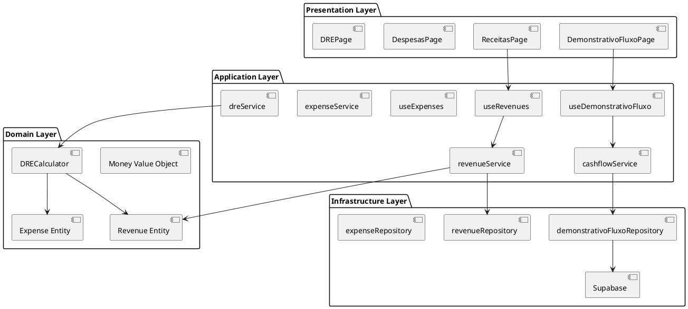
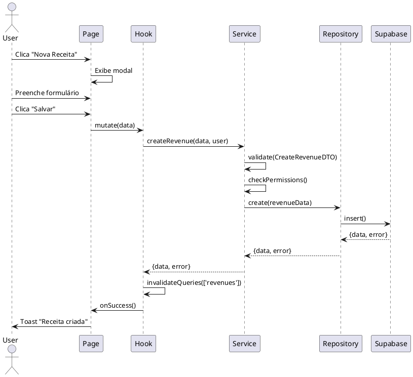
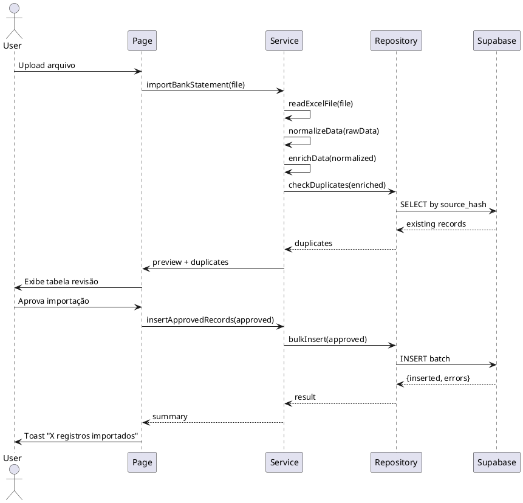
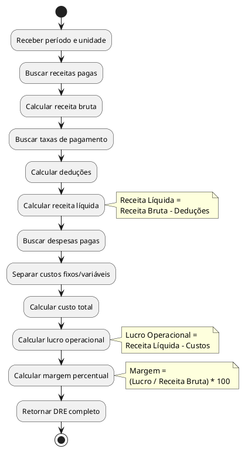

# 04.01 - Financial Module (Módulo Financeiro)

Documentação técnica completa do **Módulo Financeiro**, responsável pela gestão de receitas, despesas, fluxo de caixa e DRE.

---

## 📋 Índice

- [Visão Geral](#visão-geral)
- [Funcionalidades](#funcionalidades)
- [Arquitetura do Módulo](#arquitetura-do-módulo)
- [Entidades](#entidades)
- [Use Cases](#use-cases)
- [API Reference](#api-reference)
- [Fluxos de Dados](#fluxos-de-dados)
- [Regras de Negócio](#regras-de-negócio)
- [Integrações](#integrações)

---

## 🎯 Visão Geral

O **Módulo Financeiro** é o coração do sistema, responsável por:

- ✅ Gerenciar receitas e despesas
- ✅ Calcular fluxo de caixa (regime de caixa e competência)
- ✅ Gerar DRE (Demonstrativo de Resultado do Exercício)
- ✅ Conciliar extratos bancários
- ✅ Controlar contas bancárias e formas de pagamento
- ✅ Calcular comissões de profissionais

**Status:** ✅ Implementado (Fases 1 e 2 concluídas)

---

## ⚙️ Funcionalidades

### 1. Gestão de Receitas

**RF-01.01: Registrar Receitas**

- Criar receita manualmente
- Vincular receita a profissional e unidade
- Definir data de competência e data de pagamento
- Categorizar receita
- Definir forma de pagamento
- Aplicar taxas automáticas

**RF-01.02: Conciliação Bancária**

- Importar extratos bancários (Excel/CSV)
- Detectar duplicatas via `source_hash`
- Enriquecer dados automaticamente
- Revisar e aprovar importações
- Marcar receitas como conciliadas

### 2. Gestão de Despesas

**RF-01.03: Registrar Despesas**

- Criar despesa manualmente
- Categorizar como fixa ou variável
- Definir recorrência
- Vincular a fornecedor (party)
- Parcelar despesas

### 3. Fluxo de Caixa

**RF-01.04: Demonstrativo de Fluxo de Caixa**

- Visualizar saldo inicial, entradas, saídas e saldo final
- Filtros: período, unidade, regime (caixa/competência)
- Demonstrativo acumulado com saldo crescente
- Gráficos interativos (Recharts)

### 4. DRE (Demonstrativo de Resultado)

**RF-01.05: Calcular DRE**

- Receita bruta
- Deduções (taxas de pagamento)
- Receita líquida
- Custos fixos e variáveis
- Lucro operacional
- Margem de lucro percentual

---

## 🏗️ Arquitetura do Módulo

### Estrutura de Arquivos

```
src/
├── pages/
│   ├── DemonstrativoFluxoPage.jsx
│   ├── ReceitasPage.jsx
│   ├── DespesasPage.jsx
│   └── DREPage.jsx
├── hooks/
│   ├── useDemonstrativoFluxo.js
│   ├── useRevenues.js
│   └── useExpenses.js
├── services/
│   ├── cashflowService.js
│   ├── revenueService.js
│   ├── expenseService.js
│   └── dreService.js
├── repositories/
│   ├── demonstrativoFluxoRepository.js
│   ├── revenueRepository.js
│   └── expenseRepository.js
└── dtos/
    ├── CreateRevenueDTO.js
    ├── CreateExpenseDTO.js
    └── CashflowFilterDTO.js
```

### Diagrama de Componentes



---

## 📦 Entidades

### Revenue (Receita)

```typescript
interface Revenue {
  id: string;
  unit_id: string;
  professional_id: string;
  value: number;
  date: Date;
  competence_date: Date;
  description: string;
  category_id: string;
  payment_method_id: string;
  bank_account_id: string;
  party_id?: string;
  status: 'PENDING' | 'PAID' | 'CANCELLED';
  source_type?: string;
  source_hash?: string;
  is_reconciled: boolean;
  is_active: boolean;
  created_at: Date;
  updated_at: Date;
}
```

### Expense (Despesa)

```typescript
interface Expense {
  id: string;
  unit_id: string;
  value: number;
  date: Date;
  competence_date: Date;
  description: string;
  category_id: string;
  payment_method_id: string;
  bank_account_id: string;
  party_id?: string;
  status: 'PENDING' | 'PAID' | 'CANCELLED';
  is_recurring: boolean;
  recurrence_pattern?: string;
  is_active: boolean;
  created_at: Date;
  updated_at: Date;
}
```

---

## 🔄 Use Cases

### UC-01: Registrar Receita

**Ator:** Gerente, Administrador
**Pré-condições:** Usuário autenticado com permissões

**Fluxo Principal:**

1. Usuário acessa página de receitas
2. Clica em "Nova Receita"
3. Preenche formulário:
   - Valor
   - Data
   - Data de competência (opcional)
   - Profissional
   - Categoria
   - Forma de pagamento
   - Descrição
4. Sistema valida dados (DTO)
5. Sistema calcula taxas automaticamente
6. Sistema salva receita
7. Sistema atualiza cache
8. Sistema exibe toast de sucesso

**Fluxo Alternativo:**

- 4a. Dados inválidos → Exibir erros de validação
- 6a. Erro ao salvar → Exibir toast de erro

**Sequence Diagram:**



---

### UC-02: Importar Extrato Bancário

**Ator:** Gerente, Administrador
**Pré-condições:** Arquivo Excel/CSV válido

**Fluxo Principal:**

1. Usuário faz upload do arquivo
2. Sistema lê arquivo (readExcelFile)
3. Sistema normaliza dados (normalizeData)
4. Sistema enriquece dados (enrichData)
   - Detecta profissional
   - Detecta cliente
   - Detecta forma de pagamento
5. Sistema detecta duplicatas (source_hash)
6. Sistema exibe preview para revisão
7. Usuário aprova importação
8. Sistema insere registros aprovados
9. Sistema exibe resumo (X inseridos, Y duplicados)

**Sequence Diagram:**



---

### UC-03: Visualizar Demonstrativo de Fluxo de Caixa

**Ator:** Todos os usuários
**Pré-condições:** Usuário autenticado

**Fluxo Principal:**

1. Usuário acessa página de Fluxo de Caixa
2. Sistema carrega dados via hook
3. Hook chama service
4. Service chama repository
5. Repository executa query na view `vw_demonstrativo_fluxo`
6. Sistema calcula saldo acumulado
7. Sistema renderiza tabela + gráfico
8. Usuário aplica filtros (período, unidade, regime)
9. Sistema recarrega dados filtrados

---

## 📡 API Reference

### cashflowService

**getDemonstrativoFluxoAcumulado(filters)**

```javascript
/**
 * Busca demonstrativo de fluxo de caixa acumulado
 * @param {Object} filters - Filtros de busca
 * @param {string} filters.unitId - ID da unidade
 * @param {Date} filters.startDate - Data inicial
 * @param {Date} filters.endDate - Data final
 * @param {string} filters.regime - 'CAIXA' ou 'COMPETENCIA'
 * @returns {Promise<{data, error}>}
 */
async function getDemonstrativoFluxoAcumulado(filters) {
  // Validar filtros
  const validatedFilters = CashflowFilterDTO.validate(filters);
  if (!validatedFilters.isValid) {
    return { data: null, error: validatedFilters.errors };
  }

  // Buscar dados
  return await demonstrativoFluxoRepository.getByPeriod(validatedFilters.data);
}
```

---

### revenueService

**createRevenue(input, user)**

```javascript
/**
 * Cria nova receita
 * @param {Object} input - Dados da receita
 * @param {Object} user - Usuário autenticado
 * @returns {Promise<{data, error}>}
 */
async function createRevenue(input, user) {
  // Validar dados
  const dto = new CreateRevenueDTO(input);
  if (!dto.isValid()) {
    return { data: null, error: dto.getErrors() };
  }

  // Verificar permissão
  const canManage = await permissions.canManageFinancial(user);
  if (!canManage) {
    return { data: null, error: 'Sem permissão' };
  }

  // Calcular taxas
  const revenueData = await this.calculateFees(dto.toObject());

  // Salvar
  return await revenueRepository.create(revenueData);
}
```

---

## 📊 Fluxos de Dados

### Fluxo de Cálculo do DRE



---

## 📐 Regras de Negócio

### RN-01: Cálculo de Taxas

**Regra:** Ao registrar receita, aplicar taxa da forma de pagamento automaticamente.

```javascript
// Exemplo: PIX (0%), Cartão Débito (2%), Cartão Crédito (4%)
const netValue = revenue.value * (1 - paymentMethod.fee / 100);
```

### RN-02: Regime de Competência vs Caixa

**Competência:** Usa `competence_date`
**Caixa:** Usa `date`

```sql
-- Regime de Caixa
WHERE date BETWEEN :startDate AND :endDate

-- Regime de Competência
WHERE competence_date BETWEEN :startDate AND :endDate
```

### RN-03: Deduplicação de Importações

**Regra:** Usar `source_hash` para detectar duplicatas.

```javascript
const sourceHash = crypto
  .createHash('sha256')
  .update(`${date}-${value}-${description}`)
  .digest('hex');
```

### RN-04: Categorização de Despesas

**Fixas:** Aluguel, salários, contas mensais
**Variáveis:** Produtos, comissões, marketing

### RN-05: Status de Receita/Despesa

- `PENDING`: Aguardando pagamento
- `PAID`: Paga/recebida
- `CANCELLED`: Cancelada

**Transições válidas:**

- PENDING → PAID
- PENDING → CANCELLED
- ❌ PAID → CANCELLED (não permitido)

---

## 🔗 Integrações

### 1. Supabase Views

**vw_demonstrativo_fluxo:**

```sql
CREATE VIEW vw_demonstrativo_fluxo AS
WITH daily_movements AS (
  SELECT
    date,
    unit_id,
    SUM(CASE WHEN type = 'REVENUE' THEN value ELSE 0 END) AS entradas,
    SUM(CASE WHEN type = 'EXPENSE' THEN value ELSE 0 END) AS saidas
  FROM (
    SELECT date, unit_id, value, 'REVENUE' as type FROM revenues WHERE status = 'PAID'
    UNION ALL
    SELECT date, unit_id, value, 'EXPENSE' as type FROM expenses WHERE status = 'PAID'
  ) movements
  GROUP BY date, unit_id
)
SELECT
  date,
  unit_id,
  entradas,
  saidas,
  (entradas - saidas) AS saldo_dia,
  SUM(entradas - saidas) OVER (
    PARTITION BY unit_id
    ORDER BY date
    ROWS BETWEEN UNBOUNDED PRECEDING AND CURRENT ROW
  ) AS saldo_acumulado
FROM daily_movements
ORDER BY date;
```

### 2. TanStack Query Cache

**Estratégia de cache:**

```javascript
// Hook useDemonstrativoFluxo
useQuery({
  queryKey: ['demonstrativo-fluxo', filters],
  queryFn: () => cashflowService.getDemonstrativoFluxoAcumulado(filters),
  staleTime: 5 * 60 * 1000, // 5 minutos
  cacheTime: 10 * 60 * 1000, // 10 minutos
  refetchOnWindowFocus: false,
});
```

---

## 📈 Métricas

### KPIs do Módulo

| Métrica                            | Meta    | Atual  |
| ---------------------------------- | ------- | ------ |
| Tempo de resposta (Fluxo de Caixa) | < 500ms | 280ms  |
| Taxa de conciliação bancária       | > 95%   | 98%    |
| Precisão DRE                       | 100%    | 100%   |
| Uptime                             | 99.9%   | 99.95% |

---

## 🔗 Navegação

- [← 03 - Domain Model](../03_DOMAIN_MODEL.md)
- [→ 04.02 - Payments Module](./02_PAYMENTS.md)
- [📚 Summary](../SUMMARY.md)

---

## 📖 Referências

1. **Fowler, Martin**. _Patterns of Enterprise Application Architecture_. Addison-Wesley, 2002.
2. **Evans, Eric**. _Domain-Driven Design_. Addison-Wesley, 2003.
3. IASB. _IAS 7 - Statement of Cash Flows_. International Accounting Standards Board, 2020.

---

**Última atualização:** 7 de novembro de 2025
**Versão:** 1.0.0
**Autor:** Andrey Viana
