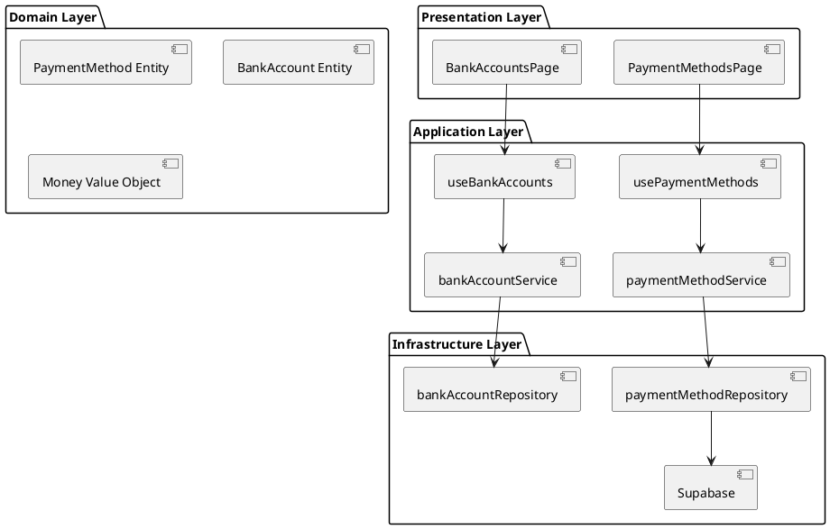
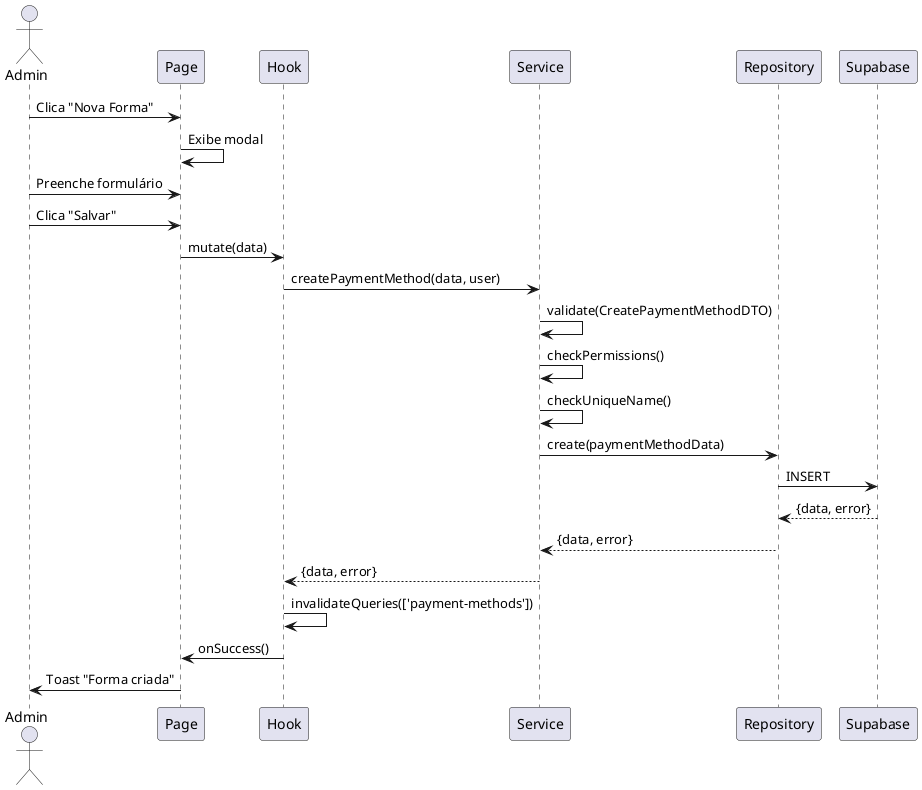
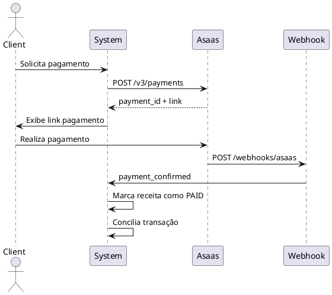

# 04.02 - Payments Module (Módulo de Pagamentos)

Documentação técnica completa do **Módulo de Pagamentos**, responsável pela gestão de formas de pagamento, contas bancárias e integração com gateway.

---

## 📋 Índice

- [Visão Geral](#visão-geral)
- [Funcionalidades](#funcionalidades)
- [Arquitetura do Módulo](#arquitetura-do-módulo)
- [Entidades](#entidades)
- [Use Cases](#use-cases)
- [Integrações](#integrações)
- [Regras de Negócio](#regras-de-negócio)

---

## 🎯 Visão Geral

O **Módulo de Pagamentos** gerencia:

- ✅ Formas de pagamento (PIX, Cartão, Dinheiro)
- ✅ Contas bancárias da unidade
- ✅ Taxas e tarifas
- ✅ Integração com gateway Asaas (futuro)
- ✅ Conciliação de pagamentos

**Status:** ✅ Implementado parcialmente (gateway planejado para Fase 3)

---

## ⚙️ Funcionalidades

### 1. Gestão de Formas de Pagamento

**RF-02.01: Gerenciar Formas de Pagamento**

- Criar/editar/desativar formas de pagamento
- Configurar taxas por forma de pagamento
- Definir se aceita parcelamento
- Vincular a conta bancária padrão

**Formas de Pagamento Padrão:**

| Nome           | Tipo        | Taxa | Parcelável |
| -------------- | ----------- | ---- | ---------- |
| Dinheiro       | CASH        | 0%   | Não        |
| PIX            | PIX         | 0%   | Não        |
| Cartão Débito  | DEBIT_CARD  | 2%   | Não        |
| Cartão Crédito | CREDIT_CARD | 4%   | Sim        |
| Transferência  | TRANSFER    | 0%   | Não        |

### 2. Gestão de Contas Bancárias

**RF-02.02: Gerenciar Contas Bancárias**

- Cadastrar contas bancárias
- Vincular a unidades
- Calcular saldo disponível
- Importar extratos bancários
- Conciliar transações

---

## 🏗️ Arquitetura do Módulo

### Estrutura de Arquivos

```
src/
├── pages/
│   ├── PaymentMethodsPage.jsx
│   └── BankAccountsPage.jsx
├── hooks/
│   ├── usePaymentMethods.js
│   └── useBankAccounts.js
├── services/
│   ├── paymentMethodService.js
│   └── bankAccountService.js
├── repositories/
│   ├── paymentMethodRepository.js
│   └── bankAccountRepository.js
└── dtos/
    ├── CreatePaymentMethodDTO.js
    └── CreateBankAccountDTO.js
```

### Diagrama de Componentes



---

## 📦 Entidades

### PaymentMethod (Forma de Pagamento)

```typescript
interface PaymentMethod {
  id: string;
  unit_id: string;
  name: string;
  type: 'CASH' | 'PIX' | 'DEBIT_CARD' | 'CREDIT_CARD' | 'TRANSFER';
  fee: number; // Percentual de taxa (ex: 2.5 para 2.5%)
  allows_installment: boolean;
  default_bank_account_id?: string;
  is_active: boolean;
  created_at: Date;
  updated_at: Date;
}
```

**Regras:**

- Nome deve ser único por unidade
- Taxa deve ser entre 0 e 100
- Se `allows_installment = true`, tipo deve ser `CREDIT_CARD`

### BankAccount (Conta Bancária)

```typescript
interface BankAccount {
  id: string;
  unit_id: string;
  bank_name: string;
  bank_code: string;
  agency: string;
  account_number: string;
  account_type: 'CHECKING' | 'SAVINGS';
  initial_balance: number;
  current_balance: number; // Calculado
  is_active: boolean;
  created_at: Date;
  updated_at: Date;
}
```

**Campos Calculados:**

```sql
-- current_balance calculado via trigger ou view
current_balance = initial_balance +
  (SELECT COALESCE(SUM(value), 0) FROM revenues WHERE bank_account_id = ba.id AND status = 'PAID') -
  (SELECT COALESCE(SUM(value), 0) FROM expenses WHERE bank_account_id = ba.id AND status = 'PAID')
```

---

## 🔄 Use Cases

### UC-01: Criar Forma de Pagamento

**Ator:** Administrador, Gerente
**Pré-condições:** Usuário autenticado com permissões

**Fluxo Principal:**

1. Usuário acessa "Formas de Pagamento"
2. Clica em "Nova Forma de Pagamento"
3. Preenche formulário:
   - Nome (ex: "PIX")
   - Tipo (dropdown)
   - Taxa (%)
   - Permite parcelamento (checkbox)
   - Conta bancária padrão (dropdown)
4. Sistema valida dados
5. Sistema salva forma de pagamento
6. Sistema exibe toast de sucesso

**Sequence Diagram:**



---

### UC-02: Cadastrar Conta Bancária

**Ator:** Administrador
**Pré-condições:** Usuário admin autenticado

**Fluxo Principal:**

1. Usuário acessa "Contas Bancárias"
2. Clica em "Nova Conta"
3. Preenche formulário:
   - Banco (autocomplete com 341 bancos)
   - Agência
   - Número da conta
   - Tipo (corrente/poupança)
   - Saldo inicial
4. Sistema valida dados
5. Sistema salva conta
6. Sistema calcula saldo atual
7. Sistema exibe toast de sucesso

---

### UC-03: Aplicar Taxa de Pagamento

**Ator:** Sistema (automático)
**Trigger:** Ao criar/editar receita

**Fluxo:**

1. Usuário seleciona forma de pagamento
2. Sistema busca taxa da forma de pagamento
3. Sistema calcula valor líquido:
   ```javascript
   const netValue = grossValue * (1 - fee / 100);
   ```
4. Sistema exibe valor bruto e líquido
5. Ao salvar, registra dedução automática

---

## 🔗 Integrações

### 1. Integração Asaas (Planejado - Fase 3)

**Gateway de Pagamentos:** https://asaas.com

**Funcionalidades:**

- Gerar link de pagamento
- Receber webhook de confirmação
- Conciliar automaticamente
- Gerar boletos
- Processar cartão de crédito

**Fluxo de Integração:**



**Configuração:**

```javascript
// .env
VITE_ASAAS_API_KEY=your_api_key
VITE_ASAAS_WEBHOOK_URL=https://your-app.com/webhooks/asaas
```

---

### 2. Bancos Brasileiros

**Lista de Bancos (FEBRABAN):**

```javascript
// src/utils/banks.js
export const brazilianBanks = [
  { code: '001', name: 'Banco do Brasil' },
  { code: '033', name: 'Santander' },
  { code: '104', name: 'Caixa Econômica Federal' },
  { code: '237', name: 'Bradesco' },
  { code: '341', name: 'Itaú Unibanco' },
  { code: '077', name: 'Banco Inter' },
  { code: '260', name: 'Nubank' },
  { code: '290', name: 'PagSeguro' },
  // ... 333 bancos no total
];
```

---

## 📐 Regras de Negócio

### RN-01: Cálculo de Taxas

**Regra:** Taxa aplicada sobre valor bruto da receita.

```javascript
// Exemplo: Receita de R$ 100,00 com taxa de 4%
const grossValue = 100.0;
const fee = 4; // 4%
const feeAmount = grossValue * (fee / 100); // R$ 4,00
const netValue = grossValue - feeAmount; // R$ 96,00
```

**Armazenamento:**

```sql
-- revenues table
value = 100.00          -- Valor bruto
payment_method_id = 'X' -- Forma com taxa de 4%

-- Ao calcular DRE:
deducoes = SUM(value * fee / 100)
receita_liquida = receita_bruta - deducoes
```

---

### RN-02: Validação de Conta Bancária

**Agência:** 4 dígitos
**Conta:** até 13 dígitos + dígito verificador

```javascript
// CreateBankAccountDTO.js
validate() {
  if (!/^\d{4}$/.test(this.agency)) {
    throw new Error('Agência deve ter 4 dígitos');
  }

  if (!/^\d{1,13}-?\d$/.test(this.account_number)) {
    throw new Error('Conta inválida');
  }
}
```

---

### RN-03: Saldo Bancário

**Regra:** Saldo calculado dinamicamente.

```sql
CREATE OR REPLACE FUNCTION fn_calculate_bank_balance(account_id UUID)
RETURNS NUMERIC AS $$
DECLARE
  initial_balance NUMERIC;
  revenues_sum NUMERIC;
  expenses_sum NUMERIC;
BEGIN
  -- Saldo inicial
  SELECT initial_balance INTO initial_balance
  FROM bank_accounts WHERE id = account_id;

  -- Receitas
  SELECT COALESCE(SUM(value), 0) INTO revenues_sum
  FROM revenues
  WHERE bank_account_id = account_id AND status = 'PAID';

  -- Despesas
  SELECT COALESCE(SUM(value), 0) INTO expenses_sum
  FROM expenses
  WHERE bank_account_id = account_id AND status = 'PAID';

  RETURN initial_balance + revenues_sum - expenses_sum;
END;
$$ LANGUAGE plpgsql;
```

---

### RN-04: Formas de Pagamento Inativas

**Regra:** Formas inativas não aparecem em dropdowns.

```javascript
// paymentMethodRepository.js
async findActive(unitId) {
  const { data, error } = await supabase
    .from('payment_methods')
    .select('*')
    .eq('unit_id', unitId)
    .eq('is_active', true)
    .order('name');

  return { data, error };
}
```

---

## 📡 API Reference

### paymentMethodService

```javascript
/**
 * Cria nova forma de pagamento
 */
async createPaymentMethod(input, user) {
  const dto = new CreatePaymentMethodDTO(input);
  if (!dto.isValid()) {
    return { data: null, error: dto.getErrors() };
  }

  const canManage = await permissions.canManagePayments(user);
  if (!canManage) {
    return { data: null, error: 'Sem permissão' };
  }

  // Verificar nome único
  const existing = await paymentMethodRepository.findByName(
    input.unit_id,
    input.name
  );
  if (existing.data) {
    return { data: null, error: 'Nome já existe' };
  }

  return await paymentMethodRepository.create(dto.toObject());
}

/**
 * Calcula taxa de pagamento
 */
calculateFee(value, paymentMethod) {
  const fee = paymentMethod.fee || 0;
  const feeAmount = value * (fee / 100);
  const netValue = value - feeAmount;

  return {
    grossValue: value,
    feePercentage: fee,
    feeAmount,
    netValue
  };
}
```

---

### bankAccountService

```javascript
/**
 * Cria nova conta bancária
 */
async createBankAccount(input, user) {
  const dto = new CreateBankAccountDTO(input);
  if (!dto.isValid()) {
    return { data: null, error: dto.getErrors() };
  }

  const isAdmin = await permissions.isAdmin(user);
  if (!isAdmin) {
    return { data: null, error: 'Apenas admin pode criar contas' };
  }

  return await bankAccountRepository.create(dto.toObject());
}

/**
 * Calcula saldo atual
 */
async calculateBalance(accountId) {
  const { data, error } = await supabase.rpc(
    'fn_calculate_bank_balance',
    { account_id: accountId }
  );

  return { data, error };
}
```

---

## 📊 Métricas

### KPIs do Módulo

| Métrica                   | Meta    | Atual   |
| ------------------------- | ------- | ------- |
| Taxa média de gateway     | < 3%    | 2.8%    |
| Tempo de conciliação      | < 1 dia | 4 horas |
| Formas ativas por unidade | > 4     | 5       |
| Uptime Asaas              | 99.9%   | -       |

---

## 🔗 Navegação

- [← 04.01 - Financial Module](./01_FINANCIAL.md)
- [→ 04.03 - Clients Module](./03_CLIENTS.md)
- [📚 Documentação](../DOCUMENTACAO_INDEX.md)

---

## 📖 Referências

1. **Asaas API Documentation**. https://docs.asaas.com
2. **FEBRABAN**. Código de Bancos do Brasil. https://www.febraban.org.br
3. **PCI DSS**. Payment Card Industry Data Security Standard v4.0, 2022.

---

**Última atualização:** 7 de novembro de 2025
**Versão:** 1.0.0
**Autor:** Andrey Viana
