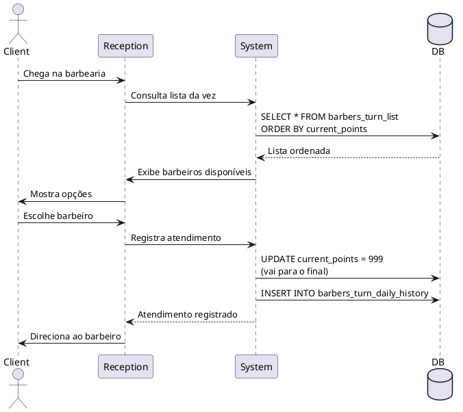

# 04.04 - Scheduler Module (Módulo de Agendamentos)

Documentação técnica completa do **Módulo de Agendamentos**, responsável pelo calendário, lista da vez e lembretes.

---

## 📋 Índice

- [Visão Geral](#visão-geral)
- [Funcionalidades](#funcionalidades)
- [Lista da Vez](#lista-da-vez)
- [Calendário de Agendamentos](#calendário-de-agendamentos)
- [Regras de Negócio](#regras-de-negócio)
- [Integrações](#integrações)

---

## 🎯 Visão Geral

O **Módulo de Agendamentos** gerencia:

- ✅ Lista da Vez (Turn List) - **IMPLEMENTADO**
- 🚧 Calendário de agendamentos (planejado)
- 🚧 Lembretes automáticos (planejado)
- 🚧 Integração Google Calendar (planejado)

**Status:** Parcialmente implementado (Fase 1 concluída, Fase 3 planejada)

---

## ⚙️ Funcionalidades

### 1. Lista da Vez

**RF-04.01: Gerenciar Lista da Vez** ✅

Sistema de fila de atendimento por ordem de pontos:

- Cada barbeiro tem uma pontuação
- Cliente escolhe barbeiro disponível
- Barbeiro atende e vai para o final da fila
- Pontuação resetada mensalmente (último dia do mês, 23h)

**Tabelas:**

- `barbers_turn_list`: Estado atual da fila
- `barbers_turn_history`: Histórico mensal completo
- `barbers_turn_daily_history`: Histórico diário

### 2. Calendário de Agendamentos (Planejado)

**RF-04.02: Agendar Horários** 🚧

- Grid semanal com slots de 30min
- Visualização por profissional
- Bloqueio de horários
- Marcação de feriados
- Confirmação via WhatsApp

### 3. Lembretes Automáticos (Planejado)

**RF-04.03: Notificar Clientes** 🚧

- Lembrete 24h antes do horário
- Lembrete 2h antes do horário
- Confirmação de presença
- Cancelamento pelo cliente

---

## 🎯 Lista da Vez

### Entidades

```typescript
// barbers_turn_list
interface BarberTurnList {
  id: string;
  professional_id: string;
  unit_id: string;
  current_points: number;
  is_active: boolean;
  created_at: Date;
  updated_at: Date;
}

// barbers_turn_history
interface BarberTurnHistory {
  id: string;
  professional_id: string;
  unit_id: string;
  month: Date; // Primeiro dia do mês
  final_points: number;
  total_services: number;
  created_at: Date;
}

// barbers_turn_daily_history
interface BarberTurnDailyHistory {
  id: string;
  professional_id: string;
  unit_id: string;
  date: Date;
  services_count: number;
  created_at: Date;
}
```

### Fluxo de Atendimento



### Funções SQL

**fn_get_turn_list:**

```sql
CREATE OR REPLACE FUNCTION fn_get_turn_list(p_unit_id UUID)
RETURNS TABLE (
  professional_id UUID,
  professional_name TEXT,
  current_points INTEGER,
  services_today INTEGER,
  is_active BOOLEAN
) AS $$
BEGIN
  RETURN QUERY
  SELECT
    btl.professional_id,
    p.name AS professional_name,
    btl.current_points,
    COALESCE(
      (SELECT COUNT(*)
       FROM barbers_turn_daily_history btdh
       WHERE btdh.professional_id = btl.professional_id
         AND btdh.date = CURRENT_DATE),
      0
    )::INTEGER AS services_today,
    btl.is_active
  FROM barbers_turn_list btl
  JOIN professionals p ON p.id = btl.professional_id
  WHERE btl.unit_id = p_unit_id
    AND btl.is_active = true
    AND p.is_active = true
  ORDER BY btl.current_points ASC, p.name ASC;
END;
$$ LANGUAGE plpgsql;
```

**fn_register_turn_service:**

```sql
CREATE OR REPLACE FUNCTION fn_register_turn_service(
  p_professional_id UUID,
  p_unit_id UUID
)
RETURNS VOID AS $$
BEGIN
  -- Atualiza pontos (vai para o final)
  UPDATE barbers_turn_list
  SET
    current_points = 999,
    updated_at = NOW()
  WHERE professional_id = p_professional_id
    AND unit_id = p_unit_id;

  -- Registra no histórico diário
  INSERT INTO barbers_turn_daily_history (
    professional_id,
    unit_id,
    date,
    services_count
  )
  VALUES (
    p_professional_id,
    p_unit_id,
    CURRENT_DATE,
    1
  )
  ON CONFLICT (professional_id, unit_id, date)
  DO UPDATE SET services_count = barbers_turn_daily_history.services_count + 1;
END;
$$ LANGUAGE plpgsql;
```

**fn_reset_monthly_turn_list:**

```sql
CREATE OR REPLACE FUNCTION fn_reset_monthly_turn_list()
RETURNS VOID AS $$
BEGIN
  -- Salva estado atual no histórico
  INSERT INTO barbers_turn_history (
    professional_id,
    unit_id,
    month,
    final_points,
    total_services
  )
  SELECT
    btl.professional_id,
    btl.unit_id,
    DATE_TRUNC('month', NOW() - INTERVAL '1 day') AS month,
    btl.current_points,
    COALESCE(
      (SELECT SUM(services_count)
       FROM barbers_turn_daily_history btdh
       WHERE btdh.professional_id = btl.professional_id
         AND btdh.unit_id = btl.unit_id
         AND DATE_TRUNC('month', btdh.date) = DATE_TRUNC('month', NOW() - INTERVAL '1 day')),
      0
    ) AS total_services
  FROM barbers_turn_list btl
  WHERE btl.is_active = true;

  -- Reseta pontos
  UPDATE barbers_turn_list
  SET
    current_points = 0,
    updated_at = NOW()
  WHERE is_active = true;
END;
$$ LANGUAGE plpgsql;
```

**Cron Job (pg_cron):**

```sql
-- Executar todo último dia do mês às 23:00
SELECT cron.schedule(
  'reset-turn-list-monthly',
  '0 23 L * *',
  $$SELECT fn_reset_monthly_turn_list()$$
);
```

---

## 📅 Calendário de Agendamentos (Planejado)

### Entidades

```typescript
interface Appointment {
  id: string;
  unit_id: string;
  professional_id: string;
  client_id: string;
  service_id: string;
  date: Date;
  time: string; // HH:MM
  duration: number; // minutos
  status: 'SCHEDULED' | 'CONFIRMED' | 'CANCELLED' | 'COMPLETED';
  notes?: string;
  reminder_sent: boolean;
  created_at: Date;
  updated_at: Date;
}

interface BlockedTime {
  id: string;
  professional_id: string;
  date: Date;
  start_time: string;
  end_time: string;
  reason: string;
  created_at: Date;
}
```

### Componente de Calendário

```javascript
// SchedulerCalendar.jsx
import { Calendar } from '@fullcalendar/core';
import dayGridPlugin from '@fullcalendar/daygrid';
import timeGridPlugin from '@fullcalendar/timegrid';
import interactionPlugin from '@fullcalendar/interaction';

export function SchedulerCalendar() {
  const { data: appointments } = useAppointments();
  const { mutate: createAppointment } = useCreateAppointment();

  const handleDateSelect = selectInfo => {
    const title = prompt('Nome do cliente:');
    if (title) {
      createAppointment({
        professional_id: selectedProfessional,
        client_name: title,
        start: selectInfo.start,
        end: selectInfo.end,
      });
    }
  };

  return (
    <Calendar
      plugins={[dayGridPlugin, timeGridPlugin, interactionPlugin]}
      initialView="timeGridWeek"
      selectable={true}
      select={handleDateSelect}
      events={appointments}
      slotDuration="00:30:00"
      slotMinTime="08:00:00"
      slotMaxTime="20:00:00"
      locale="pt-br"
    />
  );
}
```

---

## 📐 Regras de Negócio

### RN-01: Ordem de Atendimento

**Regra:** Barbeiro com menor pontuação atende primeiro.

```javascript
// listaDaVezService.js
async getTurnOrder(unitId) {
  const { data, error } = await supabase.rpc('fn_get_turn_list', {
    p_unit_id: unitId
  });

  // Já vem ordenado do banco (ORDER BY current_points ASC)
  return { data, error };
}
```

### RN-02: Pontuação após Atendimento

**Regra:** Após atender, barbeiro vai para o final (pontos = 999).

```javascript
async registerService(professionalId, unitId) {
  return await supabase.rpc('fn_register_turn_service', {
    p_professional_id: professionalId,
    p_unit_id: unitId
  });
}
```

### RN-03: Reset Mensal Automático

**Regra:** Último dia do mês às 23:00, pontos voltam para 0.

**Implementação:** Cron Job `pg_cron` no Supabase

### RN-04: Conflito de Horários (Planejado)

**Regra:** Não permitir agendamentos sobrepostos.

```sql
-- Constraint na tabela appointments
CREATE OR REPLACE FUNCTION fn_check_appointment_conflict()
RETURNS TRIGGER AS $$
BEGIN
  IF EXISTS (
    SELECT 1 FROM appointments
    WHERE professional_id = NEW.professional_id
      AND date = NEW.date
      AND status NOT IN ('CANCELLED', 'COMPLETED')
      AND (
        (time >= NEW.time AND time < NEW.time + INTERVAL '1 minute' * NEW.duration)
        OR
        (time + INTERVAL '1 minute' * duration > NEW.time AND time < NEW.time)
      )
  ) THEN
    RAISE EXCEPTION 'Conflito de horário detectado';
  END IF;

  RETURN NEW;
END;
$$ LANGUAGE plpgsql;

CREATE TRIGGER trg_check_appointment_conflict
BEFORE INSERT OR UPDATE ON appointments
FOR EACH ROW EXECUTE FUNCTION fn_check_appointment_conflict();
```

### RN-05: Confirmação de Presença (Planejado)

**Regra:** Cliente deve confirmar presença até 2h antes.

```javascript
async confirmPresence(appointmentId) {
  const appointment = await appointmentRepository.findById(appointmentId);

  const now = new Date();
  const appointmentTime = new Date(`${appointment.date} ${appointment.time}`);
  const twoHoursBefore = new Date(appointmentTime.getTime() - 2 * 60 * 60 * 1000);

  if (now > twoHoursBefore) {
    return { data: null, error: 'Prazo de confirmação expirado' };
  }

  return await appointmentRepository.update(appointmentId, {
    status: 'CONFIRMED'
  });
}
```

---

## 🔗 Integrações

### 1. WhatsApp Business (Planejado)

**Lembretes Automáticos:**

```javascript
// appointmentReminderService.js
async sendReminder24h(appointment) {
  const client = await clientRepository.findById(appointment.client_id);
  const professional = await professionalRepository.findById(appointment.professional_id);

  const message = `🗓️ Lembrete de Agendamento

Olá, ${client.name}!

Você tem um horário agendado amanhã:
📅 Data: ${formatDate(appointment.date)}
⏰ Horário: ${appointment.time}
💈 Profissional: ${professional.name}

Para confirmar sua presença, responda SIM.
Para cancelar, responda CANCELAR.`;

  await whatsapp.sendMessage(client.phone, message);
}
```

**Cron Job:**

```javascript
// Edge Function: send-appointment-reminders
import { serve } from 'https://deno.land/std@0.168.0/http/server.ts';

serve(async req => {
  const tomorrow = new Date();
  tomorrow.setDate(tomorrow.getDate() + 1);

  const appointments = await getAppointmentsByDate(tomorrow);

  for (const appointment of appointments) {
    if (!appointment.reminder_sent) {
      await sendReminder24h(appointment);
      await markReminderSent(appointment.id);
    }
  }

  return new Response(JSON.stringify({ sent: appointments.length }));
});
```

### 2. Google Calendar (Planejado)

**Sincronização Bidirecional:**

```javascript
// googleCalendarService.js
async syncToGoogleCalendar(appointment) {
  const event = {
    summary: `Cliente: ${appointment.client_name}`,
    description: `Serviço: ${appointment.service_name}`,
    start: {
      dateTime: `${appointment.date}T${appointment.time}:00`,
      timeZone: 'America/Sao_Paulo',
    },
    end: {
      dateTime: calculateEndTime(appointment.time, appointment.duration),
      timeZone: 'America/Sao_Paulo',
    },
    attendees: [
      { email: appointment.client_email }
    ]
  };

  const response = await calendar.events.insert({
    calendarId: professional.google_calendar_id,
    resource: event
  });

  // Salvar google_event_id
  await appointmentRepository.update(appointment.id, {
    google_event_id: response.data.id
  });
}
```

---

## 📊 Métricas

### KPIs do Módulo

| Métrica                        | Meta    | Descrição                     |
| ------------------------------ | ------- | ----------------------------- |
| Taxa de confirmação            | > 85%   | % de agendamentos confirmados |
| Taxa de no-show                | < 10%   | % de faltas                   |
| Tempo médio entre agendamentos | 15 dias | Frequência de retorno         |
| Utilização de agenda           | > 75%   | % de slots preenchidos        |

---

## 🔗 Navegação

- [← 04.03 - Clients Module](./03_CLIENTS.md)
- [→ 04.05 - Reports Module](./05_REPORTS.md)
- [📚 Documentação](../DOCUMENTACAO_INDEX.md)

---

## 📖 Referências

1. **FullCalendar**. JavaScript Event Calendar Library. https://fullcalendar.io
2. **Google Calendar API**. https://developers.google.com/calendar
3. **pg_cron**. PostgreSQL Job Scheduler. https://github.com/citusdata/pg_cron

---

**Última atualização:** 7 de novembro de 2025
**Versão:** 1.0.0
**Autor:** Andrey Viana
