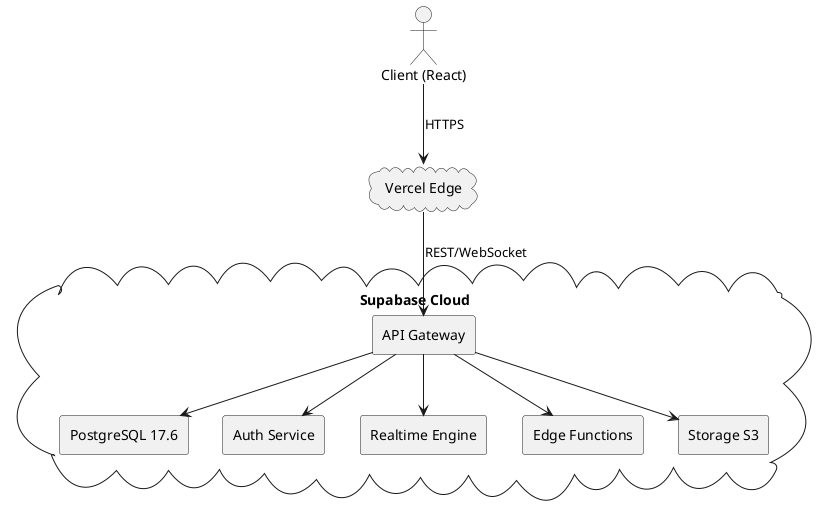
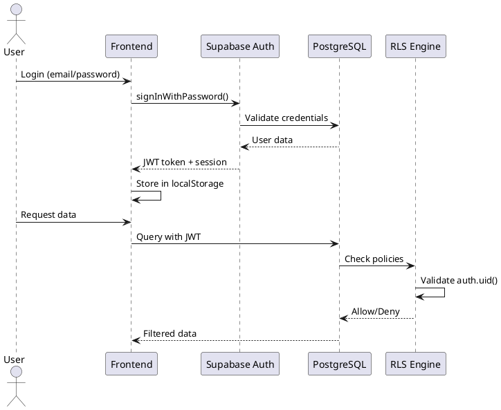

# 05 - Infrastructure (Infraestrutura)

Documentação técnica completa da **Infraestrutura** do Barber Analytics Pro, incluindo Supabase, PostgreSQL, autenticação, realtime e deployment.

---

## 📋 Índice

- [Visão Geral](#visão-geral)
- [Supabase Platform](#supabase-platform)
- [PostgreSQL Database](#postgresql-database)
- [Authentication](#authentication)
- [Row Level Security (RLS)](#row-level-security-rls)
- [Realtime Subscriptions](#realtime-subscriptions)
- [Edge Functions](#edge-functions)
- [Storage](#storage)
- [Monitoring & Logs](#monitoring--logs)

---

## 🎯 Visão Geral

O Barber Analytics Pro utiliza **Supabase** como Backend-as-a-Service (BaaS), fornecendo:

- ✅ PostgreSQL 17.6 (banco de dados relacional)
- ✅ Autenticação JWT com RLS
- ✅ Realtime WebSockets
- ✅ Edge Functions (Deno runtime)
- ✅ Storage (arquivos estáticos)
- ✅ Auto-backup e replicação

**Região:** South America (São Paulo) - `sa-east-1`
**Plano:** Pro (escalável até 100GB)

---

## 🚀 Supabase Platform

### Arquitetura Geral



### Configuração do Cliente

```javascript
// src/lib/supabase.js
import { createClient } from '@supabase/supabase-js';

const supabaseUrl = import.meta.env.VITE_SUPABASE_URL;
const supabaseAnonKey = import.meta.env.VITE_SUPABASE_ANON_KEY;

export const supabase = createClient(supabaseUrl, supabaseAnonKey, {
  auth: {
    autoRefreshToken: true,
    persistSession: true,
    detectSessionInUrl: true,
    storage: window.localStorage,
    storageKey: 'barber-analytics-auth',
  },
  realtime: {
    params: {
      eventsPerSecond: 10,
    },
  },
  db: {
    schema: 'public',
  },
  global: {
    headers: {
      'x-application-name': 'barber-analytics-pro',
    },
  },
});
```

### Variáveis de Ambiente

```bash
# .env.local
VITE_SUPABASE_URL=https://your-project.supabase.co
VITE_SUPABASE_ANON_KEY=your-anon-key
VITE_SUPABASE_SERVICE_ROLE_KEY=your-service-role-key (apenas backend)
```

---

## 🗄️ PostgreSQL Database

### Versão e Extensões

**PostgreSQL:** 17.6
**Extensões Ativas:**

```sql
-- Extensões habilitadas
CREATE EXTENSION IF NOT EXISTS "uuid-ossp";      -- UUID generation
CREATE EXTENSION IF NOT EXISTS "pg_cron";        -- Job scheduler
CREATE EXTENSION IF NOT EXISTS "pgcrypto";       -- Crypto functions
CREATE EXTENSION IF NOT EXISTS "pg_stat_statements"; -- Query analytics
CREATE EXTENSION IF NOT EXISTS "pg_trgm";        -- Text search
```

### Connection Pooling

**Configuração:**

- **Pool Mode:** Transaction
- **Default Pool Size:** 15
- **Max Client Conn:** 100
- **Timeout:** 30s

```javascript
// Para operações longas, usar connection direta
const { data, error } = await supabase
  .rpc('fn_calculate_dre', {
    /* params */
  })
  .timeout(60000); // 60s timeout
```

### Índices Principais

```sql
-- Índices de performance críticos

-- revenues
CREATE INDEX idx_revenues_unit_date ON revenues(unit_id, date);
CREATE INDEX idx_revenues_professional ON revenues(professional_id);
CREATE INDEX idx_revenues_status ON revenues(status) WHERE status = 'PAID';
CREATE INDEX idx_revenues_competence ON revenues(competence_date);
CREATE INDEX idx_revenues_source_hash ON revenues(source_hash);

-- expenses
CREATE INDEX idx_expenses_unit_date ON expenses(unit_id, date);
CREATE INDEX idx_expenses_category ON expenses(category_id);
CREATE INDEX idx_expenses_status ON expenses(status) WHERE status = 'PAID';

-- orders
CREATE INDEX idx_orders_unit_status ON orders(unit_id, status);
CREATE INDEX idx_orders_professional ON orders(professional_id);
CREATE INDEX idx_orders_client ON orders(client_id);
CREATE INDEX idx_orders_closed_at ON orders(closed_at);

-- professionals
CREATE INDEX idx_professionals_user_id ON professionals(user_id);
CREATE INDEX idx_professionals_unit ON professionals(unit_id);
CREATE INDEX idx_professionals_active ON professionals(is_active) WHERE is_active = true;
```

### Triggers Principais

```sql
-- 1. Atualizar updated_at automaticamente
CREATE OR REPLACE FUNCTION fn_update_updated_at()
RETURNS TRIGGER AS $$
BEGIN
  NEW.updated_at = NOW();
  RETURN NEW;
END;
$$ LANGUAGE plpgsql;

-- Aplicar em todas as tabelas
CREATE TRIGGER trg_revenues_updated_at
  BEFORE UPDATE ON revenues
  FOR EACH ROW
  EXECUTE FUNCTION fn_update_updated_at();

-- 2. Validar datas
CREATE OR REPLACE FUNCTION fn_validate_dates()
RETURNS TRIGGER AS $$
BEGIN
  IF NEW.date > NOW() THEN
    RAISE EXCEPTION 'Data não pode ser futura';
  END IF;

  IF NEW.competence_date IS NULL THEN
    NEW.competence_date := NEW.date;
  END IF;

  RETURN NEW;
END;
$$ LANGUAGE plpgsql;

CREATE TRIGGER trg_revenues_validate_dates
  BEFORE INSERT OR UPDATE ON revenues
  FOR EACH ROW
  EXECUTE FUNCTION fn_validate_dates();
```

### Views Materializadas (Planejado)

```sql
-- Para performance em dashboards com muito acesso
CREATE MATERIALIZED VIEW mv_financial_summary AS
SELECT
  unit_id,
  DATE_TRUNC('month', date) AS month,
  SUM(CASE WHEN type = 'REVENUE' THEN value ELSE 0 END) AS total_revenue,
  SUM(CASE WHEN type = 'EXPENSE' THEN value ELSE 0 END) AS total_expense,
  SUM(CASE WHEN type = 'REVENUE' THEN value ELSE -value END) AS net_profit
FROM (
  SELECT unit_id, date, value, 'REVENUE' AS type FROM revenues WHERE status = 'PAID'
  UNION ALL
  SELECT unit_id, date, value, 'EXPENSE' AS type FROM expenses WHERE status = 'PAID'
) movements
GROUP BY unit_id, DATE_TRUNC('month', date);

-- Índice na materialized view
CREATE INDEX idx_mv_financial_summary_unit_month
ON mv_financial_summary(unit_id, month);

-- Refresh automático via cron
SELECT cron.schedule(
  'refresh-financial-summary',
  '0 * * * *', -- A cada hora
  $$REFRESH MATERIALIZED VIEW CONCURRENTLY mv_financial_summary$$
);
```

---

## 🔐 Authentication

### Fluxo de Autenticação



### Configuração de Auth

```javascript
// authService.js
export const authService = {
  async signIn(email, password) {
    const { data, error } = await supabase.auth.signInWithPassword({
      email,
      password,
    });

    if (error) {
      return { data: null, error: error.message };
    }

    return { data: data.user, error: null };
  },

  async signOut() {
    const { error } = await supabase.auth.signOut();
    return { error };
  },

  async getSession() {
    const { data, error } = await supabase.auth.getSession();
    return { data: data.session, error };
  },

  async refreshSession() {
    const { data, error } = await supabase.auth.refreshSession();
    return { data: data.session, error };
  },

  onAuthStateChange(callback) {
    return supabase.auth.onAuthStateChange(callback);
  },
};
```

### JWT Token Structure

```json
{
  "aud": "authenticated",
  "exp": 1730985600,
  "sub": "user-uuid",
  "email": "user@example.com",
  "role": "authenticated",
  "app_metadata": {
    "provider": "email"
  },
  "user_metadata": {
    "name": "João Silva"
  }
}
```

### Auth Policies (Supabase Dashboard)

```sql
-- Tabela auth.users é gerenciada pelo Supabase
-- Criamos link com professionals

-- Function para pegar role do usuário
CREATE OR REPLACE FUNCTION get_user_role(user_id UUID)
RETURNS TEXT AS $$
DECLARE
  user_role TEXT;
BEGIN
  SELECT role INTO user_role
  FROM professionals
  WHERE professionals.user_id = user_id
    AND is_active = true
  LIMIT 1;

  -- Normaliza 'administrador' para 'admin'
  IF user_role = 'administrador' THEN
    user_role := 'admin';
  END IF;

  RETURN user_role;
END;
$$ LANGUAGE plpgsql SECURITY DEFINER;
```

---

## 🛡️ Row Level Security (RLS)

### Conceito

**RLS** garante que usuários só acessem dados de suas unidades, implementando **segurança no nível do banco**.

### Políticas Principais

#### 1. Revenues (Receitas)

```sql
-- Habilitar RLS
ALTER TABLE revenues ENABLE ROW LEVEL SECURITY;

-- SELECT: Ver apenas da própria unidade
CREATE POLICY "view_own_unit_revenues"
ON revenues FOR SELECT
USING (
  unit_id IN (
    SELECT unit_id
    FROM professionals
    WHERE user_id = auth.uid()
      AND is_active = true
  )
);

-- INSERT: Criar apenas em unidades permitidas
CREATE POLICY "insert_own_unit_revenues"
ON revenues FOR INSERT
WITH CHECK (
  unit_id IN (
    SELECT unit_id
    FROM professionals
    WHERE user_id = auth.uid()
      AND is_active = true
      AND role IN ('admin', 'gerente')
  )
);

-- UPDATE: Atualizar apenas da própria unidade
CREATE POLICY "update_own_unit_revenues"
ON revenues FOR UPDATE
USING (
  unit_id IN (
    SELECT unit_id
    FROM professionals
    WHERE user_id = auth.uid()
      AND is_active = true
      AND role IN ('admin', 'gerente')
  )
);

-- DELETE: Soft delete apenas
CREATE POLICY "delete_own_unit_revenues"
ON revenues FOR UPDATE
USING (
  unit_id IN (
    SELECT unit_id
    FROM professionals
    WHERE user_id = auth.uid()
      AND is_active = true
      AND role = 'admin'
  )
);
```

#### 2. Orders (Comandas)

```sql
ALTER TABLE orders ENABLE ROW LEVEL SECURITY;

-- Todos podem ver comandas da unidade
CREATE POLICY "view_own_unit_orders"
ON orders FOR SELECT
USING (
  unit_id IN (
    SELECT unit_id
    FROM professionals
    WHERE user_id = auth.uid()
  )
);

-- Apenas profissionais podem criar
CREATE POLICY "create_orders"
ON orders FOR INSERT
WITH CHECK (
  EXISTS (
    SELECT 1
    FROM professionals
    WHERE user_id = auth.uid()
      AND unit_id = orders.unit_id
      AND is_active = true
  )
);
```

#### 3. Professionals (Profissionais)

```sql
ALTER TABLE professionals ENABLE ROW LEVEL SECURITY;

-- Ver profissionais da mesma unidade
CREATE POLICY "view_same_unit_professionals"
ON professionals FOR SELECT
USING (
  unit_id IN (
    SELECT unit_id
    FROM professionals
    WHERE user_id = auth.uid()
  )
);

-- Apenas admin pode criar/editar
CREATE POLICY "manage_professionals"
ON professionals FOR ALL
USING (
  get_user_role(auth.uid()) = 'admin'
);
```

### Funções de Permissão

```sql
-- Verificar se pode gerenciar serviços
CREATE OR REPLACE FUNCTION fn_can_manage_services(user_id UUID)
RETURNS BOOLEAN AS $$
BEGIN
  RETURN EXISTS (
    SELECT 1
    FROM professionals
    WHERE professionals.user_id = user_id
      AND is_active = true
      AND role IN ('admin', 'administrador', 'gerente')
  );
END;
$$ LANGUAGE plpgsql SECURITY DEFINER;

-- Verificar se pode gerenciar caixa
CREATE OR REPLACE FUNCTION fn_can_manage_cash_register(user_id UUID)
RETURNS BOOLEAN AS $$
BEGIN
  RETURN EXISTS (
    SELECT 1
    FROM professionals
    WHERE professionals.user_id = user_id
      AND is_active = true
      AND role IN ('admin', 'administrador', 'gerente')
  );
END;
$$ LANGUAGE plpgsql SECURITY DEFINER;
```

### Bypass RLS (Service Role)

```javascript
// Para operações administrativas em Edge Functions
import { createClient } from '@supabase/supabase-js';

const supabaseAdmin = createClient(
  process.env.SUPABASE_URL,
  process.env.SUPABASE_SERVICE_ROLE_KEY,
  {
    auth: {
      autoRefreshToken: false,
      persistSession: false,
    },
  }
);

// Bypass RLS para operações admin
const { data } = await supabaseAdmin.from('revenues').select('*'); // Retorna TODAS as receitas
```

---

## ⚡ Realtime Subscriptions

### Conceito

**Realtime** permite ouvir mudanças no banco via WebSocket, atualizando UI automaticamente.

### Configuração de Canal

```javascript
// useRealtimeRevenues.js
import { useEffect, useState } from 'react';
import { supabase } from '@/lib/supabase';

export function useRealtimeRevenues(unitId) {
  const [revenues, setRevenues] = useState([]);

  useEffect(() => {
    // Buscar dados iniciais
    const fetchInitial = async () => {
      const { data } = await supabase
        .from('revenues')
        .select('*')
        .eq('unit_id', unitId)
        .order('date', { ascending: false });

      setRevenues(data || []);
    };

    fetchInitial();

    // Configurar subscription
    const channel = supabase
      .channel(`revenues:unit_id=eq.${unitId}`)
      .on(
        'postgres_changes',
        {
          event: '*', // INSERT, UPDATE, DELETE
          schema: 'public',
          table: 'revenues',
          filter: `unit_id=eq.${unitId}`,
        },
        payload => {
          console.log('Realtime event:', payload);

          if (payload.eventType === 'INSERT') {
            setRevenues(prev => [payload.new, ...prev]);
          }

          if (payload.eventType === 'UPDATE') {
            setRevenues(prev =>
              prev.map(r => (r.id === payload.new.id ? payload.new : r))
            );
          }

          if (payload.eventType === 'DELETE') {
            setRevenues(prev => prev.filter(r => r.id !== payload.old.id));
          }
        }
      )
      .subscribe();

    // Cleanup
    return () => {
      supabase.removeChannel(channel);
    };
  }, [unitId]);

  return revenues;
}
```

### Realtime com TanStack Query

```javascript
// useLiveRevenues.js
import { useQuery, useQueryClient } from '@tanstack/react-query';
import { useEffect } from 'react';

export function useLiveRevenues(unitId) {
  const queryClient = useQueryClient();

  const query = useQuery({
    queryKey: ['revenues', unitId],
    queryFn: async () => {
      const { data } = await supabase
        .from('revenues')
        .select('*')
        .eq('unit_id', unitId);
      return data;
    },
  });

  useEffect(() => {
    const channel = supabase
      .channel(`revenues:${unitId}`)
      .on(
        'postgres_changes',
        {
          event: '*',
          schema: 'public',
          table: 'revenues',
          filter: `unit_id=eq.${unitId}`,
        },
        () => {
          // Invalidar cache ao receber mudança
          queryClient.invalidateQueries(['revenues', unitId]);
        }
      )
      .subscribe();

    return () => {
      supabase.removeChannel(channel);
    };
  }, [unitId, queryClient]);

  return query;
}
```

### Realtime Presence (Planejado)

```javascript
// Mostrar usuários online
const channel = supabase
  .channel('online-users')
  .on('presence', { event: 'sync' }, () => {
    const state = channel.presenceState();
    console.log('Online users:', state);
  })
  .on('presence', { event: 'join' }, ({ newPresences }) => {
    console.log('User joined:', newPresences);
  })
  .on('presence', { event: 'leave' }, ({ leftPresences }) => {
    console.log('User left:', leftPresences);
  })
  .subscribe(async status => {
    if (status === 'SUBSCRIBED') {
      await channel.track({
        user_id: currentUser.id,
        online_at: new Date().toISOString(),
      });
    }
  });
```

---

## ⚙️ Edge Functions

### Configuração

**Runtime:** Deno 1.37
**Região:** Global (deploy automático)

### Estrutura de Projeto

```
supabase/
└── functions/
    ├── _shared/
    │   ├── cors.ts
    │   └── supabaseClient.ts
    ├── send-appointment-reminders/
    │   └── index.ts
    ├── process-bank-import/
    │   └── index.ts
    └── calculate-commissions/
        └── index.ts
```

### Exemplo: Send Reminders

```typescript
// supabase/functions/send-appointment-reminders/index.ts
import { serve } from 'https://deno.land/std@0.168.0/http/server.ts';
import { createClient } from 'https://esm.sh/@supabase/supabase-js@2';

const supabase = createClient(
  Deno.env.get('SUPABASE_URL') ?? '',
  Deno.env.get('SUPABASE_SERVICE_ROLE_KEY') ?? ''
);

serve(async req => {
  try {
    // Buscar agendamentos de amanhã sem lembrete
    const tomorrow = new Date();
    tomorrow.setDate(tomorrow.getDate() + 1);

    const { data: appointments, error } = await supabase
      .from('appointments')
      .select('*, clients(*), professionals(*)')
      .eq('date', tomorrow.toISOString().split('T')[0])
      .eq('reminder_sent', false)
      .eq('status', 'SCHEDULED');

    if (error) throw error;

    let sent = 0;
    for (const appointment of appointments) {
      // Enviar via WhatsApp (integração externa)
      await sendWhatsAppMessage(
        appointment.clients.phone,
        `Lembrete: Você tem um horário amanhã às ${appointment.time} com ${appointment.professionals.name}`
      );

      // Marcar como enviado
      await supabase
        .from('appointments')
        .update({ reminder_sent: true })
        .eq('id', appointment.id);

      sent++;
    }

    return new Response(JSON.stringify({ success: true, sent }), {
      headers: { 'Content-Type': 'application/json' },
      status: 200,
    });
  } catch (error) {
    return new Response(
      JSON.stringify({ success: false, error: error.message }),
      {
        headers: { 'Content-Type': 'application/json' },
        status: 500,
      }
    );
  }
});
```

### Deploy Edge Function

```bash
# Login
supabase login

# Deploy function
supabase functions deploy send-appointment-reminders

# Invocar function
supabase functions invoke send-appointment-reminders
```

### Cron Jobs com Edge Functions

```sql
-- Agendar execução via pg_cron
SELECT cron.schedule(
  'send-reminders-daily',
  '0 9 * * *', -- Todo dia às 9h
  $$
  SELECT net.http_post(
    url := 'https://your-project.supabase.co/functions/v1/send-appointment-reminders',
    headers := '{"Authorization": "Bearer YOUR_ANON_KEY"}'::jsonb
  )
  $$
);
```

---

## 📦 Storage

### Buckets Configurados

```javascript
// Criar buckets via Dashboard ou SQL
INSERT INTO storage.buckets (id, name, public)
VALUES
  ('avatars', 'avatars', true),
  ('documents', 'documents', false),
  ('receipts', 'receipts', false);
```

### Upload de Arquivo

```javascript
// uploadService.js
export async function uploadAvatar(file, userId) {
  const fileExt = file.name.split('.').pop();
  const fileName = `${userId}-${Date.now()}.${fileExt}`;
  const filePath = `avatars/${fileName}`;

  const { data, error } = await supabase.storage
    .from('avatars')
    .upload(filePath, file, {
      cacheControl: '3600',
      upsert: false,
    });

  if (error) {
    return { data: null, error };
  }

  // Pegar URL pública
  const {
    data: { publicUrl },
  } = supabase.storage.from('avatars').getPublicUrl(filePath);

  return { data: { path: filePath, url: publicUrl }, error: null };
}
```

### Storage Policies

```sql
-- Avatars públicos: qualquer um pode ler
CREATE POLICY "public_read_avatars"
ON storage.objects FOR SELECT
USING (bucket_id = 'avatars');

-- Apenas dono pode fazer upload
CREATE POLICY "own_upload_avatars"
ON storage.objects FOR INSERT
WITH CHECK (
  bucket_id = 'avatars'
  AND auth.uid()::text = (storage.foldername(name))[1]
);

-- Documentos privados: apenas mesma unidade
CREATE POLICY "unit_documents"
ON storage.objects FOR SELECT
USING (
  bucket_id = 'documents'
  AND (storage.foldername(name))[1] IN (
    SELECT unit_id::text
    FROM professionals
    WHERE user_id = auth.uid()
  )
);
```

---

## 📊 Monitoring & Logs

### Métricas Disponíveis

**Supabase Dashboard > Reports:**

- API Requests (total, sucesso, erro)
- Database Queries (tempo médio, slow queries)
- Auth Events (logins, signups, erros)
- Storage Usage (GB utilizados)
- Realtime Connections

### Query Performance

```sql
-- Ver queries mais lentas (pg_stat_statements)
SELECT
  query,
  calls,
  mean_exec_time,
  max_exec_time,
  total_exec_time
FROM pg_stat_statements
ORDER BY mean_exec_time DESC
LIMIT 20;
```

### Logs de Aplicação

```javascript
// logService.js
export async function logEvent(event) {
  await supabase.from('application_logs').insert({
    event_type: event.type,
    user_id: event.userId,
    metadata: event.metadata,
    created_at: new Date(),
  });
}

// Uso
await logEvent({
  type: 'revenue_created',
  userId: currentUser.id,
  metadata: {
    revenue_id: newRevenue.id,
    value: newRevenue.value,
  },
});
```

### Alertas (Planejado)

```javascript
// Integração com Sentry para erros
import * as Sentry from '@sentry/react';

Sentry.init({
  dsn: import.meta.env.VITE_SENTRY_DSN,
  environment: import.meta.env.MODE,
  integrations: [new Sentry.BrowserTracing(), new Sentry.Replay()],
  tracesSampleRate: 1.0,
  replaysSessionSampleRate: 0.1,
});
```

---

## 🔗 Navegação

- [← 04.06 - Notifications Module](./04_MODULES/06_NOTIFICATIONS.md)
- [→ 06 - API Reference](./06_API_REFERENCE.md)
- [📚 Documentação](./DOCUMENTACAO_INDEX.md)

---

## 📖 Referências

1. **Supabase Documentation**. https://supabase.com/docs
2. **PostgreSQL 17 Documentation**. https://www.postgresql.org/docs/17/
3. **Deno Runtime**. https://deno.land/manual
4. **pg_cron**. https://github.com/citusdata/pg_cron

---

**Última atualização:** 7 de novembro de 2025
**Versão:** 1.0.0
**Autor:** Andrey Viana
