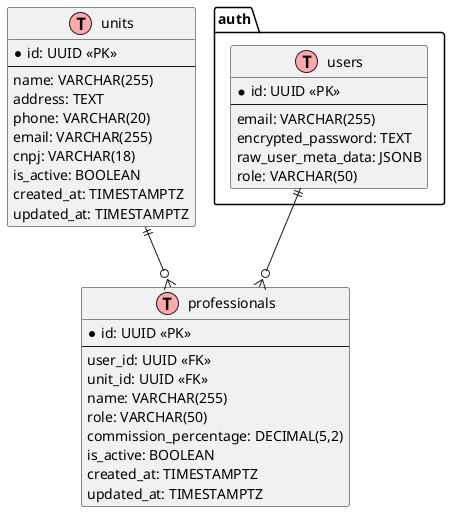
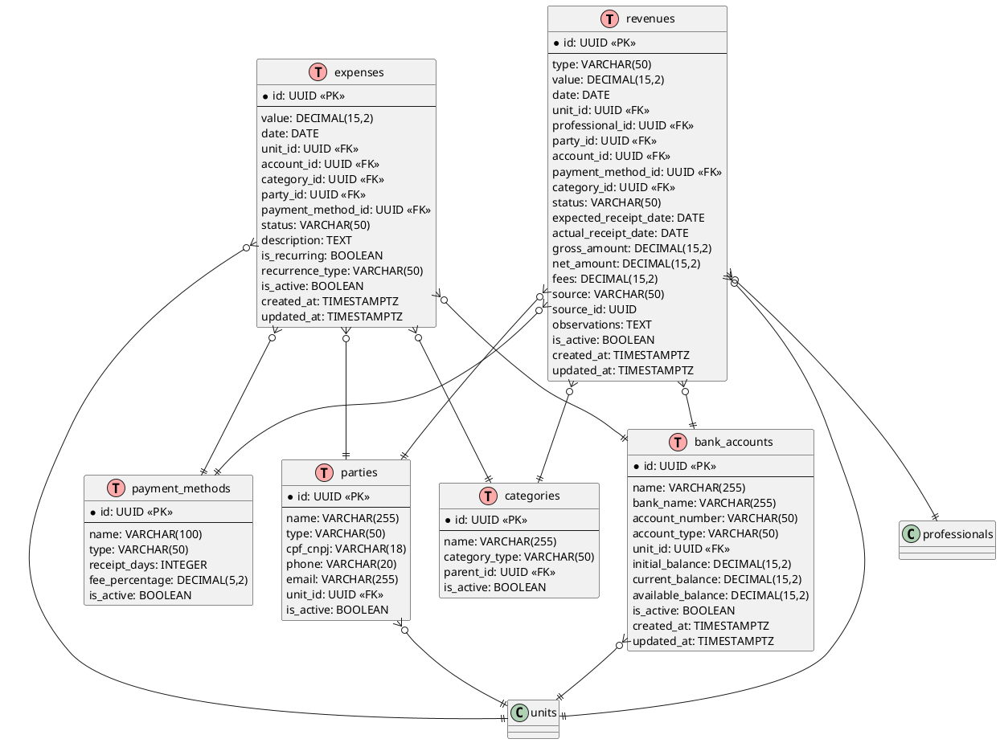
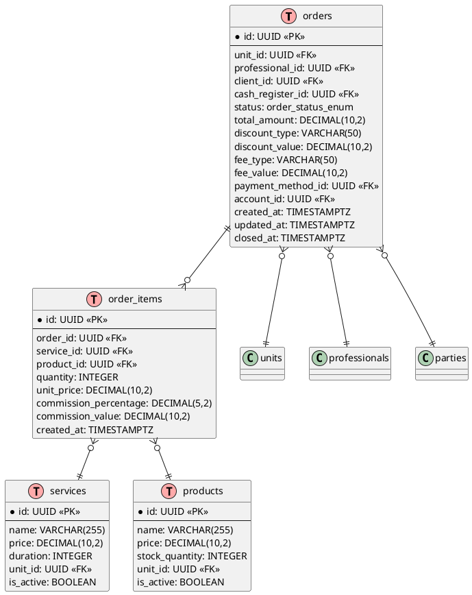
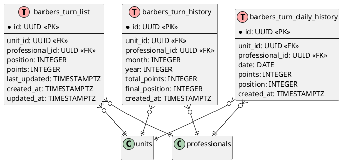

# 07 - Data Model: Barber Analytics Pro

---

**Documento:** 07_DATA_MODEL.md
**Título:** Modelo de Dados
**Autor:** Andrey Viana
**Versão:** 1.0.0
**Última Atualização:** 7 de novembro de 2025
**Licença:** Proprietary

---

## 📋 Objetivo do Documento

Este documento apresenta o modelo de dados completo do sistema, incluindo:

- **ERD (Entity Relationship Diagram)** em PlantUML
- **Dicionário de Dados** com descrição de todas as tabelas e colunas
- **Views e Funções** do banco de dados
- **Índices e Constraints** para performance

## 🗄️ ERD - Diagrama Entidade-Relacionamento

### Módulo Core (Unidades e Usuários)



### Módulo Financeiro



### Módulo de Comandas (Orders)



### Módulo Lista da Vez



## 📊 Dicionário de Dados

### Tabela: `units` (Unidades)

Armazena as barbearias cadastradas no sistema (multi-tenant).

| Coluna     | Tipo         | Nullable      | Descrição            |
| ---------- | ------------ | ------------- | -------------------- |
| id         | UUID         | NOT NULL      | Chave primária       |
| name       | VARCHAR(255) | NOT NULL      | Nome da barbearia    |
| address    | TEXT         | NULL          | Endereço completo    |
| phone      | VARCHAR(20)  | NULL          | Telefone com DDD     |
| email      | VARCHAR(255) | NULL          | E-mail principal     |
| cnpj       | VARCHAR(18)  | NULL          | CNPJ formatado       |
| is_active  | BOOLEAN      | DEFAULT true  | Status ativo/inativo |
| created_at | TIMESTAMPTZ  | DEFAULT now() | Data de criação      |
| updated_at | TIMESTAMPTZ  | DEFAULT now() | Última atualização   |

**Indexes**:

- PRIMARY KEY: `id`
- INDEX: `idx_units_is_active` ON `is_active`

### Tabela: `professionals` (Profissionais)

Cadastro de barbeiros, gerentes e demais profissionais.

| Coluna                | Tipo         | Nullable      | Descrição                               |
| --------------------- | ------------ | ------------- | --------------------------------------- |
| id                    | UUID         | NOT NULL      | Chave primária                          |
| user_id               | UUID         | NOT NULL      | FK para auth.users                      |
| unit_id               | UUID         | NOT NULL      | FK para units                           |
| name                  | VARCHAR(255) | NOT NULL      | Nome completo                           |
| role                  | VARCHAR(50)  | NOT NULL      | admin, gerente, barbeiro, recepcionista |
| commission_percentage | DECIMAL(5,2) | DEFAULT 0     | Percentual de comissão padrão           |
| is_active             | BOOLEAN      | DEFAULT true  | Status ativo/inativo                    |
| created_at            | TIMESTAMPTZ  | DEFAULT now() | Data de criação                         |
| updated_at            | TIMESTAMPTZ  | DEFAULT now() | Última atualização                      |

**Indexes**:

- PRIMARY KEY: `id`
- FOREIGN KEY: `user_id` → `auth.users(id)`
- FOREIGN KEY: `unit_id` → `units(id)`
- INDEX: `idx_professionals_unit_active` ON `(unit_id, is_active)`
- INDEX: `idx_professionals_user` ON `user_id`

### Tabela: `revenues` (Receitas)

Registros de receitas (vendas de serviços, produtos, assinaturas).

| Coluna                | Tipo          | Nullable          | Descrição                                  |
| --------------------- | ------------- | ----------------- | ------------------------------------------ |
| id                    | UUID          | NOT NULL          | Chave primária                             |
| type                  | VARCHAR(50)   | NOT NULL          | service, product, subscription, adjustment |
| value                 | DECIMAL(15,2) | NOT NULL          | Valor da receita                           |
| date                  | DATE          | NOT NULL          | Data da competência                        |
| unit_id               | UUID          | NOT NULL          | FK para units                              |
| professional_id       | UUID          | NULL              | FK para professionals                      |
| party_id              | UUID          | NULL              | FK para parties (cliente)                  |
| account_id            | UUID          | NULL              | FK para bank_accounts                      |
| payment_method_id     | UUID          | NULL              | FK para payment_methods                    |
| category_id           | UUID          | NULL              | FK para categories                         |
| status                | VARCHAR(50)   | DEFAULT 'Pending' | Pending, Received, Canceled                |
| expected_receipt_date | DATE          | NULL              | Data esperada de recebimento               |
| actual_receipt_date   | DATE          | NULL              | Data real de recebimento                   |
| gross_amount          | DECIMAL(15,2) | NULL              | Valor bruto (antes de taxas)               |
| net_amount            | DECIMAL(15,2) | NULL              | Valor líquido (após taxas)                 |
| fees                  | DECIMAL(15,2) | DEFAULT 0         | Taxas de cartão, gateway                   |
| source                | VARCHAR(50)   | NULL              | order, subscription, manual                |
| source_id             | UUID          | NULL              | ID da origem (order_id, subscription_id)   |
| observations          | TEXT          | NULL              | Observações adicionais                     |
| is_active             | BOOLEAN       | DEFAULT true      | Soft delete                                |
| created_at            | TIMESTAMPTZ   | DEFAULT now()     | Data de criação                            |
| updated_at            | TIMESTAMPTZ   | DEFAULT now()     | Última atualização                         |

**Indexes**:

- PRIMARY KEY: `id`
- INDEX: `idx_revenues_unit_date` ON `(unit_id, date)`
- INDEX: `idx_revenues_status` ON `status`
- INDEX: `idx_revenues_professional` ON `professional_id`
- INDEX: `idx_revenues_account` ON `account_id`

### Tabela: `expenses` (Despesas)

Registros de despesas operacionais e fixas.

| Coluna            | Tipo          | Nullable          | Descrição                    |
| ----------------- | ------------- | ----------------- | ---------------------------- |
| id                | UUID          | NOT NULL          | Chave primária               |
| value             | DECIMAL(15,2) | NOT NULL          | Valor da despesa             |
| date              | DATE          | NOT NULL          | Data da competência          |
| unit_id           | UUID          | NOT NULL          | FK para units                |
| account_id        | UUID          | NULL              | FK para bank_accounts        |
| category_id       | UUID          | NOT NULL          | FK para categories           |
| party_id          | UUID          | NULL              | FK para parties (fornecedor) |
| payment_method_id | UUID          | NULL              | FK para payment_methods      |
| status            | VARCHAR(50)   | DEFAULT 'Pending' | Pending, Paid, Canceled      |
| description       | TEXT          | NULL              | Descrição da despesa         |
| is_recurring      | BOOLEAN       | DEFAULT false     | Despesa recorrente?          |
| recurrence_type   | VARCHAR(50)   | NULL              | monthly, quarterly, yearly   |
| is_active         | BOOLEAN       | DEFAULT true      | Soft delete                  |
| created_at        | TIMESTAMPTZ   | DEFAULT now()     | Data de criação              |
| updated_at        | TIMESTAMPTZ   | DEFAULT now()     | Última atualização           |

**Indexes**:

- PRIMARY KEY: `id`
- INDEX: `idx_expenses_unit_date` ON `(unit_id, date)`
- INDEX: `idx_expenses_category` ON `category_id`
- INDEX: `idx_expenses_status` ON `status`

### Tabela: `bank_accounts` (Contas Bancárias)

Cadastro de contas bancárias da barbearia.

| Coluna            | Tipo          | Nullable      | Descrição                                      |
| ----------------- | ------------- | ------------- | ---------------------------------------------- |
| id                | UUID          | NOT NULL      | Chave primária                                 |
| name              | VARCHAR(255)  | NOT NULL      | Nome da conta (ex: "Conta Corrente Principal") |
| bank_name         | VARCHAR(255)  | NULL          | Nome do banco                                  |
| account_number    | VARCHAR(50)   | NULL          | Número da conta                                |
| account_type      | VARCHAR(50)   | NULL          | checking, savings, investment                  |
| unit_id           | UUID          | NOT NULL      | FK para units                                  |
| initial_balance   | DECIMAL(15,2) | DEFAULT 0     | Saldo inicial                                  |
| current_balance   | DECIMAL(15,2) | DEFAULT 0     | Saldo atual (calculado)                        |
| available_balance | DECIMAL(15,2) | DEFAULT 0     | Saldo disponível (calculado)                   |
| is_active         | BOOLEAN       | DEFAULT true  | Status ativo/inativo                           |
| created_at        | TIMESTAMPTZ   | DEFAULT now() | Data de criação                                |
| updated_at        | TIMESTAMPTZ   | DEFAULT now() | Última atualização                             |

**Indexes**:

- PRIMARY KEY: `id`
- INDEX: `idx_bank_accounts_unit` ON `unit_id`

### Tabela: `payment_methods` (Formas de Pagamento)

Cadastro de formas de pagamento disponíveis.

| Coluna         | Tipo         | Nullable      | Descrição                                |
| -------------- | ------------ | ------------- | ---------------------------------------- |
| id             | UUID         | NOT NULL      | Chave primária                           |
| name           | VARCHAR(100) | NOT NULL      | Nome (ex: "Pix", "Débito", "Crédito 3x") |
| type           | VARCHAR(50)  | NOT NULL      | pix, debit, credit, cash, bank_slip      |
| receipt_days   | INTEGER      | DEFAULT 0     | Dias até recebimento (D+0, D+1, D+30)    |
| fee_percentage | DECIMAL(5,2) | DEFAULT 0     | Percentual de taxa                       |
| is_active      | BOOLEAN      | DEFAULT true  | Status ativo/inativo                     |
| created_at     | TIMESTAMPTZ  | DEFAULT now() | Data de criação                          |
| updated_at     | TIMESTAMPTZ  | DEFAULT now() | Última atualização                       |

**Indexes**:

- PRIMARY KEY: `id`
- INDEX: `idx_payment_methods_type` ON `type`

## 🔍 Views Principais

### View: `vw_demonstrativo_fluxo`

Consolida entradas e saídas diárias com saldo acumulado.

```sql
CREATE VIEW vw_demonstrativo_fluxo AS
WITH daily_movements AS (
  -- Receitas (entradas)
  SELECT
    unit_id,
    account_id,
    date::DATE AS transaction_date,
    SUM(COALESCE(net_amount, value)) AS entradas,
    0 AS saidas
  FROM revenues
  WHERE is_active = true
    AND status IN ('Received', 'Paid')
  GROUP BY unit_id, account_id, date::DATE

  UNION ALL

  -- Despesas (saídas)
  SELECT
    unit_id,
    account_id,
    date::DATE AS transaction_date,
    0 AS entradas,
    SUM(value) AS saidas
  FROM expenses
  WHERE is_active = true
    AND status = 'Paid'
  GROUP BY unit_id, account_id, date::DATE
),
aggregated AS (
  SELECT
    unit_id,
    account_id,
    transaction_date,
    SUM(entradas) AS entradas,
    SUM(saidas) AS saidas,
    SUM(entradas) - SUM(saidas) AS saldo_dia
  FROM daily_movements
  GROUP BY unit_id, account_id, transaction_date
)
SELECT
  *,
  SUM(saldo_dia) OVER (
    PARTITION BY unit_id, account_id
    ORDER BY transaction_date
    ROWS BETWEEN UNBOUNDED PRECEDING AND CURRENT ROW
  ) AS saldo_acumulado
FROM aggregated
ORDER BY unit_id, account_id, transaction_date;
```

### View: `vw_financial_summary`

Resumo financeiro consolidado por unidade.

```sql
CREATE VIEW vw_financial_summary AS
SELECT
  r.unit_id,
  DATE_TRUNC('month', r.date) AS period,
  COALESCE(SUM(r.value), 0) AS total_revenues,
  COALESCE(SUM(e.value), 0) AS total_expenses,
  COALESCE(SUM(r.value), 0) - COALESCE(SUM(e.value), 0) AS net_profit,
  COUNT(DISTINCT r.party_id) AS total_clients,
  COUNT(DISTINCT r.professional_id) AS active_professionals
FROM revenues r
LEFT JOIN expenses e ON e.unit_id = r.unit_id
  AND DATE_TRUNC('month', e.date) = DATE_TRUNC('month', r.date)
WHERE r.is_active = true
  AND r.status IN ('Received', 'Paid')
GROUP BY r.unit_id, DATE_TRUNC('month', r.date);
```

## 🔧 Funções Principais

### Função: `fn_calculate_dre`

Calcula DRE (Demonstração do Resultado do Exercício) para um período.

```sql
CREATE OR REPLACE FUNCTION fn_calculate_dre(
  p_unit_id UUID,
  p_start_date DATE,
  p_end_date DATE
)
RETURNS JSON
LANGUAGE plpgsql
SECURITY DEFINER
AS $$
DECLARE
  v_receita_bruta DECIMAL(15,2);
  v_deducoes DECIMAL(15,2);
  v_receita_liquida DECIMAL(15,2);
  v_custos_fixos DECIMAL(15,2);
  v_custos_variaveis DECIMAL(15,2);
  v_lucro_operacional DECIMAL(15,2);
  v_margem_percentual DECIMAL(5,2);
BEGIN
  -- Receita Bruta
  SELECT COALESCE(SUM(gross_amount), 0) INTO v_receita_bruta
  FROM revenues
  WHERE unit_id = p_unit_id
    AND date BETWEEN p_start_date AND p_end_date
    AND status IN ('Received', 'Paid')
    AND is_active = true;

  -- Deduções (taxas, fees)
  SELECT COALESCE(SUM(fees), 0) INTO v_deducoes
  FROM revenues
  WHERE unit_id = p_unit_id
    AND date BETWEEN p_start_date AND p_end_date
    AND status IN ('Received', 'Paid')
    AND is_active = true;

  -- Receita Líquida
  v_receita_liquida := v_receita_bruta - v_deducoes;

  -- Custos Fixos
  SELECT COALESCE(SUM(value), 0) INTO v_custos_fixos
  FROM expenses e
  JOIN categories c ON c.id = e.category_id
  WHERE e.unit_id = p_unit_id
    AND e.date BETWEEN p_start_date AND p_end_date
    AND e.status = 'Paid'
    AND c.name ILIKE '%fixo%'
    AND e.is_active = true;

  -- Custos Variáveis
  SELECT COALESCE(SUM(value), 0) INTO v_custos_variaveis
  FROM expenses e
  JOIN categories c ON c.id = e.category_id
  WHERE e.unit_id = p_unit_id
    AND e.date BETWEEN p_start_date AND p_end_date
    AND e.status = 'Paid'
    AND c.name ILIKE '%variável%'
    AND e.is_active = true;

  -- Lucro Operacional
  v_lucro_operacional := v_receita_liquida - v_custos_fixos - v_custos_variaveis;

  -- Margem Percentual
  IF v_receita_bruta > 0 THEN
    v_margem_percentual := (v_lucro_operacional / v_receita_bruta) * 100;
  ELSE
    v_margem_percentual := 0;
  END IF;

  RETURN json_build_object(
    'receita_bruta', v_receita_bruta,
    'deducoes', v_deducoes,
    'receita_liquida', v_receita_liquida,
    'custos_fixos', v_custos_fixos,
    'custos_variaveis', v_custos_variaveis,
    'lucro_operacional', v_lucro_operacional,
    'margem_percentual', v_margem_percentual
  );
END;
$$;
```

## 📚 Referências

- **PostgreSQL Documentation**: Version 17.6
- **Supabase RLS**: Row Level Security Best Practices
- **Database Design**: Joe Celko, _SQL for Smarties_
- **PlantUML**: Diagram as Code

---

## 🔗 Navegação

- **Anterior**: [06 - API Reference](./06_API_REFERENCE.md)
- **Próximo**: [08 - Testing Strategy](./08_TESTING_STRATEGY.md)
- **Índice Geral**: [SUMMARY.md](./SUMMARY.md)

---
