# 💰 Módulo de Caixa — Barber Analytics Pro

> **Documentação completa do módulo de gestão de caixas com controle de abertura, fechamento e relatórios.**
>
> **Versão:** 1.0.0  
> **Atualizado em:** 2025-10-24  
> **Autor:** Andrey Viana

---

## 🎯 Visão Geral

O **Módulo de Caixa** gerencia o fluxo de abertura e fechamento de caixas nas unidades, garantindo controle financeiro e rastreabilidade de todas as operações. Implementa controle de permissões rigoroso baseado em perfis de usuário.

### Principais Funcionalidades

- ✅ Abertura de caixa com saldo inicial
- ✅ Controle de apenas 1 caixa aberto por unidade
- ✅ Fechamento com validação de comandas abertas
- ✅ Relatórios detalhados por período
- ✅ Histórico completo de caixas
- ✅ Permissões baseadas em perfil (Recepcionista, Gerente, Admin)
- ✅ Auditoria completa de ações

---

## 🏗️ Arquitetura

O módulo segue **Clean Architecture** com separação clara de responsabilidades:

```
┌─────────────────────────────────────────────────────────┐
│                     UI Layer (React)                     │
│  CashRegisterPage, OpenCashModal, CloseCashModal       │
└───────────────────────┬─────────────────────────────────┘
                        │
┌───────────────────────▼─────────────────────────────────┐
│                   Presentation Layer                     │
│           useCashRegister (Custom Hook)                 │
└───────────────────────┬─────────────────────────────────┘
                        │
┌───────────────────────▼─────────────────────────────────┐
│                  Application Layer                       │
│            cashRegisterService.js                       │
│  (Validações de negócio, orquestração)                  │
└───────────────────────┬─────────────────────────────────┘
                        │
┌───────────────────────▼─────────────────────────────────┐
│                 Infrastructure Layer                     │
│          cashRegisterRepository.js                      │
│         (Acesso direto ao Supabase)                     │
└───────────────────────┬─────────────────────────────────┘
                        │
┌───────────────────────▼─────────────────────────────────┐
│                  Database (PostgreSQL)                   │
│      cash_registers table + RLS Policies               │
└─────────────────────────────────────────────────────────┘
```

---

## 📊 Modelo de Dados

### Tabela: `cash_registers`

```sql
CREATE TABLE cash_registers (
    id UUID PRIMARY KEY DEFAULT uuid_generate_v4(),
    unit_id UUID NOT NULL REFERENCES units(id),
    opened_by UUID NOT NULL REFERENCES users(id),
    closed_by UUID REFERENCES users(id),
    opening_balance NUMERIC(10,2) NOT NULL CHECK (opening_balance >= 0),
    closing_balance NUMERIC(10,2) CHECK (closing_balance >= 0),
    status VARCHAR(20) NOT NULL DEFAULT 'open' CHECK (status IN ('open', 'closed')),
    opening_time TIMESTAMP NOT NULL DEFAULT NOW(),
    closing_time TIMESTAMP,
    observations TEXT,
    created_at TIMESTAMP DEFAULT NOW(),
    updated_at TIMESTAMP DEFAULT NOW()
);

-- Índices para performance
CREATE INDEX idx_cash_registers_unit_status ON cash_registers(unit_id, status);
CREATE INDEX idx_cash_registers_opening_time ON cash_registers(opening_time DESC);
```

### Views Relacionadas

#### `vw_cash_register_summary`

View que agrega receitas e despesas por caixa:

```sql
CREATE OR REPLACE VIEW vw_cash_register_summary AS
SELECT
    cr.id AS cash_register_id,
    cr.unit_id,
    cr.opening_balance,
    cr.closing_balance,
    cr.opening_time,
    cr.closing_time,
    cr.status,
    COALESCE(SUM(r.value), 0) AS total_revenue,
    COALESCE(SUM(e.value), 0) AS total_expenses,
    cr.opening_balance + COALESCE(SUM(r.value), 0) - COALESCE(SUM(e.value), 0) AS expected_balance,
    (cr.closing_balance - (cr.opening_balance + COALESCE(SUM(r.value), 0) - COALESCE(SUM(e.value), 0))) AS difference
FROM cash_registers cr
LEFT JOIN revenues r ON r.unit_id = cr.unit_id
    AND r.created_at BETWEEN cr.opening_time AND COALESCE(cr.closing_time, NOW())
LEFT JOIN expenses e ON e.unit_id = cr.unit_id
    AND e.created_at BETWEEN cr.opening_time AND COALESCE(cr.closing_time, NOW())
GROUP BY cr.id, cr.unit_id, cr.opening_balance, cr.closing_balance,
         cr.opening_time, cr.closing_time, cr.status;
```

---

## 🔐 Controle de Acesso (RLS)

### Permissões por Perfil

| Ação         | Profissional | Recepcionista | Gerente | Admin |
| ------------ | ------------ | ------------- | ------- | ----- |
| Visualizar   | ❌           | ✅            | ✅      | ✅    |
| Abrir Caixa  | ❌           | ✅            | ✅      | ✅    |
| Fechar Caixa | ❌           | ✅            | ✅      | ✅    |
| Relatórios   | ❌           | ✅            | ✅      | ✅    |

### Função de Validação

```sql
CREATE OR REPLACE FUNCTION fn_can_manage_cash_register(
  p_user_id UUID,
  p_unit_id UUID
) RETURNS BOOLEAN AS $$
DECLARE
  v_user_role VARCHAR(50);
  v_user_unit_id UUID;
BEGIN
  -- Busca perfil e unidade do usuário
  SELECT role, unit_id INTO v_user_role, v_user_unit_id
  FROM professionals
  WHERE user_id = p_user_id AND is_active = true;

  -- Valida se pertence à unidade e tem perfil adequado
  RETURN (v_user_unit_id = p_unit_id)
    AND (v_user_role IN ('recepcionista', 'gerente', 'administrador'));
END;
$$ LANGUAGE plpgsql SECURITY DEFINER;
```

### Políticas RLS

```sql
-- SELECT: Ver caixas da sua unidade
CREATE POLICY "view_own_unit_cash_registers"
ON cash_registers FOR SELECT
USING (unit_id IN (SELECT unit_id FROM get_user_unit_ids()));

-- INSERT: Apenas perfis autorizados
CREATE POLICY "open_cash_register_authorized"
ON cash_registers FOR INSERT
WITH CHECK (fn_can_manage_cash_register(auth.uid(), unit_id));

-- UPDATE: Apenas perfis autorizados (para fechamento)
CREATE POLICY "close_cash_register_authorized"
ON cash_registers FOR UPDATE
USING (fn_can_manage_cash_register(auth.uid(), unit_id));
```

---

## 🔄 Fluxos de Uso

### 1. Abertura de Caixa

```mermaid
sequenceDiagram
    participant User
    participant UI as OpenCashModal
    participant Hook as useCashRegister
    participant Service as cashRegisterService
    participant Repo as cashRegisterRepository
    participant DB as Supabase

    User->>UI: Clica "Abrir Caixa"
    UI->>UI: Valida permissão (useUserPermissions)
    UI->>User: Exibe modal
    User->>UI: Preenche saldo inicial + observações
    UI->>Hook: openCashRegister(data)
    Hook->>Service: openCashRegister(dto, userId)
    Service->>Service: Valida DTO (Zod)
    Service->>Service: Verifica se já existe caixa aberto
    Service->>Repo: getActiveCashRegister(unitId)
    Repo->>DB: SELECT WHERE status='open'
    DB-->>Repo: null (sem caixa aberto)
    Service->>Repo: openCashRegister(data)
    Repo->>DB: INSERT INTO cash_registers
    DB-->>Repo: Registro criado
    Repo-->>Service: {data, error: null}
    Service-->>Hook: {data, error: null}
    Hook->>Hook: Atualiza cache (React Query)
    Hook-->>UI: Sucesso
    UI->>User: Toast "Caixa aberto com sucesso"
```



### 2. Fechamento de Caixa

```mermaid
sequenceDiagram
    participant User
    participant UI as CloseCashModal
    participant Hook as useCashRegister
    participant Service as cashRegisterService
    participant Repo as cashRegisterRepository
    participant DB as Supabase

    User->>UI: Clica "Fechar Caixa"
    UI->>Service: getCashRegisterSummary(id)
    Service->>DB: SELECT FROM vw_cash_register_summary
    DB-->>UI: {expected_balance: 150}
    UI->>User: Exibe saldo esperado
    User->>UI: Informa saldo real + observações
    UI->>UI: Calcula diferença
    UI->>Hook: closeCashRegister(id, data)
    Hook->>Service: closeCashRegister(id, dto, userId)
    Service->>Repo: countOpenOrders(cashRegisterId)
    Repo->>DB: SELECT COUNT(*) WHERE status='open'
    DB-->>Service: 0 (sem comandas abertas)
    Service->>Repo: closeCashRegister(id, data)
    Repo->>DB: UPDATE cash_registers SET status='closed'
    DB-->>Service: {data, error: null}
    Service-->>UI: Toast "Caixa fechado com sucesso"
```



---

## 📝 DTOs (Validação com Zod)

### `openCashRegisterSchema`

```javascript
import { z } from 'zod';

export const openCashRegisterSchema = z.object({
  unitId: z.string().uuid('ID da unidade inválido'),
  openedBy: z.string().uuid('ID do usuário inválido'),
  openingBalance: z
    .number()
    .nonnegative('Saldo inicial deve ser maior ou igual a zero'),
  observations: z.string().optional(),
});
```

### `closeCashRegisterSchema`

```javascript
export const closeCashRegisterSchema = z.object({
  closedBy: z.string().uuid('ID do usuário inválido'),
  closingBalance: z
    .number()
    .nonnegative('Saldo de fechamento deve ser maior ou igual a zero'),
  observations: z.string().optional(),
});
```

---

## 🛠️ Componentes UI

### Páginas

- **`CashRegisterPage.jsx`** - Página principal com listagem e controles

### Modais

- **`OpenCashModal.jsx`** - Modal de abertura de caixa
- **`CloseCashModal.jsx`** - Modal de fechamento com resumo

### Atoms & Molecules

- **`StatusBadge.jsx`** - Badge visual de status (open/closed)
- **`CashRegisterCard.jsx`** - Card resumido de caixa

---

## 📊 Relatórios

### Relatório de Caixa

```javascript
const report = await cashRegisterService.getCashRegisterReport(cashRegisterId);

// Retorna:
{
  cash_register: {
    id, unit_id, opening_balance, closing_balance,
    opening_time, closing_time, status
  },
  summary: {
    total_revenue: 1500.00,
    total_expenses: 300.00,
    expected_balance: 1300.00,
    difference: -50.00 // Falta
  },
  orders: [
    { order_id, total_amount, client_name, professional_name }
  ]
}
```

---

## 🧪 Testes

### Testes Unitários

- ✅ DTOs: 15 testes (validação de schemas)
- ✅ Services: 26 testes (lógica de negócio)
- ⏳ Repositories: Pendente (complexidade de mock Supabase)

### Testes de Integração

- [ ] Fluxo completo: abrir → criar comandas → fechar
- [ ] Validação de caixa único por unidade
- [ ] Bloqueio de fechamento com comandas abertas

---

## 🚀 Uso e Exemplos

### Hook `useCashRegister`

```javascript
import useCashRegister from '@/hooks/useCashRegister';

function CashRegisterPage() {
  const {
    activeCashRegister,
    isLoading,
    openCashRegister,
    closeCashRegister,
    getCashRegisterReport,
  } = useCashRegister(unitId);

  const handleOpen = async () => {
    const result = await openCashRegister({
      openingBalance: 100,
      observations: 'Abertura normal',
    });

    if (result.error) {
      toast.error(result.error);
    } else {
      toast.success('Caixa aberto com sucesso!');
    }
  };

  return (
    <div>
      {activeCashRegister ? (
        <CloseCashModal cashRegister={activeCashRegister} />
      ) : (
        <OpenCashModal onOpen={handleOpen} />
      )}
    </div>
  );
}
```

---

## 📚 Referências

- [DATABASE_SCHEMA.md](./DATABASE_SCHEMA.md) - Schema completo do banco
- [FINANCIAL_MODULE.md](./FINANCIAL_MODULE.md) - Integração com módulo financeiro
- [Plano_Implementacao_Novas_Funcionalidades.md](./docs/Plano_Implementacao_Novas_Funcionalidades.md) - Plano de implementação
- [ARQUITETURA.md](./ARQUITETURA.md) - Arquitetura geral do sistema

---

**Status:** ✅ Implementado  
**Versão:** 1.0.0  
**Última Atualização:** 2025-10-24
