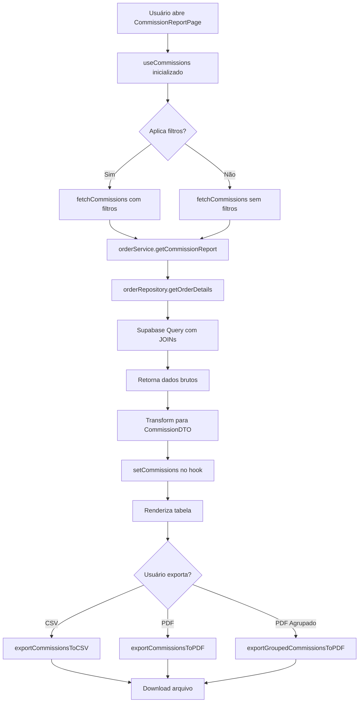

# 💰 Implementação do Módulo de Comissões

> **Data:** 24/01/2025  
> **Autor:** Andrey Viana  
> **FASE:** 6.2 - Financial Integration (Comissões)  
> **Status:** ✅ Completo

---

## 🎯 Objetivo

Implementar sistema completo de rastreamento, visualização e exportação de comissões de profissionais, integrado ao módulo de comandas e financeiro.

---

## 📦 Arquivos Criados

### 1. **CommissionReportPage.jsx** (525 linhas)

**Localização:** `src/pages/CommissionReportPage.jsx`

Página completa de relatórios de comissões com:

#### Features:

- ✅ **Resumo Visual**: Integração com `CommissionSummaryCard`
- ✅ **Filtros Avançados**:
  - Profissional (dropdown)
  - Data início/fim
  - Status (todas/pagas/pendentes)
  - Número da comanda
- ✅ **Visualizações**:
  - Tabela normal: todas as comissões em lista
  - Tabela agrupada: comissões agrupadas por profissional
- ✅ **Exportação**: Botões para CSV e PDF
- ✅ **Cálculos em tempo real**:
  - Total de comissões
  - Comissões pagas
  - Comissões pendentes
  - Percentuais de conversão
- ✅ **Responsividade**: Mobile-first design
- ✅ **Dark Mode**: Suporte completo

#### Estrutura:

```jsx
<div className="commission-report-page">
  <Header>
    <Título e descrição>
    <Botões de exportação (CSV/PDF)>
  </Header>

  <CommissionSummaryCard />

  <Filtros Avançados>
    <Profissional>
    <Data Início/Fim>
    <Status>
    <Nº Comanda>
    <Botões: Aplicar/Limpar>
    <Checkbox: Agrupar por profissional>
  </Filtros>

  <Tabela de Dados>
    {groupByProfessional ? (
      <VisualizaçãoAgrupada />
    ) : (
      <VisualizaçãoNormal />
    )}
  </Tabela>

  <Footer com Totais />
</div>
```

---

### 2. **useCommissions.js** (280 linhas)

**Localização:** `src/hooks/useCommissions.js`

Hook customizado para gerenciar comissões.

#### API Pública:

```javascript
const {
  // Estado
  commissions, // Array de comissões
  loading, // Boolean de carregamento
  error, // Mensagem de erro

  // Operações principais
  fetchCommissions, // Busca comissões com filtros
  refetch, // Recarrega dados
  clearCommissions, // Limpa estado

  // Cálculos
  calculateTotals, // Totais gerais
  calculateAverageByProfessional, // Média por profissional
  calculateByPeriod, // Agrupamento temporal

  // Agrupamentos
  groupByProfessional, // Agrupa por profissional
  groupByDate, // Agrupa por data

  // Filtros e buscas
  filterCommissions, // Filtro customizado
  getCommissionById, // Busca por ID
  getCommissionsByProfessional, // Por profissional
  getCommissionsByOrder, // Por comanda
} = useCommissions();
```

#### Funcionalidades:

- ✅ Busca com filtros dinâmicos
- ✅ Cálculo de totais (pagas/pendentes/total)
- ✅ Agrupamento por profissional
- ✅ Agrupamento por data
- ✅ Agrupamento por período (dia/semana/mês/ano)
- ✅ Cálculo de médias
- ✅ Filtros locais para performance
- ✅ Error handling robusto
- ✅ Loading states

---

### 3. **exportCommissions.js** (380 linhas)

**Localização:** `src/utils/exportCommissions.js`

Utilitários de exportação de relatórios.

#### Funções exportadas:

##### `exportCommissionsToCSV(commissions, filters)`

Gera arquivo CSV com:

- Todas as colunas de comissão
- Linhas de totais ao final
- Encoding UTF-8 com BOM
- Nome de arquivo com timestamp
- Formato compatível com Excel

**Exemplo de saída:**

```csv
Data,Comanda,Profissional,Cliente,Serviço,Quantidade,Valor Unitário,Percentual,Comissão,Status,Data Pagamento
2025-01-20,001,João Silva,Cliente A,Corte de Cabelo,1,R$ 50.00,30%,R$ 15.00,Paga,2025-01-25
...
,,,,,,,TOTAL,R$ 150.00,,
,,,,,,,Pagas,R$ 100.00,,
,,,,,,,Pendentes,R$ 50.00,,
```

##### `exportCommissionsToPDF(commissions, filters)`

Gera PDF formatado com:

- Header com título e data de geração
- Informações de filtros aplicados
- Tabela estilizada (jsPDF + autoTable)
- Totais destacados com cores
- Assinatura do responsável
- Numeração de páginas
- Logo e branding (futuro)

**Layout:**

```
┌─────────────────────────────────────┐
│   Relatório de Comissões            │
│   Gerado em: 24/01/2025             │
│   Período: 01/01/2025 a 31/01/2025  │
├─────────────────────────────────────┤
│ [Tabela de Comissões]               │
│                                     │
│ Data | Comanda | Prof | ... | R$   │
│ ...                                 │
├─────────────────────────────────────┤
│ Total: R$ 1.500,00                  │
│ Pagas: R$ 1.200,00                  │
│ Pendentes: R$ 300,00                │
│                                     │
│ _________________  _____________    │
│ Assinatura         Data             │
└─────────────────────────────────────┘
```

##### `exportGroupedCommissionsToPDF(groupedData, filters)`

Gera PDF com comissões agrupadas por profissional:

- Uma página por profissional
- Totais individuais
- Tabela de itens de cada profissional
- Ideal para entrega individual

---

### 4. **orderService.getCommissionReport()** (60 linhas adicionadas)

**Localização:** `src/services/orderService.js`

Novo método no service para buscar dados de comissões.

#### Assinatura:

```javascript
async getCommissionReport(filters = {}) {
  // filters: { professionalId, startDate, endDate, status, orderId }
  // returns: { data: Array<Commission>, error: Error|null }
}
```

#### Funcionalidades:

- ✅ Busca itens de comanda com JOIN completo
- ✅ Filtra por profissional, data, comanda
- ✅ Filtra por status de comissão (paid/pending)
- ✅ Transforma dados para formato padronizado
- ✅ Integra com orderRepository.getOrderDetails()
- ✅ Error handling com toast
- ✅ Retorna dados normalizados

#### Fluxo:

```
CommissionReportPage
  ↓
useCommissions.fetchCommissions(filters)
  ↓
orderService.getCommissionReport(filters)
  ↓
orderRepository.getOrderDetails(filters)
  ↓
Supabase: JOIN orders + order_items + services + professionals + clients
  ↓
Transform data
  ↓
Return: Array<CommissionDTO>
```

---

## 🗄️ Estrutura de Dados

### Commission Object

```typescript
interface Commission {
  id: string; // ID do item
  orderId: string; // ID da comanda
  orderNumber: string; // Número da comanda
  professionalId: string; // ID do profissional
  professionalName: string; // Nome do profissional
  clientId: string; // ID do cliente
  clientName: string; // Nome do cliente
  serviceId: string; // ID do serviço
  serviceName: string; // Nome do serviço
  quantity: number; // Quantidade
  unitPrice: number; // Preço unitário
  commissionPercentage: number; // % de comissão
  commissionValue: number; // Valor da comissão
  status: 'paid' | 'pending'; // Status do pagamento
  date: string; // Data da comanda (ISO)
  paymentDate: string | null; // Data de pagamento (ISO)
}
```

### Filters Object

```typescript
interface CommissionFilters {
  professionalId?: string; // Filtrar por profissional
  startDate?: string; // Data início (YYYY-MM-DD)
  endDate?: string; // Data fim (YYYY-MM-DD)
  status?: 'all' | 'paid' | 'pending';
  orderId?: string; // Filtrar por comanda
}
```

### Totals Object

```typescript
interface CommissionTotals {
  totalCommissions: number; // Soma total
  paidCommissions: number; // Soma pagas
  pendingCommissions: number; // Soma pendentes
  itemsCount: number; // Quantidade de itens
  paidCount: number; // Quantidade pagos
  pendingCount: number; // Quantidade pendentes
}
```

---

## 🔗 Integração com Componentes Existentes

### CommissionSummaryCard

Já existente, integrado na página de relatórios:

```jsx
<CommissionSummaryCard
  professionals={professionals}
  onFetchCommissions={fetchCommissions}
  onExport={handleExportCSV}
  onViewDetails={() => scrollTo(tableSection)}
/>
```

---

## 🎨 UI/UX

### Paleta de Cores

- **Total**: Purple 600 (`#7c3aed`) - Destaque principal
- **Pagas**: Green 600 (`#16a34a`) - Sucesso
- **Pendentes**: Orange 600 (`#ea580c`) - Atenção

### Estados Visuais

- ✅ **Loading**: Spinner animado
- ✅ **Empty State**: Ícone + mensagem amigável
- ✅ **Error State**: Toast notification
- ✅ **Success State**: Toast confirmation
- ✅ **Hover Effects**: Linhas da tabela
- ✅ **Active Filters**: Badge visual

### Responsividade

- **Desktop**: Grid 5 colunas (filtros)
- **Tablet**: Grid 3 colunas
- **Mobile**: Grid 1 coluna (stack)
- **Tabela**: Scroll horizontal em telas pequenas

---

## 📊 Casos de Uso

### 1. Gerente verifica comissões do mês

```javascript
// Usuário: Gerente
// Ação: Abre página de comissões

1. CommissionReportPage renderiza
2. useCommissions.fetchCommissions() chamado
3. Carrega dados de todos os profissionais do mês atual
4. Exibe CommissionSummaryCard com totais
5. Tabela mostra todas as comissões
6. Gerente pode agrupar por profissional
7. Exporta PDF agrupado para arquivo
```

### 2. Profissional consulta suas comissões

```javascript
// Usuário: Profissional (João)
// Ação: Seleciona "Minhas Comissões" no menu

1. Página carrega com filtro professionalId=joao
2. Hook busca apenas comissões de João
3. Exibe total, pagas e pendentes
4. João vê detalhamento por serviço
5. Exporta CSV para controle pessoal
```

### 3. Fechamento de folha de pagamento

```javascript
// Usuário: Gerente/Admin
// Ação: Gera relatório para pagamento

1. Seleciona período: 01/01 a 31/01
2. Seleciona status: "Pendentes"
3. Agrupa por profissional
4. Exporta PDF agrupado
5. Usa PDF para efetuar pagamentos
6. Marca comissões como "Pagas" (futuro)
7. Gera novo relatório de confirmação
```

---

## 🔄 Fluxo de Dados Completo



---

## 🧪 Testes Necessários (FASE 7)

### Testes Unitários

- [ ] `useCommissions.calculateTotals()` com dados mock
- [ ] `useCommissions.groupByProfessional()` agrupa corretamente
- [ ] `exportCommissionsToCSV()` gera CSV válido
- [ ] `exportCommissionsToPDF()` gera PDF sem erros
- [ ] `orderService.getCommissionReport()` com filtros diversos

### Testes de Integração

- [ ] CommissionReportPage carrega dados corretamente
- [ ] Filtros aplicam-se e atualizam tabela
- [ ] Exportação CSV funciona end-to-end
- [ ] Exportação PDF funciona end-to-end
- [ ] Agrupamento por profissional funciona

### Testes E2E

- [ ] Fluxo: Abrir página → Aplicar filtros → Visualizar dados
- [ ] Fluxo: Filtrar por profissional → Exportar CSV
- [ ] Fluxo: Agrupar → Exportar PDF
- [ ] Fluxo: Verificar responsividade mobile

---

## 📝 Dependências Externas

### NPM Packages

```json
{
  "jspdf": "^2.5.1", // Geração de PDFs
  "jspdf-autotable": "^3.8.0", // Tabelas em PDF
  "react-hot-toast": "^2.4.1" // Notificações
}
```

### Instalação:

```bash
npm install jspdf jspdf-autotable
```

---

## 🚀 Próximos Passos

### Melhorias Futuras (Backlog)

- [ ] **Marcar comissões como pagas**: Botão de ação em massa
- [ ] **Histórico de pagamentos**: Tabela de pagamentos anteriores
- [ ] **Comprovante de pagamento**: Gerar PDF individual para profissional
- [ ] **Integração bancária**: Gerar arquivo CNAB para pagamento
- [ ] **Dashboard de comissões**: Gráficos e KPIs visuais
- [ ] **Notificações**: Alertar profissionais sobre comissões pendentes
- [ ] **Relatório comparativo**: Mês atual vs. mês anterior
- [ ] **Metas de comissão**: Tracking de metas individuais
- [ ] **App mobile**: Profissionais consultam pelo celular
- [ ] **Assinatura digital**: Profissional assina recebimento

---

## ✅ Checklist de Implementação

### FASE 6.2 - Comissões: 100% Completo

- [x] Criar estrutura de dados (order_items)
- [x] Criar CommissionSummaryCard organism
- [x] Criar CommissionReportPage
- [x] Criar hook useCommissions
- [x] Criar utils/exportCommissions
- [x] Adicionar método getCommissionReport ao orderService
- [x] Implementar filtros avançados
- [x] Implementar visualização agrupada
- [x] Implementar exportação CSV
- [x] Implementar exportação PDF
- [x] Implementar exportação PDF agrupado
- [x] Adicionar cálculos de totais
- [x] Adicionar loading states
- [x] Adicionar error handling
- [x] Adicionar dark mode
- [x] Adicionar responsividade
- [x] Documentar código
- [x] Atualizar checklist principal

---

## 📖 Documentação Relacionada

- **[Plano_Implementacao_Novas_Funcionalidades.md](./Plano_Implementacao_Novas_Funcionalidades.md)** - Checklist geral
- **[FINANCIAL_MODULE.md](./FINANCIAL_MODULE.md)** - Módulo financeiro
- **[LISTA_DA_VEZ_MODULE.md](./LISTA_DA_VEZ_MODULE.md)** - Sistema de comandas

---

## 🎓 Lições Aprendidas

1. **Lazy loading de PDFs**: jsPDF é pesado, usar dynamic import reduz bundle inicial
2. **UTF-8 BOM em CSV**: Adicionar `\ufeff` garante que Excel abra corretamente
3. **Agrupamento flexível**: Permitir múltiplas visualizações melhora UX
4. **Cálculos no hook**: Centralizar lógica facilita reutilização
5. **Export separation**: Separar CSV e PDF permite otimizações independentes

---

**Autor:** Andrey Viana  
**Data:** 24/01/2025  
**Versão:** 1.0  
**Status:** ✅ Implementação Completa
