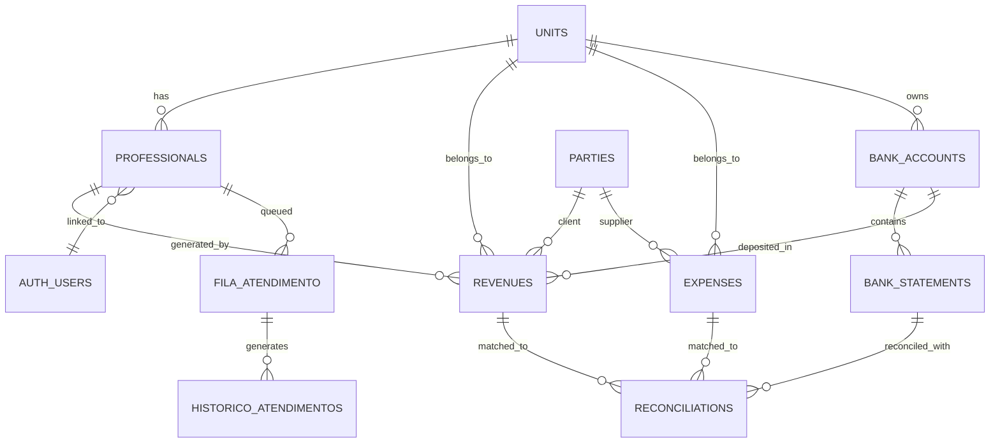

# 🗄️ DATABASE SCHEMA

> **PostgreSQL + Supabase | Row Level Security + Views + Functions + Triggers**

---

## 🎯 Visão Geral

O **BARBER-ANALYTICS-PRO** utiliza **PostgreSQL 17** via **Supabase** com arquitetura robusta incluindo:

- 🔐 **Row Level Security (RLS)** para isolamento multi-tenant
- 📊 **Views Otimizadas** para relatórios complexos
- ⚡ **Functions & Triggers** para automação
- 🔍 **Índices Estratégicos** para performance
- ✅ **Constraints** para integridade de dados

---

## 📊 Diagrama de Relacionamentos



---

## 🏗️ Core Tables

### **units** (Unidades)
> Representa cada barbearia da rede

```sql
CREATE TABLE units (
    id UUID PRIMARY KEY DEFAULT gen_random_uuid(),
    name TEXT NOT NULL,
    status BOOLEAN DEFAULT TRUE,
    created_at TIMESTAMP DEFAULT NOW(),
    updated_at TIMESTAMP DEFAULT NOW(),
    user_id UUID REFERENCES auth.users(id)
);

-- RLS Policy
CREATE POLICY "users_can_manage_own_units" ON units
    FOR ALL USING (user_id = auth.uid());

-- Triggers
CREATE TRIGGER trigger_update_units 
    BEFORE UPDATE ON units 
    FOR EACH ROW EXECUTE FUNCTION update_timestamp();
```

### **professionals** (Profissionais)
> Barbeiros, gerentes e administradores

```sql
CREATE TYPE user_role AS ENUM ('admin', 'gerente', 'barbeiro');

CREATE TABLE professionals (
    id UUID PRIMARY KEY DEFAULT gen_random_uuid(),
    name TEXT NOT NULL,
    commission_rate NUMERIC(5,2) DEFAULT 0.0,
    is_active BOOLEAN DEFAULT TRUE,
    unit_id UUID REFERENCES units(id) ON DELETE CASCADE,
    user_id UUID REFERENCES auth.users(id),
    role user_role DEFAULT 'barbeiro',
    created_at TIMESTAMP DEFAULT NOW(),
    updated_at TIMESTAMP DEFAULT NOW()
);

-- RLS Policies
CREATE POLICY "professionals_unit_access" ON professionals
    FOR SELECT USING (
        unit_id IN (
            SELECT unit_id FROM professionals 
            WHERE user_id = auth.uid()
        ) OR get_user_role() = 'admin'
    );

-- Índices
CREATE INDEX idx_professionals_unit_id ON professionals(unit_id);
CREATE INDEX idx_professionals_user_id ON professionals(user_id);
```

---

## 💰 Financial Tables

### **revenues** (Receitas)
> Receitas com contabilidade por competência

```sql
CREATE TYPE income_type AS ENUM (
    'service', 'product', 'subscription', 'commission', 'other'
);

CREATE TYPE transaction_status AS ENUM (
    'Pending', 'Received', 'Overdue', 'Cancelled'
);

CREATE TABLE revenues (
    id UUID PRIMARY KEY DEFAULT gen_random_uuid(),
    unit_id UUID REFERENCES units(id) ON DELETE CASCADE,
    professional_id UUID REFERENCES professionals(id) ON DELETE SET NULL,
    type income_type NOT NULL,
    source TEXT,
    value NUMERIC(12,2) NOT NULL,
    date DATE DEFAULT CURRENT_DATE NOT NULL,
    
    -- Contabilidade por Competência
    accrual_start_date DATE,
    accrual_end_date DATE,
    expected_receipt_date DATE,
    actual_receipt_date DATE,
    
    -- Valores Bruto/Líquido
    gross_amount NUMERIC(15,2),
    fees NUMERIC(15,2) DEFAULT 0,
    net_amount NUMERIC(15,2),
    
    -- Relacionamentos
    party_id UUID REFERENCES parties(id) ON DELETE SET NULL,
    account_id UUID REFERENCES bank_accounts(id) ON DELETE SET NULL,
    
    -- Status Automático (via Trigger)
    status transaction_status DEFAULT 'Pending',
    
    -- Metadados
    observations TEXT,
    created_at TIMESTAMP DEFAULT NOW(),
    user_id UUID REFERENCES auth.users(id),
    
    -- Constraints
    CONSTRAINT revenues_net_amount_positive CHECK (net_amount > 0),
    CONSTRAINT revenues_accrual_dates CHECK (accrual_end_date >= accrual_start_date),
    CONSTRAINT revenues_fees_non_negative CHECK (fees >= 0),
    CONSTRAINT revenues_gross_amount_positive CHECK (gross_amount > 0)
);

-- RLS Policy
CREATE POLICY "revenues_unit_access" ON revenues
    FOR ALL USING (
        unit_id IN (
            SELECT unit_id FROM professionals WHERE user_id = auth.uid()
        )
    );

-- Triggers
CREATE TRIGGER trigger_calculate_revenue_status
    BEFORE INSERT OR UPDATE ON revenues
    FOR EACH ROW EXECUTE FUNCTION calculate_revenue_status();

CREATE TRIGGER trigger_revenues_summary
    AFTER INSERT OR UPDATE OR DELETE ON revenues
    FOR EACH ROW EXECUTE FUNCTION update_monthly_summary();

-- Índices Estratégicos
CREATE INDEX idx_revenues_unit_id ON revenues(unit_id);
CREATE INDEX idx_revenues_status ON revenues(status);
CREATE INDEX idx_revenues_accrual_start_date ON revenues(accrual_start_date);
CREATE INDEX idx_revenues_expected_receipt_date ON revenues(expected_receipt_date);
CREATE INDEX idx_revenues_actual_receipt_date ON revenues(actual_receipt_date);
CREATE INDEX idx_revenues_unit_accrual ON revenues(unit_id, accrual_start_date);
CREATE INDEX idx_revenues_status_pending ON revenues(unit_id, status) 
    WHERE status IN ('Pending', 'Overdue');
```

### **expenses** (Despesas)
> Despesas com contabilidade por competência

```sql
CREATE TYPE expense_type AS ENUM (
    'salary', 'rent', 'utilities', 'supplies', 'marketing', 
    'equipment', 'maintenance', 'insurance', 'taxes', 'other'
);

CREATE TABLE expenses (
    id UUID PRIMARY KEY DEFAULT gen_random_uuid(),
    unit_id UUID REFERENCES units(id) ON DELETE CASCADE,
    type expense_type NOT NULL,
    description TEXT NOT NULL,
    value NUMERIC(12,2) NOT NULL,
    date DATE DEFAULT CURRENT_DATE NOT NULL,
    
    -- Contabilidade por Competência
    accrual_start_date DATE,
    accrual_end_date DATE,
    expected_payment_date DATE,
    actual_payment_date DATE,
    
    -- Relacionamentos
    party_id UUID REFERENCES parties(id) ON DELETE SET NULL,
    
    -- Status Automático
    status transaction_status DEFAULT 'Pending',
    
    -- Metadados
    observations TEXT,
    created_at TIMESTAMP DEFAULT NOW(),
    user_id UUID REFERENCES auth.users(id),
    
    -- Constraints
    CONSTRAINT expenses_value_positive CHECK (value > 0),
    CONSTRAINT expenses_accrual_dates CHECK (accrual_end_date >= accrual_start_date)
);

-- Trigger para Status Automático
CREATE TRIGGER trigger_calculate_expense_status
    BEFORE INSERT OR UPDATE ON expenses
    FOR EACH ROW EXECUTE FUNCTION calculate_expense_status();

-- Índices
CREATE INDEX idx_expenses_unit_id ON expenses(unit_id);
CREATE INDEX idx_expenses_status ON expenses(status);
CREATE INDEX idx_expenses_expected_payment_date ON expenses(expected_payment_date);
CREATE INDEX idx_expenses_unit_accrual ON expenses(unit_id, accrual_start_date);
```

---

## 🏦 Banking Tables

### **bank_accounts** (Contas Bancárias)
```sql
CREATE TABLE bank_accounts (
    id UUID PRIMARY KEY DEFAULT gen_random_uuid(),
    unit_id UUID REFERENCES units(id) ON DELETE CASCADE,
    bank_name VARCHAR(100) NOT NULL,
    account_type VARCHAR(50) NOT NULL, -- 'checking', 'savings', 'business'
    account_number VARCHAR(20) NOT NULL,
    agency VARCHAR(10),
    balance NUMERIC(15,2) DEFAULT 0,
    is_active BOOLEAN DEFAULT TRUE,
    created_at TIMESTAMP DEFAULT NOW(),
    updated_at TIMESTAMP DEFAULT NOW(),
    
    CONSTRAINT bank_accounts_balance_can_be_negative CHECK (balance >= -999999999)
);

-- Trigger
CREATE TRIGGER trigger_update_bank_accounts_updated_at
    BEFORE UPDATE ON bank_accounts
    FOR EACH ROW EXECUTE FUNCTION update_bank_accounts_updated_at();

-- Índices
CREATE INDEX idx_bank_accounts_unit_id ON bank_accounts(unit_id);
CREATE INDEX idx_bank_accounts_is_active ON bank_accounts(is_active);
```

### **bank_statements** (Extratos Bancários)
```sql
CREATE TYPE statement_type AS ENUM ('credit', 'debit');

CREATE TABLE bank_statements (
    id UUID PRIMARY KEY DEFAULT gen_random_uuid(),
    bank_account_id UUID REFERENCES bank_accounts(id) ON DELETE CASCADE,
    transaction_date DATE NOT NULL,
    description TEXT NOT NULL,
    amount NUMERIC(15,2) NOT NULL,
    type statement_type NOT NULL,
    balance_after NUMERIC(15,2),
    reconciled BOOLEAN DEFAULT FALSE,
    hash_unique VARCHAR(32) UNIQUE, -- Para evitar duplicatas
    created_at TIMESTAMP DEFAULT NOW(),
    
    CONSTRAINT bank_statements_amount_not_zero CHECK (amount != 0)
);

-- Trigger para Hash Único
CREATE TRIGGER trigger_set_statement_hash
    BEFORE INSERT ON bank_statements
    FOR EACH ROW EXECUTE FUNCTION set_statement_hash();

-- Índices Otimizados
CREATE INDEX idx_bank_statements_account_id ON bank_statements(bank_account_id);
CREATE INDEX idx_bank_statements_transaction_date ON bank_statements(transaction_date);
CREATE INDEX idx_bank_statements_reconciled ON bank_statements(reconciled);
CREATE INDEX idx_bank_statements_account_date ON bank_statements(bank_account_id, transaction_date);
CREATE INDEX idx_bank_statements_not_reconciled ON bank_statements(bank_account_id, reconciled) 
    WHERE reconciled = FALSE;
```

### **reconciliations** (Conciliações)
```sql
CREATE TYPE reconciliation_status AS ENUM ('Pending', 'Reconciled', 'Divergent');
CREATE TYPE reference_type AS ENUM ('Revenue', 'Expense');

CREATE TABLE reconciliations (
    id UUID PRIMARY KEY DEFAULT gen_random_uuid(),
    bank_statement_id UUID REFERENCES bank_statements(id) ON DELETE CASCADE,
    reference_type reference_type NOT NULL,
    reference_id UUID NOT NULL, -- ID da revenue ou expense
    reconciliation_date DATE DEFAULT CURRENT_DATE NOT NULL,
    status reconciliation_status DEFAULT 'Pending' NOT NULL,
    difference NUMERIC(15,2) DEFAULT 0,
    notes TEXT,
    reconciled_by UUID REFERENCES auth.users(id) NOT NULL,
    created_at TIMESTAMP DEFAULT NOW(),
    updated_at TIMESTAMP DEFAULT NOW(),
    
    CONSTRAINT reconciliations_difference_check CHECK (difference >= 0),
    CONSTRAINT reconciliations_unique_statement UNIQUE (bank_statement_id, reference_type, reference_id)
);

-- Trigger para Atualizar Bank Statement
CREATE TRIGGER trigger_update_bank_statement_reconciliation
    AFTER INSERT OR UPDATE OR DELETE ON reconciliations
    FOR EACH ROW EXECUTE FUNCTION update_bank_statement_reconciliation();

-- Índices
CREATE INDEX idx_reconciliations_statement_id ON reconciliations(bank_statement_id);
CREATE INDEX idx_reconciliations_reference ON reconciliations(reference_type, reference_id);
CREATE INDEX idx_reconciliations_status ON reconciliations(status);
```

---

## 👥 Third Parties

### **parties** (Terceiros - Clientes/Fornecedores)
```sql
CREATE TYPE party_type AS ENUM ('pessoa_fisica', 'pessoa_juridica');

CREATE TABLE parties (
    id UUID PRIMARY KEY DEFAULT gen_random_uuid(),
    unit_id UUID REFERENCES units(id) ON DELETE CASCADE,
    nome VARCHAR(255) NOT NULL,
    tipo party_type NOT NULL,
    cpf_cnpj VARCHAR(18) UNIQUE,
    telefone VARCHAR(20),
    email VARCHAR(255),
    endereco TEXT,
    observacoes TEXT,
    is_active BOOLEAN DEFAULT TRUE,
    created_at TIMESTAMP DEFAULT NOW(),
    updated_at TIMESTAMP DEFAULT NOW(),
    
    CONSTRAINT parties_nome_not_empty CHECK (TRIM(nome) != '')
);

-- Índices
CREATE INDEX idx_parties_unit_id ON parties(unit_id);
CREATE INDEX idx_parties_tipo ON parties(tipo);
CREATE INDEX idx_parties_nome ON parties(nome);
CREATE INDEX idx_parties_unit_tipo ON parties(unit_id, tipo) WHERE is_active = TRUE;
```

---

## 💳 Payment Methods

### **payment_methods** (Formas de Pagamento)
```sql
CREATE TABLE payment_methods (
    id UUID PRIMARY KEY DEFAULT gen_random_uuid(),
    unit_id UUID REFERENCES units(id) ON DELETE CASCADE,
    name VARCHAR(100) NOT NULL,
    fee_percentage NUMERIC(5,2) DEFAULT 0.00 NOT NULL,
    receipt_days INTEGER DEFAULT 0 NOT NULL,
    is_active BOOLEAN DEFAULT TRUE NOT NULL,
    created_at TIMESTAMP DEFAULT NOW() NOT NULL,
    updated_at TIMESTAMP DEFAULT NOW() NOT NULL,
    created_by UUID REFERENCES auth.users(id) ON DELETE SET NULL,
    
    CONSTRAINT payment_methods_fee_percentage_range 
        CHECK (fee_percentage >= 0 AND fee_percentage <= 100),
    CONSTRAINT payment_methods_name_not_empty 
        CHECK (TRIM(name) != ''),
    CONSTRAINT payment_methods_receipt_days_non_negative 
        CHECK (receipt_days >= 0)
);

-- RLS Policy (Apenas Admins)
CREATE POLICY "payment_methods_admin_only" ON payment_methods
    FOR ALL USING (get_user_role() = 'admin');

-- Trigger
CREATE TRIGGER trigger_update_payment_methods_updated_at
    BEFORE UPDATE ON payment_methods
    FOR EACH ROW EXECUTE FUNCTION update_payment_methods_updated_at();

-- Índices
CREATE INDEX idx_payment_methods_unit_id ON payment_methods(unit_id);
CREATE INDEX idx_payment_methods_is_active ON payment_methods(is_active) WHERE is_active = TRUE;
```

---

## 🎯 Queue System

### **fila_atendimento** (Fila de Atendimento)
```sql
CREATE TYPE queue_status AS ENUM ('active', 'paused', 'attending');

CREATE TABLE fila_atendimento (
    id UUID PRIMARY KEY DEFAULT gen_random_uuid(),
    barbeiro_id UUID REFERENCES professionals(id) ON DELETE CASCADE,
    unidade_id UUID REFERENCES units(id) ON DELETE CASCADE,
    total_atendimentos INTEGER DEFAULT 0,
    status queue_status DEFAULT 'active',
    data_atual DATE DEFAULT CURRENT_DATE,
    ultima_atualizacao TIMESTAMP DEFAULT NOW(),
    created_at TIMESTAMP DEFAULT NOW(),
    updated_at TIMESTAMP DEFAULT NOW(),
    user_id UUID REFERENCES auth.users(id),
    
    CONSTRAINT fila_atendimento_barbeiro_id_unidade_id_data_atual_key 
        UNIQUE (barbeiro_id, unidade_id, data_atual)
);

-- Triggers
CREATE TRIGGER trigger_atualizar_timestamp_fila
    BEFORE UPDATE ON fila_atendimento
    FOR EACH ROW EXECUTE FUNCTION atualizar_timestamp_fila();

-- Índices Otimizados
CREATE INDEX idx_fila_atendimento_unidade_status 
    ON fila_atendimento(unidade_id, status, total_atendimentos, ultima_atualizacao);
CREATE INDEX idx_fila_atendimento_barbeiro_data ON fila_atendimento(barbeiro_id, data_atual);
CREATE INDEX idx_fila_atendimento_data_status ON fila_atendimento(data_atual, status);
```

### **historico_atendimentos** (Histórico)
```sql
CREATE TABLE historico_atendimentos (
    id UUID PRIMARY KEY DEFAULT gen_random_uuid(),
    barbeiro_id UUID REFERENCES professionals(id) ON DELETE CASCADE,
    unidade_id UUID REFERENCES units(id) ON DELETE CASCADE,
    data_atendimento DATE DEFAULT CURRENT_DATE,
    hora_inicio TIMESTAMP,
    hora_fim TIMESTAMP,
    duracao_minutos INTEGER GENERATED ALWAYS AS (
        EXTRACT(EPOCH FROM (hora_fim - hora_inicio)) / 60
    ) STORED,
    valor_servico NUMERIC(10,2),
    tipo_servico TEXT,
    status VARCHAR(20) DEFAULT 'em_andamento',
    observacoes TEXT,
    created_at TIMESTAMP DEFAULT NOW(),
    updated_at TIMESTAMP DEFAULT NOW(),
    user_id UUID REFERENCES auth.users(id)
);

-- Trigger para Atualizar Contador
CREATE TRIGGER trigger_atualizar_contador_atendimentos
    AFTER INSERT OR UPDATE ON historico_atendimentos
    FOR EACH ROW EXECUTE FUNCTION atualizar_contador_atendimentos();

-- Índices
CREATE INDEX idx_historico_atendimentos_barbeiro_data 
    ON historico_atendimentos(barbeiro_id, data_atendimento);
CREATE INDEX idx_historico_atendimentos_unidade_data 
    ON historico_atendimentos(unidade_id, data_atendimento);
```

---

## 📊 Reporting Views

### **vw_monthly_dre** (DRE Mensal)
```sql
CREATE VIEW vw_monthly_dre AS
WITH revenues AS (
    SELECT 
        date_trunc('month', revenue_dt) AS month,
        SUM(amount) AS total_revenues
    FROM vw_revenues_detailed
    GROUP BY date_trunc('month', revenue_dt)
),
expenses AS (
    SELECT 
        date_trunc('month', expense_dt) AS month,
        SUM(amount) AS total_expenses
    FROM vw_expenses_detailed
    GROUP BY date_trunc('month', expense_dt)
)
SELECT 
    COALESCE(r.month, e.month) AS month,
    COALESCE(r.total_revenues, 0) AS total_revenues,
    COALESCE(e.total_expenses, 0) AS total_expenses,
    COALESCE(r.total_revenues, 0) - COALESCE(e.total_expenses, 0) AS net_profit,
    CASE 
        WHEN COALESCE(r.total_revenues, 0) > 0 
        THEN (COALESCE(r.total_revenues, 0) - COALESCE(e.total_expenses, 0)) / COALESCE(r.total_revenues, 0)
        ELSE NULL 
    END AS profit_margin
FROM revenues r
FULL JOIN expenses e ON r.month = e.month
ORDER BY month DESC;
```

### **vw_cashflow_entries** (Fluxo de Caixa)
```sql
CREATE VIEW vw_cashflow_entries AS
WITH daily_transactions AS (
    -- Receitas Efetivas
    SELECT 
        actual_receipt_date AS transaction_date,
        unit_id,
        account_id,
        COALESCE(net_amount, value) AS amount,
        'inflow' AS type
    FROM revenues
    WHERE actual_receipt_date IS NOT NULL 
      AND status = 'Received'
    
    UNION ALL
    
    -- Despesas Efetivas
    SELECT 
        actual_payment_date AS transaction_date,
        unit_id,
        NULL AS account_id,
        value AS amount,
        'outflow' AS type
    FROM expenses
    WHERE actual_payment_date IS NOT NULL 
      AND status = 'Paid'
),
daily_aggregated AS (
    SELECT 
        transaction_date,
        unit_id,
        account_id,
        SUM(CASE WHEN type = 'inflow' THEN amount ELSE 0 END) AS inflows,
        SUM(CASE WHEN type = 'outflow' THEN amount ELSE 0 END) AS outflows,
        SUM(CASE WHEN type = 'inflow' THEN amount ELSE -amount END) AS daily_balance
    FROM daily_transactions
    GROUP BY transaction_date, unit_id, account_id
)
SELECT 
    transaction_date,
    unit_id,
    account_id,
    inflows,
    outflows,
    daily_balance,
    SUM(daily_balance) OVER (
        PARTITION BY unit_id, account_id 
        ORDER BY transaction_date 
        ROWS BETWEEN UNBOUNDED PRECEDING AND CURRENT ROW
    ) AS accumulated_balance
FROM daily_aggregated
ORDER BY transaction_date, unit_id, account_id;
```

### **vw_calendar_events** (Calendário Financeiro)
```sql
CREATE VIEW vw_calendar_events AS
-- Recebimentos Esperados
SELECT 
    r.id,
    'Receive' AS tipo,
    CASE 
        WHEN r.status = 'Overdue' THEN 'Overdue'
        ELSE 'Expected'
    END AS status,
    r.expected_receipt_date AS event_date,
    COALESCE(p.nome, r.source, 'Revenue') AS title,
    COALESCE(r.net_amount, r.value) AS amount,
    r.unit_id,
    r.account_id,
    r.party_id,
    'Revenue' AS ref_type,
    r.id AS ref_id,
    r.status::TEXT AS transaction_status,
    r.type::TEXT AS category
FROM revenues r
LEFT JOIN parties p ON p.id = r.party_id
WHERE r.actual_receipt_date IS NULL 
  AND r.status NOT IN ('Cancelled', 'Received')

UNION ALL

-- Recebimentos Efetivos
SELECT 
    r.id,
    'Receive' AS tipo,
    'Effective' AS status,
    r.actual_receipt_date AS event_date,
    COALESCE(p.nome, r.source, 'Revenue') AS title,
    COALESCE(r.net_amount, r.value) AS amount,
    r.unit_id,
    r.account_id,
    r.party_id,
    'Revenue' AS ref_type,
    r.id AS ref_id,
    r.status::TEXT AS transaction_status,
    r.type::TEXT AS category
FROM revenues r
LEFT JOIN parties p ON p.id = r.party_id
WHERE r.actual_receipt_date IS NOT NULL 
  AND r.status = 'Received'

UNION ALL

-- Pagamentos Esperados/Efetivos (similar para expenses)
SELECT 
    e.id,
    'Pay' AS tipo,
    CASE 
        WHEN e.status = 'Overdue' THEN 'Overdue'
        WHEN e.actual_payment_date IS NOT NULL THEN 'Effective'
        ELSE 'Expected'
    END AS status,
    COALESCE(e.actual_payment_date, e.expected_payment_date) AS event_date,
    COALESCE(p.nome, e.description, 'Expense') AS title,
    e.value AS amount,
    e.unit_id,
    NULL AS account_id,
    e.party_id,
    'Expense' AS ref_type,
    e.id AS ref_id,
    e.status::TEXT AS transaction_status,
    e.type::TEXT AS category
FROM expenses e
LEFT JOIN parties p ON p.id = e.party_id
WHERE (e.actual_payment_date IS NULL AND e.status NOT IN ('Cancelled', 'Paid'))
   OR (e.actual_payment_date IS NOT NULL AND e.status = 'Paid')

ORDER BY event_date DESC;
```

---

## ⚡ Functions & Triggers

### **Status Calculation Functions**

#### **calculate_revenue_status()**
```sql
CREATE OR REPLACE FUNCTION calculate_revenue_status()
RETURNS TRIGGER AS $$
BEGIN
    -- Se tem data de recebimento efetivo, está Received
    IF NEW.actual_receipt_date IS NOT NULL THEN
        NEW.status := 'Received';
    
    -- Se está Pending e passou da data prevista, marca como Overdue
    ELSIF NEW.status = 'Pending' AND NEW.expected_receipt_date < CURRENT_DATE THEN
        NEW.status := 'Overdue';
    
    -- Se não tem status, define como Pending
    ELSIF NEW.status IS NULL THEN
        NEW.status := 'Pending';
    END IF;
    
    RETURN NEW;
END;
$$ LANGUAGE plpgsql;
```

#### **calculate_expense_status()**
```sql
CREATE OR REPLACE FUNCTION calculate_expense_status()
RETURNS TRIGGER AS $$
BEGIN
    -- Se tem data de pagamento efetivo, está Paid
    IF NEW.actual_payment_date IS NOT NULL THEN
        NEW.status := 'Paid';
    
    -- Se está Pending e passou da data prevista, marca como Overdue
    ELSIF NEW.status = 'Pending' AND NEW.expected_payment_date < CURRENT_DATE THEN
        NEW.status := 'Overdue';
    
    -- Se não tem status, define como Pending
    ELSIF NEW.status IS NULL THEN
        NEW.status := 'Pending';
    END IF;
    
    RETURN NEW;
END;
$$ LANGUAGE plpgsql;
```

### **User Functions**

#### **get_user_role()**
```sql
CREATE OR REPLACE FUNCTION get_user_role()
RETURNS user_role
LANGUAGE SQL STABLE SECURITY DEFINER AS $$
    SELECT COALESCE(
        (SELECT role FROM professionals WHERE user_id = auth.uid()),
        'barbeiro'::user_role
    );
$$;
```

#### **get_user_unit_id()**
```sql
CREATE OR REPLACE FUNCTION get_user_unit_id()
RETURNS UUID
LANGUAGE SQL STABLE SECURITY DEFINER AS $$
    SELECT unit_id FROM professionals WHERE user_id = auth.uid();
$$;
```

### **Queue Management Functions**

#### **get_fila_ordenada()**
```sql
CREATE OR REPLACE FUNCTION get_fila_ordenada(p_unidade_id UUID)
RETURNS TABLE(
    barbeiro_id UUID,
    barbeiro_nome TEXT,
    posicao INTEGER,
    total_atendimentos INTEGER,
    status queue_status,
    ultima_atualizacao TIMESTAMP,
    tempo_desde_ultimo TEXT
)
LANGUAGE plpgsql AS $$
BEGIN
    RETURN QUERY
    SELECT 
        f.barbeiro_id,
        p.name::TEXT AS barbeiro_nome,
        ROW_NUMBER() OVER (
            ORDER BY 
                CASE f.status 
                    WHEN 'attending' THEN 0  -- Em atendimento fica no topo
                    WHEN 'active' THEN 1     -- Disponíveis ordenados por critério
                    WHEN 'paused' THEN 2     -- Pausados por último
                END,
                f.total_atendimentos ASC,    -- Menos atendimentos primeiro
                f.ultima_atualizacao ASC     -- Em caso de empate, quem entrou há mais tempo
        )::INTEGER AS posicao,
        f.total_atendimentos,
        f.status,
        f.ultima_atualizacao,
        -- Calcular tempo desde a última atualização
        CASE 
            WHEN f.ultima_atualizacao > NOW() - INTERVAL '1 minute' THEN 'Agora mesmo'
            WHEN f.ultima_atualizacao > NOW() - INTERVAL '1 hour' THEN 
                EXTRACT(EPOCH FROM (NOW() - f.ultima_atualizacao))::INTEGER / 60 || ' min'
            ELSE 
                EXTRACT(EPOCH FROM (NOW() - f.ultima_atualizacao))::INTEGER / 3600 || ' h'
        END::TEXT AS tempo_desde_ultimo
    FROM fila_atendimento f
    JOIN professionals p ON f.barbeiro_id = p.id
    WHERE f.unidade_id = p_unidade_id 
        AND f.data_atual = CURRENT_DATE
        AND p.is_active = TRUE
        AND p.role = 'barbeiro'
    ORDER BY posicao;
END;
$$;
```

---

## 🔐 Row Level Security (RLS)

### **Políticas Principais**

#### **Unit Isolation** (Isolamento por Unidade)
```sql
-- Aplicada em todas as tabelas principais
CREATE POLICY "unit_isolation" ON [table_name]
    FOR ALL USING (
        unit_id IN (
            SELECT unit_id 
            FROM professionals 
            WHERE user_id = auth.uid()
        )
    );
```

#### **Admin Override** (Acesso Total para Admins)
```sql
CREATE POLICY "admin_full_access" ON [table_name]
    FOR ALL USING (get_user_role() = 'admin');
```

#### **Role-Based Access** (Acesso por Perfil)
```sql
-- Exemplo: Payment Methods apenas para Admins
CREATE POLICY "payment_methods_admin_only" ON payment_methods
    FOR ALL USING (get_user_role() = 'admin');

-- Exemplo: Relatórios para Gerentes e Admins
CREATE POLICY "reports_managers_and_admins" ON reports
    FOR SELECT USING (get_user_role() IN ('admin', 'gerente'));
```

---

## 📈 Performance Optimization

### **Índices Estratégicos**

#### **Consultas Frequentes**
```sql
-- Dashboard Queries
CREATE INDEX idx_revenues_dashboard ON revenues(unit_id, date, status) 
    WHERE is_active = TRUE;

CREATE INDEX idx_expenses_dashboard ON expenses(unit_id, date, status);

-- Relatórios Mensais
CREATE INDEX idx_revenues_monthly ON revenues(unit_id, accrual_start_date);
CREATE INDEX idx_expenses_monthly ON expenses(unit_id, accrual_start_date);

-- Calendário Financeiro
CREATE INDEX idx_revenues_calendar ON revenues(unit_id, expected_receipt_date) 
    WHERE status IN ('Pending', 'Overdue');
CREATE INDEX idx_expenses_calendar ON expenses(unit_id, expected_payment_date) 
    WHERE status IN ('Pending', 'Overdue');
```

#### **Conciliação Bancária**
```sql
-- Auto-matching Algorithm
CREATE INDEX idx_bank_statements_matching ON bank_statements(
    bank_account_id, transaction_date, amount
) WHERE reconciled = FALSE;

-- Reconciliation Status
CREATE INDEX idx_reconciliations_pending ON reconciliations(status, created_at) 
    WHERE status = 'Pending';
```

### **Partitioning Strategy**
```sql
-- Para grandes volumes de dados históricos
CREATE TABLE revenues_2024 PARTITION OF revenues
    FOR VALUES FROM ('2024-01-01') TO ('2025-01-01');

CREATE TABLE revenues_2025 PARTITION OF revenues
    FOR VALUES FROM ('2025-01-01') TO ('2026-01-01');

-- Índices automáticos em partições
CREATE INDEX idx_revenues_2024_unit_date ON revenues_2024(unit_id, date);
CREATE INDEX idx_revenues_2025_unit_date ON revenues_2025(unit_id, date);
```

---

## 🧪 Database Testing

### **Data Integrity Tests**
```sql
-- Test: Revenue Status Consistency
SELECT 'FAIL: Status inconsistency' AS test_result
FROM revenues 
WHERE (actual_receipt_date IS NOT NULL AND status != 'Received')
   OR (actual_receipt_date IS NULL AND expected_receipt_date < CURRENT_DATE AND status = 'Pending')
HAVING COUNT(*) > 0

UNION ALL

SELECT 'PASS: Revenue status consistent' AS test_result
WHERE NOT EXISTS (
    SELECT 1 FROM revenues 
    WHERE (actual_receipt_date IS NOT NULL AND status != 'Received')
       OR (actual_receipt_date IS NULL AND expected_receipt_date < CURRENT_DATE AND status = 'Pending')
);

-- Test: RLS Isolation
DO $$
DECLARE
    test_user_id UUID;
    test_count INTEGER;
BEGIN
    -- Criar usuário de teste
    INSERT INTO auth.users (id, email) VALUES (gen_random_uuid(), 'test@example.com')
    RETURNING id INTO test_user_id;
    
    -- Simular contexto do usuário
    PERFORM set_config('request.jwt.claims', json_build_object('sub', test_user_id)::text, true);
    
    -- Testar isolamento
    SELECT COUNT(*) INTO test_count FROM revenues;
    
    IF test_count > 0 THEN
        RAISE EXCEPTION 'RLS FAIL: User can see other unit data';
    ELSE
        RAISE NOTICE 'RLS PASS: Proper isolation';
    END IF;
    
    -- Cleanup
    DELETE FROM auth.users WHERE id = test_user_id;
END;
$$;
```

### **Performance Tests**
```sql
-- Test: Query Performance
EXPLAIN (ANALYZE, BUFFERS, FORMAT TEXT)
SELECT 
    month,
    total_revenues,
    total_expenses,
    net_profit
FROM vw_monthly_dre
WHERE month >= '2024-01-01'
ORDER BY month DESC
LIMIT 12;

-- Test: Index Usage
SELECT 
    schemaname,
    tablename,
    indexname,
    idx_scan,
    idx_tup_read,
    idx_tup_fetch
FROM pg_stat_user_indexes
WHERE tablename IN ('revenues', 'expenses', 'bank_statements')
ORDER BY idx_scan DESC;
```

---

## 🚀 Migration Scripts

### **Version Upgrade Template**
```sql
-- Migration: v1.2.0 -> v1.3.0
-- Add: Payment Methods Support

BEGIN;

-- 1. Create new table
CREATE TABLE payment_methods (
    -- [table definition]
);

-- 2. Add new columns
ALTER TABLE revenues 
ADD COLUMN payment_method_id UUID REFERENCES payment_methods(id);

-- 3. Migrate existing data
UPDATE revenues 
SET payment_method_id = (
    SELECT id FROM payment_methods 
    WHERE name = 'Dinheiro' 
    LIMIT 1
)
WHERE payment_method_id IS NULL;

-- 4. Add constraints
ALTER TABLE revenues 
ADD CONSTRAINT revenues_payment_method_required 
CHECK (payment_method_id IS NOT NULL);

-- 5. Create indexes
CREATE INDEX idx_revenues_payment_method ON revenues(payment_method_id);

-- 6. Update RLS policies
CREATE POLICY "payment_methods_unit_access" ON payment_methods
    FOR ALL USING (unit_id IN (SELECT unit_id FROM professionals WHERE user_id = auth.uid()));

-- 7. Grant permissions
GRANT SELECT ON payment_methods TO authenticated;

-- 8. Update version
INSERT INTO schema_migrations (version, applied_at) VALUES ('1.3.0', NOW());

COMMIT;
```

---

## 📊 Monitoring & Maintenance

### **Health Check Queries**
```sql
-- Database Size
SELECT 
    pg_size_pretty(pg_database_size(current_database())) AS database_size;

-- Table Statistics
SELECT 
    schemaname,
    tablename,
    n_tup_ins AS inserts,
    n_tup_upd AS updates,
    n_tup_del AS deletes,
    n_live_tup AS live_rows,
    n_dead_tup AS dead_rows
FROM pg_stat_user_tables
ORDER BY n_live_tup DESC;

-- Index Usage
SELECT 
    i.tablename,
    i.indexname,
    i.idx_scan AS scans,
    pg_size_pretty(pg_relation_size(i.indexrelid)) AS size
FROM pg_stat_user_indexes i
JOIN pg_stat_user_tables t ON i.tablename = t.tablename
WHERE i.idx_scan < 100 AND pg_relation_size(i.indexrelid) > 1000000
ORDER BY pg_relation_size(i.indexrelid) DESC;
```

### **Cleanup Procedures**
```sql
-- Monthly Cleanup Procedure
CREATE OR REPLACE FUNCTION monthly_cleanup()
RETURNS void AS $$
BEGIN
    -- Limpar logs antigos (> 6 meses)
    DELETE FROM access_logs 
    WHERE created_at < NOW() - INTERVAL '6 months';
    
    -- Arquivar dados antigos
    INSERT INTO historical_data 
    SELECT * FROM bank_statements 
    WHERE transaction_date < NOW() - INTERVAL '2 years'
      AND reconciled = TRUE;
    
    DELETE FROM bank_statements 
    WHERE transaction_date < NOW() - INTERVAL '2 years'
      AND reconciled = TRUE;
    
    -- Vacuum e Analyze
    VACUUM ANALYZE;
    
    RAISE NOTICE 'Monthly cleanup completed at %', NOW();
END;
$$ LANGUAGE plpgsql;

-- Agendar via pg_cron (se disponível)
SELECT cron.schedule('monthly-cleanup', '0 2 1 * *', 'SELECT monthly_cleanup();');
```

---

**🔗 Links Relacionados:**
- [Architecture Overview](./ARCHITECTURE.md)
- [Financial Module](./FINANCIAL_MODULE.md)
- [API Reference](./API_REFERENCE.md)

---

*Última atualização: 18/10/2025*