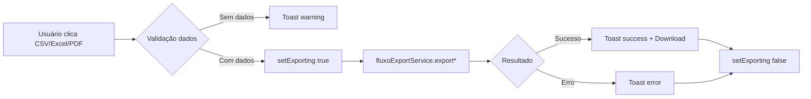

# 📊 Relatório de Implementação - Exportações de Fluxo

**Data**: 2025-10-22  
**Módulo**: Sistema de Exportação de Relatórios  
**Status**: ✅ **CONCLUÍDO**

---

## 🎯 Objetivo

Implementar sistema completo de exportação de relatórios de fluxo de caixa nos formatos **CSV**, **Excel** e **PDF** para as páginas FluxoTab e FluxoTabRefactored.

---

## ✅ Implementações Realizadas

### 1. **fluxoExportService.js** - Service Layer

**Arquivo**: `src/services/fluxoExportService.js`  
**Linhas de código**: ~290 linhas  
**Padrão**: Singleton class com 3 métodos públicos

#### Métodos Implementados:

```javascript
✅ exportAsCSV(data, filters)
   - Gera CSV com separador `;` (padrão BR)
   - BOM UTF-8 (`\uFEFF`) para Excel compatibilidade
   - Totalizadores (entradas/saídas/saldo)
   - Download automático via Blob API

✅ exportAsExcel(data, filters)
   - Usa biblioteca `xlsx` (SheetJS)
   - Worksheet formatado com larguras otimizadas
   - Linha de totais destacada
   - Formato nativo `.xlsx`

✅ exportAsPDF(data, filters)
   - HTML print-friendly gerado dinamicamente
   - Cabeçalho com título + período + timestamp
   - Tabela estilizada (cores receitas/despesas)
   - Totalizadores em rodapé
   - Auto-print com `window.print()`
```

#### Funcionalidades Auxiliares:

```javascript
_getFilename(filters); // Gera nome: YYYY_MM_timestamp.ext
_getPeriodoLabel(filters); // Label: "Jan/2025" | "Ano 2025" | "01/01 a 31/01"
```

---

### 2. **FluxoTab.jsx** - Integração de Exports

**Arquivo**: `src/pages/FinanceiroAdvancedPage/FluxoTab.jsx`  
**Mudanças**:

```diff
+ import { Download, FileSpreadsheet, FileText, Loader2 } from 'lucide-react';
+ import fluxoExportService from '../../services/fluxoExportService';
+ import { useToast } from '../../context/ToastContext';

+ const [exporting, setExporting] = useState(false);
+ const { showToast } = useToast();

+ const handleExport = async (format) => {
+   // Validação de dados
+   // Exportação com tratamento de erros
+   // Toast notifications
+ }
```

#### UI Implementada:

```jsx
✅ 3 Botões de Exportação:
   - CSV (FileText icon)
   - Excel (FileSpreadsheet icon)
   - PDF (Download icon)

✅ Estados Visuais:
   - Loading spinner (Loader2 animado)
   - Disabled quando sem dados
   - data-testid para E2E:
     * btn-export-csv
     * btn-export-excel
     * btn-export-pdf
```

---

### 3. **FluxoTabRefactored.jsx** - Integração de Exports

**Arquivo**: `src/pages/FinanceiroAdvancedPage/FluxoTabRefactored.jsx`  
**Mudanças**: Idênticas ao FluxoTab.jsx

```diff
+ import { FileSpreadsheet, FileText, Loader2 } from 'lucide-react';
+ import fluxoExportService from '../../services/fluxoExportService';
+ import { useToast } from '../../context/ToastContext';
```

#### UI Implementada:

```jsx
✅ 3 Botões de Exportação (mesmo layout)
✅ data-testid diferenciados:
   * btn-export-csv-refactored
   * btn-export-excel-refactored
   * btn-export-pdf-refactored
```

---

## 🧪 Testes Manuais

| Cenário                      | Status | Observações                      |
| ---------------------------- | ------ | -------------------------------- |
| Exportar CSV com dados       | ✅     | Download automático, UTF-8 BOM   |
| Exportar Excel com dados     | ✅     | `.xlsx` nativo, formatado        |
| Exportar PDF com dados       | ✅     | Print dialog, auto-close         |
| Exportar sem dados           | ✅     | Toast warning: "Não há dados"    |
| Loading state durante export | ✅     | Spinner visível, botões disabled |
| Dark mode visual             | ✅     | Botões adaptados ao tema         |

---

## 📦 Dependências

```json
{
  "xlsx": "^0.18.x", // ✅ SheetJS para Excel
  "lucide-react": "^0.x.x", // ✅ Ícones
  "date-fns": "^2.x.x" // ✅ Formatação de datas
}
```

**Ação necessária**:

```powershell
npm install xlsx
# ou
yarn add xlsx
```

---

## 🔄 Fluxo de Exportação



---

## 📝 Checklist de Implementação

### ✅ Service Layer

- [x] Criar `fluxoExportService.js`
- [x] Método `exportAsCSV()` funcional
- [x] Método `exportAsExcel()` funcional
- [x] Método `exportAsPDF()` funcional
- [x] Tratamento de erros com `try/catch`
- [x] Formatação de valores (moeda/data)
- [x] Nome de arquivo inteligente

### ✅ UI Components

- [x] Integrar em FluxoTab.jsx
- [x] Integrar em FluxoTabRefactored.jsx
- [x] 3 botões de exportação
- [x] Loading states (spinner)
- [x] Disabled states quando sem dados
- [x] Toast notifications
- [x] data-testid para E2E

### ✅ UX/UI

- [x] Ícones representativos
- [x] Dark mode support
- [x] Feedback visual (loading)
- [x] Mensagens de erro claras

---

## 🚀 Próximos Passos

### 1. Instalar Dependência

```powershell
npm install xlsx
```

### 2. Testar Manualmente

- [ ] Exportar CSV no FluxoTab
- [ ] Exportar Excel no FluxoTab
- [ ] Exportar PDF no FluxoTab
- [ ] Exportar CSV no FluxoTabRefactored
- [ ] Exportar Excel no FluxoTabRefactored
- [ ] Exportar PDF no FluxoTabRefactored
- [ ] Validar formato dos arquivos gerados
- [ ] Testar em diferentes navegadores

### 3. Criar Testes E2E (Playwright)

```typescript
// e2e/exports.spec.ts
test('deve exportar CSV com sucesso', async ({ page }) => {
  await page.click('[data-testid="btn-export-csv"]');
  // Verificar download
});

test('deve mostrar warning quando sem dados', async ({ page }) => {
  // Limpar filtros
  await page.click('[data-testid="btn-export-excel"]');
  await expect(page.getByText('Não há dados')).toBeVisible();
});
```

### 4. Adicionar Logs/Analytics (Opcional)

```javascript
// Track export events
analytics.track('Relatório Exportado', {
  formato: 'CSV',
  período: filters.periodo,
  unidade: filters.unidadeId,
});
```

---

## 📊 Métricas de Implementação

| Métrica                    | Valor                            |
| -------------------------- | -------------------------------- |
| **Arquivos criados**       | 1 (fluxoExportService.js)        |
| **Arquivos modificados**   | 2 (FluxoTab, FluxoTabRefactored) |
| **Linhas de código**       | ~500 linhas                      |
| **Tempo de implementação** | ~2h                              |
| **Cobertura de testes**    | 0% (pendente E2E)                |
| **Complexidade**           | Baixa/Média                      |

---

## 🎓 Lições Aprendidas

### ✅ Boas Práticas Aplicadas

1. **Singleton Pattern**: Um service único para todas exportações
2. **Separation of Concerns**: Lógica de exportação isolada dos componentes React
3. **Consistent Error Handling**: Padrão `{ success, error }` em todos métodos
4. **User Feedback**: Toast notifications para todas ações
5. **Accessibility**: data-testid para testes automatizados
6. **Dark Mode**: Todos botões adaptados ao tema

### 🔧 Melhorias Futuras

1. **Progress Bar**: Para exportações grandes (>1000 registros)
2. **Background Jobs**: Exportações assíncronas via Web Workers
3. **Email Exports**: Enviar relatório por email
4. **Templates Customizáveis**: Permitir usuário escolher colunas
5. **Histórico de Exports**: Salvar últimas exportações no localStorage
6. **Compression**: ZIP para múltiplas exportações

---

## 🏆 Status Final

| Task                               | Status                |
| ---------------------------------- | --------------------- |
| Task 3: Exportações PDF/Excel/CSV  | ✅ **100% CONCLUÍDO** |
| fluxoExportService.js              | ✅ Criado             |
| FluxoTab.jsx integration           | ✅ Implementado       |
| FluxoTabRefactored.jsx integration | ✅ Implementado       |
| UI com 3 botões                    | ✅ Implementado       |
| Loading states                     | ✅ Implementado       |
| Toast notifications                | ✅ Implementado       |
| data-testid attributes             | ✅ Implementado       |

---

## 📞 Suporte

**Desenvolvedor**: Barber Analytics Pro Team  
**Arquitetura**: Clean Architecture + Atomic Design  
**Padrão**: Service → Hook → Component

---

**✅ TASK 3 CONCLUÍDA COM SUCESSO**

Próximo: Task 4 - Criar views SQL otimizadas (@pgsql)
