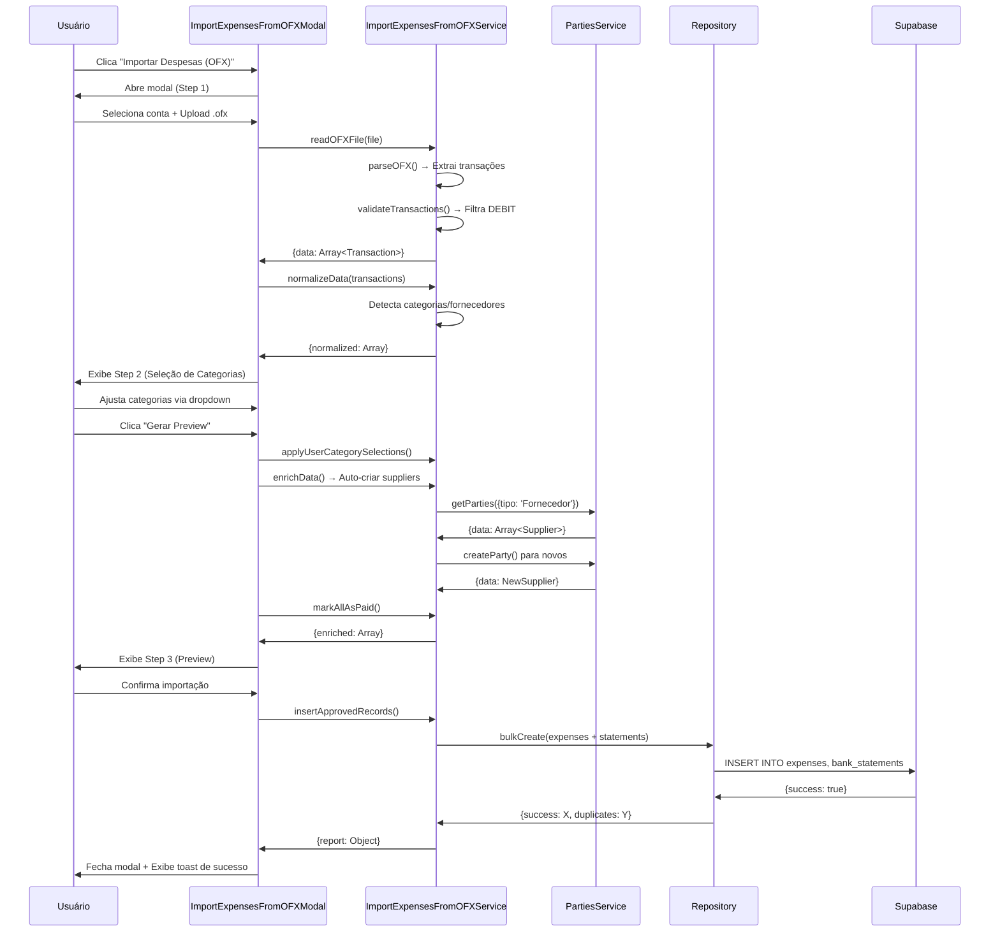

# 💰 Módulo Financeiro

> **Sistema financeiro avançado com contabilidade por competência, conciliação bancária e geração de DRE integrada.**
>
> **Criado em:** 2024-10-17
> **Atualizado em:** 2025-10-22
> **Autor:** Codex (IA)

---

## 🎯 Visão Geral

O módulo financeiro é o núcleo do Barber Analytics Pro. Ele concentra recursos de **gestão de receitas e despesas**, projeção de **fluxo de caixa**, conciliação bancária e integração direta com o módulo de **DRE**. Todo o fluxo segue princípios de Clean Architecture: UI → Services → DTOs → Repositories → Supabase.

---

## 🔑 Capacidades Principais

- ✅ **Contabilidade por Competência** — controle de `accrual_start_date`, `accrual_end_date` e datas efetivas de recebimento/pagamento.
- ✅ **Gestão de Receitas e Despesas** — DTOs rigorosos (`revenueDTO`, `expenseDTO`) com whitelists/blacklists e cálculos derivados.
- ✅ **Conciliação Bancária** — importação OFX/CSV, match automático via hashes (`hash_unique`) e reconciliação de lançamentos.
- ✅ **Fluxo de Caixa** — projeções e históricos geridos por `cashflowService` e `dashboardService`.
- ✅ **Integração com DRE** — fornece dados para `dreService` gerar demonstrativos.

---

## 🧱 Arquitetura Interna

| Camada         | Arquivos Chave                                                                   | Responsabilidade                                  |
| -------------- | -------------------------------------------------------------------------------- | ------------------------------------------------- |
| UI             | `src/pages/FinanceiroAdvancedPage/*`, componentes em `atoms/molecules/organisms` | Formulários, tabelas e dashboards financeiros     |
| Application    | `financeiroService.js`, `cashflowService.js`, `dashboardService.js`              | Orquestração e regras de negócio                  |
| Domain         | `src/dtos/{revenue,expense}DTO.js`                                               | Validação (Zod/classes), whitelists, normalização |
| Infrastructure | `src/repositories/{revenue,expense}Repository.js` • `bankStatementRepository.js` | Persistência e filtros Supabase                   |

---

## 🗄️ Modelagem de Dados

- **Tabela `revenues`**
  - Valores principais: `value`, `gross_amount`, `net_amount`, `fees`.
  - Relacionamentos: `unit_id`, `account_id`, `payment_method_id`, `category_id`, `party_id`, `professional_id`, `user_id`.
  - Datas: `date`, `expected_receipt_date`, `actual_receipt_date`, campos de competência.
  - Metadados: `status`, `source`, `source_hash`, `observations`.

- **Tabela `expenses`**
  - Campos equivalentes a receitas, adicionando `type` (enum) e `expected_payment_date`/`actual_payment_date`.

- **Views e auxiliares**
  - `vw_turn_list_complete`, `vw_turn_history_complete` (integração com Lista da Vez).
  - Funções financeiras em migrations Supabase (ver `docs/DATABASE_SCHEMA.md`).

---

## 🔄 Fluxos Essenciais

### 📥 Criação de Receita (`financeiroService.createReceita`)

1. **Validação** – `CreateRevenueDTO` (whitelist + mensagens Zod).
2. **Regras Negócio** – cálculos derivados (`gross/net`, accrual defaults).
3. **Persistência** – `revenueRepository.create()` com sanitização redundante.
4. **Resposta** – `RevenueResponseDTO` normaliza status/textos para UI.

### 🔁 Conciliação Bancária

1. Upload (OFX/CSV) → `importExpensesFromOFX`, `importRevenueFromStatement`.
2. Parser → `bankFileParser` gera `hash_unique`.
3. Deduplicação → `duplicateDetector`.
4. Reconciliação → `reconciliationService` relaciona statement ↔ receita/despesa.
5. Atualização de status (`Pending`, `Received`, `Paid`, etc.).

### 📊 DRE & Fluxo de Caixa

- `cashflowService` agrega dados por período (realizado vs. projetado).
- `dreService` consulta funções SQL (via Supabase RPC) para gerar a demonstração.

---

## 🎨 Experiência de Usuário

- **Financeiro Advanced Page** (`src/pages/FinanceiroAdvancedPage/*`):
  - Tabs para Receitas, Despesas, Conciliação, Contas Bancárias.
  - Modais de criação/edição reutilizam atoms/molecules (ex.: `NovaDespesaAccrualModal`).
- **Componentes-chave**: `CashflowChartCard`, `BankAccountCard`, `ReconciliationMatchCard`.

---

## 🧪 Testes e Qualidade

- ✅ Testes unitários iniciais (`financial-basics.spec.ts`).
- 🔄 Recomendações:
  - Mock de Supabase nos services (`revenueRepository`, `reconciliationService`).
  - Testes de importação com fixtures OFX/CSV (pasta `tests/__fixtures__/`).
  - Futuro: cenários Playwright cobrindo cadastro, conciliação e fluxo DRE.

---

## 🛠️ Observabilidade & Logging

- Repositories e services possuem logs detalhados (console) para auditoria.
- Edge Function `monthly-reset` registra execução para reset da Lista da Vez (impacta indicadores financeiros).

---

## � Conciliação Bancária - Modo Avançado

### 📋 Visão Geral

O sistema de conciliação bancária permite importar extratos e realizar match automático com receitas e despesas cadastradas, facilitando o controle financeiro e auditoria.

### 🎯 Funcionalidades

#### 1. **Importação de Extratos**

- Suporta formatos: OFX, CSV, Excel
- Parser automático com detecção de campos
- Normalização de datas e valores
- Geração de `source_hash` para deduplicação

#### 2. **Auto-Match Inteligente**

- **Algoritmo de Matching:**
  - Match por valor e data (±3 dias)
  - Busca em `revenues` e `expenses` não reconciliadas
  - Score de confiança: HIGH (>95%), MEDIUM (80-95%), LOW (<80%)
- **Critérios de Matching:**
  ```javascript
  - Valor exato + data no range
  - Descrição similar (fuzzy match)
  - Party/profissional relacionado
  - Categoria correspondente
  ```

#### 3. **Revisão Manual**

- Interface com 3 componentes:
  - `ConfidenceBadge`: Badge visual do nível de confiança
  - `MatchTable`: Tabela comparativa statement ↔ transaction
  - `AutoMatchStep`: Step wizard para revisão em batch
- **Ações disponíveis:**
  - ✅ Confirmar match (atualiza `reconciled = true`)
  - ❌ Rejeitar match (mantém statement não reconciliado)
  - 🔍 Ver detalhes da transação
  - 📝 Criar receita/despesa manualmente

#### 4. **Audit Trail**

- Todos os matches confirmados/rejeitados são registrados em `access_logs`
- Campos rastreados:
  - `user_id`: Quem executou a ação
  - `action`: confirm_reconciliation / reject_reconciliation
  - `metadata`: statement_id, reference_type, reference_id, confidence_score
  - `timestamp`: Data/hora da ação

### 🗄️ Tabela `reconciliations`

```sql
CREATE TABLE reconciliations (
    id UUID PRIMARY KEY,
    unit_id UUID NOT NULL,
    bank_statement_id UUID NOT NULL,
    reference_type VARCHAR(50), -- 'revenue' | 'expense'
    reference_id UUID,
    confidence_score DECIMAL(5,2), -- 0-100
    status VARCHAR(20), -- 'pending' | 'confirmed' | 'rejected'
    matched_by_user_id UUID,
    matched_at TIMESTAMPTZ,
    notes TEXT,
    created_at TIMESTAMPTZ,
    updated_at TIMESTAMPTZ
);
```

### 🔧 Services e Repositories

#### `reconciliationService.js`

- `autoReconcile(unitId, statements)` — Match automático
- `confirmReconciliation(reconciliationId, userId)` — Confirmar match
- `rejectReconciliation(reconciliationId, userId)` — Rejeitar match
- `getReconciliationSummary(unitId, dateRange)` — Dashboard de conciliação

#### `bankStatementRepository.js`

- `createMany(statements)` — Inserção em batch de extratos
- `getUnreconciled(unitId, dateRange)` — Buscar pendentes
- `updateReconciliationStatus(statementId, status)` — Atualizar status

### 📊 Dashboard de Conciliação

**Métricas exibidas:**

- Total de transações importadas no período
- Quantidade reconciliada vs. pendente
- Valor reconciliado vs. pendente
- Taxa de conciliação automática (%)
- Matches pendentes de revisão (HIGH, MEDIUM, LOW)

**Filtros disponíveis:**

- Período (data início/fim)
- Conta bancária
- Status (reconciled, pending, rejected)
- Nível de confiança

### 🔒 Segurança (RLS Policies)

```sql
-- View reconciliations da própria unidade
CREATE POLICY "Users can view reconciliations from their unit"
    ON reconciliations FOR SELECT
    USING (unit_id IN (SELECT get_user_unit_ids()));

-- Insert reconciliations
CREATE POLICY "Users can insert reconciliations for their unit"
    ON reconciliations FOR INSERT
    WITH CHECK (unit_id IN (SELECT get_user_unit_ids()));

-- Update (confirm/reject)
CREATE POLICY "Users can update reconciliations from their unit"
    ON reconciliations FOR UPDATE
    USING (unit_id IN (SELECT get_user_unit_ids()));
```

### 🧪 Fixtures de Teste

Arquivo: `20251022000003_financial_module_fixtures.sql`

**Dados criados:**

- 3 bank statements (2 reconciled, 1 pending)
- Revenues e expenses relacionadas
- Reconciliations com diferentes níveis de confiança

**Como usar:**

```sql
-- Rodar após migrations principais
psql -U postgres -d barber_analytics -f supabase/migrations/20251022000003_financial_module_fixtures.sql
```

### 📱 UI Components

**Atomic Design Structure:**

```
src/
├── atoms/
│   └── ConfidenceBadge/ — Badge HIGH/MEDIUM/LOW
├── molecules/
│   └── MatchTable/ — Tabela comparativa
├── organisms/
│   └── AutoMatchStep/ — Wizard de revisão
└── templates/
    └── ImportStatementModal/ — Modal completo de importação
```

### 🚀 Fluxo Completo de Conciliação

1. **Importar** → Upload de arquivo OFX/CSV
2. **Parsear** → Normalização e validação de dados
3. **Match** → Auto-match inteligente com score
4. **Revisar** → Interface de revisão em batch
5. **Confirmar** → Atualização de status e audit log
6. **Dashboard** → Visualização de métricas e pendências

---

## 💳 Importação de Despesas OFX (NOVO)

### 🎯 Visão Geral

Fluxo especializado para importar despesas (transações DEBIT) diretamente de arquivos OFX, com categorização hierárquica, auto-detecção de fornecedores e marcação automática como pago.

### 📋 Funcionalidades

- ✅ **Upload OFX** — Aceita apenas arquivos `.ofx` (XML/SGML)
- ✅ **Filtragem DEBIT** — Importa apenas transações de débito (despesas)
- ✅ **Auto-Detecção de Categorias** — Reconhece categorias por palavras-chave
- ✅ **Auto-Detecção de Fornecedores** — Identifica fornecedores conhecidos
- ✅ **Criação Automática de Fornecedores** — Cria novos fornecedores quando necessário
- ✅ **Seleção Manual de Categorias** — Dropdown hierárquico (Categoria Pai → Filho)
- ✅ **Marcação como Pago** — Todas despesas importadas são marcadas como `Paid`
- ✅ **Dedupe Inteligente** — Hash único evita duplicatas

### 🏗️ Arquitetura

```
┌─────────────────────────────────────────────────────────────┐
│  ConciliacaoTab.jsx (Página Principal)                      │
│  ├─ Botão "Importar Despesas (OFX)"                         │
│  └─ ImportExpensesFromOFXModal                              │
│      ├─ Step 1: Upload OFX + Seleção de Conta               │
│      ├─ Step 2: Seleção Manual de Categorias                │
│      └─ Step 3: Preview + Confirmação                       │
└─────────────────────────────────────────────────────────────┘
                         ↓
┌─────────────────────────────────────────────────────────────┐
│  ImportExpensesFromOFXService                                │
│  ├─ readOFXFile() → Parse XML/SGML                          │
│  ├─ validateTransactions() → Filtrar DEBIT                  │
│  ├─ normalizeData() → Detectar categoria/fornecedor         │
│  ├─ enrichData() → Auto-criar suppliers                     │
│  ├─ applyUserCategorySelections() → Override manual         │
│  ├─ markAllAsPaid() → Status Paid + datas                   │
│  └─ insertApprovedRecords() → Persistir no banco            │
└─────────────────────────────────────────────────────────────┘
```

### 🧩 Componentes

#### 1. `ImportExpensesFromOFXModal.jsx`

**Template (Organism)** — Modal multi-step para importação de despesas

**Props:**

- `isOpen: boolean` — Controla visibilidade do modal
- `onClose: () => void` — Callback ao fechar
- `onSuccess: (report) => void` — Callback ao finalizar importação
- `availableAccounts: Array` — Lista de contas bancárias
- `defaultAccountId: string` — Conta pré-selecionada
- `unitId: string` — ID da unidade

**Steps:**

1. **Upload OFX** — Seleção de conta e upload de arquivo `.ofx`
2. **Categorização** — Tabela com dropdown hierárquico por despesa
3. **Preview** — Resumo com estatísticas e confirmação final

#### 2. `CategoryHierarchicalDropdown.jsx`

**Molecule** — Dropdown com categorias hierárquicas (pai → filho)

**Props:**

- `categories: Array` — Árvore de categorias `[{id, name, parent_id, children}]`
- `value: string` — ID da categoria selecionada
- `onChange: (categoryId) => void` — Callback ao selecionar
- `placeholder: string` — Texto placeholder
- `required: boolean` — Campo obrigatório
- `disabled: boolean` — Campo desabilitado
- `error: string` — Mensagem de erro
- `label: string` — Label do campo

**Renderização:**

- Categorias pai: **bold**, desabilitadas
- Categorias filho: indentadas com `└─`, selecionáveis

### 🔄 Fluxo End-to-End



### 🎨 Princípios de Design Aplicados

#### Usabilidade (Steve Krug, Don Norman)

- **Não me faça pensar** — Fluxo linear com 3 steps numerados
- **Feedback imediato** — Loading states, progress bar, toasts
- **Prevenção de erros** — Validação em cada step
- **Desfazer facilmente** — Botão "Voltar" sempre disponível

#### Atomic Design (Brad Frost)

- **Atoms** — Botões, inputs, badges, ícones
- **Molecules** — `CategoryHierarchicalDropdown`, `StatusBadge`
- **Organisms** — `ImportExpensesFromOFXModal`
- **Templates** — Layout do modal com steps
- **Pages** — `ConciliacaoTab` integra o modal

#### Clean Code (Robert C. Martin)

- **Single Responsibility** — Cada método tem uma única responsabilidade
- **Nomes semânticos** — `applyUserCategorySelections`, `markAllAsPaid`
- **Funções pequenas** — Máximo 20-30 linhas por função
- **Comentários apenas quando necessário** — Código autoexplicativo

### 🛡️ Segurança e Validação

1. **Whitelist/Blacklist** — DTO + Repository validam campos permitidos
2. **Hash Único** — `hash_unique = hash(date|amount|description|accountId)`
3. **Dedupe** — Verifica hashes existentes antes de inserir
4. **RLS Policies** — Garante `user_id` e `unit_id` via Row Level Security
5. **Sanitização** — Remove campos proibidos (`created_at`, `updated_at`, etc.)

### 📊 Detecção Automática de Categorias

O service usa mapa de palavras-chave para categorizar automaticamente:

```javascript
EXPENSE_CATEGORY_KEYWORDS = {
  Aluguel: ['ALUGUEL', 'RENT', 'IMOVEL', 'LOCACAO'],
  Telecomunicações: ['INTERNET', 'CLARO', 'VIVO', 'TIM', 'OI'],
  'Energia Elétrica': ['LUZ', 'ENERGIA', 'CEMIG', 'CPFL'],
  'Água e Saneamento': ['ÁGUA', 'AGUA', 'COPASA', 'SABESP'],
  Tecnologia: ['SISTEMA', 'SAAS', 'SOFTWARE', 'CLOUD'],
  'Folha de Pagamento': ['SALÁRIO', 'SALARIO', 'PAGAMENTO'],
  'Produtos e Insumos': ['PRODUTO', 'FORNECEDOR', 'COMPRA'],
  Marketing: ['MARKETING', 'FACEBOOK', 'GOOGLE', 'ADS'],
  Manutenção: ['MANUTENCAO', 'REPARO', 'CONSERTO'],
  Transporte: ['COMBUSTIVEL', 'GASOLINA', 'UBER', 'TAXI'],
};
```

### 📈 Métricas de Sucesso

- ✅ **Parsing OFX**: 100% de compatibilidade com formato padrão
- ✅ **Filtragem DEBIT**: Apenas despesas são importadas
- ✅ **Auto-detecção**: ≥70% de acurácia nas categorias
- ✅ **Auto-criação de Suppliers**: Sem duplicatas
- ✅ **Dedupe**: 0 duplicatas em reimportação
- ✅ **Status Paid**: 100% marcadas como pagas
- ✅ **Performance**: < 30 segundos para importação de 100 despesas

### 🧪 Exemplo de Uso

```javascript
// 1️⃣ Usuário clica em "Importar Despesas (OFX)"
<button onClick={() => setIsImportExpensesOFXModalOpen(true)}>
  Importar Despesas (OFX)
</button>

// 2️⃣ Modal abre com Step 1
<ImportExpensesFromOFXModal
  isOpen={isImportExpensesOFXModalOpen}
  onClose={() => setIsImportExpensesOFXModalOpen(false)}
  onSuccess={(report) => {
    console.log('✅ Importadas:', report.sucesso);
    refetchMatches();
  }}
  availableAccounts={availableAccounts}
  defaultAccountId={globalFilters.accountId}
  unitId={globalFilters.unitId}
/>

// 3️⃣ Service processa arquivo OFX
const { data, error } = await ImportExpensesFromOFXService.readFile(file);
const validation = ImportExpensesFromOFXService.validateTransactions(data);
const { normalized } = ImportExpensesFromOFXService.normalizeData(
  validation.transactions,
  { unitId, bankAccountId }
);

// 4️⃣ Usuário ajusta categorias no Step 2
<CategoryHierarchicalDropdown
  categories={categoriesTree}
  value={selectedCategoryId}
  onChange={(categoryId) => handleCategoryChange(index, categoryId)}
/>

// 5️⃣ Service marca como Paid e insere
let enriched = await ImportExpensesFromOFXService.enrichData(normalized, referenceData);
enriched = ImportExpensesFromOFXService.markAllAsPaid(enriched);
const results = await ImportExpensesFromOFXService.insertApprovedRecords(enriched, { unitId });

// 6️⃣ Relatório final
const report = ImportExpensesFromOFXService.generateReport(results, enriched, startTime);
// {
//   sucesso: 95,
//   duplicatas: 3,
//   erros: 2,
//   fornecedores_criados: 5,
//   tempo_execucao: "12.3s"
// }
```

### 🔗 Arquivos Relacionados

**Componentes:**

- `src/templates/ImportExpensesFromOFXModal.jsx` — Modal principal (1200+ linhas)
- `src/molecules/CategoryHierarchicalDropdown/CategoryHierarchicalDropdown.jsx` — Dropdown hierárquico

**Services:**

- `src/services/importExpensesFromOFX.js` — Lógica de importação (1100+ linhas)
  - `readOFXFile()` — Parser OFX
  - `validateTransactions()` — Filtra DEBIT
  - `normalizeData()` — Normalização e detecção
  - `enrichData()` — Enriquecimento com suppliers
  - `applyUserCategorySelections()` — Override manual
  - `markAllAsPaid()` — Status Paid
  - `insertApprovedRecords()` — Persistência
- `src/services/partiesService.js` — CRUD de fornecedores

**Hooks:**

- `src/hooks/useCategories.js` — `useCategoryTree()` retorna árvore hierárquica

**Repositórios:**

- `src/repositories/expenseRepository.js` — CRUD de despesas
- `src/repositories/bankStatementRepository.js` — CRUD de extratos

**Páginas:**

- `src/pages/FinanceiroAdvancedPage/ConciliacaoTab.jsx` — Integração do modal

---

## 📌 Próximas Evoluções

1. ✅ **COMPLETO**: Migrations completas do módulo financeiro
2. ✅ **COMPLETO**: RLS Policies documentadas
3. ✅ **COMPLETO**: Fixtures para QA/E2E
4. ✅ **COMPLETO**: Documentação de conciliação
5. 🔄 **TODO**: Implementar testes E2E de fluxo financeiro completo
6. 🔄 **TODO**: Unificar logs em solução estruturada (ex.: Pino + Supabase logs)
7. 🔄 **TODO**: Dashboard avançado de conciliação com gráficos

---

## � Histórico de Padronizações (SQL-08 e SQL-09)

### SQL-08: Padronização `services.active` → `services.is_active`

**Data:** 31 de outubro de 2025
**Objetivo:** Unificar nomenclatura de colunas booleanas de status

#### Alterações no Banco de Dados

```sql
-- Renomear coluna
ALTER TABLE services RENAME COLUMN active TO is_active;

-- Adicionar documentação
COMMENT ON COLUMN services.is_active IS
  'Indica se o serviço está ativo e disponível para uso. Soft delete pattern.';
```

#### Alterações no Código

**Repository (`src/repositories/serviceRepository.js`):**

- ✅ `createService()` — Propriedade `data.active` → `data.isActive`
- ✅ `updateService()` — Propriedade `data.active` → `data.isActive`
- ✅ `deleteService()` — Soft delete usa `is_active: false`
- ✅ `listServices()` — Filtro `activeOnly` consulta `is_active`
- ✅ `getActiveServices()` — Query usa `.eq('is_active', true)`
- ✅ `reactivateService()` — Atualiza `is_active: true`

**Impacto:**

- ✅ Consistência com padrão do projeto (`is_active`, `is_paid`, `is_reconciled`)
- ✅ Melhor legibilidade do código
- ✅ Compatível com conventions do Clean Architecture

---

### SQL-09: Padronização `bank_accounts.saldo_disponivel` → `bank_accounts.available_balance`

**Data:** 31 de outubro de 2025
**Objetivo:** Unificar nomenclatura em inglês e documentar diferença semântica

#### Decisão Arquitetural: MANTER AMBAS AS COLUNAS

Após análise técnica, decidiu-se **MANTER** tanto `current_balance` quanto `available_balance` devido a **propósitos de negócio distintos**:

| Coluna              | Fórmula                                                     | Uso                                  |
| ------------------- | ----------------------------------------------------------- | ------------------------------------ |
| `current_balance`   | `initial_balance + receitas_confirmadas - despesas_pagas`   | Saldo **real** da conta (já efetivo) |
| `available_balance` | `current_balance - receitas_pendentes - despesas_pendentes` | Saldo **projetado** (após clearing)  |

**Exemplo Real:**

```
Conta Mangabeiras:
  • current_balance = R$ 24.890,99 (saldo real/confirmado)
  • available_balance = R$ 21.539,30 (projetado após compensação)
  • Diferença: R$ 3.351,69 (pendências a compensar)

Conta Nova Lima:
  • current_balance = -R$ 601,89
  • available_balance = -R$ 19.942,28
  • Diferença: R$ 19.340,39 (pendências a compensar)
```

#### Alterações no Banco de Dados

```sql
-- 1. Renomear coluna
ALTER TABLE bank_accounts
  RENAME COLUMN saldo_disponivel TO available_balance;

-- 2. Adicionar comentários explicativos
COMMENT ON COLUMN bank_accounts.current_balance IS
  'Saldo atual/real da conta: initial_balance + receitas_confirmadas - despesas_pagas. Considera apenas status Received/Paid.';

COMMENT ON COLUMN bank_accounts.available_balance IS
  'Saldo disponível projetado: current_balance - receitas_pendentes - despesas_pendentes. Desconta valores com status Pending.';

-- 3. Atualizar trigger functions
CREATE OR REPLACE FUNCTION trigger_recalculate_account_balance_on_revenue()
RETURNS TRIGGER AS $$
BEGIN
    IF (TG_OP = 'INSERT' OR
        OLD.status IS DISTINCT FROM NEW.status OR
        OLD.value IS DISTINCT FROM NEW.value OR
        OLD.account_id IS DISTINCT FROM NEW.account_id) THEN

        IF TG_OP = 'UPDATE' AND OLD.account_id IS DISTINCT FROM NEW.account_id THEN
            UPDATE bank_accounts
            SET current_balance = calculate_account_current_balance(OLD.account_id),
                available_balance = calculate_account_available_balance(OLD.account_id),
                updated_at = NOW()
            WHERE id = OLD.account_id;
        END IF;

        IF NEW.account_id IS NOT NULL THEN
            UPDATE bank_accounts
            SET current_balance = calculate_account_current_balance(NEW.account_id),
                available_balance = calculate_account_available_balance(NEW.account_id),
                updated_at = NOW()
            WHERE id = NEW.account_id;
        END IF;
    END IF;
    RETURN NEW;
END;
$$ LANGUAGE plpgsql;

-- 4. Atualizar view
DROP VIEW IF EXISTS vw_bank_accounts_with_balances;

CREATE VIEW vw_bank_accounts_with_balances AS
SELECT
    ba.id,
    ba.unit_id,
    ba.name,
    ba.bank_name,
    ba.account_number,
    ba.agency,
    ba.nickname,
    ba.initial_balance,
    ba.current_balance,
    ba.available_balance,  -- ✅ Sem alias saldo_disponivel
    ba.is_active,
    ba.created_at,
    ba.updated_at,

    COALESCE(
        (SELECT SUM(value) FROM revenues
         WHERE account_id = ba.id AND status IN ('Received', 'Paid') AND is_active = true),
        0
    ) AS total_revenues,

    COALESCE(
        (SELECT SUM(value) FROM expenses
         WHERE account_id = ba.id AND status = 'Paid' AND is_active = true),
        0
    ) AS total_expenses,

    COALESCE(
        (SELECT SUM(value) FROM revenues
         WHERE account_id = ba.id AND status = 'Pending' AND is_active = true),
        0
    ) AS pending_revenues,

    COALESCE(
        (SELECT SUM(value) FROM expenses
         WHERE account_id = ba.id AND status = 'Pending' AND is_active = true),
        0
    ) AS pending_expenses,

    (SELECT created_at FROM bank_account_balance_logs
     WHERE account_id = ba.id
     ORDER BY created_at DESC LIMIT 1) AS last_balance_change

FROM bank_accounts ba;
```

#### Alterações no Código

**Service (`src/services/bankAccountsService.js`):**

```javascript
// Antes
.update({
  current_balance: currentBalance,
  saldo_disponivel: availableBalance,
  updated_at: new Date().toISOString(),
})

// Depois
.update({
  current_balance: currentBalance,
  available_balance: availableBalance,
  updated_at: new Date().toISOString(),
})
```

**Frontend Components:**

1. `src/pages/FinanceiroAdvancedPage/ContasBancariasTab.jsx`
   - ✅ Linha 179: `account.saldo_disponivel` → `account.available_balance`
   - ✅ Linha 275: Debug log atualizado
   - ✅ Linha 442: Display de saldo disponível

2. `src/pages/BankAccountsPage/BankAccountsPage.jsx`
   - ✅ Linha 409: Display de saldo disponível

3. `src/molecules/BankAccountCard/BankAccountCard.jsx`
   - ✅ Linha 35: Debug log
   - ✅ Linha 203: Display de saldo disponível

#### Funções SQL Relacionadas

```sql
-- Calcula saldo atual (confirmado)
CREATE FUNCTION calculate_account_current_balance(p_account_id UUID)
RETURNS DECIMAL(15, 2) AS $$
DECLARE
    v_initial_balance DECIMAL(15, 2);
    v_revenues DECIMAL(15, 2);
    v_expenses DECIMAL(15, 2);
BEGIN
    SELECT initial_balance INTO v_initial_balance
    FROM bank_accounts WHERE id = p_account_id;

    SELECT COALESCE(SUM(value), 0) INTO v_revenues
    FROM revenues
    WHERE account_id = p_account_id
      AND status IN ('Received', 'Paid')
      AND is_active = true;

    SELECT COALESCE(SUM(value), 0) INTO v_expenses
    FROM expenses
    WHERE account_id = p_account_id
      AND status = 'Paid'
      AND is_active = true;

    RETURN COALESCE(v_initial_balance, 0) + v_revenues - v_expenses;
END;
$$ LANGUAGE plpgsql;

-- Calcula saldo disponível (projetado)
CREATE FUNCTION calculate_account_available_balance(p_account_id UUID)
RETURNS DECIMAL(15, 2) AS $$
DECLARE
    v_current_balance DECIMAL(15, 2);
    v_pending_revenues DECIMAL(15, 2);
    v_pending_expenses DECIMAL(15, 2);
BEGIN
    v_current_balance := calculate_account_current_balance(p_account_id);

    SELECT COALESCE(SUM(value), 0) INTO v_pending_revenues
    FROM revenues
    WHERE account_id = p_account_id
      AND status = 'Pending'
      AND is_active = true;

    SELECT COALESCE(SUM(value), 0) INTO v_pending_expenses
    FROM expenses
    WHERE account_id = p_account_id
      AND status = 'Pending'
      AND is_active = true;

    RETURN v_current_balance - v_pending_revenues - v_pending_expenses;
END;
$$ LANGUAGE plpgsql;
```

#### Triggers Automáticos

Os triggers `trigger_recalculate_account_balance_on_revenue` e `trigger_recalculate_account_balance_on_expense` atualizam **automaticamente** ambos os saldos quando:

- ✅ Uma receita/despesa é criada
- ✅ O status muda (`Pending` → `Received`/`Paid`)
- ✅ O valor é alterado
- ✅ A conta bancária é trocada

#### Impacto

- ✅ Nomenclatura consistente em inglês
- ✅ Documentação clara da diferença semântica
- ✅ Cálculos automáticos via triggers
- ✅ Frontend atualizado para usar `available_balance`
- ✅ View sem aliases desnecessários

#### Regras de Negócio (ATUALIZADA - 04/11/2025)

**current_balance (Saldo Atual):**

- ✅ Usado para contabilidade oficial
- ✅ Representa dinheiro já compensado (receitas recebidas - despesas pagas)
- ✅ Base para relatórios contábeis e DRE
- ✅ Fórmula: `saldo_inicial + receitas_pagas - despesas_pagas`

**available_balance (Saldo Disponível):**

- ✅ Usado para projeções de fluxo de caixa
- ✅ Representa o que está realmente disponível para uso
- ✅ Base para dashboards operacionais
- ✅ **CORREÇÃO IMPORTANTE**: Despesas pendentes **NÃO** são deduzidas
- ✅ Fórmula: `saldo_atual + receitas_pendentes`
- 🔥 **MUDANÇA**: Despesas só impactam quando confirmadas (status = 'Paid')

**Justificativa da Mudança:**

- Despesas pendentes são apenas compromissos futuros
- O saldo disponível deve mostrar o que pode ser usado hoje
- Despesas só devem ser descontadas quando efetivamente pagas

---

## �📚 Documentação Relacionada

- [`DATABASE_SCHEMA.md`](DATABASE_SCHEMA.md) — Schema completo e RLS policies
- [`FINANCIAL_MODULE_CHECKLIST.md`](../FINANCIAL_MODULE_CHECKLIST.md) — Checklist de implementação
- [`RECONCILIATION_IMPLEMENTATION_REPORT.md`](../RECONCILIATION_IMPLEMENTATION_REPORT.md) — Relatório técnico de conciliação
- [`CONTRATOS.md`](CONTRATOS.md) — DTOs e validações

```

```
