# Barber Analytics Pro - Implementação Infraestrutura v5.0

**Versão:** 5.0
**Data:** 11 de novembro de 2025
**Autor:** Andrey Viana

Este documento complementa o `INFRASTRUCTURE_v4.0.md` (atualizado para v5.0) com detalhes práticos de implementação, mapeamento completo do sistema, fluxogramas de comunicação e checklist executável.

## 📋 Índice

1. [Checklist de Implementação v5.0](#checklist-de-implementação-v50)
2. [Estrutura Completa do Projeto](#estrutura-completa-do-projeto)
3. [Mapeamento do Banco de Dados](#mapeamento-do-banco-de-dados)
4. [Fluxogramas de Comunicação](#fluxogramas-de-comunicação)
5. [Guia de Deploy](#guia-de-deploy)
6. [Troubleshooting](#troubleshooting)

---

## ✅ Checklist de Implementação v5.0

### Fase 1: Preparação e Análise (✅ CONCLUÍDO)

- [x] Análise completa do codebase (516 arquivos)
- [x] Mapeamento de tecnologias utilizadas
- [x] Identificação da arquitetura real (Vite+React vs Next.js)
- [x] Levantamento de todas as rotas API
- [x] Mapeamento de cron jobs configurados
- [x] Análise do schema do banco de dados
- [x] Identificação de integrações externas

### Fase 2: Atualização da Documentação (✅ CONCLUÍDO)

- [x] Atualizar INFRASTRUCTURE.md para v5.0
- [x] Documentar arquitetura real (Vite+React + Serverless)
- [x] Criar diagrama de arquitetura atualizado
- [x] Mapear stack tecnológica completa
- [x] Adicionar seções faltantes ao INFRASTRUCTURE.md principal:
  - [x] Estrutura completa do repositório (ESTRUTURA_COMPLETA_REPOSITORIO.md - 46KB)
  - [x] Mapeamento de banco de dados (Seção 3 deste documento - 23+ tabelas)
  - [x] Fluxo de dados detalhado (MAPEAMENTO_FLUXO_DADOS.md - 95KB)
  - [x] Integrações externas (Seção 9 do INFRASTRUCTURE.md - OpenAI, Telegram, OFX/Excel)
- [x] Criar documento de implementação (este arquivo)
- [x] Criar guias de referência rápida:
  - [x] QUICK_REFERENCE_GUIDE.md (9KB)
  - [x] ARQUITETURA_VISUAL.md (39KB)
  - [x] DOCUMENTACAO_INDEX.md (11KB)

### Fase 3: Verificação de Implementações v4.0 (🔄 A FAZER)

#### 3.1 - Idempotência

- [ ] Verificar se `lib/idempotency.ts` existe
- [ ] Verificar se tabela `etl_runs` existe no banco
- [ ] Verificar se todos os cron jobs usam `ensureIdempotency()`
- [ ] Testar idempotência com execução duplicada
- [ ] Validar timeout handling (10 minutos)

**Comando de verificação:**
```bash
# Verificar arquivo
ls -la lib/idempotency.ts

# Verificar uso nos cron jobs
grep -r "ensureIdempotency" app/api/cron/

# Verificar tabela no banco
npx supabase db dump --schema public -t etl_runs
```

#### 3.2 - Circuit Breaker

- [ ] Verificar se `lib/circuitBreaker.ts` existe
- [ ] Verificar implementação da classe `CircuitBreaker`
- [ ] Verificar instâncias singleton (`openaiCircuitBreaker`, `telegramCircuitBreaker`)
- [ ] Verificar uso em `lib/ai/openai.ts`
- [ ] Verificar uso em `lib/telegram.ts`
- [ ] Testar circuit breaker abrindo após 5 falhas
- [ ] Testar reset após timeout

**Comando de verificação:**
```bash
ls -la lib/circuitBreaker.ts
grep -r "CircuitBreaker" lib/
grep -r "openaiCircuitBreaker\|telegramCircuitBreaker" lib/
```

#### 3.3 - Retry com Backoff Exponencial

- [ ] Verificar se `lib/retry.ts` existe
- [ ] Verificar implementação de `retryWithBackoff()`
- [ ] Verificar parâmetros: maxAttempts, initialDelay, backoffMultiplier
- [ ] Verificar uso em chamadas OpenAI
- [ ] Verificar uso em chamadas Telegram
- [ ] Testar retry com falha temporária
- [ ] Validar delays exponenciais (1s, 2s, 4s...)

**Comando de verificação:**
```bash
ls -la lib/retry.ts
grep -r "retryWithBackoff" lib/
```

#### 3.4 - Cache Inteligente OpenAI

- [ ] Verificar se `lib/cache.ts` existe
- [ ] Verificar funções: `getCachedAnalysis()`, `setCachedAnalysis()`, `generateCacheKey()`
- [ ] Verificar se tabela `openai_cache` existe
- [ ] Verificar indexes na tabela de cache
- [ ] Verificar TTL padrão (24h)
- [ ] Verificar integração com `lib/ai/openai.ts`
- [ ] Testar cache hit/miss
- [ ] Validar economia de custos (tracking)
- [ ] Verificar cleanup de cache antigo (função SQL)

**Comando de verificação:**
```bash
ls -la lib/cache.ts
npx supabase db dump --schema public -t openai_cache
grep -r "getCachedAnalysis\|setCachedAnalysis" lib/
```

**Migration SQL necessária:**
```sql
-- Verificar se tabela existe
SELECT table_name
FROM information_schema.tables
WHERE table_schema = 'public'
AND table_name = 'openai_cache';

-- Se não existir, criar:
CREATE TABLE IF NOT EXISTS openai_cache (
  id UUID PRIMARY KEY DEFAULT gen_random_uuid(),
  cache_key VARCHAR(255) UNIQUE NOT NULL,
  response TEXT NOT NULL,
  created_at TIMESTAMPTZ DEFAULT NOW()
);

CREATE INDEX IF NOT EXISTS idx_openai_cache_key ON openai_cache(cache_key);
CREATE INDEX IF NOT EXISTS idx_openai_cache_created_at ON openai_cache(created_at);

-- Função de cleanup
CREATE OR REPLACE FUNCTION fn_cleanup_old_cache()
RETURNS void AS $$
BEGIN
  DELETE FROM openai_cache
  WHERE created_at < NOW() - INTERVAL '7 days';
END;
$$ LANGUAGE plpgsql;
```

#### 3.5 - Structured Logging

- [ ] Verificar se `lib/logger.ts` existe
- [ ] Verificar classe `Logger` com métodos: info, error, warn, debug
- [ ] Verificar formatação JSON estruturada
- [ ] Verificar geração de `correlationId`
- [ ] Verificar uso em todos os cron jobs
- [ ] Verificar uso em rotas API críticas
- [ ] Validar campos: timestamp, level, message, context
- [ ] Testar logging em produção (Vercel Logs)

**Comando de verificação:**
```bash
ls -la lib/logger.ts
grep -r "import.*logger" app/api/
grep -r "logger\.info\|logger\.error" app/api/cron/
```

#### 3.6 - Monitoramento de Custos OpenAI

- [ ] Verificar se `lib/monitoring.ts` existe
- [ ] Verificar funções: `trackOpenAICost()`, `getMonthlyOpenAICost()`, `checkCostThreshold()`
- [ ] Verificar se tabela `openai_cost_tracking` existe
- [ ] Verificar indexes na tabela
- [ ] Verificar integração com chamadas OpenAI
- [ ] Configurar `OPENAI_COST_ALERT_THRESHOLD` (env var)
- [ ] Testar alerta aos 80% do threshold
- [ ] Validar tracking de tokens e custos

**Comando de verificação:**
```bash
ls -la lib/monitoring.ts
npx supabase db dump --schema public -t openai_cost_tracking
grep -r "trackOpenAICost\|getMonthlyOpenAICost" lib/
```

**Migration SQL necessária:**
```sql
CREATE TABLE IF NOT EXISTS openai_cost_tracking (
  id UUID PRIMARY KEY DEFAULT gen_random_uuid(),
  unit_id UUID REFERENCES units(id),
  date DATE NOT NULL,
  tokens_used INTEGER NOT NULL,
  cost_usd DECIMAL(10, 4) NOT NULL,
  model VARCHAR(50) NOT NULL,
  created_at TIMESTAMPTZ DEFAULT NOW()
);

CREATE INDEX IF NOT EXISTS idx_cost_tracking_date ON openai_cost_tracking(date);
CREATE INDEX IF NOT EXISTS idx_cost_tracking_unit_date ON openai_cost_tracking(unit_id, date);
```

#### 3.7 - Processamento Paralelo

- [ ] Verificar se `lib/parallelProcessing.ts` existe (ou similar)
- [ ] Verificar função `processInBatches()`
- [ ] Verificar batch size configurável (padrão: 5)
- [ ] Verificar uso no ETL diário
- [ ] Testar processamento de múltiplas unidades
- [ ] Validar que não ultrapassa timeout de função (10s)
- [ ] Medir melhoria de performance vs sequencial

**Comando de verificação:**
```bash
ls -la lib/parallelProcessing.ts lib/parallel*.ts
grep -r "processInBatches\|Promise\.all" app/api/cron/etl-diario/
```

#### 3.8 - Health Checks

- [ ] Verificar se `/app/api/health/route.ts` existe (básico)
- [ ] Verificar se `/app/api/health/detailed/route.ts` existe
- [ ] Verificar se `/app/api/cron/health-check/route.ts` existe
- [ ] Verificar cron job configurado (`*/5 * * * *`)
- [ ] Verificar checks: Supabase, OpenAI, Telegram, last cron, storage
- [ ] Testar resposta de cada check
- [ ] Validar alertas Telegram quando unhealthy
- [ ] Configurar `HEALTH_CHECK_ENABLED=true`

**Comando de verificação:**
```bash
ls -la app/api/health/route.ts
ls -la app/api/health/detailed/route.ts
ls -la app/api/cron/health-check/route.ts
grep -A5 "health-check" vercel.json
```

### Fase 4: Criação de Componentes Faltantes (🔄 A FAZER)

Para cada item marcado como faltante acima, criar o arquivo/tabela correspondente seguindo os exemplos documentados no `INFRASTRUCTURE_v4.0.md` seção "Melhorias v4.0".

**Prioridade Alta:**
1. `lib/idempotency.ts` + tabela `etl_runs`
2. `lib/cache.ts` + tabela `openai_cache`
3. `lib/monitoring.ts` + tabela `openai_cost_tracking`
4. `lib/logger.ts`
5. `lib/circuitBreaker.ts`
6. `lib/retry.ts`

**Prioridade Média:**
7. `lib/parallelProcessing.ts`
8. `/app/api/health/detailed/route.ts`
9. `/app/api/cron/health-check/route.ts`

**Prioridade Baixa:**
10. Dashboard de saúde (`/src/pages/AdminHealthPage.jsx`)
11. Métricas customizadas (`lib/metrics.ts`)

### Fase 5: Configuração de Ambiente (🔄 A FAZER)

#### 5.1 - Variáveis de Ambiente

Verificar se todas as variáveis estão configuradas no Vercel:

**Obrigatórias:**
- [ ] `VITE_SUPABASE_URL`
- [ ] `VITE_SUPABASE_ANON_KEY`
- [ ] `SUPABASE_SERVICE_ROLE_KEY`
- [ ] `OPENAI_API_KEY`
- [ ] `TELEGRAM_BOT_TOKEN`
- [ ] `TELEGRAM_CHAT_ID`
- [ ] `CRON_SECRET`

**v5.0 Novas:**
- [ ] `OPENAI_MODEL` (default: gpt-4o-mini)
- [ ] `OPENAI_MODEL_FALLBACK` (default: gpt-3.5-turbo)
- [ ] `OPENAI_COST_ALERT_THRESHOLD` (default: 80)
- [ ] `HEALTH_CHECK_ENABLED` (default: true)
- [ ] `REDIS_URL` (opcional, para cache externo)
- [ ] `ANALYTICS_BATCH_SIZE` (default: 5)
- [ ] `LOG_LEVEL` (default: info)
- [ ] `ENABLE_STRUCTURED_LOGGING` (default: true)

**Comando de verificação:**
```bash
vercel env ls
vercel env pull .env.local
```

#### 5.2 - Vercel Configuration

- [ ] Verificar `vercel.json` existe
- [ ] Verificar cron jobs configurados (7 jobs)
- [ ] Verificar headers CSP/HSTS/Security
- [ ] Verificar regions (`gru1` para Brasil)
- [ ] Verificar redirects e rewrites para SPA
- [ ] Verificar build settings (Vite)

**Comando de verificação:**
```bash
cat vercel.json
```

**Conteúdo esperado do `vercel.json`:**
```json
{
  "buildCommand": "pnpm build",
  "devCommand": "pnpm dev",
  "framework": null,
  "installCommand": "pnpm install",
  "outputDirectory": "dist",
  "regions": ["gru1"],
  "crons": [
    {
      "path": "/api/cron/etl-diario",
      "schedule": "0 3 * * *"
    },
    {
      "path": "/api/cron/relatorio-semanal",
      "schedule": "0 6 * * 1"
    },
    {
      "path": "/api/cron/fechamento-mensal",
      "schedule": "0 7 1 * *"
    },
    {
      "path": "/api/cron/enviar-alertas",
      "schedule": "*/15 * * * *"
    },
    {
      "path": "/api/cron/health-check",
      "schedule": "*/5 * * * *"
    },
    {
      "path": "/api/cron/validate-balance",
      "schedule": "0 4 * * *"
    },
    {
      "path": "/api/cron/gerar-despesas-recorrentes",
      "schedule": "0 2 * * *"
    }
  ],
  "headers": [
    {
      "source": "/(.*)",
      "headers": [
        {
          "key": "X-Content-Type-Options",
          "value": "nosniff"
        },
        {
          "key": "X-Frame-Options",
          "value": "DENY"
        },
        {
          "key": "X-XSS-Protection",
          "value": "1; mode=block"
        },
        {
          "key": "Referrer-Policy",
          "value": "strict-origin-when-cross-origin"
        },
        {
          "key": "Permissions-Policy",
          "value": "camera=(), microphone=(), geolocation=()"
        },
        {
          "key": "Strict-Transport-Security",
          "value": "max-age=31536000; includeSubDomains"
        }
      ]
    }
  ],
  "rewrites": [
    {
      "source": "/((?!api).*)",
      "destination": "/index.html"
    }
  ]
}
```

#### 5.3 - Supabase Configuration

- [ ] Verificar conexão com Supabase
- [ ] Verificar RLS habilitado em todas as tabelas
- [ ] Verificar policies por unidade/tenant
- [ ] Verificar PgBouncer habilitado
- [ ] Verificar backups automáticos configurados
- [ ] Verificar migrations aplicadas (38 migrations)

**Comando de verificação:**
```bash
npx supabase status
npx supabase db diff
npx supabase migration list
```

### Fase 6: Testes e Validação (🔄 A FAZER)

#### 6.1 - Testes Unitários

- [ ] Executar suite de testes: `pnpm test`
- [ ] Verificar cobertura de testes: `pnpm test:coverage`
- [ ] Validar threshold mínimo (target: 80%)
- [ ] Corrigir testes quebrados

**Comando:**
```bash
pnpm test
pnpm test:coverage
```

#### 6.2 - Testes de Integração

- [ ] Testar fluxo completo de ETL
- [ ] Testar integração Supabase
- [ ] Testar integração OpenAI
- [ ] Testar integração Telegram
- [ ] Testar cache hit/miss
- [ ] Testar circuit breaker
- [ ] Testar retry logic

**Scripts de teste:**
```bash
pnpm tsx scripts/test-etl.sh
pnpm tsx scripts/test-openai.ts
pnpm tsx scripts/test-telegram.ts
```

#### 6.3 - Testes E2E

- [ ] Executar testes Playwright: `pnpm test:e2e`
- [ ] Testar fluxos críticos de usuário
- [ ] Testar responsividade mobile
- [ ] Testar acessibilidade (axe-core)

**Comando:**
```bash
pnpm test:e2e
pnpm test:e2e:ui
```

#### 6.4 - Testes de Cron Jobs

Para cada cron job, testar execução manual:

```bash
# ETL Diário
curl -X GET https://seu-dominio.vercel.app/api/cron/etl-diario \
  -H "Authorization: Bearer $CRON_SECRET"

# Relatório Semanal
curl -X GET https://seu-dominio.vercel.app/api/cron/relatorio-semanal \
  -H "Authorization: Bearer $CRON_SECRET"

# Health Check
curl -X GET https://seu-dominio.vercel.app/api/cron/health-check \
  -H "Authorization: Bearer $CRON_SECRET"
```

- [ ] ETL Diário executa sem erros
- [ ] Idempotência funciona (segunda execução é skipped)
- [ ] Relatório semanal gera PDF/dados
- [ ] Fechamento mensal calcula DRE
- [ ] Envio de alertas notifica Telegram
- [ ] Validação de saldo detecta divergências
- [ ] Despesas recorrentes são criadas
- [ ] Health check valida todos os serviços

#### 6.5 - Testes de Performance

- [ ] Medir tempo de build: `time pnpm build`
- [ ] Medir tamanho do bundle: `du -sh dist/`
- [ ] Medir tempo de ETL por unidade
- [ ] Validar que funções não ultrapassam 10s
- [ ] Testar com carga (10+ unidades simultâneas)
- [ ] Validar uso de memória < 1GB

**Métricas esperadas:**
- Build time: < 2 minutos
- Bundle size: < 2 MB (gzipped)
- ETL por unidade: < 5s
- Função total: < 300s (com processamento paralelo)

### Fase 7: Deploy e Monitoramento (🔄 A FAZER)

#### 7.1 - Deploy Preview

- [ ] Criar branch `feature/infra-v5`
- [ ] Push para GitHub
- [ ] Aguardar preview deploy Vercel
- [ ] Validar preview URL funciona
- [ ] Executar smoke tests no preview
- [ ] Validar cron jobs no preview (verificar logs)

**Comando:**
```bash
git checkout -b feature/infra-v5
git add .
git commit -m "feat: implement infrastructure v5.0"
git push origin feature/infra-v5
```

#### 7.2 - Deploy Production

- [ ] Criar Pull Request para `main`
- [ ] Code review aprovado
- [ ] CI/CD passa (lint, test, build)
- [ ] Merge para `main`
- [ ] Aguardar production deploy
- [ ] Validar production URL
- [ ] Executar smoke tests em produção
- [ ] Monitorar logs por 24h

#### 7.3 - Configuração de Monitoramento

- [ ] Configurar alertas Vercel (erros, performance)
- [ ] Configurar alertas Supabase (quota, performance)
- [ ] Configurar alertas OpenAI (custos, quota)
- [ ] Configurar alertas Telegram (health checks)
- [ ] Configurar dashboard Vercel Analytics
- [ ] Configurar dashboard Supabase (queries lentas)

#### 7.4 - Validação Pós-Deploy

- [ ] Verificar primeiro ETL diário executa às 03:00
- [ ] Verificar notificação Telegram recebida
- [ ] Verificar dados salvos no banco
- [ ] Verificar cache funcionando (economia de custos)
- [ ] Verificar health checks executando a cada 5min
- [ ] Verificar logs estruturados no Vercel
- [ ] Verificar métricas de performance
- [ ] Validar custos OpenAI dentro do esperado

### Fase 8: Documentação Final (🔄 A FAZER)

- [ ] Atualizar README.md com arquitetura v5.0
- [ ] Criar/atualizar diagramas de arquitetura
- [ ] Documentar todos os endpoints API
- [ ] Documentar schema do banco de dados
- [ ] Criar guia de troubleshooting
- [ ] Documentar processo de deploy
- [ ] Criar guia de desenvolvimento local
- [ ] Atualizar CHANGELOG.md

### Resumo de Status

| Fase | Status | Progresso |
|------|--------|-----------|
| 1. Preparação e Análise | ✅ Completo | 100% |
| 2. Atualização Documentação | 🚧 Em Andamento | 60% |
| 3. Verificação v4.0 | ⏳ Pendente | 0% |
| 4. Criação de Componentes | ⏳ Pendente | 0% |
| 5. Configuração Ambiente | ⏳ Pendente | 0% |
| 6. Testes e Validação | ⏳ Pendente | 0% |
| 7. Deploy e Monitoramento | ⏳ Pendente | 0% |
| 8. Documentação Final | ⏳ Pendente | 0% |

**Progresso Geral:** ~20%

---

## 🗂️ Estrutura Completa do Projeto

### Árvore de Diretórios (Simplificada)

```
barber-analytics-pro/
├── .github/                      # GitHub Actions workflows
│   └── workflows/
│       ├── ci.yml               # Lint, test, build
│       └── deploy.yml           # Deploy automation
│
├── .husky/                      # Git hooks
│   ├── pre-commit               # Lint-staged
│   └── commit-msg               # Commitlint
│
├── app/                         # Backend - Serverless API Routes
│   └── api/
│       ├── alerts/
│       │   └── query/           # GET /api/alerts/query
│       ├── cron/                # Scheduled Tasks
│       │   ├── etl-diario/      # Daily ETL (03:00)
│       │   ├── relatorio-semanal/ # Weekly report (Mon 06:00)
│       │   ├── fechamento-mensal/ # Monthly closing (1st 07:00)
│       │   ├── enviar-alertas/  # Send alerts (every 15min)
│       │   ├── health-check/    # Health monitoring (every 5min)
│       │   ├── validate-balance/ # Balance validation (04:00)
│       │   └── gerar-despesas-recorrentes/ # Recurring expenses (02:00)
│       ├── forecasts/
│       │   └── cashflow/        # GET/POST /api/forecasts/cashflow
│       ├── kpis/
│       │   └── health/          # GET /api/kpis/health
│       ├── reports/
│       │   └── weekly/          # GET /api/reports/weekly
│       └── telegram/
│           └── webhook/         # POST /api/telegram/webhook
│
├── lib/                         # Backend Business Logic
│   ├── ai/                      # AI/OpenAI Integration
│   │   ├── openai.ts           # OpenAI client + cache
│   │   ├── analysis.ts         # AI analysis logic
│   │   ├── anonymization.ts    # Data anonymization
│   │   └── prompts.ts          # AI prompts
│   ├── analytics/               # ETL & Analytics Engine
│   │   ├── etl.ts              # Main ETL pipeline
│   │   ├── calculations.ts     # Financial calculations
│   │   ├── anomalies.ts        # Anomaly detection
│   │   ├── cashflowForecast.ts # Cashflow predictions
│   │   └── validateBalance.ts  # Balance validation
│   ├── repositories/            # Data Access Layer
│   │   ├── aiMetricsRepository.ts
│   │   ├── alertsRepository.ts
│   │   └── kpiTargetsRepository.ts
│   ├── middleware/              # API Middleware
│   │   ├── cronAuth.ts         # Cron authentication
│   │   └── rateLimit.ts        # Rate limiting
│   ├── services/                # Backend Services
│   │   └── recurringExpenseNotifications.ts
│   ├── telegram/                # Telegram Integration
│   │   └── commands.ts
│   ├── supabaseAdmin.ts        # Supabase admin client
│   ├── idempotency.ts          # ⚡ v4.0 - Idempotency control
│   ├── cache.ts                # ⚡ v4.0 - Cache layer
│   ├── circuitBreaker.ts       # ⚡ v4.0 - Circuit breaker
│   ├── retry.ts                # ⚡ v4.0 - Retry logic
│   ├── logger.ts               # ⚡ v4.0 - Structured logging
│   ├── monitoring.ts           # ⚡ v4.0 - Cost monitoring
│   └── parallelProcessing.ts   # ⚡ v4.0 - Parallel processing
│
├── src/                         # Frontend - Vite + React Application
│   ├── atoms/                   # Atomic Design - Level 1
│   │   ├── Button/
│   │   ├── Input/
│   │   ├── Badge/
│   │   └── ... (15+ atomic components)
│   ├── molecules/               # Atomic Design - Level 2
│   │   ├── FormField/
│   │   ├── Card/
│   │   ├── Alert/
│   │   └── ... (20+ molecular components)
│   ├── organisms/               # Atomic Design - Level 3
│   │   ├── Header/
│   │   ├── Sidebar/
│   │   ├── DataTable/
│   │   ├── CommissionFormModal/
│   │   └── ... (30+ organism components)
│   ├── templates/               # Page Templates
│   │   ├── DashboardLayout/
│   │   └── AuthLayout/
│   ├── pages/                   # Route Pages (19 pages)
│   │   ├── DashboardPage.jsx
│   │   ├── RevenuesPage.jsx
│   │   ├── ExpensesPage.jsx
│   │   ├── BankReconciliationPage.jsx
│   │   ├── CashFlowPage.jsx
│   │   ├── DREPage.jsx
│   │   ├── ReportsPage.jsx
│   │   ├── GoalsPage.jsx
│   │   ├── AlertsPage.jsx
│   │   ├── CommissionsPage.jsx
│   │   ├── ListaDaVezPage.jsx
│   │   ├── OrdersPage.jsx
│   │   ├── ServicesPage.jsx
│   │   ├── ProfessionalsPage.jsx
│   │   ├── ClientsPage.jsx
│   │   ├── SuppliersPage.jsx
│   │   ├── SettingsPage.jsx
│   │   ├── UserProfilePage.jsx
│   │   └── LoginPage.jsx
│   ├── services/                # Business Logic (43+ services)
│   │   ├── revenueService.js
│   │   ├── expenseService.js
│   │   ├── reconciliationService.js
│   │   ├── analyticsService.js
│   │   ├── alertService.js
│   │   └── ... (38+ more services)
│   ├── repositories/            # Data Access Layer (25+ repos)
│   │   ├── revenueRepository.js
│   │   ├── expenseRepository.js
│   │   ├── unitsRepository.js
│   │   ├── professionalsRepository.js
│   │   └── ... (21+ more repositories)
│   ├── hooks/                   # Custom React Hooks (30+ hooks)
│   │   ├── useAuth.js
│   │   ├── useRevenues.js
│   │   ├── useExpenses.js
│   │   ├── useAlerts.js
│   │   ├── useKPIs.js
│   │   └── ... (25+ more hooks)
│   ├── context/                 # React Context Providers
│   │   ├── AuthContext.jsx
│   │   ├── ThemeContext.jsx
│   │   └── NotificationContext.jsx
│   ├── utils/                   # Utility Functions
│   │   ├── formatters.js
│   │   ├── validators.js
│   │   ├── calculations.js
│   │   ├── exportCommissions.js
│   │   ├── exportRevenues.js
│   │   └── testSupabaseConnection.js
│   ├── dtos/                    # Data Transfer Objects
│   ├── styles/                  # Global Styles
│   │   └── globals.css
│   ├── main.jsx                 # ⚡ Entry Point (Vite + React)
│   └── App.jsx                  # Root Component
│
├── supabase/                    # Database
│   ├── migrations/              # 38 SQL migrations
│   │   ├── 20250101000000_initial_schema.sql
│   │   ├── 20250102000000_add_reconciliation.sql
│   │   ├── ...
│   │   └── 20250308000000_add_etl_tracking.sql
│   ├── functions/               # Edge Functions (if any)
│   └── config.toml             # Supabase config
│
├── scripts/                     # Utility Scripts
│   ├── run-etl.ts              # Manual ETL execution
│   ├── test-openai.ts          # Test OpenAI integration
│   ├── test-telegram.ts        # Test Telegram bot
│   ├── get-telegram-chat-id.ts # Get Telegram chat ID
│   ├── create-test-alert.ts    # Create test alert
│   ├── test-etl.sh             # Shell script for ETL test
│   └── validate-rls.sql        # Validate RLS policies
│
├── tests/                       # Tests
│   ├── unit/
│   │   ├── idempotency.test.ts
│   │   ├── margin.test.ts
│   │   └── ...
│   └── integration/
│
├── e2e/                        # E2E Tests (Playwright)
│   └── ... playwright tests
│
├── docs/                       # Documentation
│   ├── ETL_SEM_OPENAI.md
│   └── ...
│
├── components/                 # Shared Component Library
├── public/                     # Static Assets
│
├── .env.example                # Environment variables template
├── .eslintrc.cjs              # ESLint config
├── .prettierrc                # Prettier config
├── commitlint.config.js       # Commitlint config
├── playwright.config.js       # Playwright config
├── tailwind.config.js         # Tailwind config
├── tsconfig.json              # TypeScript config (backend)
├── tsconfig.cli.json          # TypeScript config (CLI scripts)
├── vite.config.js             # ⚡ Vite config (build tool)
├── vitest.config.js           # Vitest config (testing)
├── vercel.json                # ⚡ Vercel deployment config
├── package.json               # Dependencies & scripts
├── pnpm-lock.yaml             # Lock file
└── README.md                  # Main documentation
```

### Contadores

| Tipo | Quantidade |
|------|------------|
| Total de arquivos | 516 |
| Páginas React | 19 |
| Serviços (business logic) | 43+ |
| Repositórios (data access) | 25+ |
| Custom Hooks | 30+ |
| Componentes Atoms | 15+ |
| Componentes Molecules | 20+ |
| Componentes Organisms | 30+ |
| API Routes | 12+ |
| Cron Jobs | 7 |
| Migrations SQL | 38 |
| Scripts utilitários | 7 |
| Tests | Vários (unit + integration + e2e) |

---

## 💾 Mapeamento do Banco de Dados

### Schema Overview

**Provider:** Supabase (PostgreSQL 15)
**Schema:** `public`
**Total de tabelas:** 23+ core tables
**Migrations:** 38 arquivos SQL versionados
**RLS:** Habilitado em todas as tabelas sensíveis

### Tabelas Core

#### 1. **units** - Unidades de Negócio

Armazena as unidades/filiais da barbearia.

```sql
CREATE TABLE units (
  id UUID PRIMARY KEY DEFAULT gen_random_uuid(),
  name VARCHAR(255) NOT NULL,
  address TEXT,
  phone VARCHAR(20),
  is_active BOOLEAN DEFAULT true,
  created_at TIMESTAMPTZ DEFAULT NOW(),
  updated_at TIMESTAMPTZ DEFAULT NOW()
);

CREATE INDEX idx_units_is_active ON units(is_active);

-- RLS Policy
ALTER TABLE units ENABLE ROW LEVEL SECURITY;

CREATE POLICY "Users can view their unit"
  ON units FOR SELECT
  USING (auth.jwt() ->> 'unit_id' = id::text);
```

#### 2. **professionals** - Profissionais

Barbeiros e profissionais da unidade.

```sql
CREATE TABLE professionals (
  id UUID PRIMARY KEY DEFAULT gen_random_uuid(),
  unit_id UUID REFERENCES units(id) ON DELETE CASCADE,
  name VARCHAR(255) NOT NULL,
  email VARCHAR(255),
  phone VARCHAR(20),
  role VARCHAR(50), -- 'Barbeiro', 'Gerente', etc.
  commission_rate DECIMAL(5, 2) DEFAULT 0, -- Percentual de comissão
  is_active BOOLEAN DEFAULT true,
  created_at TIMESTAMPTZ DEFAULT NOW(),
  updated_at TIMESTAMPTZ DEFAULT NOW()
);

CREATE INDEX idx_professionals_unit_id ON professionals(unit_id);
CREATE INDEX idx_professionals_is_active ON professionals(is_active);

-- RLS Policy
ALTER TABLE professionals ENABLE ROW LEVEL SECURITY;

CREATE POLICY "Users can view professionals from their unit"
  ON professionals FOR SELECT
  USING (unit_id::text = auth.jwt() ->> 'unit_id');
```

#### 3. **bank_accounts** - Contas Bancárias

```sql
CREATE TABLE bank_accounts (
  id UUID PRIMARY KEY DEFAULT gen_random_uuid(),
  unit_id UUID REFERENCES units(id) ON DELETE CASCADE,
  name VARCHAR(255) NOT NULL,
  bank_name VARCHAR(100),
  account_number VARCHAR(50),
  account_type VARCHAR(50), -- 'Corrente', 'Poupança'
  initial_balance DECIMAL(15, 2) DEFAULT 0,
  current_balance DECIMAL(15, 2) DEFAULT 0,
  is_active BOOLEAN DEFAULT true,
  created_at TIMESTAMPTZ DEFAULT NOW(),
  updated_at TIMESTAMPTZ DEFAULT NOW()
);

CREATE INDEX idx_bank_accounts_unit_id ON bank_accounts(unit_id);
CREATE INDEX idx_bank_accounts_is_active ON bank_accounts(is_active);
```

#### 4. **payment_methods** - Métodos de Pagamento

```sql
CREATE TABLE payment_methods (
  id UUID PRIMARY KEY DEFAULT gen_random_uuid(),
  unit_id UUID REFERENCES units(id) ON DELETE CASCADE,
  name VARCHAR(100) NOT NULL,
  type VARCHAR(50) NOT NULL, -- 'PIX', 'Débito', 'Crédito', 'Dinheiro', 'Transferência'
  is_active BOOLEAN DEFAULT true,
  created_at TIMESTAMPTZ DEFAULT NOW()
);

CREATE INDEX idx_payment_methods_unit_id ON payment_methods(unit_id);
CREATE INDEX idx_payment_methods_type ON payment_methods(type);
```

#### 5. **parties** - Clientes e Fornecedores

```sql
CREATE TABLE parties (
  id UUID PRIMARY KEY DEFAULT gen_random_uuid(),
  unit_id UUID REFERENCES units(id) ON DELETE CASCADE,
  nome VARCHAR(255) NOT NULL,
  tipo VARCHAR(20) NOT NULL, -- 'Cliente' ou 'Fornecedor'
  cpf_cnpj VARCHAR(18),
  email VARCHAR(255),
  telefone VARCHAR(20),
  endereco TEXT,
  observacoes TEXT,
  is_active BOOLEAN DEFAULT true,
  created_at TIMESTAMPTZ DEFAULT NOW(),
  updated_at TIMESTAMPTZ DEFAULT NOW()
);

CREATE INDEX idx_parties_unit_id ON parties(unit_id);
CREATE INDEX idx_parties_tipo ON parties(tipo);
CREATE INDEX idx_parties_cpf_cnpj ON parties(cpf_cnpj);
```

#### 6. **categories** - Categorias de Receitas/Despesas

Sistema hierárquico de categorias.

```sql
CREATE TABLE categories (
  id UUID PRIMARY KEY DEFAULT gen_random_uuid(),
  unit_id UUID REFERENCES units(id) ON DELETE CASCADE,
  parent_id UUID REFERENCES categories(id) ON DELETE SET NULL,
  name VARCHAR(255) NOT NULL,
  category_type VARCHAR(20) NOT NULL, -- 'Receita' ou 'Despesa'
  description TEXT,
  is_active BOOLEAN DEFAULT true,
  created_at TIMESTAMPTZ DEFAULT NOW(),
  updated_at TIMESTAMPTZ DEFAULT NOW()
);

CREATE INDEX idx_categories_unit_id ON categories(unit_id);
CREATE INDEX idx_categories_parent_id ON categories(parent_id);
CREATE INDEX idx_categories_type ON categories(category_type);
```

#### 7. **revenues** - Receitas

```sql
CREATE TABLE revenues (
  id UUID PRIMARY KEY DEFAULT gen_random_uuid(),
  unit_id UUID REFERENCES units(id) ON DELETE CASCADE,
  category_id UUID REFERENCES categories(id),
  payment_method_id UUID REFERENCES payment_methods(id),
  bank_account_id UUID REFERENCES bank_accounts(id),
  client_id UUID REFERENCES parties(id),
  professional_id UUID REFERENCES professionals(id),

  descricao VARCHAR(500) NOT NULL,
  valor DECIMAL(15, 2) NOT NULL,
  data DATE NOT NULL,
  data_competencia DATE, -- Competência contábil

  -- Campos para conciliação
  source_hash VARCHAR(64), -- Hash único para detectar duplicatas (OFX import)
  reconciled BOOLEAN DEFAULT false,
  reconciliation_id UUID,

  observacoes TEXT,
  created_at TIMESTAMPTZ DEFAULT NOW(),
  updated_at TIMESTAMPTZ DEFAULT NOW()
);

CREATE INDEX idx_revenues_unit_id ON revenues(unit_id);
CREATE INDEX idx_revenues_data ON revenues(data);
CREATE INDEX idx_revenues_data_competencia ON revenues(data_competencia);
CREATE INDEX idx_revenues_category_id ON revenues(category_id);
CREATE INDEX idx_revenues_source_hash ON revenues(source_hash);
CREATE INDEX idx_revenues_reconciled ON revenues(reconciled);
```

#### 8. **expenses** - Despesas

```sql
CREATE TABLE expenses (
  id UUID PRIMARY KEY DEFAULT gen_random_uuid(),
  unit_id UUID REFERENCES units(id) ON DELETE CASCADE,
  category_id UUID REFERENCES categories(id),
  payment_method_id UUID REFERENCES payment_methods(id),
  bank_account_id UUID REFERENCES bank_accounts(id),
  supplier_id UUID REFERENCES parties(id),

  descricao VARCHAR(500) NOT NULL,
  valor DECIMAL(15, 2) NOT NULL,
  data DATE NOT NULL,
  data_competencia DATE,

  -- Campos para despesas recorrentes
  is_recurring BOOLEAN DEFAULT false,
  recurrence_frequency VARCHAR(20), -- 'Mensal', 'Trimestral', 'Anual'
  recurrence_day INTEGER, -- Dia do mês (1-31)

  -- Campos para conciliação
  source_hash VARCHAR(64),
  reconciled BOOLEAN DEFAULT false,
  reconciliation_id UUID,

  observacoes TEXT,
  created_at TIMESTAMPTZ DEFAULT NOW(),
  updated_at TIMESTAMPTZ DEFAULT NOW()
);

CREATE INDEX idx_expenses_unit_id ON expenses(unit_id);
CREATE INDEX idx_expenses_data ON expenses(data);
CREATE INDEX idx_expenses_data_competencia ON expenses(data_competencia);
CREATE INDEX idx_expenses_category_id ON expenses(category_id);
CREATE INDEX idx_expenses_is_recurring ON expenses(is_recurring);
```

#### 9. **bank_statements** - Extratos Bancários Importados

```sql
CREATE TABLE bank_statements (
  id UUID PRIMARY KEY DEFAULT gen_random_uuid(),
  bank_account_id UUID REFERENCES bank_accounts(id) ON DELETE CASCADE,

  transaction_date DATE NOT NULL,
  description TEXT NOT NULL,
  amount DECIMAL(15, 2) NOT NULL,
  transaction_type VARCHAR(20), -- 'Crédito' ou 'Débito'
  balance_after DECIMAL(15, 2),

  -- Metadados do import
  import_date TIMESTAMPTZ DEFAULT NOW(),
  import_source VARCHAR(50), -- 'OFX', 'CSV', 'Excel'
  source_hash VARCHAR(64) UNIQUE, -- Para evitar duplicatas

  -- Status de reconciliação
  reconciled BOOLEAN DEFAULT false,
  reconciliation_id UUID,

  created_at TIMESTAMPTZ DEFAULT NOW()
);

CREATE INDEX idx_bank_statements_account_id ON bank_statements(bank_account_id);
CREATE INDEX idx_bank_statements_date ON bank_statements(transaction_date);
CREATE INDEX idx_bank_statements_reconciled ON bank_statements(reconciled);
CREATE INDEX idx_bank_statements_source_hash ON bank_statements(source_hash);
```

#### 10. **reconciliations** - Conciliações Bancárias

```sql
CREATE TABLE reconciliations (
  id UUID PRIMARY KEY DEFAULT gen_random_uuid(),
  bank_statement_id UUID REFERENCES bank_statements(id),
  transaction_id UUID, -- Pode ser revenue_id ou expense_id
  transaction_type VARCHAR(20), -- 'Revenue' ou 'Expense'

  status VARCHAR(20) NOT NULL, -- 'Pending', 'Matched', 'Confirmed', 'Rejected'
  confidence_score DECIMAL(5, 2), -- 0-100 (para matching automático)
  match_method VARCHAR(50), -- 'Exact', 'Fuzzy', 'Manual'

  reconciled_by UUID, -- user_id
  reconciled_at TIMESTAMPTZ,

  notes TEXT,
  created_at TIMESTAMPTZ DEFAULT NOW()
);

CREATE INDEX idx_reconciliations_statement_id ON reconciliations(bank_statement_id);
CREATE INDEX idx_reconciliations_transaction_id ON reconciliations(transaction_id);
CREATE INDEX idx_reconciliations_status ON reconciliations(status);
```

#### 11. **services** - Serviços Oferecidos

```sql
CREATE TABLE services (
  id UUID PRIMARY KEY DEFAULT gen_random_uuid(),
  unit_id UUID REFERENCES units(id) ON DELETE CASCADE,
  name VARCHAR(255) NOT NULL,
  description TEXT,
  price DECIMAL(10, 2) NOT NULL,
  duration_minutes INTEGER, -- Duração em minutos
  is_active BOOLEAN DEFAULT true,
  created_at TIMESTAMPTZ DEFAULT NOW(),
  updated_at TIMESTAMPTZ DEFAULT NOW()
);

CREATE INDEX idx_services_unit_id ON services(unit_id);
CREATE INDEX idx_services_is_active ON services(is_active);
```

#### 12. **orders** - Pedidos/Atendimentos

```sql
CREATE TABLE orders (
  id UUID PRIMARY KEY DEFAULT gen_random_uuid(),
  unit_id UUID REFERENCES units(id) ON DELETE CASCADE,
  professional_id UUID REFERENCES professionals(id),
  client_id UUID REFERENCES parties(id),

  order_number VARCHAR(50) UNIQUE,
  status VARCHAR(20) NOT NULL, -- 'Pending', 'In Progress', 'Completed', 'Cancelled'
  total_amount DECIMAL(10, 2) NOT NULL,
  discount_amount DECIMAL(10, 2) DEFAULT 0,
  final_amount DECIMAL(10, 2) NOT NULL,

  payment_method_id UUID REFERENCES payment_methods(id),
  payment_status VARCHAR(20), -- 'Pending', 'Paid', 'Refunded'

  notes TEXT,
  created_at TIMESTAMPTZ DEFAULT NOW(),
  updated_at TIMESTAMPTZ DEFAULT NOW(),
  completed_at TIMESTAMPTZ
);

CREATE INDEX idx_orders_unit_id ON orders(unit_id);
CREATE INDEX idx_orders_professional_id ON orders(professional_id);
CREATE INDEX idx_orders_status ON orders(status);
CREATE INDEX idx_orders_created_at ON orders(created_at);
```

#### 13. **order_items** - Itens do Pedido

```sql
CREATE TABLE order_items (
  id UUID PRIMARY KEY DEFAULT gen_random_uuid(),
  order_id UUID REFERENCES orders(id) ON DELETE CASCADE,
  service_id UUID REFERENCES services(id),

  quantity INTEGER DEFAULT 1,
  unit_price DECIMAL(10, 2) NOT NULL,
  total_price DECIMAL(10, 2) NOT NULL,

  created_at TIMESTAMPTZ DEFAULT NOW()
);

CREATE INDEX idx_order_items_order_id ON order_items(order_id);
CREATE INDEX idx_order_items_service_id ON order_items(service_id);
```

#### 14. **commissions** - Comissões de Profissionais

```sql
CREATE TABLE commissions (
  id UUID PRIMARY KEY DEFAULT gen_random_uuid(),
  professional_id UUID REFERENCES professionals(id) ON DELETE CASCADE,
  order_id UUID REFERENCES orders(id),

  base_amount DECIMAL(10, 2) NOT NULL, -- Valor base para cálculo
  commission_rate DECIMAL(5, 2) NOT NULL, -- Percentual
  commission_amount DECIMAL(10, 2) NOT NULL, -- Valor da comissão

  date DATE NOT NULL,
  status VARCHAR(20) DEFAULT 'Pending', -- 'Pending', 'Paid'
  paid_at TIMESTAMPTZ,

  notes TEXT,
  created_at TIMESTAMPTZ DEFAULT NOW()
);

CREATE INDEX idx_commissions_professional_id ON commissions(professional_id);
CREATE INDEX idx_commissions_date ON commissions(date);
CREATE INDEX idx_commissions_status ON commissions(status);
```

#### 15. **lista_da_vez** - Fila de Atendimento

```sql
CREATE TABLE lista_da_vez (
  id UUID PRIMARY KEY DEFAULT gen_random_uuid(),
  unit_id UUID REFERENCES units(id) ON DELETE CASCADE,
  professional_id UUID REFERENCES professionals(id),

  client_name VARCHAR(255) NOT NULL,
  client_phone VARCHAR(20),
  position INTEGER NOT NULL,
  status VARCHAR(20) DEFAULT 'Waiting', -- 'Waiting', 'In Service', 'Completed', 'Cancelled'

  joined_at TIMESTAMPTZ DEFAULT NOW(),
  called_at TIMESTAMPTZ,
  completed_at TIMESTAMPTZ,

  notes TEXT
);

CREATE INDEX idx_lista_da_vez_unit_id ON lista_da_vez(unit_id);
CREATE INDEX idx_lista_da_vez_status ON lista_da_vez(status);
CREATE INDEX idx_lista_da_vez_position ON lista_da_vez(position);
```

#### 16. **cash_registers** - Caixas

```sql
CREATE TABLE cash_registers (
  id UUID PRIMARY KEY DEFAULT gen_random_uuid(),
  unit_id UUID REFERENCES units(id) ON DELETE CASCADE,
  professional_id UUID REFERENCES professionals(id), -- Responsável pelo caixa

  opened_at TIMESTAMPTZ NOT NULL,
  closed_at TIMESTAMPTZ,
  status VARCHAR(20) DEFAULT 'Open', -- 'Open', 'Closed'

  initial_amount DECIMAL(10, 2) NOT NULL,
  final_amount DECIMAL(10, 2),
  expected_amount DECIMAL(10, 2),
  difference_amount DECIMAL(10, 2),

  notes TEXT,
  created_at TIMESTAMPTZ DEFAULT NOW()
);

CREATE INDEX idx_cash_registers_unit_id ON cash_registers(unit_id);
CREATE INDEX idx_cash_registers_status ON cash_registers(status);
CREATE INDEX idx_cash_registers_opened_at ON cash_registers(opened_at);
```

#### 17. **goals** - Metas Financeiras

```sql
CREATE TABLE goals (
  id UUID PRIMARY KEY DEFAULT gen_random_uuid(),
  unit_id UUID REFERENCES units(id) ON DELETE CASCADE,
  category_id UUID REFERENCES categories(id),

  name VARCHAR(255) NOT NULL,
  goal_type VARCHAR(20) NOT NULL, -- 'Revenue', 'Expense', 'Margin', 'Custom'
  target_amount DECIMAL(15, 2) NOT NULL,
  current_amount DECIMAL(15, 2) DEFAULT 0,

  period_type VARCHAR(20) NOT NULL, -- 'Daily', 'Weekly', 'Monthly', 'Yearly'
  start_date DATE NOT NULL,
  end_date DATE NOT NULL,

  status VARCHAR(20) DEFAULT 'Active', -- 'Active', 'Completed', 'Failed', 'Cancelled'

  created_at TIMESTAMPTZ DEFAULT NOW(),
  updated_at TIMESTAMPTZ DEFAULT NOW()
);

CREATE INDEX idx_goals_unit_id ON goals(unit_id);
CREATE INDEX idx_goals_status ON goals(status);
CREATE INDEX idx_goals_period ON goals(start_date, end_date);
```

#### 18. **ai_metrics_daily** - Métricas Diárias (ETL)

Tabela gerada pelo ETL diário com métricas agregadas.

```sql
CREATE TABLE ai_metrics_daily (
  id UUID PRIMARY KEY DEFAULT gen_random_uuid(),
  unit_id UUID REFERENCES units(id) ON DELETE CASCADE,

  metric_date DATE NOT NULL,

  -- Receitas
  gross_revenue DECIMAL(15, 2) DEFAULT 0,
  net_revenue DECIMAL(15, 2) DEFAULT 0,
  revenue_count INTEGER DEFAULT 0,

  -- Despesas
  total_expenses DECIMAL(15, 2) DEFAULT 0,
  fixed_expenses DECIMAL(15, 2) DEFAULT 0,
  variable_expenses DECIMAL(15, 2) DEFAULT 0,
  expense_count INTEGER DEFAULT 0,

  -- Margens
  gross_profit DECIMAL(15, 2) DEFAULT 0,
  gross_margin_percentage DECIMAL(5, 2) DEFAULT 0,
  net_profit DECIMAL(15, 2) DEFAULT 0,
  net_margin_percentage DECIMAL(5, 2) DEFAULT 0,

  -- KPIs
  average_ticket DECIMAL(10, 2) DEFAULT 0,
  customer_count INTEGER DEFAULT 0,
  services_count INTEGER DEFAULT 0,

  -- Metadados
  etl_run_id UUID, -- Referência ao etl_runs
  ai_analysis TEXT, -- Análise gerada pela IA
  has_anomalies BOOLEAN DEFAULT false,

  created_at TIMESTAMPTZ DEFAULT NOW(),
  updated_at TIMESTAMPTZ DEFAULT NOW(),

  UNIQUE(unit_id, metric_date)
);

CREATE INDEX idx_ai_metrics_unit_id ON ai_metrics_daily(unit_id);
CREATE INDEX idx_ai_metrics_date ON ai_metrics_daily(metric_date);
CREATE INDEX idx_ai_metrics_has_anomalies ON ai_metrics_daily(has_anomalies);
```

#### 19. **alerts** - Alertas do Sistema

```sql
CREATE TABLE alerts (
  id UUID PRIMARY KEY DEFAULT gen_random_uuid(),
  unit_id UUID REFERENCES units(id) ON DELETE CASCADE,

  alert_type VARCHAR(50) NOT NULL, -- 'Anomaly', 'Goal', 'Balance', 'System', 'Cost'
  severity VARCHAR(20) NOT NULL, -- 'Info', 'Warning', 'Critical'
  title VARCHAR(255) NOT NULL,
  message TEXT NOT NULL,

  -- Contexto
  related_entity_type VARCHAR(50), -- 'Revenue', 'Expense', 'Goal', etc.
  related_entity_id UUID,
  metadata JSONB, -- Dados adicionais em JSON

  -- Status
  status VARCHAR(20) DEFAULT 'Pending', -- 'Pending', 'Sent', 'Acknowledged', 'Resolved'
  sent_at TIMESTAMPTZ,
  acknowledged_at TIMESTAMPTZ,
  resolved_at TIMESTAMPTZ,
  resolved_by UUID,

  created_at TIMESTAMPTZ DEFAULT NOW()
);

CREATE INDEX idx_alerts_unit_id ON alerts(unit_id);
CREATE INDEX idx_alerts_type ON alerts(alert_type);
CREATE INDEX idx_alerts_severity ON alerts(severity);
CREATE INDEX idx_alerts_status ON alerts(status);
CREATE INDEX idx_alerts_created_at ON alerts(created_at);
```

#### 20. **kpi_targets** - Metas de KPIs

```sql
CREATE TABLE kpi_targets (
  id UUID PRIMARY KEY DEFAULT gen_random_uuid(),
  unit_id UUID REFERENCES units(id) ON DELETE CASCADE,

  kpi_name VARCHAR(100) NOT NULL, -- 'gross_revenue', 'net_margin', 'average_ticket', etc.
  target_value DECIMAL(15, 2) NOT NULL,
  period VARCHAR(20) NOT NULL, -- 'Daily', 'Weekly', 'Monthly', 'Yearly'
  start_date DATE NOT NULL,
  end_date DATE,

  is_active BOOLEAN DEFAULT true,
  created_at TIMESTAMPTZ DEFAULT NOW(),
  updated_at TIMESTAMPTZ DEFAULT NOW()
);

CREATE INDEX idx_kpi_targets_unit_id ON kpi_targets(unit_id);
CREATE INDEX idx_kpi_targets_kpi_name ON kpi_targets(kpi_name);
CREATE INDEX idx_kpi_targets_period ON kpi_targets(period);
```

#### 21. **etl_runs** - Rastreamento de Execuções ETL (v4.0)

Tabela para idempotência e tracking de cron jobs.

```sql
CREATE TABLE etl_runs (
  id UUID PRIMARY KEY DEFAULT gen_random_uuid(),

  run_type VARCHAR(50) NOT NULL, -- 'ETL_DIARIO', 'RELATORIO_SEMANAL', etc.
  run_date DATE NOT NULL,
  status VARCHAR(20) NOT NULL, -- 'RUNNING', 'SUCCESS', 'FAILED', 'PARTIAL'

  started_at TIMESTAMPTZ DEFAULT NOW(),
  finished_at TIMESTAMPTZ,
  duration_seconds INTEGER,

  units_processed INTEGER DEFAULT 0,
  records_inserted INTEGER DEFAULT 0,
  records_updated INTEGER DEFAULT 0,
  records_failed INTEGER DEFAULT 0,

  error_message TEXT,
  error_stack TEXT,

  trigger_source VARCHAR(50), -- 'cron', 'manual', 'api'
  triggered_by UUID, -- user_id if manual

  metadata JSONB,

  created_at TIMESTAMPTZ DEFAULT NOW(),

  UNIQUE(run_type, run_date, status) -- Permite uma execução SUCCESS por dia
);

CREATE INDEX idx_etl_runs_type ON etl_runs(run_type);
CREATE INDEX idx_etl_runs_date ON etl_runs(run_date);
CREATE INDEX idx_etl_runs_status ON etl_runs(status);
CREATE INDEX idx_etl_runs_started_at ON etl_runs(started_at);
```

#### 22. **openai_cache** - Cache de Análises IA (v4.0)

```sql
CREATE TABLE openai_cache (
  id UUID PRIMARY KEY DEFAULT gen_random_uuid(),
  cache_key VARCHAR(255) UNIQUE NOT NULL,
  response TEXT NOT NULL,

  tokens_used INTEGER,
  cost_usd DECIMAL(10, 6),
  model VARCHAR(50),

  hit_count INTEGER DEFAULT 0, -- Quantas vezes foi reutilizado

  created_at TIMESTAMPTZ DEFAULT NOW(),
  last_accessed_at TIMESTAMPTZ DEFAULT NOW()
);

CREATE INDEX idx_openai_cache_key ON openai_cache(cache_key);
CREATE INDEX idx_openai_cache_created_at ON openai_cache(created_at);
CREATE INDEX idx_openai_cache_last_accessed ON openai_cache(last_accessed_at);

-- Função de cleanup automático
CREATE OR REPLACE FUNCTION fn_cleanup_old_cache()
RETURNS void AS $$
BEGIN
  DELETE FROM openai_cache
  WHERE created_at < NOW() - INTERVAL '7 days';
END;
$$ LANGUAGE plpgsql;
```

#### 23. **openai_cost_tracking** - Rastreamento de Custos OpenAI (v4.0)

```sql
CREATE TABLE openai_cost_tracking (
  id UUID PRIMARY KEY DEFAULT gen_random_uuid(),
  unit_id UUID REFERENCES units(id),

  date DATE NOT NULL,
  model VARCHAR(50) NOT NULL,

  total_requests INTEGER DEFAULT 0,
  cache_hits INTEGER DEFAULT 0,
  cache_misses INTEGER DEFAULT 0,

  tokens_used INTEGER NOT NULL,
  cost_usd DECIMAL(10, 6) NOT NULL,

  context VARCHAR(100), -- 'etl_diario', 'relatorio_semanal', etc.

  created_at TIMESTAMPTZ DEFAULT NOW(),

  UNIQUE(unit_id, date, model, context)
);

CREATE INDEX idx_cost_tracking_date ON openai_cost_tracking(date);
CREATE INDEX idx_cost_tracking_unit_date ON openai_cost_tracking(unit_id, date);
CREATE INDEX idx_cost_tracking_model ON openai_cost_tracking(model);
```

### Views Materializadas

#### vw_demonstrativo_fluxo - DRE Completo

```sql
CREATE MATERIALIZED VIEW vw_demonstrativo_fluxo AS
SELECT
  unit_id,
  DATE_TRUNC('month', data_competencia) AS month_period,

  -- Receitas
  SUM(CASE WHEN category_type = 'Receita' THEN valor ELSE 0 END) AS total_revenue,

  -- Despesas por tipo
  SUM(CASE WHEN c.name ILIKE '%folha%' THEN valor ELSE 0 END) AS payroll_expenses,
  SUM(CASE WHEN c.name ILIKE '%aluguel%' THEN valor ELSE 0 END) AS rent_expenses,
  SUM(CASE WHEN c.name ILIKE '%energia%' OR c.name ILIKE '%água%' THEN valor ELSE 0 END) AS utility_expenses,
  SUM(CASE WHEN category_type = 'Despesa' THEN valor ELSE 0 END) AS total_expenses,

  -- Resultado
  SUM(CASE WHEN category_type = 'Receita' THEN valor ELSE -valor END) AS net_result

FROM (
  SELECT unit_id, category_id, valor, data_competencia FROM revenues
  UNION ALL
  SELECT unit_id, category_id, valor, data_competencia FROM expenses
) AS transactions
JOIN categories c ON transactions.category_id = c.id
GROUP BY unit_id, DATE_TRUNC('month', data_competencia);

CREATE INDEX idx_vw_dre_unit_period ON vw_demonstrativo_fluxo(unit_id, month_period);
```

### Funções e Stored Procedures

#### fn_calculate_dre - Calcular DRE

```sql
CREATE OR REPLACE FUNCTION fn_calculate_dre(
  p_unit_id UUID,
  p_start_date DATE,
  p_end_date DATE
)
RETURNS TABLE(
  category_name VARCHAR,
  category_type VARCHAR,
  total_amount DECIMAL(15,2)
) AS $$
BEGIN
  RETURN QUERY
  SELECT
    c.name,
    c.category_type,
    SUM(r.valor) AS total
  FROM revenues r
  JOIN categories c ON r.category_id = c.id
  WHERE r.unit_id = p_unit_id
    AND r.data_competencia BETWEEN p_start_date AND p_end_date
  GROUP BY c.name, c.category_type

  UNION ALL

  SELECT
    c.name,
    c.category_type,
    SUM(e.valor) AS total
  FROM expenses e
  JOIN categories c ON e.category_id = c.id
  WHERE e.unit_id = p_unit_id
    AND e.data_competencia BETWEEN p_start_date AND p_end_date
  GROUP BY c.name, c.category_type

  ORDER BY category_type, category_name;
END;
$$ LANGUAGE plpgsql;
```

### Row Level Security (RLS) Policies

Todas as tabelas sensíveis têm RLS habilitado com políticas baseadas em `unit_id`:

```sql
-- Política genérica para tabelas com unit_id
CREATE POLICY "Users can only see data from their unit"
  ON {table_name} FOR ALL
  USING (unit_id::text = auth.jwt() ->> 'unit_id');

-- Para administradores (ver todas as unidades)
CREATE POLICY "Admins can see all data"
  ON {table_name} FOR ALL
  USING (auth.jwt() ->> 'role' = 'admin');
```

---

## 🔀 Fluxogramas de Comunicação

### 1. Fluxo de Autenticação e Autorização

```mermaid
sequenceDiagram
    actor User
    participant Browser
    participant VercelCDN as Vercel CDN
    participant ReactApp as React App
    participant SupabaseAuth as Supabase Auth
    participant SupabaseDB as Supabase DB

    User->>Browser: Acessa aplicação
    Browser->>VercelCDN: GET /
    VercelCDN->>Browser: index.html + JS bundle
    Browser->>ReactApp: Inicializa app

    alt Não autenticado
        ReactApp->>User: Exibe LoginPage
        User->>ReactApp: Submete email/senha
        ReactApp->>SupabaseAuth: signInWithPassword()
        SupabaseAuth-->>ReactApp: JWT token + user data
        ReactApp->>ReactApp: Armazena token (localStorage)
        ReactApp->>SupabaseDB: SELECT user profile
        SupabaseDB-->>ReactApp: User + unit_id + role
        ReactApp->>User: Redireciona para Dashboard
    else Já autenticado
        ReactApp->>SupabaseAuth: getSession()
        SupabaseAuth-->>ReactApp: Session válida
        ReactApp->>User: Carrega Dashboard
    end

    Note over ReactApp,SupabaseDB: RLS Policies aplicadas<br/>baseadas em unit_id do JWT
```



### 2. Fluxo de Leitura de Dados (Dashboard)

```mermaid
sequenceDiagram
    actor User
    participant DashboardPage
    participant useKPIs as useKPIs Hook
    participant ReactQuery as React Query
    participant revenueRepo as Revenue Repository
    participant SupabaseClient as Supabase Client
    participant SupabaseDB as Supabase DB (RLS)

    User->>DashboardPage: Acessa /dashboard
    DashboardPage->>useKPIs: Chama hook
    useKPIs->>ReactQuery: useQuery('kpis')

    alt Cache válido (< 5min)
        ReactQuery-->>useKPIs: Retorna dados do cache
        useKPIs-->>DashboardPage: KPIs
        DashboardPage->>User: Exibe dashboard
    else Cache inválido / primeira carga
        ReactQuery->>revenueRepo: getKPIs(unitId, dateRange)
        revenueRepo->>SupabaseClient: Query com filtros
        SupabaseClient->>SupabaseDB: SELECT com RLS
        Note over SupabaseDB: RLS filtra por unit_id<br/>do JWT do usuário
        SupabaseDB-->>SupabaseClient: Dados filtrados
        SupabaseClient-->>revenueRepo: Resultado
        revenueRepo->>revenueRepo: Calcula métricas
        revenueRepo-->>ReactQuery: KPIs calculados
        ReactQuery->>ReactQuery: Armazena em cache
        ReactQuery-->>useKPIs: KPIs
        useKPIs-->>DashboardPage: KPIs
        DashboardPage->>User: Exibe dashboard
    end
```



### 3. Fluxo de Criação de Receita

```mermaid
sequenceDiagram
    actor User
    participant RevenuesPage
    participant useRevenues as useRevenues Hook
    participant ReactQuery as React Query
    participant revenueService as Revenue Service
    participant revenueRepo as Revenue Repository
    participant SupabaseClient as Supabase Client
    participant SupabaseDB as Supabase DB
    participant Toast

    User->>RevenuesPage: Preenche formulário
    User->>RevenuesPage: Clica "Salvar"
    RevenuesPage->>RevenuesPage: Valida com Zod

    alt Validação falha
        RevenuesPage->>User: Exibe erros no form
    else Validação OK
        RevenuesPage->>useRevenues: createRevenue(data)
        useRevenues->>ReactQuery: useMutation
        ReactQuery->>revenueService: create(data)
        revenueService->>revenueService: Business logic validations
        revenueService->>revenueRepo: insert(revenue)
        revenueRepo->>SupabaseClient: INSERT INTO revenues
        SupabaseClient->>SupabaseDB: SQL INSERT com unit_id

        alt Sucesso
            SupabaseDB-->>SupabaseClient: Revenue created
            SupabaseClient-->>revenueRepo: New revenue
            revenueRepo-->>revenueService: New revenue
            revenueService-->>ReactQuery: Success
            ReactQuery->>ReactQuery: Invalidate cache 'revenues'
            ReactQuery->>ReactQuery: Refetch queries
            ReactQuery-->>useRevenues: Success
            useRevenues->>Toast: Sucesso!
            Toast->>User: "Receita criada com sucesso"
            RevenuesPage->>User: Atualiza lista
        else Erro
            SupabaseDB-->>SupabaseClient: Error
            SupabaseClient-->>revenueRepo: Error
            revenueRepo-->>revenueService: Error
            revenueService-->>ReactQuery: Error
            ReactQuery-->>useRevenues: Error
            useRevenues->>Toast: Erro!
            Toast->>User: "Erro ao criar receita"
        end
    end
```



### 4. Fluxo de ETL Diário (Cron Job)

```mermaid
flowchart TD
    Start([⏰ Vercel Cron<br/>03:00 BRT]) --> Auth{Autorizado?<br/>CRON_SECRET}

    Auth -->|Não| Unauthorized[❌ 401 Unauthorized]
    Unauthorized --> End1([Fim])

    Auth -->|Sim| Idempotency[🔍 Check Idempotência<br/>ensureIdempotency]

    Idempotency --> Already{Já executado<br/>hoje?}

    Already -->|Sim| Skip[⏭️ Skip: já processado]
    Skip --> Return1[📤 Return success<br/>skipped: true]
    Return1 --> End2([Fim])

    Already -->|Não| CreateRun[📝 Create etl_run<br/>status: RUNNING]

    CreateRun --> FetchUnits[📊 Fetch active units<br/>FROM units WHERE is_active]

    FetchUnits --> HasUnits{Units > 0?}

    HasUnits -->|Não| NoUnits[⚠️ Sem unidades ativas]
    NoUnits --> UpdateFailed[❌ Update etl_run<br/>status: FAILED]
    UpdateFailed --> End3([Fim])

    HasUnits -->|Sim| ParallelProcess[⚡ Process in batches<br/>5 units parallel]

    ParallelProcess --> ForEach[📦 For each unit]

    ForEach --> ExtractData[🔄 EXTRACT<br/>Revenues + Expenses]

    ExtractData --> TransformData[🔧 TRANSFORM<br/>Calculate metrics<br/>Danfo.js + Decimal.js]

    TransformData --> DetectAnomalies[🔍 Detect anomalies<br/>Z-score analysis]

    DetectAnomalies --> CheckCache{Cache exists<br/>for metrics?}

    CheckCache -->|Sim| CacheHit[💾 Cache HIT<br/>Use cached analysis]
    CacheHit --> SaveMetrics

    CheckCache -->|Não| CacheMiss[⚠️ Cache MISS]
    CacheMiss --> Anonymize[🔒 Anonymize data<br/>Remove PII]

    Anonymize --> CircuitBreaker{Circuit Breaker<br/>state?}

    CircuitBreaker -->|OPEN| CBOpen[❌ Circuit Breaker OPEN<br/>Skip OpenAI]
    CBOpen --> SaveMetrics

    CircuitBreaker -->|CLOSED/HALF_OPEN| CallOpenAI[🤖 Call OpenAI<br/>With Retry + Backoff]

    CallOpenAI --> OpenAISuccess{Success?}

    OpenAISuccess -->|Não| OpenAIFail[❌ OpenAI failed<br/>Update circuit breaker]
    OpenAIFail --> SaveMetrics

    OpenAISuccess -->|Sim| TrackCost[💰 Track cost<br/>openai_cost_tracking]
    TrackCost --> SaveCache[💾 Save to cache<br/>openai_cache]
    SaveCache --> CheckThreshold{Cost > 80%<br/>threshold?}

    CheckThreshold -->|Sim| AlertCost[🚨 Alert: High cost]
    AlertCost --> SaveMetrics

    CheckThreshold -->|Não| SaveMetrics[💾 LOAD<br/>Save to ai_metrics_daily]

    SaveMetrics --> CheckKPIs[📊 Check KPI targets]

    CheckKPIs --> KPIMissed{KPI<br/>missed?}

    KPIMissed -->|Sim| CreateAlert[🚨 Create alert<br/>INSERT INTO alerts]
    CreateAlert --> NextUnit

    KPIMissed -->|Não| NextUnit{More units?}

    NextUnit -->|Sim| ForEach

    NextUnit -->|Não| Aggregate[📊 Aggregate results]

    Aggregate --> UpdateSuccess[✅ Update etl_run<br/>status: SUCCESS<br/>units_processed, records_inserted]

    UpdateSuccess --> SendTelegram[📱 Send summary<br/>Telegram notification]

    SendTelegram --> TelegramSuccess{Success?}

    TelegramSuccess -->|Sim| LogSuccess[📝 Log: ETL completed]
    TelegramSuccess -->|Não| LogWarning[⚠️ Log: ETL OK but Telegram failed]

    LogSuccess --> End4([✅ Fim Sucesso])
    LogWarning --> End5([⚠️ Fim com Aviso])

    style Start fill:#4ecdc4
    style End4 fill:#95e1d3
    style End5 fill:#f38181
    style CallOpenAI fill:#10a37f
    style SaveCache fill:#61dafb
    style ParallelProcess fill:#ff6b6b
```



### 5. Fluxo de Health Check (Cron Job)

```mermaid
flowchart TD
    Start([⏰ Vercel Cron<br/>Every 5 min]) --> Auth{Autorizado?}

    Auth -->|Não| Unauthorized[❌ 401 Unauthorized]
    Unauthorized --> End1([Fim])

    Auth -->|Sim| Parallel[🔀 Run checks in parallel]

    Parallel --> CheckSupabase[🗄️ Check Supabase]
    Parallel --> CheckOpenAI[🤖 Check OpenAI]
    Parallel --> CheckTelegram[📱 Check Telegram]
    Parallel --> CheckLastCron[⏰ Check Last Cron]
    Parallel --> CheckStorage[💾 Check Storage]

    CheckSupabase --> SupabaseTest[Query: SELECT id<br/>FROM units LIMIT 1]
    SupabaseTest --> SupabaseResult{Success?}
    SupabaseResult -->|Sim| SupabaseOK[✅ Supabase: healthy<br/>latency: Xms]
    SupabaseResult -->|Não| SupabaseFail[❌ Supabase: unhealthy]

    CheckOpenAI --> OpenAICost[Get monthly cost<br/>FROM openai_cost_tracking]
    OpenAICost --> OpenAIThreshold{Cost <<br/>threshold?}
    OpenAIThreshold -->|Sim| OpenAIOK[✅ OpenAI: healthy<br/>cost: $X]
    OpenAIThreshold -->|Não| OpenAIFail[❌ OpenAI: unhealthy<br/>cost exceeded]

    CheckTelegram --> TelegramTest[Send test message<br/>getMe API]
    TelegramTest --> TelegramResult{Success?}
    TelegramResult -->|Sim| TelegramOK[✅ Telegram: healthy]
    TelegramResult -->|Não| TelegramFail[❌ Telegram: unhealthy]

    CheckLastCron --> LastCronQuery[Query: last ETL run<br/>FROM etl_runs]
    LastCronQuery --> LastCronTime{< 25h ago<br/>AND SUCCESS?}
    LastCronTime -->|Sim| CronOK[✅ Last Cron: healthy]
    LastCronTime -->|Não| CronFail[❌ Last Cron: unhealthy]

    CheckStorage --> StorageQuery[Get usage<br/>Supabase Storage API]
    StorageQuery --> StorageLimit{< 80%?}
    StorageLimit -->|Sim| StorageOK[✅ Storage: healthy]
    StorageLimit -->|Não| StorageFail[❌ Storage: unhealthy]

    SupabaseOK --> Aggregate
    SupabaseFail --> Aggregate
    OpenAIOK --> Aggregate
    OpenAIFail --> Aggregate
    TelegramOK --> Aggregate
    TelegramFail --> Aggregate
    CronOK --> Aggregate
    CronFail --> Aggregate
    StorageOK --> Aggregate
    StorageFail --> Aggregate

    Aggregate[📊 Aggregate results] --> AllHealthy{All checks<br/>healthy?}

    AllHealthy -->|Sim| Healthy[✅ System: healthy]
    Healthy --> LogHealthy[📝 Log success]
    LogHealthy --> ReturnHealthy[📤 Return 200<br/>status: healthy]
    ReturnHealthy --> End2([Fim])

    AllHealthy -->|Não| Unhealthy[❌ System: degraded]
    Unhealthy --> FormatAlert[📋 Format alert message]
    FormatAlert --> SendAlert[📱 Send Telegram alert<br/>⚠️ Health Check Failed]
    SendAlert --> LogUnhealthy[📝 Log warning]
    LogUnhealthy --> ReturnUnhealthy[📤 Return 200<br/>status: degraded]
    ReturnUnhealthy --> End3([Fim])

    style Start fill:#4ecdc4
    style Healthy fill:#95e1d3
    style Unhealthy fill:#f38181
    style Parallel fill:#feca57
```



### 6. Fluxo de Reconciliação Bancária

```mermaid
sequenceDiagram
    actor User
    participant ReconciliationPage
    participant FileUpload
    participant OFXParser
    participant ReconciliationService
    participant MatchingEngine
    participant SupabaseDB
    participant Toast

    User->>ReconciliationPage: Acessa página
    User->>FileUpload: Seleciona arquivo OFX/Excel
    User->>FileUpload: Upload

    FileUpload->>OFXParser: Parse file
    OFXParser->>OFXParser: Validate format

    alt Formato inválido
        OFXParser-->>User: Erro: formato não suportado
    else Formato válido
        OFXParser->>OFXParser: Extract transactions
        OFXParser->>OFXParser: Generate source_hash
        OFXParser-->>ReconciliationService: List<Transaction>

        ReconciliationService->>SupabaseDB: Check for duplicates<br/>(by source_hash)
        SupabaseDB-->>ReconciliationService: Duplicates list

        ReconciliationService->>ReconciliationService: Filter new transactions

        ReconciliationService->>SupabaseDB: Bulk INSERT<br/>bank_statements
        SupabaseDB-->>ReconciliationService: Inserted statements

        ReconciliationService->>MatchingEngine: Auto-match transactions

        loop For each bank statement
            MatchingEngine->>SupabaseDB: Query revenues/expenses<br/>by amount + date
            SupabaseDB-->>MatchingEngine: Candidates

            MatchingEngine->>MatchingEngine: Calculate similarity<br/>(Levenshtein distance)
            MatchingEngine->>MatchingEngine: Assign confidence score

            alt Confidence > 90%
                MatchingEngine->>SupabaseDB: INSERT reconciliation<br/>status: Matched
            else Confidence 70-90%
                MatchingEngine->>SupabaseDB: INSERT reconciliation<br/>status: Pending
            else Confidence < 70%
                MatchingEngine->>MatchingEngine: Skip (no match)
            end
        end

        MatchingEngine-->>ReconciliationService: Matching results

        ReconciliationService-->>ReconciliationPage: Summary stats
        ReconciliationPage->>Toast: Sucesso!
        Toast->>User: "X transações importadas<br/>Y matches automáticos"

        ReconciliationPage->>User: Exibe lista de matches<br/>pendentes para revisão

        User->>ReconciliationPage: Revisa match sugerido
        User->>ReconciliationPage: Confirma/Rejeita

        ReconciliationPage->>ReconciliationService: updateReconciliation(id, status)
        ReconciliationService->>SupabaseDB: UPDATE reconciliations<br/>status: Confirmed/Rejected

        alt Status: Confirmed
            ReconciliationService->>SupabaseDB: UPDATE revenue/expense<br/>reconciled: true
            ReconciliationService->>SupabaseDB: UPDATE bank_account<br/>current_balance
        end

        SupabaseDB-->>ReconciliationService: Updated
        ReconciliationService-->>User: Success
    end
```



### 7. Fluxo de Cache OpenAI

```mermaid
flowchart TD
    Start([ETL needs AI analysis]) --> GenerateKey[🔑 Generate cache key<br/>hash(unitId + metrics)]

    GenerateKey --> CheckCache{Cache exists?<br/>getCachedAnalysis}

    CheckCache -->|Sim| CheckTTL{Age < 24h?}

    CheckTTL -->|Sim| CacheHit[💾 Cache HIT<br/>Return cached response]
    CacheHit --> IncrementHit[📊 Increment hit_count]
    IncrementHit --> UpdateAccess[🕐 Update last_accessed_at]
    UpdateAccess --> LogHit[📝 Log: Cache hit saved $X]
    LogHit --> Return1[📤 Return analysis]
    Return1 --> End1([Fim])

    CheckTTL -->|Não| Expired[⏰ Cache EXPIRED]
    Expired --> DeleteExpired[🗑️ DELETE from cache]
    DeleteExpired --> CacheMiss

    CheckCache -->|Não| CacheMiss[❌ Cache MISS]

    CacheMiss --> Anonymize[🔒 Anonymize data<br/>Remove PII]
    Anonymize --> CallOpenAI[🤖 Call OpenAI API<br/>with retry + circuit breaker]

    CallOpenAI --> OpenAIResult{Success?}

    OpenAIResult -->|Não| OpenAIFail[❌ OpenAI failed]
    OpenAIFail --> FallbackAnalysis[📝 Fallback: basic analysis<br/>without AI]
    FallbackAnalysis --> Return2[📤 Return fallback]
    Return2 --> End2([Fim])

    OpenAIResult -->|Sim| ParseResponse[📄 Parse OpenAI response]

    ParseResponse --> SaveCache[💾 Save to cache<br/>setCachedAnalysis]

    SaveCache --> TrackCost[💰 Track cost & tokens<br/>openai_cost_tracking]

    TrackCost --> CheckCostThreshold{Monthly cost<br/>> threshold?}

    CheckCostThreshold -->|Sim| AlertHighCost[🚨 Alert: High OpenAI cost<br/>Send Telegram notification]
    AlertHighCost --> LogMiss

    CheckCostThreshold -->|Não| LogMiss[📝 Log: Cache miss cost $X]

    LogMiss --> Return3[📤 Return analysis]
    Return3 --> End3([Fim])

    style CacheHit fill:#95e1d3
    style CacheMiss fill:#f38181
    style SaveCache fill:#61dafb
    style CallOpenAI fill:#10a37f
```

---

## 🚀 Guia de Deploy

### Deploy Inicial

1. **Setup do Projeto:**
```bash
# Clone o repositório
git clone https://github.com/seu-usuario/barber-analytics-pro.git
cd barber-analytics-pro

# Instalar dependências
pnpm install

# Configurar variáveis de ambiente
cp .env.example .env.local
# Editar .env.local com valores reais
```

2. **Configurar Supabase:**
```bash
# Instalar Supabase CLI
npm install -g supabase

# Login no Supabase
supabase login

# Link com projeto existente (ou criar novo)
supabase link --project-ref seu-project-ref

# Aplicar migrations
supabase db push

# Validar RLS
supabase db diff
```

3. **Configurar Vercel:**
```bash
# Instalar Vercel CLI
npm install -g vercel

# Login
vercel login

# Link com projeto (ou criar novo)
vercel link

# Configurar env vars
vercel env add VITE_SUPABASE_URL
vercel env add VITE_SUPABASE_ANON_KEY
vercel env add SUPABASE_SERVICE_ROLE_KEY
vercel env add OPENAI_API_KEY
vercel env add TELEGRAM_BOT_TOKEN
vercel env add TELEGRAM_CHAT_ID
vercel env add CRON_SECRET
# ... adicionar todas as outras variáveis

# Deploy de preview
vercel

# Deploy de produção
vercel --prod
```

4. **Configurar Cron Jobs:**

Os cron jobs são configurados automaticamente via `vercel.json`. Verificar se foram criados:

```bash
vercel crons ls
```

5. **Validar Deploy:**
```bash
# Testar health check
curl https://seu-dominio.vercel.app/api/health

# Testar cron manual (requer CRON_SECRET)
curl -X GET https://seu-dominio.vercel.app/api/cron/etl-diario \
  -H "Authorization: Bearer $CRON_SECRET"
```

### Deploy Contínuo (CI/CD)

O projeto usa GitHub Actions para CI/CD. Configurar secrets no GitHub:

1. Ir em Settings → Secrets and variables → Actions
2. Adicionar secrets:
   - `VERCEL_TOKEN`
   - `VERCEL_ORG_ID`
   - `VERCEL_PROJECT_ID`
   - Todas as env vars necessárias

Workflow `.github/workflows/deploy.yml` irá:
- Lint e test em PRs
- Deploy preview automático em branches
- Deploy produção automático em merge para `main`

---

## 🔧 Troubleshooting

### Problemas Comuns

#### 1. Cron Job Não Executa

**Sintomas:**
- ETL diário não roda às 03:00
- Nenhum log no Vercel
- Nenhuma notificação Telegram

**Soluções:**
1. Verificar se cron está configurado no `vercel.json`
2. Verificar timezone correto (America/Sao_Paulo)
3. Testar execução manual:
```bash
curl -X GET https://seu-dominio.vercel.app/api/cron/etl-diario \
  -H "Authorization: Bearer $CRON_SECRET"
```
4. Verificar logs no Vercel Dashboard

#### 2. OpenAI API Retorna Erro 429 (Rate Limit)

**Sintomas:**
- Circuit breaker abre
- Logs mostram "Rate limit exceeded"
- ETL falha na geração de análise

**Soluções:**
1. Verificar quota na dashboard OpenAI
2. Aumentar delay entre requests (ajustar retry config)
3. Reduzir batch size de processamento paralelo
4. Implementar rate limiting no lado do cliente

#### 3. Cache Não Funciona

**Sintomas:**
- Todos os requests vão para OpenAI (cache miss 100%)
- Custos não reduzem

**Soluções:**
1. Verificar se tabela `openai_cache` existe
2. Verificar se `generateCacheKey` está gerando keys consistentes
3. Verificar TTL do cache (padrão 24h)
4. Limpar cache antigo manualmente:
```sql
DELETE FROM openai_cache WHERE created_at < NOW() - INTERVAL '7 days';
```

#### 4. RLS Bloqueia Queries Legítimas

**Sintomas:**
- Queries retornam vazio mesmo com dados no banco
- Erro "insufficient permissions"

**Soluções:**
1. Verificar se JWT contém `unit_id` correto
2. Verificar policies RLS:
```sql
SELECT * FROM pg_policies WHERE tablename = 'revenues';
```
3. Testar query com service role (para debug apenas):
```javascript
const { data } = await supabaseAdmin
  .from('revenues')
  .select('*');
```

#### 5. Frontend Não Carrega (404)

**Sintomas:**
- Rotas retornam 404
- SPA não funciona

**Soluções:**
1. Verificar rewrite no `vercel.json`:
```json
{
  "rewrites": [
    {
      "source": "/((?!api).*)",
      "destination": "/index.html"
    }
  ]
}
```
2. Verificar build output:
```bash
ls -la dist/
```
3. Verificar se `dist/index.html` existe

#### 6. Build Falha no Vercel

**Sintomas:**
- Deploy falha com erro de build
- Logs mostram erro no Vite

**Soluções:**
1. Verificar versão do Node (deve ser >=20.19.0)
2. Verificar `package.json` tem scripts corretos:
```json
{
  "scripts": {
    "build": "vite build"
  }
}
```
3. Rodar build localmente para debug:
```bash
pnpm build
```

---

## 📊 Métricas de Sucesso

### KPIs de Infraestrutura

| Métrica | Target | Como Medir |
|---------|--------|------------|
| ETL Success Rate | > 98% | `etl_runs` table |
| ETL Duration | < 5min | `etl_runs.duration_seconds` |
| API Response Time (p95) | < 500ms | Vercel Analytics |
| Cache Hit Rate | > 60% | `openai_cache.hit_count` |
| OpenAI Cost | < $80/mês | `openai_cost_tracking` |
| Health Check Uptime | > 99.9% | Health check logs |
| Frontend Build Time | < 2min | Vercel build logs |
| Bundle Size (gzipped) | < 2MB | `dist/` folder |

### Checklist de Go-Live

- [ ] Todas as env vars configuradas
- [ ] Migrations aplicadas
- [ ] RLS policies validadas
- [ ] Cron jobs testados
- [ ] Health checks funcionando
- [ ] Cache funcionando
- [ ] Circuit breaker testado
- [ ] Alertas Telegram configurados
- [ ] Backup strategy definida
- [ ] Monitoring dashboards criados
- [ ] Documentação atualizada
- [ ] Equipe treinada

---

## 📝 Notas Finais

Este documento deve ser atualizado conforme novas features são implementadas. Manter sincronizado com `INFRASTRUCTURE_v4.0.md` (agora v5.0).

Para suporte, consultar:
- README.md principal
- Documentação técnica em `/docs`
- Issues no GitHub
- Logs no Vercel Dashboard

**Versão:** 5.0
**Última atualização:** 11 de novembro de 2025
**Próxima revisão:** Trimestral
