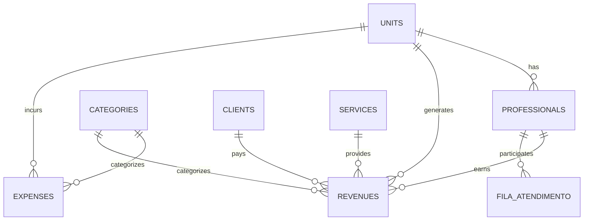

# 🔌 API Documentation

> Documentação completa das APIs, serviços e repositórios do Barber Analytics Pro

**Versão**: 2.0
**Última Atualização**: 27/10/2025
**Mantido por**: Equipe de Desenvolvimento

---

## 📋 Índice

- [Visão Geral](#-visão-geral)
- [Arquitetura de Dados](#-arquitetura-de-dados)
- [Services](#-services)
- [Repositories](#-repositories)
- [Hooks](#-hooks)
- [DTOs](#-dtos)
- [Supabase Integration](#-supabase-integration)
- [Error Handling](#-error-handling)
- [Best Practices](#-best-practices)

---

## 🎯 Visão Geral

O Barber Analytics Pro segue uma arquitetura em camadas para separar responsabilidades:

```
┌─────────────────────────────────────────┐
│         Components (UI Layer)           │
│  - React components                     │
│  - User interactions                    │
└────────────┬────────────────────────────┘
             │ uses
             ↓
┌─────────────────────────────────────────┐
│          Hooks Layer                    │
│  - Data fetching (TanStack Query)       │
│  - State management                     │
│  - Side effects                         │
└────────────┬────────────────────────────┘
             │ calls
             ↓
┌─────────────────────────────────────────┐
│        Services Layer                   │
│  - Business logic                       │
│  - Data transformation                  │
│  - Validation                           │
└────────────┬────────────────────────────┘
             │ uses
             ↓
┌─────────────────────────────────────────┐
│      Repositories Layer                 │
│  - Database access                      │
│  - Supabase queries                     │
│  - RLS enforcement                      │
└────────────┬────────────────────────────┘
             │ connects to
             ↓
┌─────────────────────────────────────────┐
│         Supabase Backend                │
│  - PostgreSQL database                  │
│  - Authentication                       │
│  - Row-Level Security                   │
└─────────────────────────────────────────┘
```

---

## 🗄️ Arquitetura de Dados

### Principais Entidades

| Entidade | Tabela | Descrição |
|----------|--------|-----------|
| Unidades | `units` | Unidades da rede (Mangabeiras, Nova Lima) |
| Profissionais | `professionals` | Barbeiros vinculados a unidades |
| Receitas | `revenues` | Entradas financeiras (serviços, assinaturas) |
| Despesas | `expenses` | Saídas financeiras (fixas e variáveis) |
| Categorias | `categories` | Hierarquia de categorização |
| Clientes | `clients` | Base de clientes |
| Serviços | `services` | Catálogo de serviços |
| Fila | `fila_atendimento` | Sistema de "Lista da Vez" |
| Usuários | `auth.users` | Autenticação e perfis |

### Relacionamentos



---

## 💼 Services

Services contêm a lógica de negócio e orquestram operações complexas.

### 1. DRE Service

**Arquivo**: `src/services/dreService.js`

#### `calculateDRE(unitId, period, options)`

Calcula a Demonstração de Resultado do Exercício.

```javascript
import { dreService } from '@/services/dreService';

// Cálculo mensal
const dre = await dreService.calculateDRE('unit-123', {
  type: 'monthly',
  month: 10,
  year: 2025
});

// Cálculo personalizado
const dreCustom = await dreService.calculateDRE('unit-123', {
  type: 'custom',
  startDate: '2025-01-01',
  endDate: '2025-03-31'
}, {
  regime: 'competencia', // ou 'caixa'
  includeProjections: false
});
```

**Retorno**:
```typescript
{
  receitas: {
    servicos: number,
    produtos: number,
    assinaturas: number,
    total: number
  },
  despesas: {
    fixas: number,
    variaveis: number,
    impostos: number,
    total: number
  },
  resultado: {
    bruto: number,
    operacional: number,
    liquido: number,
    margem: number  // percentual
  },
  metadata: {
    periodo: string,
    regime: string,
    unitId: string,
    calculatedAt: Date
  }
}
```

---

### 2. Financial Service

**Arquivo**: `src/services/financeiroService.js`

#### `createRevenue(data)`

Cria uma nova receita com validação completa.

```javascript
import { financeiroService } from '@/services/financeiroService';

const revenue = await financeiroService.createRevenue({
  unit_id: 'unit-123',
  category_id: 'cat-456',
  amount: 150.00,
  description: 'Corte + barba',
  payment_method_id: 'pm-789',
  professional_id: 'prof-101',
  date: '2025-10-27',
  status: 'received'
});
```

#### `createExpense(data)`

Cria uma nova despesa.

```javascript
const expense = await financeiroService.createExpense({
  unit_id: 'unit-123',
  category_id: 'cat-999',
  amount: 500.00,
  description: 'Aluguel mensal',
  due_date: '2025-11-05',
  status: 'pending',
  is_recurring: true,
  recurrence_config: {
    frequency: 'monthly',
    day_of_month: 5
  }
});
```

#### `getKPIs(unitId, period)`

Retorna KPIs consolidados.

```javascript
const kpis = await financeiroService.getKPIs('unit-123', {
  month: 10,
  year: 2025
});

console.log(kpis);
// {
//   revenue: 45000,
//   expenses: 28000,
//   profit: 17000,
//   margin: 37.8,
//   growth: 12.5,
//   ticketMedio: 85.50,
//   atendimentos: 526
// }
```

---

### 3. Lista da Vez Service

**Arquivo**: `src/services/listaDaVezService.js`

#### `getFilaAtual(unitId)`

Retorna a fila atual com realtime.

```javascript
import { listaDaVezService } from '@/services/listaDaVezService';

const fila = await listaDaVezService.getFilaAtual('unit-123');

// Retorna array ordenado por posição
[
  {
    id: 'fila-1',
    professional: { name: 'João', avatar: '...' },
    position: 1,
    status: 'available',
    last_service_at: '2025-10-27T14:30:00'
  },
  // ...
]
```

#### `avancarFila(unitId)`

Avança a fila após atendimento.

```javascript
await listaDaVezService.avancarFila('unit-123');
```

#### `pausarProfissional(professionalId, reason)`

Pausa um profissional temporariamente.

```javascript
await listaDaVezService.pausarProfissional('prof-101', 'Almoço');
```

---

### 4. Reconciliation Service

**Arquivo**: `src/services/reconciliationService.js`

#### `autoMatch(bankStatementId, confidence = 0.8)`

Realiza matching automático de extratos.

```javascript
import { reconciliationService } from '@/services/reconciliationService';

const matches = await reconciliationService.autoMatch('statement-123', 0.85);

// Retorna matches encontrados
[
  {
    statement_item_id: 'item-1',
    revenue_id: 'rev-456',
    confidence: 0.92,
    match_type: 'exact',
    details: {
      amount_match: true,
      date_diff_days: 0,
      description_similarity: 0.95
    }
  },
  // ...
]
```

#### `confirmMatch(matchId)`

Confirma um match sugerido.

```javascript
await reconciliationService.confirmMatch('match-789');
```

---

## 🗄️ Repositories

Repositories abstraem o acesso ao Supabase.

### Pattern Base

Todos os repositories seguem este padrão:

```javascript
// src/repositories/baseRepository.js
export class BaseRepository {
  constructor(tableName) {
    this.table = tableName;
    this.supabase = supabaseClient;
  }

  async findById(id) {
    const { data, error } = await this.supabase
      .from(this.table)
      .select('*')
      .eq('id', id)
      .single();

    if (error) throw new Error(error.message);
    return data;
  }

  async findAll(filters = {}) {
    let query = this.supabase.from(this.table).select('*');

    // Aplicar filtros
    Object.entries(filters).forEach(([key, value]) => {
      query = query.eq(key, value);
    });

    const { data, error } = await query;
    if (error) throw new Error(error.message);
    return data;
  }

  async create(data) {
    const { data: created, error } = await this.supabase
      .from(this.table)
      .insert(data)
      .select()
      .single();

    if (error) throw new Error(error.message);
    return created;
  }

  async update(id, updates) {
    const { data, error } = await this.supabase
      .from(this.table)
      .update(updates)
      .eq('id', id)
      .select()
      .single();

    if (error) throw new Error(error.message);
    return data;
  }

  async delete(id) {
    const { error } = await this.supabase
      .from(this.table)
      .delete()
      .eq('id', id);

    if (error) throw new Error(error.message);
  }
}
```

### Revenue Repository

```javascript
// src/repositories/revenueRepository.js
import { BaseRepository } from './baseRepository';

class RevenueRepository extends BaseRepository {
  constructor() {
    super('revenues');
  }

  async findByPeriod(unitId, startDate, endDate) {
    const { data, error } = await this.supabase
      .from(this.table)
      .select(`
        *,
        category:categories(*),
        professional:professionals(*),
        payment_method:payment_methods(*)
      `)
      .eq('unit_id', unitId)
      .gte('date', startDate)
      .lte('date', endDate)
      .order('date', { ascending: false });

    if (error) throw new Error(error.message);
    return data;
  }

  async getTotalByCategory(unitId, period) {
    const { data, error } = await this.supabase
      .rpc('get_revenue_by_category', {
        p_unit_id: unitId,
        p_start_date: period.start,
        p_end_date: period.end
      });

    if (error) throw new Error(error.message);
    return data;
  }
}

export const revenueRepository = new RevenueRepository();
```

---

## 🪝 Hooks

Hooks encapsulam lógica de data fetching com TanStack Query.

### useDRE

```javascript
// src/hooks/useDRE.js
import { useQuery } from '@tanstack/react-query';
import { dreService } from '@/services/dreService';

export function useDRE(unitId, period, options = {}) {
  return useQuery({
    queryKey: ['dre', unitId, period],
    queryFn: () => dreService.calculateDRE(unitId, period, options),
    enabled: !!unitId && !!period,
    staleTime: 5 * 60 * 1000, // 5 minutos
    refetchOnWindowFocus: false
  });
}

// Uso no componente
function DREPage() {
  const { selectedUnit } = useUnits();
  const { data: dre, isLoading, error } = useDRE(selectedUnit.id, {
    type: 'monthly',
    month: 10,
    year: 2025
  });

  if (isLoading) return <Loading />;
  if (error) return <Error message={error.message} />;

  return <DREDisplay data={dre} />;
}
```

### useRevenues

```javascript
// src/hooks/useRevenues.js
import { useQuery, useMutation, useQueryClient } from '@tanstack/react-query';
import { financeiroService } from '@/services/financeiroService';

export function useRevenues(filters = {}) {
  const queryClient = useQueryClient();

  const query = useQuery({
    queryKey: ['revenues', filters],
    queryFn: () => financeiroService.getRevenues(filters)
  });

  const createMutation = useMutation({
    mutationFn: (data) => financeiroService.createRevenue(data),
    onSuccess: () => {
      // Invalidar cache
      queryClient.invalidateQueries({ queryKey: ['revenues'] });
      queryClient.invalidateQueries({ queryKey: ['kpis'] });
    }
  });

  return {
    revenues: query.data || [],
    isLoading: query.isLoading,
    error: query.error,
    create: createMutation.mutate,
    isCreating: createMutation.isPending
  };
}

// Uso
function RevenuesPage() {
  const { revenues, create, isCreating } = useRevenues({
    unit_id: 'unit-123',
    month: 10,
    year: 2025
  });

  const handleCreate = (formData) => {
    create(formData, {
      onSuccess: () => toast.success('Receita criada!'),
      onError: (err) => toast.error(err.message)
    });
  };

  return (
    <div>
      <RevenueForm onSubmit={handleCreate} isSubmitting={isCreating} />
      <RevenueList items={revenues} />
    </div>
  );
}
```

---

## 📋 DTOs

DTOs (Data Transfer Objects) garantem validação e tipo-segurança.

### Revenue DTO

```javascript
// src/dtos/revenueDTO.js
import { z } from 'zod';

export const RevenueSchema = z.object({
  unit_id: z.string().uuid('Unit ID inválido'),
  category_id: z.string().uuid('Categoria inválida'),
  amount: z.number().positive('Valor deve ser positivo'),
  description: z.string().min(3, 'Descrição muito curta'),
  date: z.string().regex(/^\d{4}-\d{2}-\d{2}$/, 'Data inválida'),
  payment_method_id: z.string().uuid().optional(),
  professional_id: z.string().uuid().optional(),
  status: z.enum(['pending', 'received', 'cancelled']),
  notes: z.string().optional()
});

export class RevenueDTO {
  static validate(data) {
    return RevenueSchema.parse(data);
  }

  static validatePartial(data) {
    return RevenueSchema.partial().parse(data);
  }

  static toDatabase(data) {
    const validated = this.validate(data);
    return {
      ...validated,
      created_at: new Date().toISOString(),
      updated_at: new Date().toISOString()
    };
  }

  static fromDatabase(dbRow) {
    return {
      id: dbRow.id,
      unitId: dbRow.unit_id,
      categoryId: dbRow.category_id,
      amount: parseFloat(dbRow.amount),
      description: dbRow.description,
      date: dbRow.date,
      status: dbRow.status,
      createdAt: new Date(dbRow.created_at),
      updatedAt: new Date(dbRow.updated_at)
    };
  }
}

// Uso
try {
  const validData = RevenueDTO.validate(formData);
  await revenueRepository.create(RevenueDTO.toDatabase(validData));
} catch (error) {
  if (error instanceof z.ZodError) {
    console.error('Validation errors:', error.errors);
  }
}
```

---

## 🔗 Supabase Integration

### Cliente Supabase

```javascript
// src/services/supabase.js
import { createClient } from '@supabase/supabase-js';

const supabaseUrl = import.meta.env.VITE_SUPABASE_URL;
const supabaseAnonKey = import.meta.env.VITE_SUPABASE_ANON_KEY;

export const supabaseClient = createClient(supabaseUrl, supabaseAnonKey, {
  auth: {
    persistSession: true,
    autoRefreshToken: true
  },
  realtime: {
    params: {
      eventsPerSecond: 10
    }
  }
});
```

### Realtime Subscriptions

```javascript
// Hook para fila em tempo real
import { useEffect, useState } from 'react';
import { supabaseClient } from '@/services/supabase';

export function useFilaRealtime(unitId) {
  const [fila, setFila] = useState([]);

  useEffect(() => {
    // Buscar dados iniciais
    fetchFila();

    // Inscrever em mudanças
    const channel = supabaseClient
      .channel('fila-changes')
      .on(
        'postgres_changes',
        {
          event: '*',
          schema: 'public',
          table: 'fila_atendimento',
          filter: `unit_id=eq.${unitId}`
        },
        (payload) => {
          console.log('Mudança na fila:', payload);
          fetchFila(); // Recarregar
        }
      )
      .subscribe();

    return () => {
      channel.unsubscribe();
    };
  }, [unitId]);

  async function fetchFila() {
    const { data } = await supabaseClient
      .from('fila_atendimento')
      .select('*, professional:professionals(*)')
      .eq('unit_id', unitId)
      .order('position', { ascending: true });

    setFila(data || []);
  }

  return fila;
}
```

### RPC Functions

```javascript
// Chamando funções SQL
async function getDRECalculated(unitId, startDate, endDate) {
  const { data, error } = await supabaseClient
    .rpc('calculate_dre_v2', {
      p_unit_id: unitId,
      p_start_date: startDate,
      p_end_date: endDate,
      p_regime: 'competencia'
    });

  if (error) throw new Error(error.message);
  return data;
}
```

---

## ⚠️ Error Handling

### Padrão de Tratamento de Erros

```javascript
// Erro customizado
export class APIError extends Error {
  constructor(message, code, details = {}) {
    super(message);
    this.name = 'APIError';
    this.code = code;
    this.details = details;
  }
}

// Wrapper de chamadas
export async function safeCall(fn, fallback = null) {
  try {
    return await fn();
  } catch (error) {
    console.error('API Error:', error);

    if (error.code === '23505') {
      throw new APIError('Registro duplicado', 'DUPLICATE_ENTRY');
    }

    if (error.code === 'PGRST116') {
      throw new APIError('RLS Policy violation', 'PERMISSION_DENIED');
    }

    if (fallback !== null) return fallback;
    throw error;
  }
}

// Uso
const revenue = await safeCall(
  () => revenueRepository.create(data),
  null
);
```

### Error Boundaries em React

```javascript
import { useQueryErrorResetBoundary } from '@tanstack/react-query';
import { ErrorBoundary } from 'react-error-boundary';

function ErrorFallback({ error, resetErrorBoundary }) {
  return (
    <div role="alert">
      <h2>Algo deu errado</h2>
      <pre>{error.message}</pre>
      <button onClick={resetErrorBoundary}>Tentar novamente</button>
    </div>
  );
}

function App() {
  const { reset } = useQueryErrorResetBoundary();

  return (
    <ErrorBoundary FallbackComponent={ErrorFallback} onReset={reset}>
      <YourComponent />
    </ErrorBoundary>
  );
}
```

---

## ✅ Best Practices

### 1. Sempre use DTOs
```javascript
// ✅ Bom
const validated = RevenueDTO.validate(formData);
await service.create(validated);

// ❌ Ruim
await service.create(formData); // Sem validação
```

### 2. Use TanStack Query para cache
```javascript
// ✅ Bom
const { data } = useQuery({
  queryKey: ['revenues', filters],
  queryFn: () => fetchRevenues(filters),
  staleTime: 5 * 60 * 1000
});

// ❌ Ruim
const [data, setData] = useState([]);
useEffect(() => {
  fetchRevenues().then(setData); // Sem cache
}, []);
```

### 3. Trate erros adequadamente
```javascript
// ✅ Bom
try {
  const result = await service.create(data);
  toast.success('Criado com sucesso!');
  return result;
} catch (error) {
  if (error instanceof z.ZodError) {
    toast.error('Dados inválidos');
  } else if (error.code === 'DUPLICATE_ENTRY') {
    toast.error('Registro já existe');
  } else {
    toast.error('Erro ao criar');
    console.error(error);
  }
}

// ❌ Ruim
const result = await service.create(data); // Sem try-catch
```

### 4. Use RLS corretamente
```javascript
// ✅ Bom - RLS filtra automaticamente
const revenues = await supabase
  .from('revenues')
  .select('*');
// Retorna apenas dados da unidade do usuário (via RLS)

// ❌ Ruim - Filtro manual pode ser burlado
const revenues = await supabase
  .from('revenues')
  .select('*')
  .eq('unit_id', userUnitId);
// RLS ainda precisa estar configurado!
```

### 5. Invalide cache após mutations
```javascript
const mutation = useMutation({
  mutationFn: createRevenue,
  onSuccess: () => {
    // ✅ Invalida queries relacionadas
    queryClient.invalidateQueries({ queryKey: ['revenues'] });
    queryClient.invalidateQueries({ queryKey: ['kpis'] });
    queryClient.invalidateQueries({ queryKey: ['dre'] });
  }
});
```

---

## 📚 Referências

- [Supabase Docs](https://supabase.com/docs)
- [TanStack Query Docs](https://tanstack.com/query/latest)
- [Zod Documentation](https://zod.dev)
- [Clean Architecture](docs/ARQUITETURA.md)
- [Code Conventions](docs/guides/CODE_CONVENTIONS.md)

---

**Última atualização**: 27/10/2025
**Próxima revisão**: 27/01/2026
